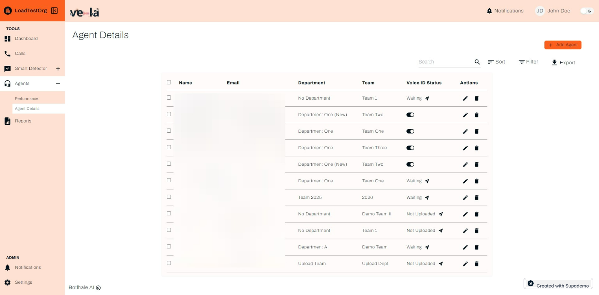

# Agents

The Agents screen gives you a complete view of how your agents are performing. It's designed to help you monitor, analyse, and improve your call centre team's performance. You can view the information in either a list or board format - whatever works best for you. Just click the **View** icon in the top right corner to switch between the two.

## Overview

### Understanding the Agent Performance Table

The Agents screen includes the following key elements:

- **Name** – The agent's name.
- **Team** – The team the agent belongs to.
- **Department** – The department associated with the agent.
- **Calls** – The number of calls handled by the agent within the selected date range.
- **Score** – The agent’s overall performance score (percentage-based), with lower scores indicating a need for improvement.
- **Strengths** – The agent’s top-performing skills, as identified by the system.
- **Weaknesses** – Areas where the agent needs improvement.
- **Rank** – The agent’s ranking based on performance compared to other agents.
- **Detailed View** – Clicking "View" provides an in-depth breakdown of the agent’s call history, analytics, and feedback.

## Detailed Agent View

The Detailed Agent View provides an in-depth analysis of individual agent metrics. This view includes a scorecard for each agent, which users can download for further analysis. The scorecard includes detailed metrics such as:

- **Call Duration**: The average duration of calls handled by the agent.
- **Customer Satisfaction**: The average customer satisfaction score for the agent.
- **Resolution Rate**: The percentage of calls resolved by the agent.
- **Adherence to Scripts**: The agent's adherence to predefined scripts during calls.
- **Missed Customer Cues**: The number of missed customer cues during calls.

## Sorting, Filtering, and Exporting Data

The Agents screen makes it easy to navigate and work with your contact centre data. You can:

- **Sort**: Order entries by any table column (except the Detailed View column) to quickly find specific agent performance metrics.
- **Filter**: Apply specific criteria based on various parameters to focus your analysis on what matters.
- **Export**: Download the entire table as a CSV file for further analysis in your preferred data visualization or statistical tools.

## Getting Started Guide

Here's a step-by-step guide to navigating and using the Agents screen:

### Sorting Agents

#### Step 1: Access Sort Options

Click on the sort button to access sorting options.

#### Step 1: Access Sort Options

#### Step 2: Choose Sort Criteriaort button to access sorting options.

You can sort the agent performance table by various attributes, in ascending or descending order.

#### Step 2: Choose Sort Criteriaort button to access sorting options.

#### Step 3: Apply Sort Settings
You can sort the agent performance table by various attributes, in ascending or descending order.
Confirm your selection by clicking "Apply".
#### Step 2: Choose Sort Criteriaort button to access sorting options.

#### Step 3: Apply Sort Settings
### Filtering Agentsthe agent performance table by various attributes, in ascending or descending order.
Confirm your selection by clicking "Apply".
#### Step 4: Access Filter Options

Click on the filter button to access filtering options.

#### Step 3: Apply Sort Settings
### Filtering Agents
#### Step 5: Select Filter Criteria

Choose the attributes you'd like to filter by.
#### Step 4: Access Filter Optionsthe agent performance table by various attributes, in ascending or descending order.
Confirm your selection by clicking "Apply".udfront.net/?s3_key=cm6hxl3ri01k2pefpgonr5yom/zp5UevkI4CXD5p95bZ_aP.jpg&x=1673&y=672&fill=2ca5e0&color=2ca5e0)
Click on the filter button to access filtering options.
#### Step 6: Apply Filters

Click "Apply" to activate your filters.
#### Step 3: Apply Sort Settings
### Filtering Agents"Apply".](https://d16ev9qffqt5qm.cloudfront.net/?s3_key=cm6hxl3ri01k2pefpgonr5yom/VljC9pZfFyr8x0ZpseFKD.jpg&x=2062&y=1233&fill=2ca5e0&color=2ca5e0)
#### Step 5: Select Filter Criteria
#### Step 7: Filter by Date Range

You can also filter agent performance by a specific date range.
#### Step 4: Access Filter Options

Click on the filter button to access filtering options.
## Agent Management

### Accessing Agent Details

Navigate to the Agent Details section to manage individual agent information.

Click "Apply" to activate your filters./d16ev9qffqt5qm.cloudfront.net/?s3_key=cm6hxl3ri01k2pefpgonr5yom/pn-PWu6EIQ0OHt8Nzv57f.jpg&x=230&y=690&fill=2ca5e0&color=2ca5e0)

The Agent Details section enables users with admin privileges to view, edit and update the details of the agents in their respective teams or departments. You have the option to activate the **Voice ID Status** or simply see the current status. You also have the ability to search for an agent, sort and filter by a range of attributes. In the top right, you have the ability to Add a new Agent. And equally as important, you have the option to reassign an agent from one team to another.

#### Step 5: Select Filter Criteria
### Reassigning Agents

#### Step 1: Select Agent Departmentpecific date range.
#### Step 4: Access Filter Options
Choose the department you want to reassign an agent to (e.g., "Debt Collection (Department A)").
Click on the filter button to access filtering options.
## Agent Management

#### Step 2: Initiate Reassignment

Click "Reassign" to begin the reassignment process.

Navigate to the Agent Details section to manage individual agent information.

#### Step 3: Confirm Reassignment

Complete the reassignment by clicking "Reassign".

The Agent Details section enables users with admin privileges to view, edit and update the details of the agents in their respective teams or departments. You have the option to activate the **Voice ID Status** or simply see the current status. You also have the ability to search for an agent, sort and filter by a range of attributes. In the top right, you have the ability to Add a new Agent. And equally as important, you have the option to reassign an agent from one team to another.

### Adding New Agents by a specific date range.

To add a new agent, click the **+ Add Agent** button and follow these steps:

#### Step 1: Select Agent Department

#### Step 1: Enter Agent Information

Fill in the required agent details. reassign an agent to (e.g., "Debt Collection (Department A)").

## Agent Management

Click "Reassign" to begin the reassignment process.
#### Step 2: Select Department and Team

Choose the appropriate department and team for the new agent.

Navigate to the Agent Details section to manage individual agent information.

#### Step 3: Confirm Reassignment

#### Step 3: Save Agent Details

Confirm the agent details by clicking the save button.
Complete the reassignment by clicking "Reassign".

The Agent Details section enables users with admin privileges to view, edit and update the details of the agents in their respective teams or departments. You have the option to activate the **Voice ID Status** or simply see the current status. You also have the ability to search for an agent, sort and filter by a range of attributes. In the top right, you have the ability to Add a new Agent. And equally as important, you have the option to reassign an agent from one team to another.
**Optional**: If you need to create a new team, you can do so during the agent creation process.
### Adding New Agents-d.png)

To add a new agent, click the **+ Add Agent** button and follow these steps:
Finally, click "Save" to finalize the new agent setup.
#### Step 1: Select Agent Departmentpecific date range.

#### Step 1: Enter Agent Information

Fill in the required agent details. reassign an agent to (e.g., "Debt Collection (Department A)").lto:support@botlhale.ai).

### 9. Now, let's navigate to the Agent Details section that option as demonstrated below.### Then, click Save once more to finalize.### 12. Click Reassign for the next operation### 13. Confirm by clicking on Add Agent### 14. Now, how do you add an Agent?Click the button titled **+ Add Agent** and follow the flow below### 15. Click to enter characters
If you choose to create a team on the go, you also have that option as demonstrated below.### Then, click Save once more to finalize.The Agent Details section enables users with admin privilleges to view, edit and update the details of the agents in their respective teams or department.s You have the option to activate the **VOice ID Status** or simply see the current status. You also have the ability to search for an agent, sort and filter by a range of attributes. In the top right, you have the ability to Add a new Agent. And equally as important, you have the option to reassign an agent from one team to another. See below.### 11. Proceed by selecting Debt Collection (Department A).### 12. Click Reassign for the next operation.### 13. Confirm by clicking on Add Agent.Click the button titled **+ Add Agent** and follow the flow below.### 15. Click to enter characters.The Agent Details section enables users with admin privileges to view, edit and update the details of the agents in their respective teams or departments. You have the option to activate the **Voice ID Status** or simply see the current status. You also have the ability to search for an agent, sort and filter by a range of attributes. In the top right, you have the ability to Add a new Agent. And equally as important, you have the option to reassign an agent from one team to another. See below.### 11. Proceed by selecting Debt Collection (Department A)### 12. Click Reassign for the next operation### 13. Confirm by clicking on Add AgentClick the button titled **+ Add Agent** and follow the flow below### 15. Click to enter characters#### Step 2: Initiate Reassignment
Click "Reassign" to begin the reassignment process.#### Step 3: Confirm Reassignment

#### Step 2: Select Department and Team

Choose the appropriate department and team for the new agent.
Complete the reassignment by clicking "Reassign".### Adding New AgentsTo add a new agent, click the **+ Add Agent** button and follow these steps:#### Step 1: Enter Agent Information

Fill in the required agent details.#### Step 2: Select Department and Team

Choose the appropriate department and team for the new agent.
#### Step 3: Save Agent Details

Confirm the agent details by clicking the save button.
#### Step 3: Save Agent Details

Confirm the agent details by clicking the save button.
**Optional**: If you need to create a new team, you can do so during the agent creation process.ocess.Finally, click "Save" to finalize the new agent setup.Finally, click "Save" to finalize the new agent setup.