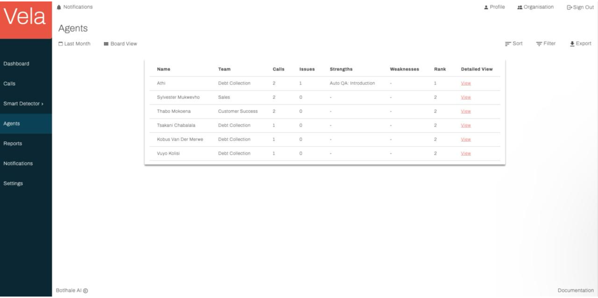
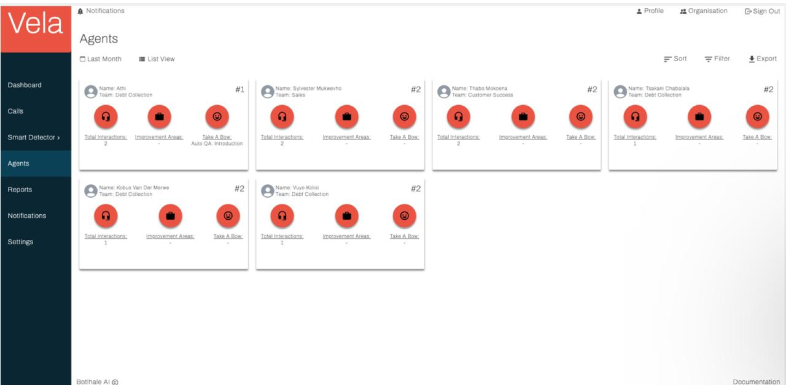

# Agents

The Agents screen in the Vela platform provides a comprehensive view of your agents' performance. This screen is designed to help you monitor, analyze, and improve the performance of your call center agents. The information on this screen is available in both a list view and a board view, allowing you to choose the format that best suits your needs. You can toggle between both views using the **View** icon in the top right corner of the screen.

## Overview

The Agents screen includes the following key elements:

- **Name**: The unique identifier or display name of the agent.
- **Team**: The team to which the agent is assigned.
- **Calls/Interactions**: The total number of calls handled by the agent within a designated timeframe.
- **Issues**: The percentage of calls identified as containing customer concerns.
- **Strengths/Take a Bow**: The top areas of agent strength, based on predefined metrics like resolution rate, customer satisfaction, and adherence to scripts.
- **Weaknesses/Improvement Areas**: Areas identified for potential improvement, pinpointed through analysis of metrics like call handling time, missed customer cues, or script deviations.
- **Rank**: The relative position of the agent within the team based on overall performance metrics.
- **Detailed View**: Clicking on an agent's entry opens a dedicated page for granular analysis. This view will be discussed in the next subsection.

## Detailed Agent View

The Detailed Agent View provides an in-depth analysis of individual agent metrics. This view includes a scorecard for each agent, which users can download for further analysis. The scorecard includes detailed metrics such as:

- **Call Duration**: The average duration of calls handled by the agent.
- **Customer Satisfaction**: The average customer satisfaction score for the agent.
- **Resolution Rate**: The percentage of calls resolved by the agent.
- **Adherence to Scripts**: The agent's adherence to predefined scripts during calls.
- **Missed Customer Cues**: The number of missed customer cues during calls.

## Sorting, Filtering, and Exporting Data

The Agents screen facilitates efficient navigation and manipulation of your contact center data. Users can:

- **Sort**: Order entries by any table column, except the Detailed View column, for streamlined identification of specific agent performance metrics.
- **Filter**: Apply targeted criteria based on various parameters, enabling focused analysis on relevant interactions.
- **Export**: Download the entire table as a CSV file for further analysis in external data visualization or statistical software tools.

## Customizing the Agents Screen

You can customize the Agents screen to display the specific data points that are most relevant to your needs. Use the following steps to customize your view:

1. Ensure you are on the Agents screen of the Vela platform.
2. Click the **Customize View** icon found in the top right corner of the screen. A pop-up window appears, prompting you to select the data points you'd like displayed.
3. Select the data points and their corresponding view. Note that data points may be specific to a view type.
4. Click **Save**. Your view is updated to display your selected data points.

## Step-by-Step Guide

Below is a step-by-step guide to navigating and using the Agents screen:

### 1. Begin by clicking the indicated area.

### 2. Next, click where specified.

### 3. Now, select the checkbox provided.

### 4. Then, confirm by clicking Apply.

### 5. Continue by clicking the next indicated area.

### 6. Select another checkbox as directed.

### 7. Again, click Apply to proceed.

### 8. Click on the following indicated area.

### 9. Confirm your selection by clicking the checkbox.

### 10. Move ahead by clicking on another checkbox.

### 11. Once more, confirm by clicking Apply.

### 12. Proceed to click the indicated area once again.

### 13. Next, select the designated checkbox.

### 14. Confirm the selection by clicking the checkbox again.

### 15. Now, click Apply as your next step.

### 16. Then, click the displayed element.

### 17. Afterwards, confirm actions by clicking Apply.

### 18. Choose Agent Details by clicking as directed.

### 19. Now, select your checkbox choice.

### 20. Continue by clicking Reassign.

### 21. Now, click to broaden your search.

### 22. Proceed by selecting Debt Collection (Department A).

### 23. Click Reassign for the next operation.

### 24. Confirm by clicking on Add Agent.

### 25. Now, please click to add a text entry.

### 26. Click to enter characters.

### 27. Moving forward, click the search area.

### 28. Choose Customer Success (Department A) by clicking.

### 29. Again, click the designated area.

### 30. Proceed by clicking to add text input.

### 31. Next, expand your search by clicking here.

### 32. Now, click Save to apply changes.

### 33. Then, click Save once more to finalize.

---
sidebar_position: 4
---

# Agents

The Agents screen in the Vela platform provides a comprehensive view of your agents' performance. This screen is designed to help you monitor, analyze, and improve the performance of your call center agents. The information on this screen is available in both a list view and a board view, allowing you to choose the format that best suits your needs. You can toggle between both views using the **View** icon in the top right corner of the screen.

## Overview

The Agents screen includes the following key elements:

- **Name**: The unique identifier or display name of the agent.
- **Team**: The team to which the agent is assigned.
- **Calls/Interactions**: The total number of calls handled by the agent within a designated timeframe.
- **Issues**: The percentage of calls identified as containing customer concerns.
- **Strengths/Take a Bow**: The top areas of agent strength, based on predefined metrics like resolution rate, customer satisfaction, and adherence to scripts.
- **Weaknesses/Improvement Areas**: Areas identified for potential improvement, pinpointed through analysis of metrics like call handling time, missed customer cues, or script deviations.
- **Rank**: The relative position of the agent within the team based on overall performance metrics.
- **Detailed View**: Clicking on an agent's entry opens a dedicated page for granular analysis. This view will be discussed in the next subsection.

## Detailed Agent View

The Detailed Agent View provides an in-depth analysis of individual agent metrics. This view includes a scorecard for each agent, which users can download for further analysis. The scorecard includes detailed metrics such as:

- **Call Duration**: The average duration of calls handled by the agent.
- **Customer Satisfaction**: The average customer satisfaction score for the agent.
- **Resolution Rate**: The percentage of calls resolved by the agent.
- **Adherence to Scripts**: The agent's adherence to predefined scripts during calls.
- **Missed Customer Cues**: The number of missed customer cues during calls.

## Sorting, Filtering, and Exporting Data

The Agents screen facilitates efficient navigation and manipulation of your contact center data. Users can:

- **Sort**: Order entries by any table column, except the Detailed View column, for streamlined identification of specific agent performance metrics.
- **Filter**: Apply targeted criteria based on various parameters, enabling focused analysis on relevant interactions.
- **Export**: Download the entire table as a CSV file for further analysis in external data visualization or statistical software tools.

## Customizing the Agents Screen

You can customize the Agents screen to display the specific data points that are most relevant to your needs. Use the following steps to customize your view:

1. Ensure you are on the Agents screen of the Vela platform.
2. Click the **Customize View** icon found in the top right corner of the screen. A pop-up window appears, prompting you to select the data points you'd like displayed.
3. Select the data points and their corresponding view. Note that data points may be specific to a view type.
4. Click **Save**. Your view is updated to display your selected data points.

## Contact Us

We are here to help! If you have any questions or need further assistance, please [contact us](mailto:support@botlhale.ai).

---

**Author:** Athenkosi Cetyana

**Steps:** 36

**Source:** [Supademo](https://app.supademo.com/demo/cm6njexvg0jjbzf0oijx115op)

---

## Step-by-Step Guide

Below is a step-by-step guide to navigating and using the Agents screen:

### 1. Begin by clicking the indicated area.

### 2. Next, click where specified.

### 3. Now, select the checkbox provided.

### 4. Then, confirm by clicking Apply.

### 5. Continue by clicking the next indicated area.

### 6. Select another checkbox as directed.

### 7. Again, click Apply to proceed.

### 8. Click on the following indicated area.

### 9. Confirm your selection by clicking the checkbox.

### 10. Move ahead by clicking on another checkbox.

### 11. Once more, confirm by clicking Apply.

### 12. Proceed to click the indicated area once again.

### 13. Next, select the designated checkbox.

### 14. Confirm the selection by clicking the checkbox again.

### 15. Now, click Apply as your next step.

### 16. Then, click the displayed element.

### 17. Afterwards, confirm actions by clicking Apply.

### 18. Choose Agent Details by clicking as directed.

### 19. Now, select your checkbox choice.

### 20. Continue by clicking Reassign.

### 21. Now, click to broaden your search.

### 22. Proceed by selecting Debt Collection (Department A).

### 23. Click Reassign for the next operation.

### 24. Confirm by clicking on Add Agent.

### 25. Now, please click to add a text entry.

### 26. Click to enter characters.

### 27. Moving forward, click the search area.

### 28. Choose Customer Success (Department A) by clicking.

### 29. Again, click the designated area.

### 30. Proceed by clicking to add text input.

### 31. Next, expand your search by clicking here.

### 32. Now, click Save to apply changes.

### 33. Then, click Save once more to finalize.

## Contact Us

We are here to help! If you have any questions or need further assistance, please [contact us](mailto:support@botlhale.ai).
