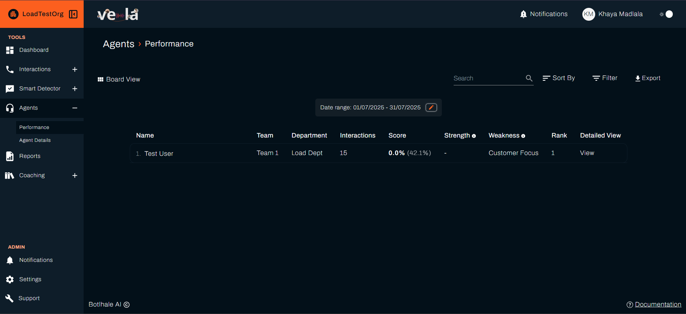
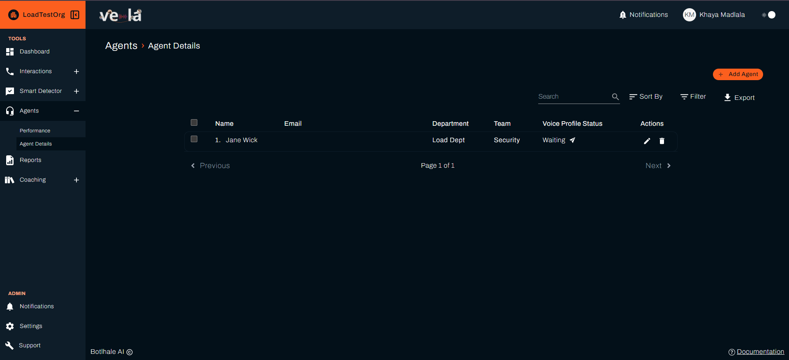
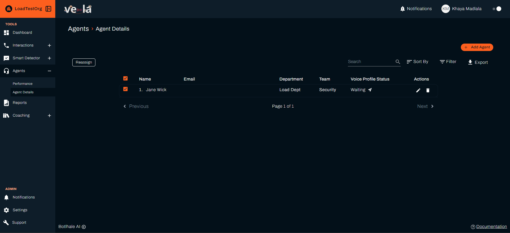
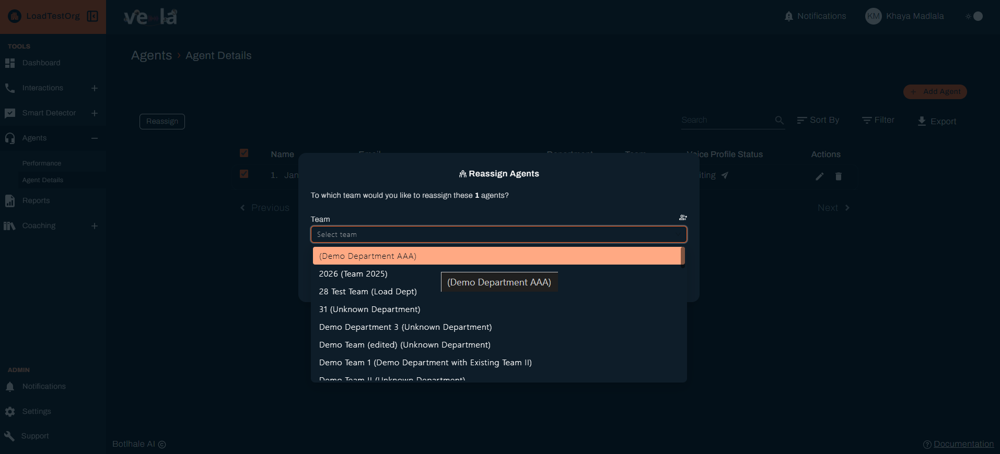

# Improve Agent Performance

Your agents are the heart of your customer experience. But managing a team effectively requires more than just listening to occasional calls. You need comprehensive insights into each agent's performance, strengths, and areas for improvement.

Vela's agent insights give you the full picture - the data you need to coach effectively, spot training gaps, and build a team that consistently delivers amazing customer experiences.

## What You Can Achieve

Agent analytics turn gut feelings into actionable insights. Here's what you'll unlock:

| **Coaching & Development** | **Performance Tracking** | **Team Optimization** |
|---------------------------|-------------------------|---------------------|
| **Coach with precision** | **Track real progress** | **Fill knowledge gaps** |
| **Celebrate success** | **Monitor improvement** | **Make smart decisions** |
| **Identify training needs** | **Spot patterns** | **Build high-performing teams** |

Instead of relying on gut feelings, you'll have actual data to back up your coaching decisions and performance assessments.

---

## Understanding Agent Performance

### Key Metrics Explained

Your agent performance table shows essential information:

| **Metric** | **What It Means** | **Action Thresholds** |
|------------|-------------------|----------------------|
| **Score** - Overall performance rating (0-100%) | 90%+ = Excellent performance 70-89% = Good performance with room for improvement Below 70% = Needs coaching | 90%+ = Recognize and mentor others 70-89% = Provide targeted coaching Below 70% = Intervention needed |
| **Strengths** - What the agent does well consistently | Areas where they excel and can mentor others | Use strengths to build confidence and mentor others |
| **Weaknesses** - Areas needing improvement | Specific skills or behaviours to focus on | Create targeted training plans |
| **Rank** - Performance compared to other agents | Relative standing within the team | Identify top performers and those needing support |
| **Calls** - Number of interactions in the selected period | Sample size for reliability | Ensure sufficient data for accurate assessment |

---

## Daily Agent Management Routine

### Morning Review (10 minutes)
- [ ] **Check agent scores** - Identify anyone needing support
- [ ] **Review strengths/weaknesses** - Plan coaching sessions
- [ ] **Look for trends** - Spot patterns across your team

This quick review gives you immediate insights into your team's performance and helps you identify who needs support or recognition.

### Weekly Coaching Sessions (30 minutes per agent)
- [ ] **Review detailed metrics** with each agent
- [ ] **Discuss specific improvements** based on data
- [ ] **Set goals** for the following week
- [ ] **Track progress** over time

---

## How to Use Agent Data for Coaching

### Step 1: Access Agent Details
1. **Go to "Agents"** in the left sidebar
2. **Click "View"** next to any agent's name
3. **Review their detailed performance breakdown**

### Step 2: Analyse Performance Patterns
Look for these key indicators:

#### Call Duration Analysis
| **Pattern** | **Possible Causes** | **Coaching Actions** |
|-------------|-------------------|---------------------|
| **Long calls** | Complex customer issues, agent uncertainty, inefficient processes | Provide training on issue resolution, improve knowledge base access |
| **Short calls** | Rushed interactions, missed opportunities, good efficiency | Review for completeness, ensure quality isn't sacrificed for speed |

#### Customer Satisfaction
| **Pattern** | **Indicators** | **Actions** |
|-------------|----------------|-------------|
| **Low satisfaction scores** | Customer complaints, negative feedback | Coaching, review call recordings, provide specific training |
| **Declining satisfaction** | Worsening performance over time | Identify root causes, create improvement plan, monitor closely |
| **High satisfaction** | Positive feedback, good efficiency | Recognize success, use as mentor, share best practices |

#### Resolution Rate
| **Pattern** | **Implications** | **Training Focus** |
|-------------|------------------|-------------------|
| **Low resolution rates** | Training needs, process gaps | Product knowledge, troubleshooting skills, escalation procedures |
| **High resolution rates** | Strong performance, good knowledge | Advanced training, leadership development, mentoring opportunities |

### Step 3: Create Action Plans
Based on your analysis, create specific improvement plans:

#### For Struggling Agents (Score < 70%)
**Actions**:
- [ ] **Identify specific weaknesses** from the data
- [ ] **Schedule one-on-one coaching** sessions
- [ ] **Provide targeted training** materials
- [ ] **Set weekly improvement goals**
- [ ] **Monitor progress** closely

**Coaching Focus**:
- Basic skills reinforcement
- Confidence building
- Clear expectations setting
- Regular check-ins

#### For Average Agents (Score 70-89%)
**Development Actions**:
- [ ] **Focus on strengths** to build confidence
- [ ] **Address specific weaknesses** systematically
- [ ] **Provide peer mentoring** opportunities
- [ ] **Set stretch goals** for improvement

**Coaching Focus**:
- Skill refinement
- Advanced techniques
- Leadership development
- Career progression

#### For Top Performers (Score 90%+)
**Recognition & Growth**:
- [ ] **Recognize their achievements**
- [ ] **Use them as mentors** for other agents
- [ ] **Provide advanced training** opportunities
- [ ] **Consider promotion** or leadership roles

**Development Focus**:
- Leadership skills
- Training others
- Process improvement
- Strategic thinking

---

## Team Performance Analysis

### Compare Agents Effectively
- [ ] **Use the sort function** to rank agents by different metrics
- [ ] **Filter by team or department** to focus on specific groups
- [ ] **Export data** for detailed analysis in spreadsheets

### Identify Team Trends
Look for patterns that affect multiple agents:

| **Pattern Type** | **What to Look For** | **Action** |
|------------------|---------------------|------------|
| **Common weaknesses** | Skills gaps across the team | Team-wide training programs |
| **Training gaps** | Knowledge areas needing attention | Update training materials |
| **Process issues** | Inefficiencies affecting performance | Process improvement initiatives |
| **Success patterns** | What top performers do differently | Share best practices |

---

## Agent Management Tools

### Adding New Agents
1. **Click "+ Add Agent"** in the top right
2. **Enter agent information**:
   - Name and email
   - Department and team assignment
   - Start date and role
3. **Click "Save"** to add them to your system

### Reassigning Agents

1. **Select the agent** you want to reassign
2. **Click "Reassign"** button
3. **Choose new department/team**
4. **Confirm the change**

### Managing Agent Access
- [ ] **Activate/deactivate** agents as needed
- [ ] **Update contact information**
- [ ] **Modify team assignments**

---

## Best Practices for Agent Coaching

### Regular Feedback Sessions
| **Session Type** | **Frequency** | **Focus** |
|------------------|---------------|-----------|
| **Weekly one-on-ones** | Every week | Struggling agents, immediate issues |
| **Monthly reviews** | Monthly | All agents, performance trends |
| **Quarterly discussions** | Quarterly | Top performers, career development |

### Data-Driven Coaching
- [ ] **Use specific examples** from call transcripts
- [ ] **Show improvement trends** over time
- [ ] **Set measurable goals** based on metrics
- [ ] **Celebrate improvements** and achievements

### Team Development
- [ ] **Pair struggling agents** with top performers
- [ ] **Create peer mentoring** programs
- [ ] **Share best practices** across the team
- [ ] **Recognize and reward** improvement

---

## Troubleshooting Common Issues

| **Problem** | **Root Cause** | **Solutions** |
|-------------|----------------|---------------|
| **Low Agent Scores** | Training gaps, unclear expectations, lack of support | Review specific weaknesses, provide targeted training, schedule additional coaching, consider role reassignment |
| **Inconsistent Performance** | External factors, inconsistent training, unclear goals | Look for patterns in good vs. bad days, check for external factors, provide consistent training, set daily goals |
| **Team-Wide Issues** | Common training gaps, process problems, systemic issues | Identify common training gaps, update team training programs, review and improve processes, consider external training resources |

---

## Next Steps

| **For Performance Reports** | **For Smart Monitoring** | **For Evaluation Systems** |
|----------------------------|-------------------------|---------------------------|
| [Generate Performance Reports](./reports.md) | [Set Up Smart Monitoring](./smart-detector-overview.md) | [Create Agent Scorecards](./agent-scorecard-guide.md) |

## Need Help?

- 📧 **Contact Support**: support@botlhale.ai
- **Navigation Guide**: [Find the right documentation](./navigation-guide.md) for your needs 