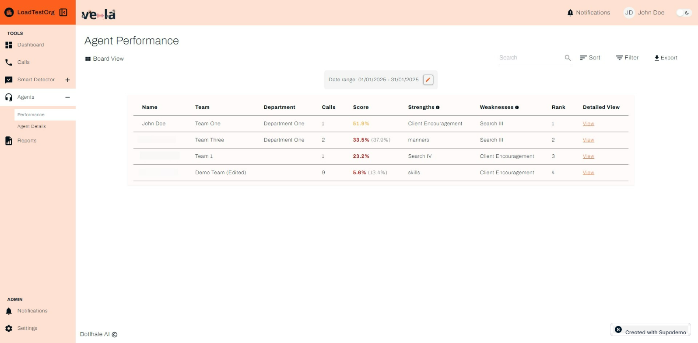

# Improve Agent Performance

Your agents are the heart of your customer experience. But how do you know who's struggling and who's ready for the next level? Vela's agent insights give you the data you need to coach effectively, spot training gaps, and build a team that consistently delivers amazing customer experiences.

## What You Can Achieve

Agent analytics turn gut feelings into actionable insights. Here's what you'll unlock:

**Coach with precision** - Spot exactly who needs help and what they're struggling with
**Celebrate success** - Recognize your rock stars and learn from their winning strategies
**Track real progress** - See improvement over time with concrete metrics
**Fill knowledge gaps** - Identify training needs across your entire team
**Make smart decisions** - Use data to guide promotions, development, and team structure

## Understanding Agent Performance

### Key Metrics Explained

Your agent performance table shows essential information:

- **Score** - Overall performance rating (0-100%)
  - 90%+ = Excellent performance
  - 70-89% = Good performance with room for improvement
  - Below 70% = Needs immediate coaching

- **Strengths** - What the agent does well consistently
- **Weaknesses** - Areas needing improvement
- **Rank** - Performance compared to other agents
- **Calls** - Number of interactions in the selected period

## Daily Agent Management Routine

### Morning Review (10 minutes)
1. **Check agent scores** - Identify anyone below 70%
2. **Review strengths/weaknesses** - Plan coaching sessions
3. **Look for trends** - Spot patterns across your team

### Weekly Coaching Sessions (30 minutes per agent)
1. **Review detailed metrics** with each agent
2. **Discuss specific improvements** based on data
3. **Set goals** for the following week
4. **Track progress** over time

## How to Use Agent Data for Coaching

### Step 1: Access Agent Details
1. **Go to "Agents"** in the left sidebar
2. **Click "View"** next to any agent's name
3. **Review their detailed performance breakdown** (for the big picture, check out the [Dashboard guide](./dashboard.md))

### Step 2: Analyze Performance Patterns
Look for these key indicators:

#### Call Duration Analysis
- **Long calls** might indicate:
  - Complex customer issues
  - Agent uncertainty or lack of knowledge
  - Inefficient processes
- **Short calls** might indicate:
  - Rushed interactions
  - Missed opportunities to help customers
  - Good efficiency (if satisfaction is high)

#### Customer Satisfaction
- **Low satisfaction scores** require immediate attention
- **Declining satisfaction** shows worsening performance
- **High satisfaction** with good efficiency = excellent performance

#### Resolution Rate
- **Low resolution rates** suggest training needs
- **High resolution rates** with good satisfaction = strong performance

### Step 3: Create Action Plans
Based on your analysis, create specific improvement plans:

#### For Struggling Agents (Score < 70%)
1. **Identify specific weaknesses** from the data
2. **Schedule one-on-one coaching** sessions
3. **Provide targeted training** materials
4. **Set weekly improvement goals**
5. **Monitor progress** closely

#### For Average Agents (Score 70-89%)
1. **Focus on strengths** to build confidence
2. **Address specific weaknesses** systematically
3. **Provide peer mentoring** opportunities
4. **Set stretch goals** for improvement

#### For Top Performers (Score 90%+)
1. **Recognize their achievements**
2. **Use them as mentors** for other agents
3. **Provide advanced training** opportunities
4. **Consider promotion** or leadership roles

## Detailed Agent Analysis

### Accessing Detailed Metrics
1. **Click "View"** on any agent row
2. **Review their comprehensive scorecard**
3. **Download the scorecard** for detailed analysis

The detailed view includes:
- **Call-by-call breakdown** of performance
- **Trend analysis** over time
- **Specific improvement areas**
- **Comparison to team averages**

### Key Metrics to Focus On

#### Call Quality Metrics
- **Script adherence** - How well agents follow procedures
- **Customer satisfaction** - Direct feedback scores
- **Resolution rate** - Percentage of issues resolved
- **First call resolution** - Issues resolved without escalation

#### Efficiency Metrics
- **Average call duration** - Time efficiency
- **Response time** - Speed of initial response
- **Silent time** - Awkward pauses or delays
- **Transfer rate** - How often calls are escalated

#### Behavioral Metrics
- **Missed customer cues** - Opportunities to help customers
- **Professionalism score** - Tone and approach
- **Empathy indicators** - Understanding customer emotions

## Team Performance Analysis

### Compare Agents Effectively
1. **Use the sort function** to rank agents by different metrics
2. **Filter by team or department** to focus on specific groups
3. **Export data** for detailed analysis in spreadsheets

### Identify Team Trends
Look for patterns that affect multiple agents:
- **Common weaknesses** across the team
- **Training gaps** that need addressing
- **Process issues** affecting performance
- **Success patterns** to replicate

## Agent Management Tools

### Adding New Agents
1. **Click "+ Add Agent"** in the top right
2. **Enter agent information**:
   - Name and email
   - Department and team assignment
   - Start date and role
3. **Click "Save"** to add them to your system

### Reassigning Agents
1. **Select the agent** you want to reassign
2. **Click "Reassign"** button
3. **Choose new department/team**
4. **Confirm the change**

### Managing Agent Access
- **Activate/deactivate** agents as needed
- **Update contact information**
- **Modify team assignments**
- **Track voice ID status** for security

## Best Practices for Agent Coaching

### Regular Feedback Sessions
- **Weekly one-on-ones** with struggling agents
- **Monthly reviews** with all agents
- **Quarterly performance discussions** with top performers

### Data-Driven Coaching
- **Use specific examples** from call transcripts
- **Show improvement trends** over time
- **Set measurable goals** based on metrics
- **Celebrate improvements** and achievements

### Team Development
- **Pair struggling agents** with top performers
- **Create peer mentoring** programs
- **Share best practices** across the team
- **Recognize and reward** improvement

## Troubleshooting Common Issues

### Low Agent Scores
**Problem**: Agent consistently scores below 70%
**Solutions**:
- Review specific weaknesses in detail
- Provide targeted training materials
- Schedule additional coaching sessions
- Consider role reassignment if needed

### Inconsistent Performance
**Problem**: Agent scores vary widely day-to-day
**Solutions**:
- Look for patterns in good vs. bad days
- Check for external factors affecting performance
- Provide more consistent training and support
- Set daily goals to maintain focus

### Team-Wide Issues
**Problem**: Multiple agents showing similar weaknesses
**Solutions**:
- Identify common training gaps
- Update team training programs
- Review and improve processes
- Consider external training resources

## Next Steps

- **[Generate Performance Reports](./reports.md)** - Create detailed agent summaries
- **[Set Up Smart Monitoring](./smart-detector-overview.md)** - Get alerts for performance issues
- **[Create Agent Scorecards](./agent-scorecard-guide.md)** - Build evaluation systems

## Need Help?

- **Contact Support**: support@botlhale.ai
- **Training Resources**: Ask about additional coaching materials
- **Performance Consulting**: Get help with team improvement strategies 