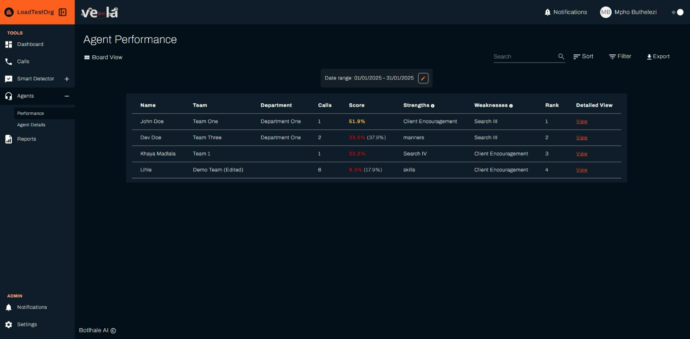
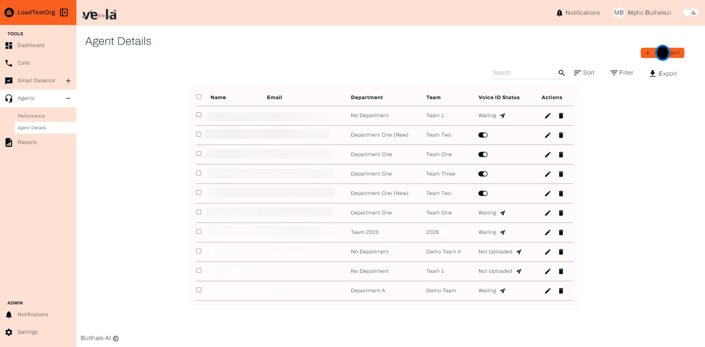

# Agents

The Agents screen in the Vela platform provides a comprehensive view of your agents' performance. This screen is designed to help you monitor, analyze, and improve the performance of your call center agents. The information on this screen is available in both a list view and a board view, allowing you to choose the format that best suits your needs. You can toggle between both views using the **View** icon in the top right corner of the screen.

## Overview

### Understanding the Agent Performance Table

The Agents screen includes the following key elements:

- **Name** – The agent's name.
- **Team** – The team the agent belongs to.
- **Department** – The department associated with the agent.
- **Calls** – The number of calls handled by the agent within the selected date range.
- **Score** – The agent’s overall performance score (percentage-based), with lower scores indicating a need for improvement.
- **Strengths** – The agent’s top-performing skills, as identified by the system.
- **Weaknesses** – Areas where the agent needs improvement.
- **Rank** – The agent’s ranking based on performance compared to other agents.
- **Detailed View** – Clicking "View" provides an in-depth breakdown of the agent’s call history, analytics, and feedback.

## Detailed Agent View

The Detailed Agent View provides an in-depth analysis of individual agent metrics. This view includes a scorecard for each agent, which users can download for further analysis. The scorecard includes detailed metrics such as:

- **Call Duration**: The average duration of calls handled by the agent.
- **Customer Satisfaction**: The average customer satisfaction score for the agent.
- **Resolution Rate**: The percentage of calls resolved by the agent.
- **Adherence to Scripts**: The agent's adherence to predefined scripts during calls.
- **Missed Customer Cues**: The number of missed customer cues during calls.

## Sorting, Filtering, and Exporting Data

The Agents screen facilitates efficient navigation and manipulation of your contact center data. Users can:

- **Sort**: Order entries by any table column, except the Detailed View column, for streamlined identification of specific agent performance metrics.
- **Filter**: Apply targeted criteria based on various parameters, enabling focused analysis on relevant interactions.
- **Export**: Download the entire table as a CSV file for further analysis in external data visualization or statistical software tools.

## How To Sort and Filter - Guide

Below is a step-by-step guide to navigating and using the Agents screen:

### 1. Let's start with the Sort functionality.

### 2. Sort By 

You have the ability to sort the agent performance table by a range of attributes, in ascending order or descending order.

### 4. Then, confirm by clicking Apply.

### 5. Filter

Next, you have the option to filter.

### 6. Check the attributes you'd like to filter by.

### 7. Again, click Apply to proceed.

### 8. Filter Agent Performance by a date range.

### 9. Now, let's navigate to the Agent Details section.

### 10. Agent Details

The Agent Details section enables users with admin privilleges to view, edit and update the details of the agents in their respective teams or department.s You have the option to activate the **VOice ID Status** or simply see the current status. You also have the ability to search for an agent, sort and filter by a range of attributes. In the top right, you have the ability to Add a new Agent. And equally as important, you have the option to reassign an agent from one team to another. See below.

### 11. Proceed by selecting Debt Collection (Department A).

### 12. Click Reassign for the next operation.

### 13. Confirm by clicking on Add Agent.

### 14. Now, how do you add an Agent?

Click the button titled **+ Add Agent** and follow the flow below.

### 15. Click to enter characters.

If you choose to create a team on the go, you also have that option as demonstrated below.

### Then, click Save once more to finalize.

## Contact Us

We are here to help! If you have any questions or need further assistance, please [contact us](mailto:support@botlhale.ai).
