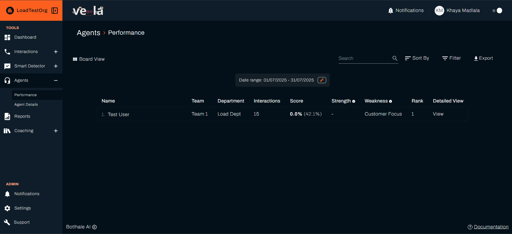
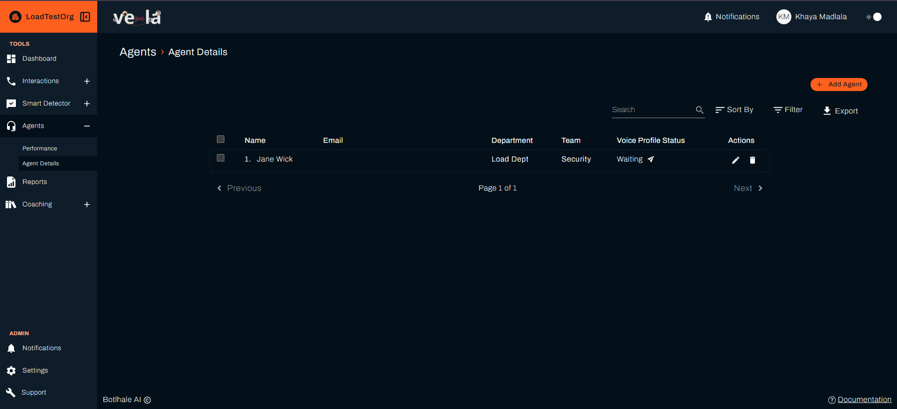
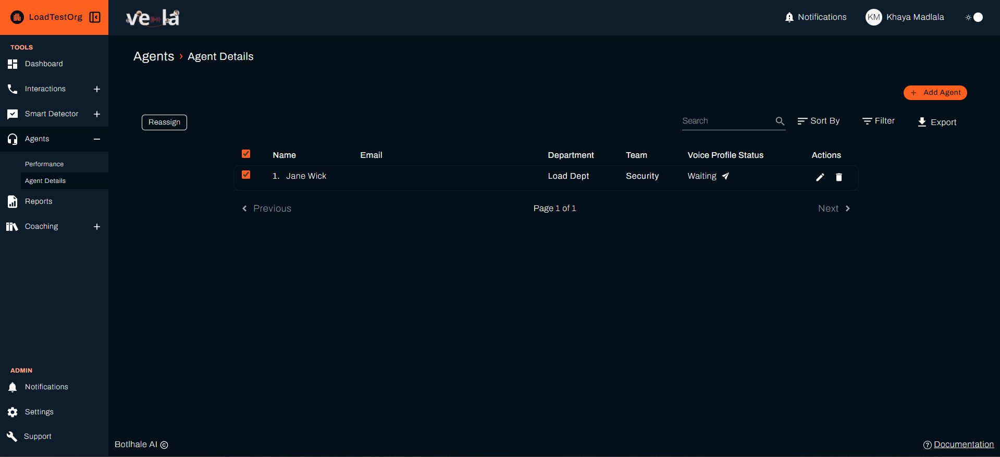
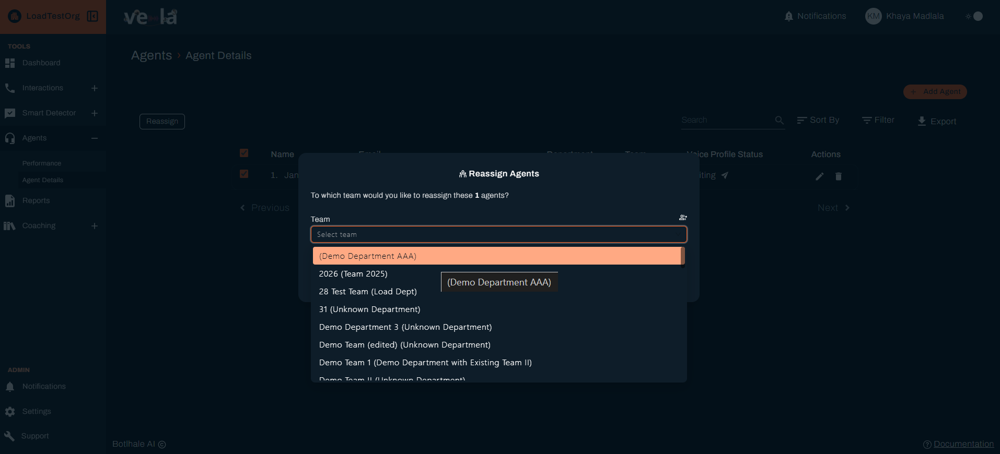

# Improve Agent Performance

Your agents are the heart of your customer experience. But managing a team effectively requires more than just listening to occasional calls. You need detailed insights into each agent's performance, strengths, and areas for improvement.

Vela's agent insights give you the full picture - the data you need to coach effectively, spot training gaps, and build a team that consistently delivers amazing customer experiences.

## What You Can Achieve

Agent analytics turn gut feelings into actionable insights. You'll discover:

| **Coaching & Development** | **Performance Tracking** | **Team Optimization** |
|---------------------------|-------------------------|---------------------|
| Coach with precision | Track real progress | Fill knowledge gaps |
| Celebrate success | Monitor improvement | Make smart decisions |
| Identify training needs | Spot patterns | Build high-performing teams |

Instead of relying on gut feelings, you'll have actual data to back up your coaching decisions and performance assessments.

---

## Understanding Agent Performance

### Key Metrics Explained

Your agent performance table shows essential information:

| **Metric** | **What It Means** |
|------------|-------------------|
| **Score** | Overall performance rating (0-100%), based on the weighted results of evaluated interactions |
| **Strengths** | Scorecard categories where the agent consistently scores well |
| **Weaknesses** | Scorecard categories where the agent consistently underperforms |
| **Rank** | The agent's standing relative to others in the same scope |
| **Interactions** | Number of evaluated interactions in the selected period |

> Performance thresholds (what counts as good, acceptable, or needs improvement) are set by your organisation's administrator, not fixed by the platform.

---

## How to Use Agent Data for Coaching

### Step 1: Access Agent Details
1. **Go to "Agents"** in the left sidebar
2. **Click "View"** next to any agent's name
3. **Review their detailed performance breakdown**

### Step 2: Create Action Plans
Based on your analysis, create specific improvement plans:

#### For Agents Below Your Organisation's Threshold
**Actions**:
- [ ] **Identify specific weaknesses** from the scorecard breakdown
- [ ] **Schedule one-on-one coaching** sessions
- [ ] **Assign targeted training** courses from the Coaching section
- [ ] **Monitor progress** closely with regular interaction reviews

#### For Agents Meeting the Threshold
**Development Actions**:
- [ ] **Focus on strengthening weak categories** while maintaining strong ones
- [ ] **Provide peer mentoring** opportunities
- [ ] **Set improvement goals** based on specific scorecard categories

#### For Top Performers
**Recognition & Growth**:
- [ ] **Recognise their achievements** using the Awards feature in Coaching
- [ ] **Use them as peer mentors** for lower-performing agents
- [ ] **Assign advanced training** to continue development

---

## Team Performance Analysis

### Compare Agents Effectively
- [ ] **Use the sort function** to rank agents by different metrics
- [ ] **Filter by team or department** to focus on specific groups
- [ ] **Export data** for detailed analysis in spreadsheets

### Identify Team Trends
Look for patterns that affect multiple agents:

| **Pattern Type** | **What to Look For** | **Action** |
|------------------|---------------------|------------|
| Common weaknesses | Skills gaps across the team | Team-wide training programs |
| Training gaps | Knowledge areas needing attention | Update training materials |
| Process issues | Inefficiencies affecting performance | Process improvement initiatives |
| Success patterns | What top performers do differently | Share best practices |

---

## Agent Management Tools

### Adding New Agents
1. **Click "+ Add Agent"** in the top right
2. **Enter agent information**:
   - Name and email
   - Department and team assignment
   - Start date and role
3. **Click "Save"** to add them to your system

### Reassigning Agents

1. **Select the agent** you want to reassign
2. **Click "Reassign"** button
3. **Choose new department/team**
4. **Confirm the change**

### Managing Agent Access
- [ ] **Activate/deactivate** agents as needed
- [ ] **Update contact information**
- [ ] **Modify team assignments**

---

## Best Practices for Agent Coaching

### Regular Feedback Sessions
| **Session Type** | **Frequency** | **Focus** |
|------------------|---------------|-----------|
| Weekly one-on-ones | Every week | Struggling agents, immediate issues |
| Monthly reviews | Monthly | All agents, performance trends |
| Quarterly discussions | Quarterly | Top performers, career development |

### Data-Driven Coaching
- [ ] **Use specific examples** from call transcripts
- [ ] **Show improvement trends** over time
- [ ] **Set measurable goals** based on metrics
- [ ] **Celebrate improvements** and achievements

### Team Development
- [ ] **Pair struggling agents** with top performers
- [ ] **Create peer mentoring** programs
- [ ] **Share best practices** across the team
- [ ] **Recognise and reward** improvement

---

## Troubleshooting Common Issues

| **Problem** | **Root Cause** | **Solutions** |
|-------------|----------------|---------------|
| Low Agent Scores | Training gaps, unclear expectations, lack of support | Review specific weaknesses, provide targeted training, schedule additional coaching, consider role reassignment |
| Inconsistent Performance | External factors, inconsistent training, unclear goals | Look for patterns in good vs. bad days, check for external factors, provide consistent training, set daily goals |
| Team-Wide Issues | Common training gaps, process problems, systemic issues | Identify common training gaps, update team training programs, review and improve processes, consider external training resources |

---

## Next Steps

| **For Performance Reports** | **For Smart Monitoring** | **For Evaluation Systems** |
|----------------------------|-------------------------|---------------------------|
| [Generate Performance Reports](./reports.md) | [Set Up Smart Monitoring](./smart-detector-overview.md) | [Create Agent Scorecards](./agent-scorecard-guide.md) |

### See also
- [Dashboard Overview](./dashboard.md) - Monitor your team's performance
- [Agent Scorecards](./agent-scorecard-guide.md) - Create detailed performance evaluations
- [Smart Monitoring](./smart-detector-overview.md) - Set up automated alerts for agent issues
- [Knowledge Base](./knowledge-base-guide.md) - Build training resources for your team

## Need Help?

- **Contact Support**: support@botlhale.ai