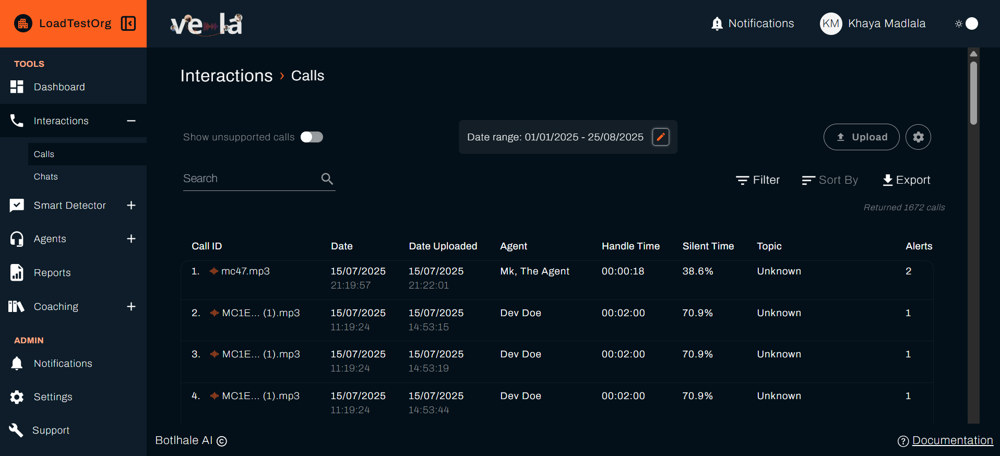
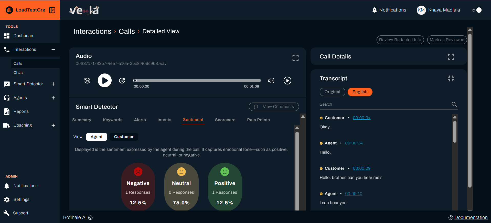
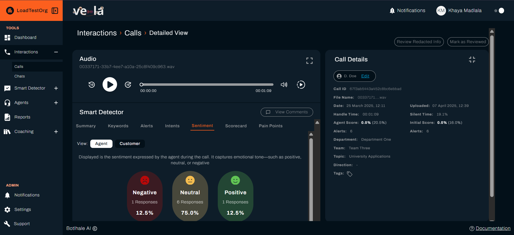
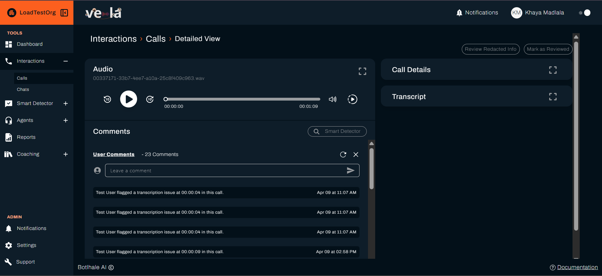

# Analyse Customer Interactions

Vela's call analysis tools help you understand what's happening in your customer conversations, spot patterns that affect satisfaction, and identify opportunities to improve your team's performance.

## What You Can Achieve

Call analysis transforms conversations into actionable insights. You'll be able to:

| **Customer Understanding** | **Performance Improvement** | **Quality Assurance** |
|---------------------------|----------------------------|---------------------|
| **Understand customer needs** | **Improve agent performance** | **Ensure consistent quality** |
| **Spot pain points** | **Track improvement over time** | **Maintain compliance** |
| **Identify opportunities** | **Guide training programs** | **Monitor standards** |

---

## Understanding Call Data

### Key Metrics Explained
Your call analysis gives you insights into every interaction:

| **Metric Category** | **What It Shows** | **Business Impact** |
|-------------------|-------------------|-------------------|
| **Call Duration** | Time efficiency and complexity | Resource allocation, capacity planning |
| **Customer Sentiment** | Satisfaction and emotional state | Customer experience, retention |
| **Agent Score** | Performance and skill assessment | Training needs, coaching opportunities |
| **Silent Time** | Communication gaps and delays | Process efficiency, training opportunities |
<!-- | **Resolution Rate** | Problem-solving effectiveness | Service quality, customer satisfaction | -->

### Call Quality Indicators
| **Indicator** | **What It Means** | **Action Required** |
|---------------|-------------------|-------------------|
| **High sentiment + High score** | Excellent service delivery | Recognise and replicate |
| **Low sentiment + Low score** | Service quality issues | Coaching needed |
| **High sentiment + Low score** | Good outcome despite challenges | Identify what worked |
| **Low sentiment + High score** | Technical issues or external factors | Investigate root causes |

---

## How to Analyse Individual Calls

### Step 1: Access Call Details

- [ ] **Go to "Calls"** in the left sidebar
- [ ] **Click on any call** to view detailed analysis
- [ ] **Review the detailed breakdown** of the interaction

### Step 2: Review Call Transcript

- [ ] **Read the full conversation** with timestamps
- [ ] **Look for key moments** that affected the outcome
- [ ] **Identify customer pain points** and agent responses
- [ ] **Note successful resolution strategies**

### Step 3: Analyse Performance Metrics

- [ ] **Review agent score** and breakdown
- [ ] **Check customer sentiment** throughout the call
- [ ] **Examine call duration** and efficiency
- [ ] **Assess resolution effectiveness**

### Step 4: Take Action

- [ ] **Add comments** for coaching purposes
- [ ] **Share insights** with the team
- [ ] **Update training materials** based on learnings
- [ ] **Follow up** with customers if needed

---

## Identifying Patterns Across Calls

### Customer Pain Point Analysis
Look for recurring issues that affect multiple customers:

| **Pattern Type** | **What to Look For** | **Business Impact** |
|------------------|---------------------|-------------------|
| **Product Issues** | Repeated complaints about features or functionality | Product development priorities |
| **Process Problems** | Confusion about procedures or policies | Process improvement opportunities |
| **Service Gaps** | Unmet customer expectations | Service enhancement needs |
| **Training Needs** | Agents struggling with specific topics | Training program development |

### Agent Performance Patterns
Identify trends that affect team performance:

| **Pattern** | **Indicators** | **Intervention** |
|-------------|----------------|-----------------|
| **Consistent High Performance** | High scores across multiple calls | Use as mentor, share best practices |
| **Declining Performance** | Decreasing scores over time | Coaching, identify root causes |
| **Inconsistent Performance** | High variance in scores | Focus on specific skill areas |
| **Specific Weaknesses** | Low scores in particular areas | Targeted training programs |

---

## Using Call Analysis for Coaching

### For Individual Agents
- [ ] **Review recent calls** with the agent
- [ ] **Identify specific improvement areas** from the data
- [ ] **Create targeted coaching plans** based on patterns
- [ ] **Track progress** over time

### For Team Development
- [ ] **Share successful strategies** from high-performing calls
- [ ] **Address common challenges** identified in analysis
- [ ] **Update training materials** based on real examples
- [ ] **Celebrate improvements** and successes

### For Process Improvement
- [ ] **Identify bottlenecks** in call handling
- [ ] **Spot opportunities** for automation or streamlining
- [ ] **Update procedures** based on customer feedback
- [ ] **Optimise resource allocation** based on call patterns

---

## Advanced Call Analysis Features

### Sentiment Analysis
Track customer emotions throughout the conversation:

| **Sentiment Level** | **What It Indicates** | **Action Required** |
|-------------------|---------------------|-------------------|
| **Positive** | Customer satisfaction, successful resolution | Maintain current approach |
| **Neutral** | Standard interaction, no major issues | Monitor for improvement opportunities |
| **Negative** | Customer dissatisfaction, potential escalation | Attention needed |

### Keyword Analysis
Identify important topics and themes:

- [ ] **Review keyword frequency** to spot trends
- [ ] **Analyse context** around important terms
- [ ] **Track topic evolution** over time
- [ ] **Identify emerging issues** early

### Performance Scoring
Understand how agents are evaluated:

| **Score Component** | **What It Measures** | **Improvement Focus** |
|-------------------|-------------------|-------------------|
| **Communication** | Clarity, professionalism, empathy | Soft skills training |
| **Problem Solving** | Issue resolution effectiveness | Technical training |
| **Efficiency** | Time management and process adherence | Process optimization |
| **Customer Focus** | Understanding and meeting customer needs | Customer service training |

---

## Call Analytics Dashboard

### Key Performance Indicators
Monitor these metrics to track team performance:

| **KPI** | **Target** | **Action Threshold** |
|---------|------------|-------------------|
| **Average Call Duration** | 5-8 minutes | Above 10 minutes = efficiency review needed |
| **Customer Satisfaction** | 85%+ positive | Below 75% = intervention needed |
| **Agent Performance Score** | 85%+ | Below 70% = coaching required |
<!-- | **First Call Resolution** | 80%+ | Below 70% = training or process review | -->

### Trend Analysis
- [ ] **Track performance over time** to identify trends
- [ ] **Compare team performance** across different periods
- [ ] **Monitor improvement** after training interventions
- [ ] **Identify seasonal patterns** in call volume and complexity

---

## Troubleshooting Common Issues

| **Problem** | **Possible Cause** | **Solution** |
|-------------|-------------------|--------------|
| **Low call quality scores** | Training gaps, unclear expectations, process issues | Review training materials, clarify expectations, optimise processes |
| **High call duration** | Complex issues, agent uncertainty, inefficient processes | Provide better training, improve knowledge base, streamline procedures |
| **Poor customer sentiment** | Service quality issues, agent attitude, product problems | Address root causes, provide coaching, improve products |
| **Inconsistent performance** | Varying call complexity, agent experience, external factors | Standardise processes, provide consistent training, account for variables |

---

## Best Practices for Call Analysis

### Regular Review Schedule
- [ ] **Daily**: Review high-priority calls and alerts
- [ ] **Weekly**: Analyse patterns and trends
- [ ] **Monthly**: Full team performance review
- [ ] **Quarterly**: Strategic analysis and planning

### Effective Coaching
- [ ] **Use specific examples** from actual calls
- [ ] **Focus on behaviours** that can be changed
- [ ] **Provide constructive feedback** with actionable steps
- [ ] **Celebrate improvements** and successes

### Continuous Improvement
- [ ] **Update training materials** based on call analysis
- [ ] **Refine processes** based on customer feedback
- [ ] **Share best practices** across the team
- [ ] **Monitor the impact** of improvements

---

## Next Steps

| **For Smart Monitoring** | **For Team Management** | **For Quality Assurance** |
|-------------------------|------------------------|-------------------------|
| [Set Up Smart Monitoring](./smart-detector-overview.md) | [Improve Agent Performance](./agents.md) | [Create Agent Scorecards](./agent-scorecard-guide.md) |

### See also
- [Dashboard Overview](./dashboard.md) - Monitor call performance trends
- [Agent Performance](./agents.md) - Coach your team effectively
- [Smart Search](./smart-search-guide.md) - Find specific patterns in calls
- [Chat Analysis](./chats.md) - Analyse digital conversations
- [Official API Documentation](https://docs-apis.botlhale.xyz) - Complete API reference for integrations

## Need Help?

- **Contact Support**: support@botlhale.ai