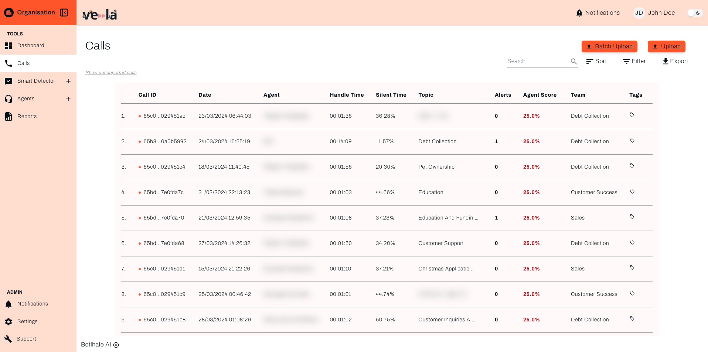
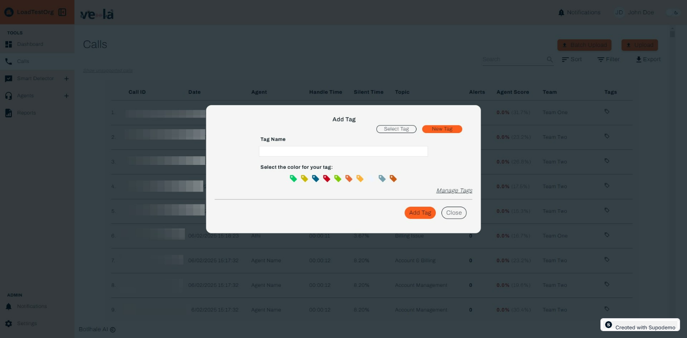
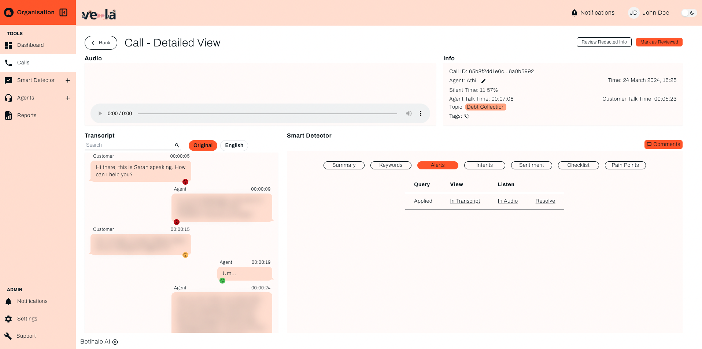

# Calls

The Vela call screen serves as the primary interface for in-depth analysis of individual customer interactions. It presents a comprehensive table log of all processed calls, organized by metadata points that facilitate efficient navigation and exploration.

## How To Get Started - Guide

 **1. Accessing the Calls Screen**

**2. Understanding the Call Log**

Each entry within the log table includes: 

-  **Call ID** – Unique identifier for each call.
-  **Date** – The exact timestamp when the call occurred.
-  **Agent** – The agent who handled the call.
-  **Handle Time** – The total duration of the call.
-  **Silent Time** – The percentage of time where neither the agent nor the customer spoke.
-  **Topic** – The main subject of the call, automatically categorized based on the conversation. This helps identify common discussion areas such as Billing, Support, Sales, or Product Inquiry.
-  **Alerts** – The number of detected issues based on Smart Search analysis.
-  **Agent Score** – The system-generated performance score for the agent.
-  **Team** – The team to which the agent belongs.
-  **Tags** – Custom labels assigned to calls for better categorization.

**3. Using Call Management Tools**

The Vela call screen facilitates efficient navigation and manipulation of your contact center data. 

Users can:  
- **Batch Upload** – Click the Batch Upload button to upload multiple call logs at once.
- **Upload** – Manually upload a single call log.
- **Sort**: Order entries by any table column, except the Detailed View column, for streamlined identification of specific call segments. 
- **Filter**: Apply targeted criteria based on various parameters like duration, silent time, issues, date, agent ID, and team, enabling focused analysis on relevant interactions. 
- **Export**: Download the entire table as a CSV file for further analysis in external data visualization or statistical software tools. 

## Call Tags

## How To Get Started - Guide
1.Click on the `Select Tag` button.

2.Choose an existing `tag` from the dropdown list.

3.Click `Add Tag` to apply the selected tag to the call.

## Creating a New Tag
1.Click on the `New Tag` button.

2.Enter a `tag` name in the text field.

3.Select a color for the tag to visually differentiate it from others.

4.Click `Add Tag` to save the new tag.

## Detailed Call View 

The Vela detailed call screen provides a comprehensive interface for in-depth analysis of individual customer interactions. It goes beyond a simple call log by presenting a multi-faceted view of the conversation. 

This screen integrates several key elements: 
- **Full Transcript**: A textual representation of the entire conversation. 
- **Audio Playback**: An audio box allowing you to replay the call recording. 
- **Smart Search**: This customizable, automated intelligence section leverages advanced natural language processing and machine learning algorithms to generate a concise summary, identify prominent keywords, categorize key issues and customer intents, gauge overall sentiment, and even assess agent performance metrics like adherence to scripts and resolution effectiveness. For more information around setting up this feature, see the [Smart Search](/docs/Smart%20Search) section of this documentation.

### Transcript 

The Vela transcript facilitates deeper analysis and collaboration through several key features:

- **Commenting**: Team members can annotate specific sections of the transcript by leaving comments visible to others. Clicking the **comment** button allows you to add your annotation and tag relevant team members.  
- **Language Translation**: For non-English call recordings, the transcript offers translation capabilities. Toggle between the original language and English with a dedicated button, allowing you to understand the conversation regardless of the spoken language. 
- **Utterance Details**: The vertical menu found in each speech bubble in the transcript reveals additional information specific to the utterance, including: 

    - **Sentiment**: The perceived emotional tone of the speaker. 
    - **Intent**: The inferred underlying goal or purpose of the speaker's statement. 
    - **Confidence**: The level of certainty associated with the model's interpretation of the utterance, expressed as a percentage for transparency. 
    - **Language**: The specific language used in the utterance, identified by automatic language detection.

### Audio Playback 

The audio playback section provides the following convenient controls for reviewing individual customer interactions.

- **Play/Pause**: Initiate or halt playback of the call recording using the designated button. 
- **Playback Speed Modulation**: Adjusting the playback speed of the call recording. This functionality is accessible through the vertical menu adjacent to the volume control. 
- **Download Capability**: Download the call recording to your local device. Click the **download** button, also located in the vertical menu. Select your preferred file format and download location when prompted.

### Smart Search 

The **Smart Search** section harnesses advanced natural language processing (NLP) and machine learning algorithms to dissect individual calls.

This automated analysis generates valuable insights, presented right on the screen: 
- **Summary** – Generates a concise overview of the call’s key points, summarizing the agent’s and customer’s interactions.
- **Keywords** – Highlights important words and phrases that frequently appear in the conversation, helping to identify recurring topics.
- **Alerts** – Detects potential issues or flagged moments in the call that may require further review, such as compliance risks, customer complaints, or unresolved concerns.
- **Intents** – Identifies the customer's purpose in the conversation, such as inquiring about a service, requesting assistance, or escalating an issue.
- **Sentiment** – Analyzes the emotional tone of the conversation, categorizing interactions as positive, neutral, or negative.
- **Checklist** – Ensures that agents follow a structured approach, checking if they have met the required conversation guidelines.
- **Pain Points** – Detects potential customer frustrations or issues raised during the call.

## Contact us

:::info
We are here to help! Please [contact us](mailto:support@botlhale.ai) with any questions.
:::