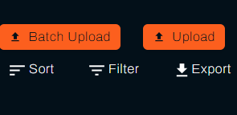
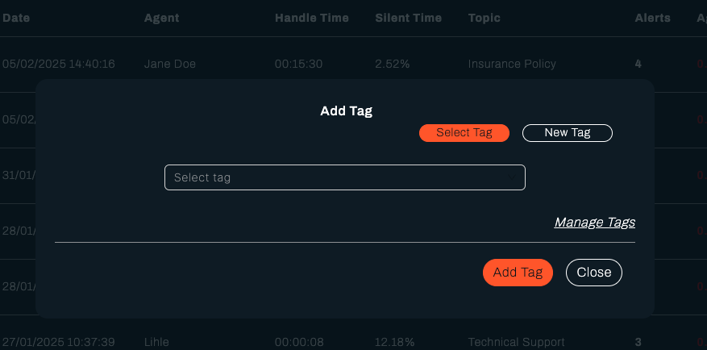
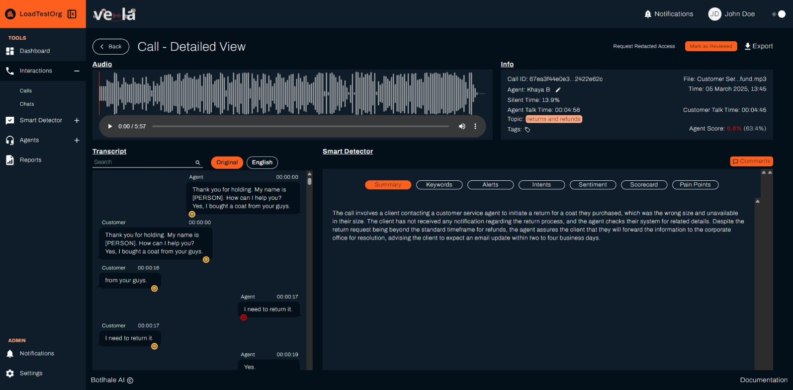

# Analyze Customer Interactions

Dive deep into your customer conversations to understand what's working, identify issues, and improve your team's performance. This guide shows you how to use call analysis to drive better customer experiences and team development.

## What You Can Achieve

With call analysis, you can:
- **Identify customer pain points** and address them proactively
- **Evaluate agent performance** with detailed conversation insights
- **Spot training opportunities** for your team
- **Track conversation trends** and patterns over time
- **Improve customer satisfaction** through data-driven insights

## Understanding Your Call Data

### Key Metrics to Monitor
Your call log shows essential information for every interaction:

- **Call Duration** - How long each conversation lasted
- **Silent Time** - Awkward pauses or processing delays
- **Topic Classification** - What the conversation was about
- **Agent Score** - Performance rating for each interaction
- **Alerts** - Issues detected by Smart Detector
- **Tags** - Custom categories for better organization

### What These Metrics Tell You
- **Long calls** might indicate complex issues or agent uncertainty
- **High silent time** could signal agent confusion or system delays
- **Low agent scores** suggest coaching opportunities
- **Frequent alerts** indicate recurring problems to address
- **Topic patterns** reveal common customer needs

## Getting Started with Call Analysis

### Step 1: Access Your Call Data
1. **Go to "Calls"** in the left sidebar
2. **Review the call log** to see all processed interactions
3. **Use filters** to focus on specific time periods, agents, or teams
4. **Sort by different metrics** to identify patterns

### Step 2: Upload New Data
Add more calls to your analysis:

1. **Click "Batch Upload"** for multiple files
2. **Select your call recordings** (we support most audio formats)
3. **Review the upload summary**
4. **Click "Upload"** to start processing

### Step 3: Organize with Tags
Create custom categories to group similar calls:

1. **Click "Select Tag"** on any call
2. **Choose existing tags** or create new ones
3. **Add descriptive names** like "Complaints," "Sales," or "Training"
4. **Use consistent naming** for better organization

## Deep Dive: Analyzing Individual Calls

### Accessing Detailed Call View
1. **Click on any call** in the call log
2. **Review the comprehensive analysis** including:
   - Full conversation transcript
   - Audio playback controls
   - Smart Detector insights
   - Performance metrics

### Understanding the Transcript
The transcript provides rich insights into each conversation:

#### Key Features
- **Full conversation text** - See exactly what was said
- **Speaker identification** - Agent vs. customer clearly marked
- **Sentiment analysis** - Emotional tone for each utterance
- **Intent detection** - What the speaker was trying to achieve
- **Language detection** - Automatic language identification

#### Using Comments for Collaboration
- **Add comments** to specific parts of conversations
- **Tag team members** for their attention
- **Share insights** and observations
- **Track follow-up actions** needed

### Audio Playback Analysis
Listen to the actual conversation for deeper insights:

- **Play/pause controls** - Review at your own pace
- **Speed adjustment** - Listen faster or slower as needed
- **Download option** - Save for offline review or training
- **Quality assessment** - Evaluate audio clarity and issues

## Smart Detector Insights

### Automated Analysis Features
Smart Detector provides instant insights for every call:

#### Call Summary
- **Key points** - Main topics and outcomes
- **Conversation flow** - How the interaction progressed
- **Resolution status** - Whether issues were resolved

#### Keyword Analysis
- **Important phrases** - Frequently mentioned terms
- **Topic identification** - What customers are talking about
- **Trend spotting** - Recurring themes across calls

#### Alert Detection
- **Compliance issues** - Regulatory or policy violations
- **Customer complaints** - Dissatisfaction indicators
- **Quality problems** - Service delivery issues
- **Training opportunities** - Areas needing improvement

#### Intent Recognition
- **Customer goals** - What they wanted to achieve
- **Service requests** - Specific needs or questions
- **Escalation indicators** - When customers need more help

#### Sentiment Analysis
- **Emotional tone** - Positive, neutral, or negative
- **Satisfaction levels** - Customer happiness indicators
- **Stress indicators** - When customers are frustrated

#### Performance Checklist
- **Script adherence** - Following required procedures
- **Resolution effectiveness** - Problem-solving success
- **Professional standards** - Meeting quality expectations

#### Pain Point Detection
- **Customer frustrations** - What's causing problems
- **Service gaps** - Areas needing improvement
- **Process issues** - Inefficiencies or bottlenecks

## Using Call Analysis for Improvement

### For Team Managers
- **Review low-scoring calls** to identify coaching needs
- **Analyze high-scoring calls** to learn best practices
- **Track performance trends** over time
- **Identify training priorities** based on common issues

### For Quality Assurance
- **Monitor compliance** with policies and procedures
- **Assess service quality** across all interactions
- **Track customer satisfaction** trends
- **Identify process improvements** needed

### For Training Teams
- **Find examples** of good and poor performance
- **Create training materials** based on real scenarios
- **Track improvement** after training interventions
- **Identify skill gaps** across the team

## Best Practices for Call Analysis

### Regular Review Routine
- **Daily check** - Review any alerts or low-scoring calls
- **Weekly analysis** - Look for patterns and trends
- **Monthly deep dive** - Comprehensive team performance review
- **Quarterly planning** - Strategic improvements based on data

### Effective Tagging Strategy
- **Use consistent naming** - Standardize tag categories
- **Create meaningful groups** - Tags that drive action
- **Review and update** - Keep tags relevant and useful
- **Train your team** - Ensure everyone uses tags consistently

### Collaboration Through Comments
- **Be specific** - Reference exact moments in calls
- **Be constructive** - Focus on improvement opportunities
- **Tag relevant people** - Ensure the right person sees feedback
- **Follow up** - Check that actions were taken

## Troubleshooting Common Issues

### Missing Call Data
**Problem**: Expected calls don't appear in the log
**Solutions**:
- Check upload status and processing completion
- Verify file formats are supported
- Review upload error logs
- Contact support for processing issues

### Poor Audio Quality
**Problem**: Audio is unclear or difficult to understand
**Solutions**:
- Check original recording quality
- Verify file format and compression
- Consider re-uploading with better quality
- Review recording equipment and settings

### Inaccurate Transcripts
**Problem**: Transcript doesn't match what was said
**Solutions**:
- Check audio quality and clarity
- Verify language detection is correct
- Review for technical terms or accents
- Consider manual corrections for important calls

### Smart Detector Issues
**Problem**: Analysis seems incorrect or missing
**Solutions**:
- Verify Smart Detector is properly configured
- Check that search criteria are appropriate
- Review alert thresholds and settings
- Contact support for configuration help

## Next Steps

- **[Monitor Performance](./dashboard.md)** - Use call insights to track team performance
- **[Improve Agent Performance](./agents.md)** - Apply call analysis to coaching
- **[Generate Reports](./reports.md)** - Create reports based on call data
- **[Set Up Smart Monitoring](./smart-detector-overview.md)** - Automate issue detection

## Need Help?

- **Contact Support**: support@botlhale.ai
- **Call Analysis Training**: Get help with effective analysis techniques
- **Smart Detector Setup**: Assistance with automated analysis configuration