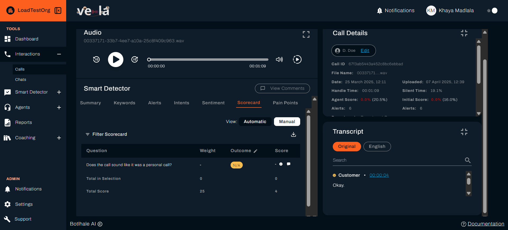
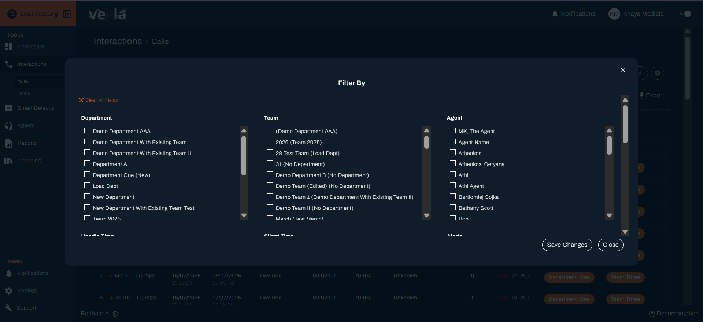
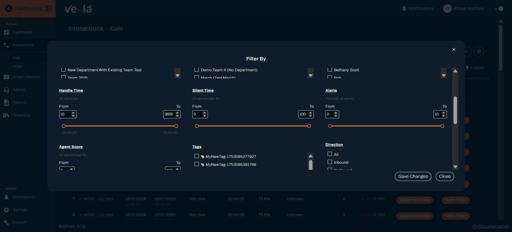

# Interactions Management

The Interactions section is your comprehensive quality assurance workspace, where you can upload, review, analyze, and score every customer conversation to ensure consistent service quality. 

## Interaction Upload Methods

### Single Call Upload

#### When to Use:
- Individual call review and analysis
- Spot-checking agent performance
- Analyzing specific customer complaints or compliments
- Training examples for coaching sessions

#### Upload Process:
1. **Navigate**: Go to Interactions → Calls
2. **Click "Upload"**
3. **Click "Single Upload"** tab
4. **Complete the form**:
   - **Agent**: Select from your team dropdown (filtered by your permission scope)
   - **Direction**: Choose "Inbound" or "Outbound"
   - **Tags**: Add classification labels (optional but recommended)
   - **File Upload**: Browse your device or drag-and-drop the audio file
5. **Submit**: Click "Upload" and monitor processing status


#### Processing Times:
- **Short calls**: (under 5 minutes)
- **Standard calls**: (5-15 minutes)
- **Long calls** : (15+ minutes) depending on content complexity

### Bulk Call Upload

#### When to Use:
- Processing daily/weekly call batches
- Historical data import during initial setup
- Routine quality assurance on large volumes
- Comprehensive team performance analysis

#### Preparation Requirements:

**1. Create ZIP Archive:**
- Maximum recommended size: 3GB per batch
- Include all audio files (WAV or MP3 format)
- Ensure consistent file naming for easy identification

**2. Prepare Metadata CSV:**
Required columns (exact column names):
```
filename,agent_name,team,department,direction,tags
call_001.mp3,john.smith,Sales Team,Sales,inbound,sales;product_inquiry
call_002.wav,mary.jones,Support Team,Customer Service,outbound,follow_up;resolution
```

**Column Details:**
- **filename**: Exact audio file name (including extension)
- **agent_name**: Must match existing agent names in your system
- **team**: Agent's team assignment
- **department**: Department classification
- **direction**: "inbound" or "outbound"
- **tags**: Semicolon-separated classification labels

**3. Download Template:**
- Use the metadata.csv template available on the upload page
- Ensures correct formatting and reduces upload errors

#### Bulk Upload Process:
1. **Navigate**: Go to Interactions → Calls
2. **Click "Upload"**
3. **Click "Bulk Upload"** tab
4. **Upload ZIP file**: Select your prepared archive
5. **Monitor processing**: Large batches display progress indicators
6. **Review results**: Check for any failed uploads or errors


#### Best Practices for Bulk Uploads:
- Test small batches first (5-10 files) to verify format
- Upload during off-peak hours to ensure optimal processing speed
- Keep backup copies of original files until processing is confirmed
- Monitor processing status - don't navigate away during large uploads

### Chat Upload Process

#### JSON Format Requirements:
```json
[
    {
        "metadata": {
            "date": "23/09/2025, 14:30",
            "agent": "agent@yourcompany.com",
            "interaction_id": "chat_12345",
            "language": "en-ZA"
        },
        "messages": [
            {
                "message": "Hello, how can I help you today?",
                "time": "23/09/2025, 14:30",
                "sender": "agent",
                "language": "en-ZA"
            },
            {
                "message": "I need help with my billing",
                "time": "23/09/2025, 14:31",
                "sender": "customer",
                "language": "en-ZA"
            }
        ]
    }
]
```

#### JSON Structure Explanation:
- **metadata**: Overall chat session information
- **messages**: Array of individual chat messages in chronological order
- **sender**: "agent" or "customer" to identify message source
- **language**: Language code for multilingual analysis

## Interaction Analysis Features

### Automatic AI Analysis

Every uploaded interaction receives comprehensive AI analysis:

#### Transcription Processing:
- **Multi-language support**: Including African languages (Zulu, Xhosa, Afrikaans, Sesotho, Setswana, and more)
- **Speaker identification**: Automatic separation of agent vs. customer speech
- **Timestamp synchronisation**: Precise timing for quality review

#### Smart Detector Analysis:

**1. Summary Generation**
- AI-created overview of interaction key points
- Issue identification and resolution tracking
- Customer satisfaction assessment
- Agent performance highlights

**2. Keyword Detection**
- Automatic identification of important terms and phrases
- Compliance monitoring for required scripts and procedures
- Product/service mentions for business intelligence
- Sentiment-bearing words that influence customer experience

**3. Alert Generation**
Alerts are raised when a processed interaction matches one of your organisation's **Smart Search** rules. Each alert links back to the specific Smart Search that triggered it and can be resolved once reviewed.

**4. Intent Classification**
- The AI identifies the customer's primary purpose for the interaction (e.g. Support, Sales, Complaint, Information)
- Intents are visible in the interaction detail view (intent tab) and aggregated in the Dashboard

**5. Sentiment Analysis**
- Overall sentiment: Positive, Neutral, or Negative for the entire interaction
- Sentiment is tracked across the conversation so you can see how the customer's mood shifted at different points

**6. Pain Point Identification**
- Customer frustration indicators: Long wait times, repeated explanations, unresolved issues
- System/process problems: Technical difficulties, unclear procedures
- Agent-related issues: Knowledge gaps, communication problems
- Resolution tracking: Whether pain points were addressed effectively


### Manual Review and Scoring

#### Accessing Interactions:
1. **Navigate**: Interactions section (Calls or Chats tab)
2. **Filter options**:
   - **Date range**: Focus on specific time periods
   - **Agent/Team**: Individual or group analysis
   - **Score range**: Focus on high/low performing interactions
   - **Alert status**: Prioritize flagged interactions
   - **Review status**: Track your QA progress

#### Interaction Detail View:

**Audio/Chat Playback Controls:**
- **Play/Pause**: Standard media controls for audio review
- **Speed adjustment**: 0.5x to 2x playback speed for efficient review
- **Skip controls**: Jump to specific timestamps
- **Volume control**: Adjust for clear listening

**Transcript Review:**
- **Speaker identification**: Clear visual separation of agent vs. customer
- **Searchable text**: Find specific keywords or phrases instantly
- **Timestamp navigation**: Click timestamps to jump to specific audio moments

**Scorecard System:**

*Automatic Scorecard:*
- AI-generated evaluation based on your organisation's Agent Scorecard items
- Each scorecard item receives a pass/fail result from the AI
- Categories and weights are set by your organisation. The breakdown reflects your own criteria
- The overall score is a weighted average of all applicable scorecard items

*Manual Scorecard:*
1. **Click "Manual"**
2. **Evaluate each category**:
   - Use your organisation's specific criteria
   - Consider context that AI might miss
   - Apply human judgment to nuanced situations
   - Add detailed comments explaining your evaluation
3. **Submit final score** which will override AI assessment



### Collaboration and Feedback

#### Comment System:
- Add comments at interaction level or specific timestamps
- Tag agents to notify them of feedback
- Collaborate with other team leads on complex quality issues
- Create coaching notes for development discussions

#### Comment Best Practices:
- **Be specific**: Reference exact moments in the interaction
- **Be constructive**: Focus on improvement opportunities, not criticism
- **Be actionable**: Provide clear next steps or suggestions
- **Be timely**: Add feedback within 24-48 hours of interaction

#### Agent Notification:
- Agents receive notifications in their portal when you add comments
- They can respond with questions or acknowledgment
- Two-way communication supports effective coaching relationships

## Quality Assurance Workflows

### Daily QA Routine

A recommended daily approach:
- Check new interactions for open alerts and prioritise those for review first
- Focus sampling on agents whose scores are declining
- Add comments to interactions as coaching notes for agents

### Weekly QA Analysis

#### Comprehensive Review Process:
- Generate weekly performance reports for all agents
- Identify patterns in low-scoring interactions
- Review alert trends and systemic issues
- Assess coaching effectiveness through score improvements
- Plan training initiatives based on common quality issues

#### Quality Trend Monitoring:
- **Score consistency**: Are agents maintaining performance standards?
- **Improvement trajectories**: Which agents are responding well to coaching?
- **Compliance adherence**: Are procedure violations decreasing?
- **Customer satisfaction**: Is sentiment improving with quality initiatives?

## Advanced Interaction Features

### Search and Filter Capabilities

#### Transcript Search:
- **Keyword search**: Find interactions containing specific terms or phrases within their transcripts
- **Multi-language search**: Search across interactions in different languages

#### Advanced Filtering:
Combine multiple criteria to narrow your interaction list:
- Date range (call date or upload date)
- Department, team, or agent
- Score range (overall, compliance, quality)
- Number of alerts
- Call duration and silent time
- Tags
- Review status (reviewed / not reviewed)
- Direction (inbound / outbound)

#### Interaction Tags:
Tags are custom labels you assign to interactions when uploading (or during review) to help classify and find them later. Tags are defined at your organisation level.




---

## Next Steps

| **For Smart Monitoring** | **For Team Management** | **For Quality Assurance** |
|-------------------------|------------------------|-------------------------|
| [Set Up Smart Monitoring](./smart-detector-overview.md) | [Improve Agent Performance](./agents.md) | [Create Agent Scorecards](./agent-scorecard-guide.md) |

### See also
- [Dashboard Overview](./dashboard.md) - Monitor interaction performance trends
- [Agent Performance](./agents.md) - Coach your team effectively
- [Smart Search](./smart-search-guide.md) - Find specific patterns in interactions
- [Official API Documentation](https://docs-apis.botlhale.xyz) - Complete API reference for integrations

## Need Help?

- **Contact Support**: support@botlhale.ai
