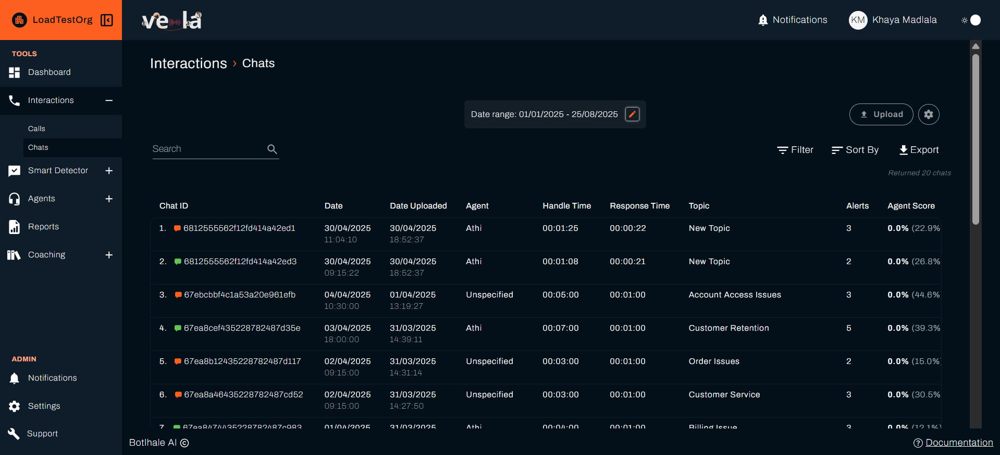
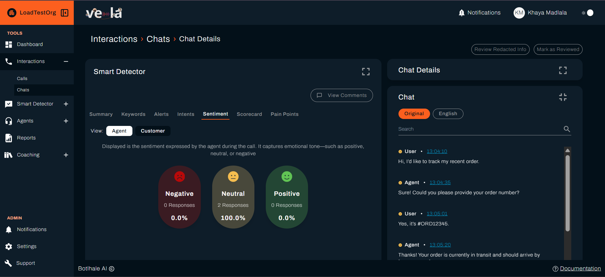
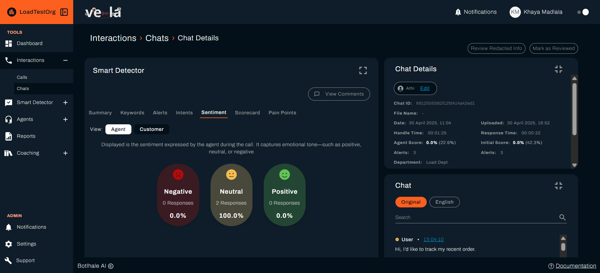
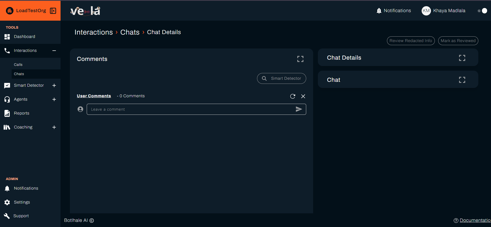

# 💬 Analyse Chat Conversations

Digital conversations reveal insights that voice calls can't capture. Vela's chat analysis helps you understand customer behaviour patterns, optimise response times, and improve the quality of your digital customer service.

## 🎯 What You Can Achieve

Chat analysis unlocks the hidden patterns in digital conversations. Here's what you'll accomplish:

| **Digital Experience** | **Response Optimization** | **Quality Improvement** |
|----------------------|-------------------------|----------------------|
| 🚀 **Optimise response times** | 📱 **Improve digital engagement** | ✅ **Enhance chat quality** |
| 🔍 **Understand customer behaviour** | 💬 **Perfect your messaging** | 📊 **Track digital performance** |
| 💡 **Identify automation opportunities** | 🎯 **Increase resolution rates** | 🛡️ **Maintain digital standards** |

---

## 📊 Understanding Chat Data

### Key Metrics for Digital Interactions
Chat analysis provides unique insights into digital customer service:

| **Metric Category** | **What It Shows** | **Digital Impact** |
|-------------------|-------------------|------------------|
| **Response Time** | Speed of agent replies | Customer satisfaction, engagement |
| **Message Count** | Conversation complexity | Issue complexity, efficiency |
| **Customer Sentiment** | Digital satisfaction levels | Digital experience quality |
| **Resolution Rate** | Problem-solving effectiveness | Digital service quality |
| **Session Duration** | Time investment and efficiency | Resource allocation, automation opportunities |

### Chat Quality Indicators
| **Indicator** | **What It Means** | **Digital Action** |
|---------------|-------------------|------------------|
| **Fast response + High satisfaction** | Excellent digital service | Replicate and automate |
| **Slow response + Low satisfaction** | Digital service issues | Optimise response processes |
| **High message count + Low resolution** | Complex issues or inefficiency | Improve processes or training |
| **Low message count + High resolution** | Efficient digital service | Scale successful approaches |

---

## 🔍 How to Analyse Chat Conversations

### Step 1: Access Chat Data

- [ ] **Go to "Chats"** in the left sidebar
- [ ] **Click on any conversation** to view detailed analysis
- [ ] **Review the conversation flow** and timing

### Step 2: Review Conversation Flow

- [ ] **Read the full conversation** with timestamps
- [ ] **Analyse response patterns** and timing
- [ ] **Identify customer journey** and pain points
- [ ] **Note successful resolution strategies**

### Step 3: Analyse Digital Metrics

- [ ] **Check response times** throughout the conversation
- [ ] **Review message count** and complexity
- [ ] **Assess customer sentiment** in digital context
- [ ] **Evaluate resolution effectiveness**

### Step 4: Take Digital Action

- [ ] **Add comments** for team learning
- [ ] **Update chat templates** based on insights
- [ ] **Optimise response processes** for efficiency
- [ ] **Identify automation opportunities**

---

## 📈 Identifying Digital Patterns

### Customer Behaviour Analysis
Understand how customers interact in digital channels:

| **Behaviour Pattern** | **What to Look For** | **Business Opportunity** |
|---------------------|---------------------|------------------------|
| **Quick Questions** | Simple queries that could be automated | Chatbot implementation |
| **Complex Issues** | Detailed problems requiring human expertise | Specialized agent training |
| **Multi-channel** | Customers switching between channels | Omnichannel optimization |
| **Peak Usage Times** | High-volume periods | Resource planning |

### Agent Performance in Digital
Identify digital-specific performance patterns:

| **Pattern** | **Digital Indicators** | **Improvement Focus** |
|-------------|---------------------|---------------------|
| **Fast Typing** | Quick responses, high message count | Efficiency training |
| **Thoughtful Responses** | Longer, more detailed messages | Quality vs. speed balance |
| **Template Usage** | Consistent, professional responses | Template optimization |
| **Personal Touch** | Customised, empathetic responses | Personalisation training |

---

## 🚀 Optimizing Digital Customer Service

### Response Time Optimization
Improve the speed and quality of digital interactions:

| **Response Time** | **Customer Expectation** | **Action Required** |
|------------------|-------------------------|-------------------|
| **Under 30 seconds** | Excellent digital service | Maintain and replicate |
| **30-60 seconds** | Good digital service | Optimise for faster response |
| **60+ seconds** | Poor digital service | Immediate process review |
| **No response** | Failed digital service | Escalation procedures |

### Message Quality Improvement
Enhance the effectiveness of digital communication:

- [ ] **Use clear, concise language** for digital audiences
- [ ] **Include relevant links** and resources
- [ ] **Maintain professional tone** while being friendly
- [ ] **Follow up appropriately** to ensure resolution

### Automation Opportunities
Identify conversations that could be automated:

| **Conversation Type** | **Automation Potential** | **Implementation** |
|---------------------|------------------------|------------------|
| **FAQ Questions** | High - Standard responses | Chatbot with knowledge base |
| **Simple Requests** | Medium - Basic workflows | Automated workflows |
| **Complex Issues** | Low - Human expertise needed | Human agent escalation |
| **Complaints** | Low - Emotional intelligence required | Specialized agent handling |

---

## 📱 Digital Experience Optimization

### Chat Interface Analysis
Optimise the digital customer experience:

| **Interface Element** | **What to Monitor** | **Optimization** |
|---------------------|-------------------|-----------------|
| **Welcome Messages** | Engagement and response rates | A/B test different approaches |
| **Response Templates** | Consistency and effectiveness | Update based on performance |
| **Escalation Process** | Smoothness of handoffs | Streamline procedures |
| **Closing Messages** | Customer satisfaction and follow-up | Optimise for retention |

### Multi-channel Integration
Ensure seamless experience across channels:

- [ ] **Track customer journey** across different channels
- [ ] **Maintain conversation context** during transfers
- [ ] **Provide consistent information** across platforms
- [ ] **Optimise handoff processes** between channels

---

## 📊 Chat Analytics Dashboard

### Digital Performance Metrics
Monitor these key indicators for digital success:

| **KPI** | **Target** | **Digital Threshold** |
|---------|------------|---------------------|
| **Average Response Time** | Under 30 seconds | Above 60 seconds = process review |
| **Customer Satisfaction** | 90%+ positive | Below 80% = immediate optimization |
| **First Contact Resolution** | 85%+ | Below 75% = training or process review |
| **Session Duration** | 3-5 minutes | Above 10 minutes = efficiency review |

### Digital Trend Analysis
- [ ] **Track digital adoption** over time
- [ ] **Monitor channel preferences** and usage patterns
- [ ] **Analyse peak usage times** for resource planning
- [ ] **Compare digital vs. voice performance** metrics

---

## 🔧 Troubleshooting Digital Issues

| **Problem** | **Digital Cause** | **Solution** |
|-------------|------------------|--------------|
| **Slow response times** | High volume, agent workload, technical issues | Optimise processes, add resources, fix technical problems |
| **Low customer satisfaction** | Poor response quality, slow service, technical problems | Improve training, optimise processes, enhance technology |
| **High escalation rates** | Complex issues, agent limitations, process gaps | Better training, improved processes, clearer escalation criteria |
| **Technical difficulties** | System issues, connectivity problems, interface problems | Technical support, system upgrades, user training |

---

## 💡 Best Practices for Chat Analysis

### Digital-First Approach
- [ ] **Optimise for mobile** and digital interfaces
- [ ] **Use digital-appropriate language** and tone
- [ ] **Leverage digital tools** and automation
- [ ] **Monitor digital metrics** specifically

### Response Optimization
- [ ] **Balance speed and quality** in digital responses
- [ ] **Use templates effectively** for consistency
- [ ] **Personalize when possible** for better engagement
- [ ] **Follow up appropriately** to ensure resolution

### Continuous Digital Improvement
- [ ] **Update chat templates** based on performance
- [ ] **Optimise response processes** for efficiency
- [ ] **Implement automation** where appropriate
- [ ] **Monitor digital trends** and adapt accordingly

---

## 🔗 Next Steps

| **For Smart Monitoring** | **For Team Management** | **For Quality Assurance** |
|-------------------------|------------------------|-------------------------|
| [🔍 Set Up Smart Monitoring](./smart-detector-overview.md) | [👥 Improve Agent Performance](./agents.md) | [📋 Create Agent Scorecards](./agent-scorecard-guide.md) |

## 🆘 Need Help?

- 📧 **Contact Support**: support@botlhale.ai
- 📚 **Navigation Guide**: [Find the right documentation](./navigation-guide.md) for your needs

