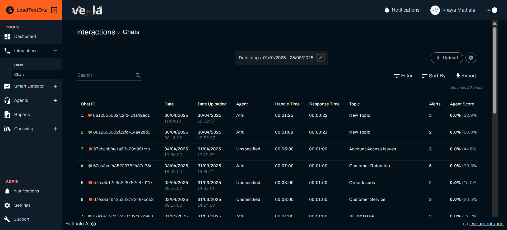
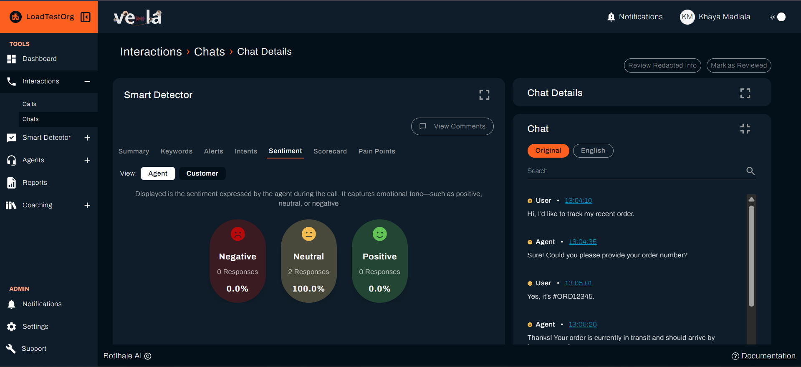
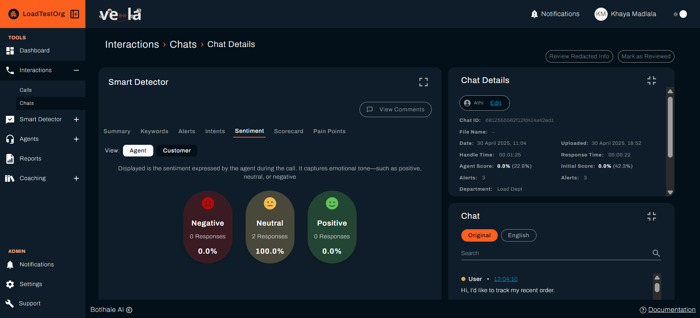
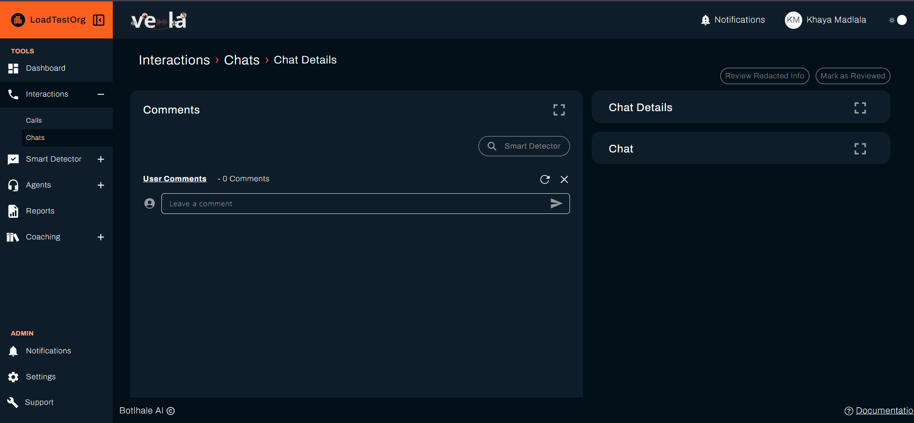

# Analyse Chat Conversations

Digital conversations reveal insights that voice calls can't capture. Vela's chat analysis helps you understand customer behaviour patterns, optimise response times, and improve the quality of your digital customer service.

## What You Can Achieve

Chat analysis reveals patterns in digital conversations. You'll be able to:

| **Digital Experience** | **Response Optimization** | **Quality Improvement** |
|----------------------|-------------------------|----------------------|
| Optimise response times | Improve digital engagement | Enhance chat quality |
| Understand customer behaviour | Perfect your messaging | Track digital performance |
| Identify automation opportunities | Increase resolution rates | Maintain digital standards |

---

## Understanding Chat Data

### Key Metrics for Digital Interactions
Chat analysis gives you unique insights into digital customer service:

| **Metric Category** | **What It Shows** | **Digital Impact** |
|-------------------|-------------------|------------------|
| Response Time | Speed of agent replies | Customer satisfaction, engagement |
| Message Count | Conversation complexity | Issue complexity, efficiency |
| Customer Sentiment | Digital satisfaction levels | Digital experience quality |
| Session Duration | Time investment and efficiency | Resource allocation, automation opportunities |
<!-- | **Resolution Rate** | Problem-solving effectiveness | Digital service quality | -->
### Chat Quality Indicators
| **Indicator** | **What It Means** | **Digital Action** |
|---------------|-------------------|------------------|
| Fast response + High satisfaction | Excellent digital service | Replicate successful patterns |
| Slow response + Low satisfaction | Digital service issues | Optimise response processes |
| High message count + Low resolution | Complex issues or inefficiency | Improve processes or training |
| Low message count + High resolution | Efficient digital service | Scale successful approaches |

---

## How to Analyse Chat Conversations

### Step 1: Access Chat Data

- [ ] **Go to "Chats"** in the left sidebar
- [ ] **Click on any conversation** to view detailed analysis
- [ ] **Review the conversation flow** and timing

### Step 2: Review Conversation Flow

- [ ] **Read the full conversation** with timestamps
- [ ] **Analyse response patterns** and timing
- [ ] **Identify customer journey** and pain points
- [ ] **Note successful resolution strategies**

### Step 3: Analyse Digital Metrics

- [ ] **Check response times** throughout the conversation
- [ ] **Review message count** and complexity
- [ ] **Assess customer sentiment** in digital context
- [ ] **Evaluate resolution effectiveness**

### Step 4: Take Digital Action

- [ ] **Add comments** for team learning
- [ ] **Update chat templates** based on insights
- [ ] **Optimise response processes** for efficiency
- [ ] **Identify automation opportunities**

---

## Identifying Digital Patterns

### Patterns to Look For

When reviewing chat interactions, consider:
- **Response time** — Are agents replying quickly? Longer response times may indicate high volume or knowledge gaps.
- **Message count** — More messages may indicate a complex issue or unclear communication.
- **Sentiment shifts** — Where in the conversation did the customer's mood improve or worsen?
- **Resolution** — Did the agent resolve the issue within the conversation, or did it require escalation?

---

## Reviewing Chat Performance on the Dashboard

Chat metrics appear alongside call metrics on your Dashboard. Chat-specific indicators include:

- **No. Chats** — total chat interactions in the selected period
- **Average Response Time** — average time between messages in a conversation
- **Sentiment Distribution** — proportion of positive, neutral, and negative chat interactions
- **Intent Distribution** — what customers were trying to achieve across chat conversations

Use the Dashboard's **Interaction Type** filter to view chat-only metrics separately from calls.

---

## Troubleshooting Digital Issues

| **Problem** | **Digital Cause** | **Solution** |
|-------------|------------------|--------------|
| Slow response times | High volume, agent workload, technical issues | Optimise processes, add resources, fix technical problems |
| Low customer satisfaction | Poor response quality, slow service, technical problems | Improve training, optimise processes, enhance technology |
| High escalation rates | Complex issues, agent limitations, process gaps | Better training, improved processes, clearer escalation criteria |
| Technical difficulties | System issues, connectivity problems, interface problems | Technical support, system upgrades, user training |

---

## Best Practices for Chat QA

- **Prioritise chats with negative sentiment** — use the sentiment filter in Interactions → Chats to find conversations where the customer's mood declined
- **Review low-scoring chats first** — apply the score range filter to surface interactions that scored below your team's threshold
- **Check Smart Search alerts** — Smart Search rules apply to both calls and chats, so alerts in the Smart Detector may relate to chat interactions
- **Use comments for coaching** — add feedback directly to individual chat interactions so agents can see specific examples

---

## Next Steps

| **For Smart Monitoring** | **For Team Management** | **For Quality Assurance** |
|-------------------------|------------------------|-------------------------|
| [Set Up Smart Monitoring](./smart-detector-overview.md) | [Improve Agent Performance](./Agents.md) | [Create Agent Scorecards](./agent-scorecard-guide.md) |

### See also
- [Call Analysis](./Calls.md) - Analyse voice interactions
- [Dashboard Overview](./Dashboard.md) - Monitor digital performance trends
- [Agent Performance](./Agents.md) - Coach your team effectively
- [Smart Search](./smart-search-guide.md) - Find patterns in digital conversations
- [Official API Documentation](https://docs-apis.botlhale.ai) - Complete API reference for integrations

## Need Help?

- **Contact Support**: support@botlhale.ai

