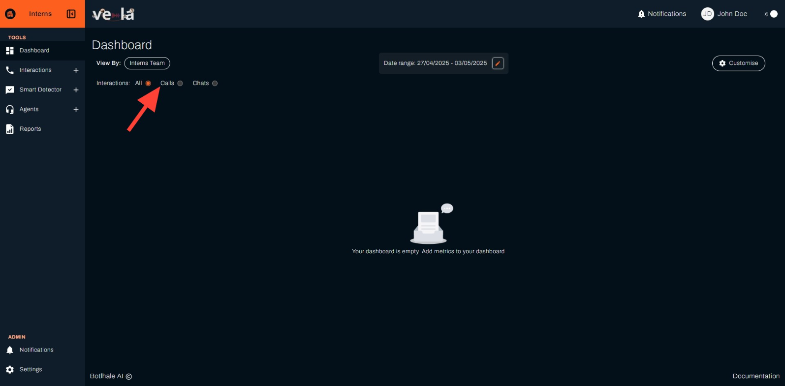

# Dashboard 

The Dashboard section helps you understand how to use the Vela Dashboard to explore your call centre data easily. It shows important information like agent performance, customer trends, and more in a simple and visual way. This makes it easier for managers and analysts to make smart decisions quickly.

## What the Dashboard Does

* **Quick Overview**: See key data like silent time, customer sentiment, agent
performance, and call summaries at a glance
* **Deep Dive**: Look closer at specific calls with charts and graphs to understand
customer sentiment, topics, and agent interactions
* **Make It Your Own**: Customise the dashboard to show the data you care about most

The Vela Dashboard turns call centre data into clear insights, helping you improve
operations and deliver better customer experiences.

## Customise Your Dashboard

When you first log in, your dashboard will be empty. You'll need to set it up to show the data
you want. Follow these steps to customise your dashboard.

## Getting Started

Here's how to set up your dashboard step by step:

### Step 1: Access Your Dashboard
Make sure you're on the "Dashboard" section of the Vela platform.

### Step 2: Choose Your Team
Use the "View By" dropdown to select a team, like "Interns Team."

### Step 3: Set Interaction Type
Pick the type of interactions to view—choose from "All," "Calls," or "Chats."

### Step 4: Set Date Range

1. Click the orange pencil on "Date range" (example: "20/04/2025 – 28/04/2025") to open the date picker.

2. In the "Select Date Range" pop-up, choose a preset option like "Today," "Yesterday," "This Week," "Last Week," "This Month," or "Last Month," or pick custom dates from the calendar (e.g., April 20 to April 26, 2025).

3. Click "Save" in the date range pop-up.

### Step 5: Customise Your Dashboard

1. Click the "Customise" button on the top right corner of the screen. A pop-up window will appear.

2. In the pop-up, click "Add New Metric" to choose the data you want to see, such as:
   - Agent Distribution
   - Agent Scores Distribution
   - Average Call Duration
   - Average Response Time
   - Average Agent Score
   - Average Silent Time
   - Bottom 10 Pain Points (Detected)

**Note**: Each metric will show data for the whole organisation and the team you choose. You can also filter data for a specific time period using the filter icon next to the metric.

3. Click the orange "Save" button to apply your changes.

**Notes**
- If your organisation hasn’t uploaded any call data, your dashboard will show empty
cards. Check the "Data Management" section for more details on how to add data.
- You can always go back to the "Customise" button to change the metrics, team,
interaction type, or date range.

<!--  -->