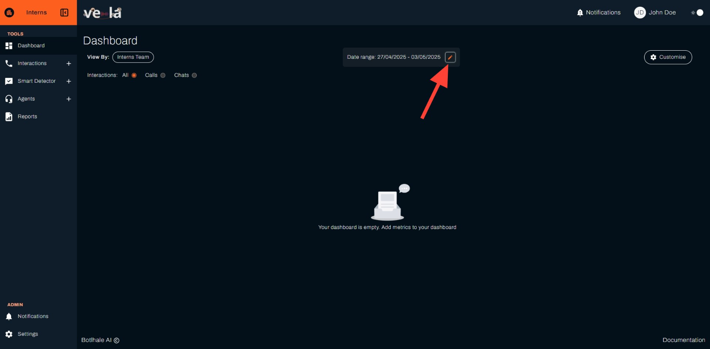
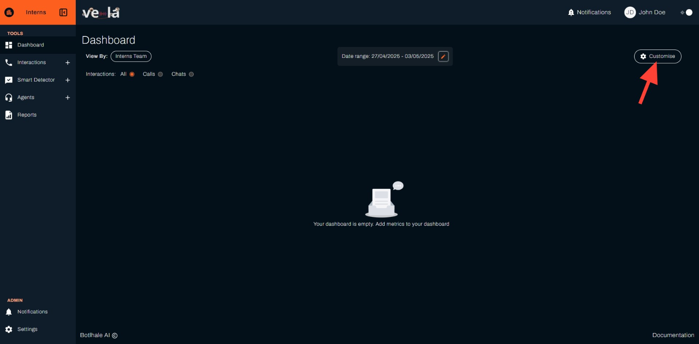

# Monitor Your Team's Performance

Your Vela dashboard gives you a comprehensive view of your call centre's performance at a glance. It's where you'll spot trends, identify coaching opportunities, and track how your team is performing.

## What You Can Achieve

Your dashboard transforms raw data into actionable insights. Here's what you'll be able to do:

| **Performance Monitoring** | **Team Management** | **Customer Experience** |
|---------------------------|-------------------|------------------------|
| **Spot problems before they escalate** | **Coach with confidence** | **Keep customers happy** |
| **Track trends and patterns** | **Identify top performers** | **Monitor satisfaction** |
| **Optimise efficiency** | **Spot training needs** | **Catch issues early** |

---

## Set Up Your Dashboard

Ready to get started? Let's set up your dashboard in just a few steps.

### Step 1: Access Your Dashboard
1. **Log in** to Vela
2. **Click "Dashboard"** in the left sidebar
3. You'll see an empty dashboard initially - this is normal

> **Tip**: If your dashboard is empty, you'll need to upload some call data first. See our [Data Upload Guide](./data-upload.md) to get started.

### Step 2: Choose Your Team
1. **Click "View By"** dropdown
2. **Select your team** (e.g., "Customer Support Team")
3. This filters all data to show only your team's performance

### Step 3: Set Your Time Period
1. **Click the date range** (e.g., "20/04/2025 – 28/04/2025")
2. **Choose a preset** like "This Week" or "Last Month"
3. **Or select custom dates** from the calendar
4. **Click "Save"** to apply

### Step 4: Add Key Metrics
1. **Click "Customise"** in the top-right corner
2. **Click "Add New Metric"** for each metric you want to track
3. **Add these essential metrics**:

> **Important**: Start with these core metrics to get the most value from your dashboard. You can always add more later as you become familiar with the platform.

#### Performance Metrics
- **Agent Distribution** - See who's handling the most calls
- **Average Agent Score** - Track overall team performance
- **Agent Scores Distribution** - Identify top performers and those needing help

#### Efficiency Metrics
- **Average Call Duration** - Spot efficiency issues
- **Average Response Time** - Monitor responsiveness
- **Average Silent Time** - Identify awkward pauses or delays

#### Customer Experience Metrics
- **Bottom 10 Pain Points** - See what's frustrating customers
- **Customer Sentiment** - Track satisfaction trends

4. **Click "Save"** to apply your dashboard

---

## Understanding Your Dashboard

### Performance Overview
Your dashboard shows comprehensive call analytics data for your selected team and time period. Each metric card displays:
- **Current value** (e.g., average call duration)
- **Trend indicator** (up/down arrows showing improvement or decline)
- **Filter icon** for additional filtering options

### Key Insights to Look For

#### Agent Performance
- **High scores** (90%+) indicate excellent performance
- **Low scores** (below 70%) suggest training opportunities
- **Score distribution** helps identify if issues are isolated or team-wide

#### Call Efficiency
- **Long call durations** might indicate complex issues or inefficiency
- **High silent time** could signal agent uncertainty or system delays
- **Response times** show how quickly your team responds to customers

#### Customer Satisfaction
- **Pain points** reveal what's frustrating customers
- **Sentiment trends** show if satisfaction is improving or declining

---

## Troubleshooting Common Issues

| **Problem** | **Solution** |
|-------------|--------------|
| **Empty Dashboard** | Check if you have uploaded call data, verify your date range includes data, ensure you've selected the correct team |
| **Missing Metrics** | Click "Customise" to add missing metrics, check if the metric is available for your data, contact support if metrics seem incorrect |
| **Outdated Data** | Refresh your browser, check if new data has been uploaded, verify your date range is current |

---

## Best Practices

### Save Multiple Dashboards
Create different dashboard views for different purposes:

| **Dashboard Type** | **Focus** | **Use Case** |
|-------------------|-----------|--------------|
| **Daily Operations** | Current performance | Morning check-ins |
| **Weekly Review** | Trend analysis | Team meetings |
| **Monthly Planning** | Forecasting metrics | Strategic planning |

### Use Filters Effectively
- **Date ranges** - Compare different time periods
- **Team filters** - Focus on specific groups
- **Call types** - Analyse different interaction types
- **Agent filters** - Review individual performance

### Set Up Alerts
Configure notifications for important events:
- Agent scores drop below thresholds
- Customer satisfaction declines
- Call volumes spike unexpectedly

---

## Next Steps

| **For Team Management** | **For Reporting** | **For Automation** |
|------------------------|------------------|-------------------|
| [Improve Agent Performance](./agents.md) | [Generate Reports](./reports.md) | [Configure Notifications](./notifications.md) |

### See also
- [Data Upload Guide](./data-upload.md) - Get your data into Vela first
- [Agent Performance](./agents.md) - Detailed agent coaching and development
- [Smart Monitoring](./smart-detector-overview.md) - Set up automated alerts
- [API Integration](./api.md) - Connect Vela with your existing systems
- [Official API Documentation](https://docs-apis.botlhale.xyz) - Complete API reference for integrations

## Need Help?

- **Contact Support**: support@botlhale.ai