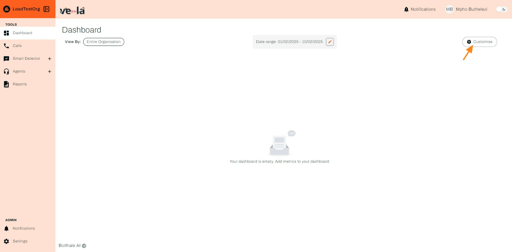
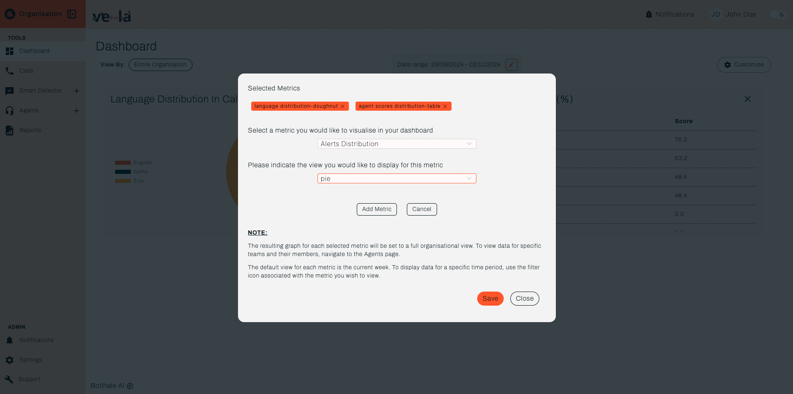

# Dashboard 

The dashboard section of this documentation suite outlines processes related to navigating and customizing the Vela Dashboard for efficient exploration of call center analytics.

The Vela Dashboard serves as the primary interface for exploring the comprehensive analytics generated from your call centre data. It consolidates key performance indicators, emerging trends, and actionable insights into a visually intuitive and customisable interface. This centralised hub empowers diverse users, from contact centre managers monitoring overall performance to quality assurance analysts investigating specific interactions, to make data-driven decisions with swiftness and precision.

The dashboard functionalities include:

* **Comprehensive Overview**: Aggregate metrics like silent time, sentiment and intent classification, agent performance, and call summarisation are readily available for at-a-glance comprehension.
* **Granular Exploration**: Drill down into specific call segments using interactive charts and graphs, enabling detailed analysis of customer sentiment, topic prevalence, and agent-customer interactions.
* **Customisation**: Tailor the dashboard layout and data presentation to align with your specific needs.

The Vela Dashboard transforms raw call centre data into a compelling narrative, guiding you towards informed decision-making, operational optimisation, and ultimately, superior customer experiences.

## Customise your dashboard

Upon first log-in, your dashboard will appear blank. This is because you first need to customise your dashboard to select the specific data points you would like a view of. Use the following steps to customise your dashboard.

##  How To Get Started - Guide
1. Ensure you are on the Dashboard screen of the Vela platform.
2. Click the **Customise Dashboard** icon found on the top right corner of the screen. A pop-up window appears, prompting you to select the datapoints you'd like displayed on your dashboard.

3. Select the data points and their corresponding view. Note that data points may be specific to a view type.

5. Click **Save**. Your dashboard is updated and displays your selected datapoints.
    a. Note that if your organisation has not uploaded any call data to the platform, your dashboard will display empty data cards. See the [Data Upload](/docs/Data%20Upload) section for more information on this.

---

## [How To Get Started - Guide](https://app.supademo.com/demo/cm6kn9w1s11xy19tn34942w73)

### 1. Customise the date range and click on "Save".

### 2. Data in the selected range.

