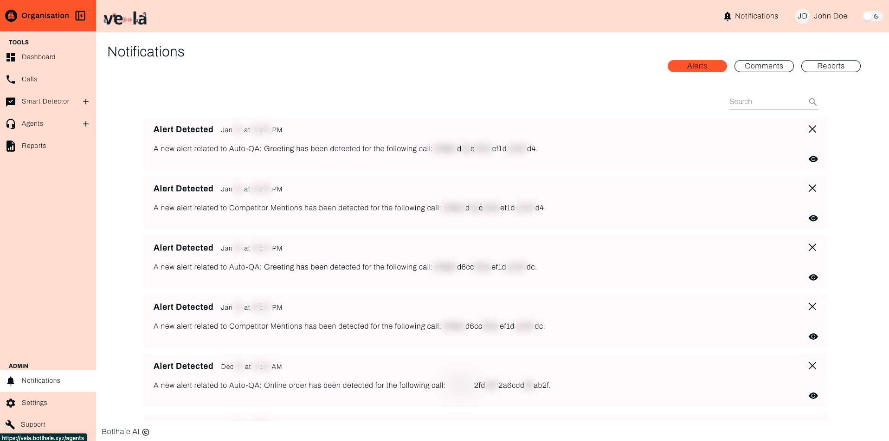
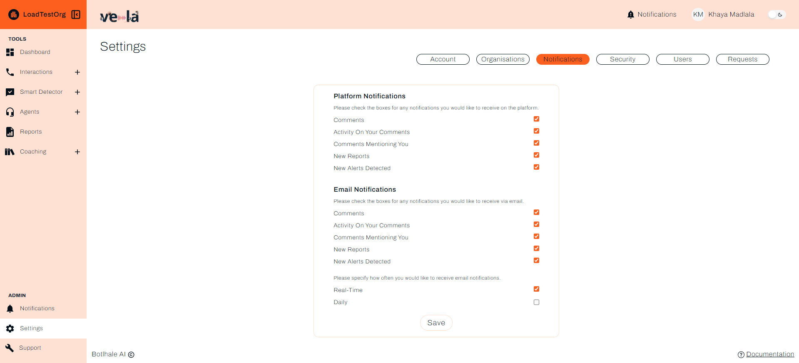

# Stay Informed and Take Action

Vela's notification system keeps you informed about important events without overwhelming you. Learn how to monitor alerts, respond to issues promptly, and keep your team connected when it matters most.

## What You Can Achieve

Notifications help you stay informed and respond quickly. Here's what you'll accomplish:

| **Issue Response** | **Team Communication** | **Performance Monitoring** |
|-------------------|----------------------|---------------------------|
| **Respond to problems promptly** | **Work together better** | **Keep track of performance** |
| **Never miss important events** | **Stay connected** | **Track what matters** |
| **Respond proactively** | **Collaborate effectively** | **Get automated insights** |

---

## Three Types of Notifications

### **Alerts: Respond to Issues Promptly**
Get notified about important events that require your attention (set up your alerts in [Smart Detector Overview](./smart-detector-overview.md)):

| **Alert Type** | **What It Monitors** | **When You Get It** |
|----------------|---------------------|-------------------|
| **Smart Search matches** | Customer complaints or compliance issues detected | When detected |
| **Performance alerts** | Agent scores below thresholds | When thresholds are exceeded |
| **System notifications** | Data processing complete or errors | When processing status changes |
| **Quality flags** | Potential issues with customer interactions | When quality issues are identified |

### **Comments: Collaborate with Your Team**
Stay updated on team discussions and feedback:

| **Comment Type** | **Purpose** | **Use Case** |
|------------------|-------------|--------------|
| **Agent feedback** | Comments on specific calls or interactions | Coaching and improvement |
| **Team discussions** | Questions and insights from colleagues | Knowledge sharing |
| **Management notes** | Important observations and instructions | Team guidance |
| **Training feedback** | Suggestions for improvement | Process enhancement |

### **Reports: Track Progress and Trends**
Receive automated summaries of your team's performance:

| **Report Type** | **Frequency** | **Content** |
|-----------------|---------------|-------------|
| **Daily summaries** | Every day | Key metrics and highlights |
| **Weekly reports** | Every week | Performance trends and insights |
| **Monthly analytics** | Every month | Comprehensive team analysis |
| **Custom reports** | As scheduled | Specific metrics you've requested |

---

## Getting Started with Notifications

### Step 1: Access Your Notifications
- [ ] **Log in** to your Vela dashboard
- [ ] **Click "Notifications"** in the left sidebar
- [ ] **Review the three tabs**:
  - [ ] **Alerts** (default) - Important events requiring attention
  - [ ] **Comments** - Team discussions and feedback
  - [ ] **Reports** - Automated summaries and analytics

### Step 2: Configure Your Preferences

- [ ] **Go to "Settings" → "Notifications"**
- [ ] **Choose your delivery method**:
  - [ ] Platform notifications (in-app)
  - [ ] Email notifications
  - [ ] Both for important alerts
- [ ] **Set notification frequency**:
  - [ ] Immediate for critical alerts
  - [ ] Daily digest for general updates
  - [ ] Weekly summary for reports

---

## Managing Alerts Effectively

### Understanding Alert Types
| **Alert Category** | **Examples** | **Priority** |
|-------------------|--------------|--------------|
| **Smart Search Alerts** | Customer complaints detected, compliance violations flagged, quality issues identified, training opportunities spotted | High - Immediate action needed |
| **Performance Alerts** | Agent scores below thresholds, call quality issues, customer satisfaction drops, efficiency problems | Medium - Review and address |

### Taking Action on Alerts
- [ ] **Click the eye icon** to view detailed information
- [ ] **Investigate the issue** by reviewing the call or interaction
- [ ] **Take appropriate action**:
  - [ ] Contact the customer if needed
  - [ ] Provide coaching to the agent
  - [ ] Update processes or training
  - [ ] Escalate to management
- [ ] **Dismiss the alert** once resolved

### Setting Up Smart Alerts
- [ ] **Go to "Smart Detector" → "Smart Search"**
- [ ] **Create searches** for issues you want to monitor
- [ ] **Set appropriate thresholds** for performance alerts
- [ ] **Configure notification preferences** for each alert type

---

## Using Comments for Collaboration

### Adding Comments to Calls
- [ ] **Open any call** in the Calls section
- [ ] **Click "Add Comment"** at the bottom
- [ ] **Write your observation** or feedback
- [ ] **Tag team members** using @username
- [ ] **Save the comment** for team visibility

### Managing Team Discussions
- [ ] **Review comments regularly** for insights
- [ ] **Respond to questions** from team members
- [ ] **Share best practices** through comments
- [ ] **Use comments for coaching** and feedback

### Best Practices for Comments
- [ ] **Be specific** - Reference exact moments in calls
- [ ] **Be constructive** - Focus on improvement opportunities
- [ ] **Tag relevant people** - Use @mentions for attention
- [ ] **Follow up** - Check if comments led to improvements

---

## Managing Report Notifications

### Understanding Report Types
| **Report Type** | **When Sent** | **What to Do** |
|-----------------|---------------|----------------|
| **Daily summaries** | Every morning | Review key metrics, identify immediate issues |
| **Weekly reports** | Every Monday | Analyse trends, plan coaching sessions |
| **Monthly analytics** | First of each month | Strategic planning, performance reviews |
| **Custom reports** | As scheduled | Review specific metrics, take action |

### Using Reports for Decision Making
- [ ] **Review trends** over time
- [ ] **Identify patterns** in performance
- [ ] **Spot improvement opportunities**
- [ ] **Share insights** with stakeholders
- [ ] **Plan next actions** based on data

---

## Troubleshooting Common Issues

| **Problem** | **Solution** |
|-------------|--------------|
| **Too many notifications** | Adjust alert thresholds, change notification frequency, filter by priority |
| **Missing important alerts** | Check notification settings, verify alert criteria, review spam filters |
| **Comments not showing** | Check permissions, verify team settings, refresh the page |
| **Reports not arriving** | Verify email settings, check spam folder, confirm report scheduling |

---

## Best Practices for Effective Notifications

### Alert Management
- [ ] **Set appropriate thresholds** - Not too sensitive, not too lenient
- [ ] **Review alerts regularly** - Don't let them pile up
- [ ] **Take action promptly** - Respond to issues when needed
- [ ] **Document actions taken** - Keep track of resolutions

### Team Communication
- [ ] **Use comments constructively** - Focus on improvement
- [ ] **Tag relevant people** - Ensure the right people see important comments
- [ ] **Follow up on discussions** - Don't let conversations die
- [ ] **Share insights broadly** - Help the whole team learn

### Report Utilization
- [ ] **Read reports regularly** - Don't just receive them
- [ ] **Share insights** with your team
- [ ] **Use data for decisions** - Let reports guide your actions
- [ ] **Provide feedback** on report usefulness

---

## Next Steps

| **For Smart Monitoring** | **For Call Analysis** | **For Settings** |
|-------------------------|---------------------|------------------|
| [Set Up Smart Monitoring](./smart-detector-overview.md) | [Analyse Call Data](./calls.md) | [Configure Settings](./settings.md) |

### See also
- [Dashboard Overview](./dashboard.md) - Monitor alerts and notifications
- [Smart Monitoring](./smart-detector-overview.md) - Set up automated alerts
- [Agent Performance](./agents.md) - Coach your team based on alerts
- [Settings Configuration](./settings.md) - Configure notification preferences
- [Official API Documentation](https://docs-apis.botlhale.xyz) - Complete API reference for integrations

## Need Help?

- **Contact Support**: support@botlhale.ai
