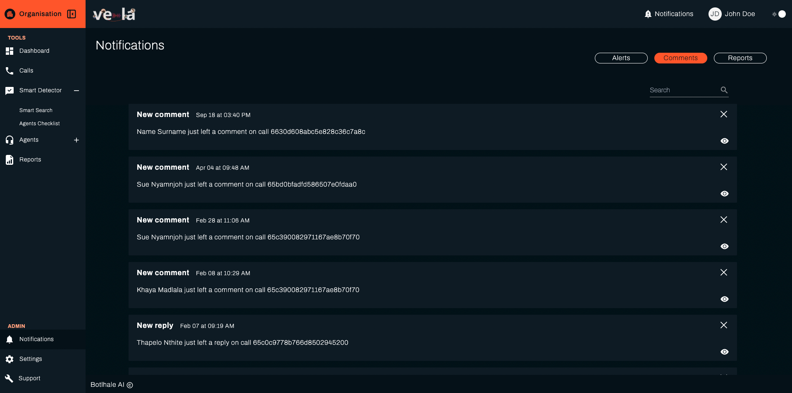

# Notifications

The Notifications Screen offers a centralised view of all platform alerts and updates, facilitating efficient monitoring 
and prompt action on critical issues, comments, and reports. On this screen, notifications are categorised into the
 following three dedicated tabs.

## Issues

This tab displays notifications related to potential problems picked up by the Smart Detector. See the Smart Detector 
section of this documentation for additional information.

Full details of the issue are not directly accessible from the notification card. Clicking the **View** icon on a specific issue notification card directs users to the corresponding detailed screen from which the issue stems. This allows for closer examination and contextual understanding of the issue.  It is important to note that closing or dismissing the issue notification card within the Notifications screen does not  mark the issue as resolved. To address the issue directly, users must navigate to the associated detailed screen and  utilise the designated resolution functions provided there.

 ## How To Get Started - Guide
1. Log in to your Vela dashboard.
2. Click on "Notifications" from the left-hand menu.
3. You will see three tabs at the top:
 - **Alerts (default)** – Displays system-generated notifications about detected events.
 - **Comments** – Shows discussions, feedback, and flagged remarks.
 - **Reports** – Contains system-generated summaries and performance analytics.

**Step 2: Understanding Alerts**

2.1.  Alerts notify users of important system detections, such as:

 -  ✅ Smart Search triggers (e.g., keyword or sentiment detection).

 -  ✅ Compliance flags.

 -  ✅ Anomalies in customer interactions.

2.2. Each alert entry includes:

  - **Alert Title** (e.g., "**Alert Detected**").
  - **Timestamp** of when the alert was generated.
  - **Description** of the event and call reference ID for review.

2.3. **Actions:**
  -  Click the eye icon to view more details.
  -  Click the X icon to dismiss the alert.

## Comments

This tab presents notifications informing users about comments left by other team members on various elements, such as call transcripts.

Full details of the comment, including its complete text and context, are not directly accessible from the notification card. 
 
Clicking the **View** icon on a specific comment notification card directs users to the corresponding detailed screen (that is, the call transcript view) where the comment was originally left. 

This allows for closer examination and contextual understanding of the comment. It is important to note that closing or dismissing the comment notification card within the Notifications screen does not mark the comment as resolved. To address the comment directly, users must navigate to the associated detailed screen and utilise the designated resolution functions provided there.

## Reports- Notifications Overview

This tab provides notifications regarding newly generated reports becoming available.

When a report is generated, a notification appears in the Reports tab with:

- **Report Title** – Identifies the newly created report.
- **Timestamp** – Shows when the report was generated.
- **Report Details** – Includes the time range covered in the report.

Each report notification provides the following action options:

- **View (Eye Icon)** – Opens the full report in a new window for detailed analysis.
- **Download (Download Icon)** – Saves the report as a PDF for further review or sharing.
- **Dismiss (X Icon)** – Removes the notification from the Reports tab.

It's important to note that closing a notification card does not automatically delete the report itself. Reports remain accessible through dedicated report management functionalities within the platform's Report screen.
