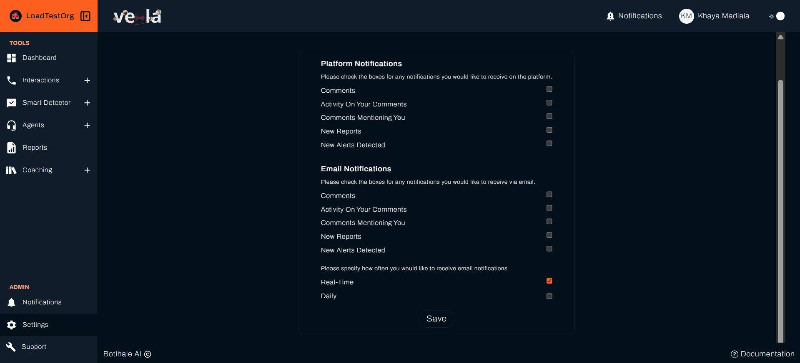

# Configure Your Notifications

Set up notifications to stay informed about important events in Vela. You can receive notifications on the platform or via email.

## How to Configure

### Step 1: Access Settings
- [ ] **Go to "Settings" → "Notifications"**
- [ ] **You'll see two sections**: Platform Notifications and Email Notifications

### Step 2: Choose What to Receive
Check the boxes for notifications you want:

- **Comments** - New comments on calls and discussions
- **Activity On Your Comments** - When someone responds to your comments  
- **Comments Mentioning You** - When you're mentioned with @username
- **New Reports** - When new reports are available
- **New Alerts Detected** - When Smart Search alerts are triggered

### Step 3: Set Email Frequency
Choose how often you want email notifications:

- **Real-Time** - Immediate emails for urgent matters
- **Daily** - One daily digest to reduce email overload

### Step 4: Save
- [ ] **Click "Save"** to apply your settings

## Best Practices

- **Start with essentials** - Enable only what you need
- **Use real-time for alerts** - Get immediate notifications for urgent matters  
- **Use daily digest for comments** - Reduce email overload
- **Review regularly** - Adjust based on what you actually use

## Next Steps

| **For Smart Monitoring** | **For Team Management** | **For Settings** |
|-------------------------|------------------------|------------------|
| [Set Up Smart Monitoring](./smart-detector-overview.md) | [Improve Agent Performance](./agents.md) | [Configure Settings](./settings.md) |

### See also
- [Dashboard Overview](./dashboard.md) - Monitor your team's performance
- [Smart Monitoring](./smart-detector-overview.md) - Set up automated alerts
- [Agent Performance](./agents.md) - Coach your team effectively

## Need Help?

- **Contact Support**: support@botlhale.ai
