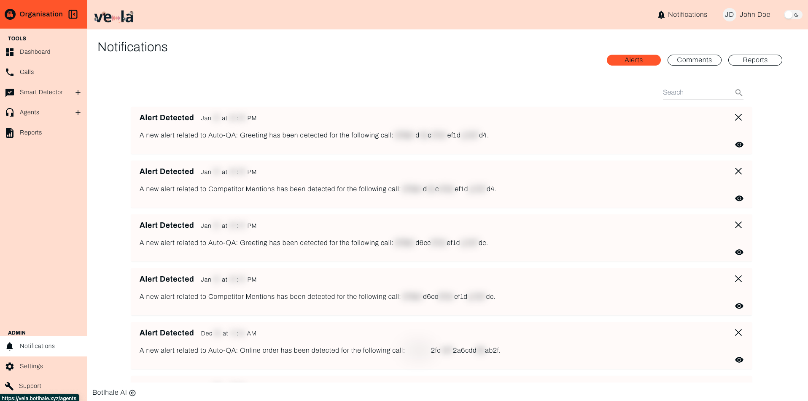
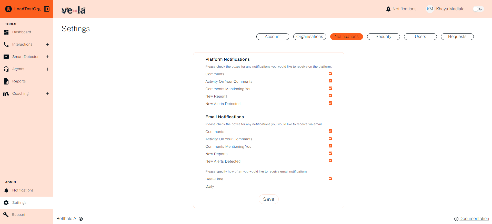

# Stay Informed and Take Action

Vela's notification system keeps you informed about important events without overwhelming you. Learn how to monitor alerts, respond to issues promptly, and keep your team connected when it matters most.

## What You Can Achieve

Notifications help you stay informed and respond quickly. You'll be able to:

| **Issue Response** | **Team Communication** | **Performance Monitoring** |
|-------------------|----------------------|---------------------------|
| Respond to problems promptly | Work together better | Keep track of performance |
| Never miss important events | Stay connected | Track what matters |
| Respond proactively | Collaborate effectively | Get automated insights |

---

## What Triggers a Notification

Vela sends in-app notifications for the following events:

| **Notification Type** | **When You Receive It** |
|----------------------|------------------------|
| **Smart Search alert** | A processed interaction matches one of your Smart Search rules |
| **Comment** | Someone adds a comment to an interaction you are involved with |
| **Report ready** | A scheduled or one-time report has finished generating |
| **Course assigned** | A training course has been assigned to you |
| **Award presented** | An award has been presented to you |
| **Call processed** | A call upload has finished processing |

---

## Getting Started with Notifications

### Step 1: Access Your Notifications
- [ ] **Log in** to your Vela dashboard
- [ ] **Click "Notifications"** in the left sidebar
- [ ] **Review the three tabs**:
  - [ ] **Alerts** (default) - Important events requiring attention
  - [ ] **Comments** - Team discussions and feedback
  - [ ] **Reports** - Automated summaries and analytics

### Step 2: Configure Smart Search Notifications

To control which Smart Searches send you notifications:
- [ ] **Go to "Smart Detector" → "Smart Search"**
- [ ] **Edit a Smart Search** and toggle the **Notifications** setting on or off

---

## Managing Alerts Effectively

### Understanding Alerts
Alerts in the Notifications section are Smart Search matches — raised automatically when a processed interaction triggers one of your configured Smart Search rules. Each alert links to the specific interaction and Smart Search that generated it.

### Taking Action on Alerts
- [ ] **Click the eye icon** to view detailed information
- [ ] **Investigate the issue** by reviewing the call or interaction
- [ ] **Take appropriate action**:
  - [ ] Contact the customer if needed
  - [ ] Provide coaching to the agent
  - [ ] Update processes or training
  - [ ] Escalate to management
- [ ] **Dismiss the alert** once resolved

### Setting Up Smart Alerts
- [ ] **Go to "Smart Detector" → "Smart Search"**
- [ ] **Create searches** for the phrases or patterns you want to monitor
- [ ] **Enable notifications** on each Smart Search to receive an in-app alert when it triggers

---

## Using Comments for Collaboration

### Adding Comments to Calls
- [ ] **Open any call** in the Calls section
- [ ] **Click "Add Comment"** at the bottom
- [ ] **Write your observation** or feedback
- [ ] **Tag agents** using the **@** symbol to share the comment directly with a specific agent
- [ ] **Save the comment** for team visibility

### Managing Team Discussions
- [ ] **Review comments regularly** for insights
- [ ] **Respond to questions** from team members
- [ ] **Share best practices** through comments
- [ ] **Use comments for coaching** and feedback

### Best Practices for Comments
- [ ] **Be specific** - Reference exact moments in calls
- [ ] **Be constructive** - Focus on improvement opportunities
- [ ] **Tag relevant people** - Use @mentions for attention
- [ ] **Follow up** - Check if comments led to improvements

---

## Report Notifications

When a scheduled or one-time report finishes generating, you'll receive a notification in your Notifications inbox. Click it to open the report directly. Report frequency (daily, weekly, or monthly) is configured when you create or schedule the report in the Reports section.

---

## Troubleshooting Common Issues

| **Problem** | **Solution** |
|-------------|--------------|
| Too many notifications | Review your Smart Search configurations and disable notifications on searches that are too broad |
| Missing important alerts | Check notification settings, verify alert criteria, review spam filters |
| Comments not showing | Check permissions, verify team settings, refresh the page |
| Reports not arriving | Verify email settings, check spam folder, confirm report scheduling |

---

## Best Practices for Effective Notifications

### Alert Management
- [ ] **Set appropriate thresholds** - Not too sensitive, not too lenient
- [ ] **Review alerts regularly** - Don't let them pile up
- [ ] **Take action promptly** - Respond to issues when needed
- [ ] **Document actions taken** - Keep track of resolutions

### Team Communication
- [ ] **Use comments constructively** - Focus on improvement
- [ ] **Tag relevant people** - Ensure the right people see important comments
- [ ] **Follow up on discussions** - Don't let conversations die
- [ ] **Share insights broadly** - Help the whole team learn

### Report Utilization
- [ ] **Read reports regularly** - Don't just receive them
- [ ] **Share insights** with your team
- [ ] **Use data for decisions** - Let reports guide your actions
- [ ] **Provide feedback** on report usefulness

---

## Next Steps

| **For Smart Monitoring** | **For Call Analysis** | **For Settings** |
|-------------------------|---------------------|------------------|
| [Set Up Smart Monitoring](./smart-detector-overview.md) | [Analyse Call Data](./Calls.md) | [Configure Settings](./Settings.md) |

### See also
- [Dashboard Overview](./Dashboard.md) - Monitor alerts and notifications
- [Smart Monitoring](./smart-detector-overview.md) - Set up automated alerts
- [Agent Performance](./Agents.md) - Coach your team based on alerts
- [Settings Configuration](./Settings.md) - Configure notification preferences
- [Official API Documentation](https://docs-apis.botlhale.xyz) - Complete API reference for integrations

## Need Help?

- **Contact Support**: support@botlhale.ai
