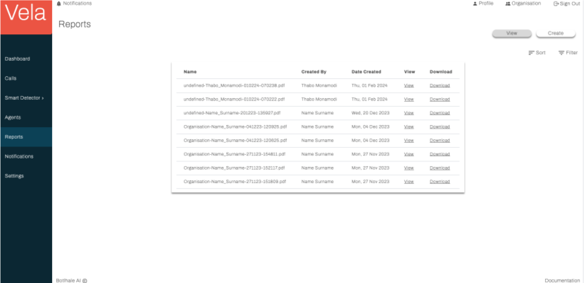
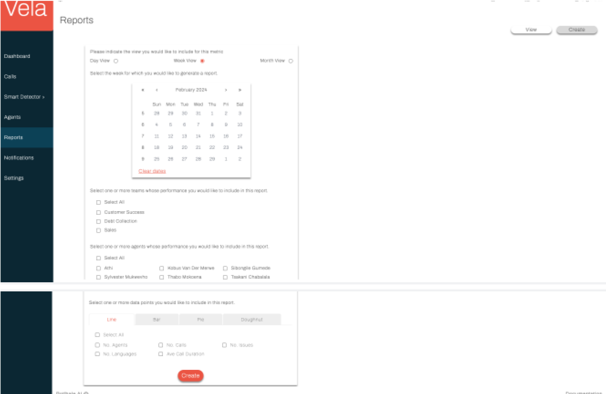

# Reports

The Vela Reports Screen serves as a central hub for generating and reviewing reports on your 
contact centre's performance.

## View Report

The View tab of this screen offers a view of all created reports alongside information relating to
when the reports were created and by whom. This tab also facilitates efficient navigation and
manipulation. Users can:

- **Sort:** Order entries by any table column, except the View and Download columns. 
- **Filter:** Apply targeted criteria based on various parameters like the date and creator. 
- **View**: View a specific report. 
- **Download:** Download a specific report as a pdf to their local machine

## Create Report

The Create tab of this screen allows you to create and generate a report by selecting the desired
metrics and parameters and clicking `Create`.

Once created, your report appears on the View tab of the page and is available to be viewed and downloaded by you and your team.

## Customise Reports

Vela reports can be customised to match your company's branding.

### Customisation Options
- **Onboarding:** During the onboarding process, you can submit a branded report template. This template will be used to generate all future Vela reports.
- **Post-onboarding:** To customise your Vela report after onboarding, please contact your Vela Account Manager.

**Note:** Specific customisation options may vary. Please consult with your Vela Account Manager for details.

## Contact us

:::info
We are here to help! Please [contact us](mailto:support@botlhale.ai) with any questions.
:::

