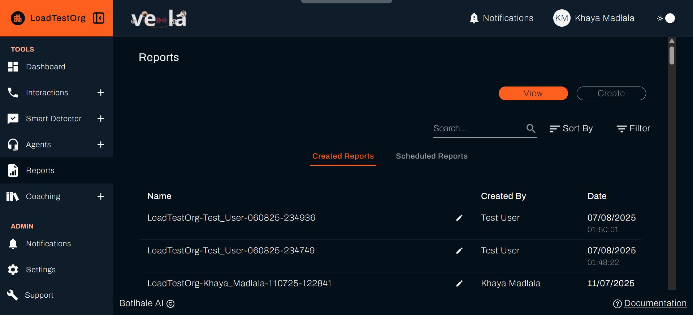
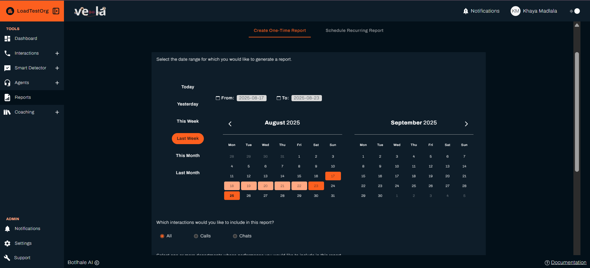
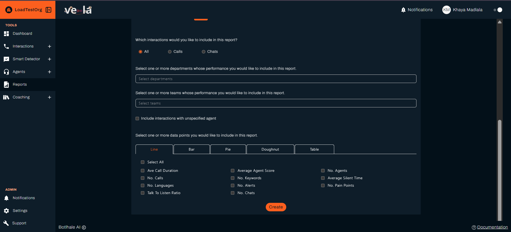

# 📊 Generate Meaningful Reports

Numbers tell stories, but only if you know how to read them. Vela's reporting tools help you turn raw data into compelling narratives that drive decisions, track progress, and convince stakeholders to take action.

## 🎯 What You Can Achieve

Reports are your secret weapon for driving change. Here's what you'll accomplish:

| **Data Storytelling** | **Stakeholder Communication** | **Strategic Decision Making** |
|---------------------|------------------------------|------------------------------|
| 📈 **Tell the story behind the numbers** | 📋 **Get buy-in from leadership** | 🎯 **Unlock hidden opportunities** |
| 📊 **Track trends and patterns** | 📈 **Share insights that matter** | 📈 **Prove your impact** |
| 🔍 **Spot insights others miss** | 💼 **Convince stakeholders to act** | 🎯 **Make decisions that stick** |

---

## 📋 Understanding Report Types

### Performance Reports
| **Report Type** | **What It Shows** | **Best For** |
|-----------------|-------------------|--------------|
| **Agent Performance** | Individual and team metrics | Coaching sessions, performance reviews |
| **Customer Satisfaction** | Sentiment and satisfaction trends | Service improvement, customer experience |
| **Call Quality** | Resolution rates and efficiency metrics | Quality assurance, process improvement |
| **Team Comparison** | Performance across different teams | Resource allocation, best practice sharing |

### Operational Reports
| **Report Type** | **What It Shows** | **Best For** |
|-----------------|-------------------|--------------|
| **Call Volume Analysis** | Peak times and workload distribution | Capacity planning, scheduling |
| **Response Time Tracking** | Speed and efficiency metrics | Process optimization, training needs |
| **Issue Resolution** | Problem patterns and solutions | Training focus, knowledge gaps |
| **Training Impact** | Before/after improvement analysis | ROI measurement, program effectiveness |

---

## 🚀 Creating Your First Report

### Step 1: Access the Reports Section
1. **Click "Reports"** in the left sidebar
2. **Click "Create"** tab
3. **Choose your report type** based on your goal

### Step 2: Select Your Data

- [ ] **Choose date range** - Select the period you want to analyse
- [ ] **Select teams/departments** - Focus on specific groups
- [ ] **Pick metrics** - Choose the data points that matter most
- [ ] **Set filters** - Narrow down to specific call types or agents

### Step 3: Customise Your Report

- [ ] **Include executive summary** - Key findings and recommendations
- [ ] **Add visualizations** - Charts and graphs for better understanding
- [ ] **Set up recurring reports** - Automate regular reporting

### Step 4: Generate and Share
- [ ] **Click "Create"** to generate your report
- [ ] **Review the results** for accuracy
- [ ] **Download as PDF** for sharing
- [ ] **Schedule recurring delivery** if needed

---

## 📈 Essential Reports for Different Goals

### 📊 **For Team Managers: Daily Performance Report**
**Goal**: Monitor daily team performance and identify issues

**Include these metrics**:
- [ ] Agent scores for the day
- [ ] Call volume and duration
- [ ] Customer satisfaction scores
- [ ] Any alerts or issues detected

**How to use it**:
- Morning team huddles
- Identify agents needing support
- Spot trends that need attention

### 📋 **For Executives: Monthly Executive Summary**
**Goal**: Provide high-level insights for strategic decision-making

**Include these metrics**:
- [ ] Overall team performance trends
- [ ] Customer satisfaction over time
- [ ] Cost per call and efficiency metrics
- [ ] Training ROI and improvement areas

**How to use it**:
- Board meetings and presentations
- Strategic planning sessions
- Budget and resource allocation

### 🎓 **For Training Teams: Coaching Effectiveness Report**
**Goal**: Measure the impact of training and coaching programs

**Include these metrics**:
- [ ] Before/after performance comparisons
- [ ] Specific skill improvements
- [ ] Training completion rates
- [ ] Long-term performance trends

**How to use it**:
- Training program evaluation
- ROI measurement
- Program improvement
- Resource allocation

---

## 📊 Advanced Reporting Features

### Custom Branding
**Add your company logo and brand colors** to reports for professional presentations

### Export Options
**Download as PDF, Excel, or CSV** for further analysis and sharing

### Automated Alerts
**Get notified when important metrics exceed thresholds** for proactive management

---

## 💡 Best Practices for Effective Reporting

### Choose the Right Metrics
- [ ] **Focus on actionable data** - Metrics that drive decisions
- [ ] **Include context** - Compare to benchmarks or goals
- [ ] **Show trends** - Don't just report current numbers
- [ ] **Highlight anomalies** - Unusual patterns that need attention

### Design Clear Reports
- [ ] **Start with executive summary** - Key findings upfront
- [ ] **Use visualizations** - Charts and graphs for clarity
- [ ] **Include recommendations** - What actions to take
- [ ] **Keep it concise** - Focus on what matters most

### Share Reports Effectively
- [ ] **Know your audience** - Different stakeholders need different details
- [ ] **Provide context** - Explain what the numbers mean
- [ ] **Include next steps** - What actions will be taken
- [ ] **Follow up** - Track if recommendations were implemented

---

## 🔧 Troubleshooting Common Issues

| **Problem** | **Solution** |
|-------------|--------------|
| **Report Generation Fails** | Check if you have sufficient data for the selected period, verify your date range includes uploaded data, ensure you have proper permissions |
| **Missing Data in Reports** | Verify data has been uploaded and processed, check your date range and filters, ensure agents are properly assigned to teams |
| **Report Formatting Issues** | Use the customization options for branding, choose appropriate visualizations for your data, include clear titles and descriptions |

---

## 🔗 Next Steps

| **For Real-Time Insights** | **For Team Management** | **For Automation** |
|---------------------------|------------------------|-------------------|
| [📊 Monitor Performance](./dashboard.md) | [👥 Improve Agent Performance](./agents.md) | [🔔 Configure Notifications](./notifications.md) |

## 🆘 Need Help?

- 📧 **Contact Support**: support@botlhale.ai
- 📚 **Navigation Guide**: [Find the right documentation](./navigation-guide.md) for your needs

