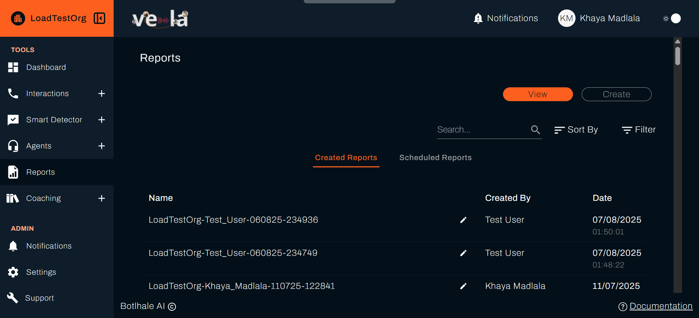
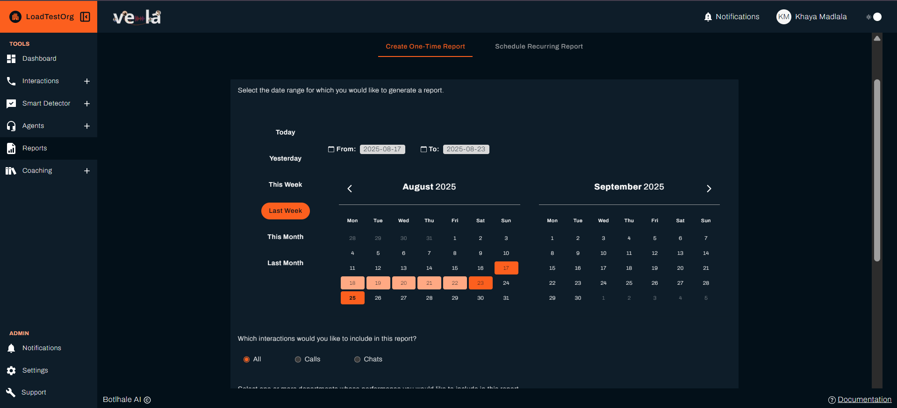
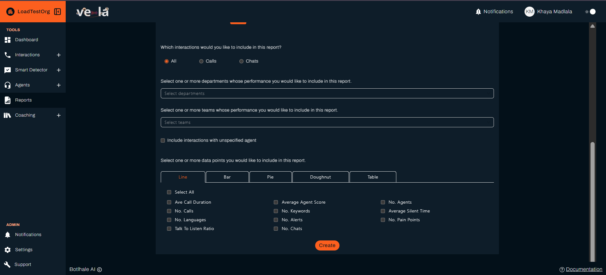

# Generate Reports

Vela's reporting tools let you build custom reports from your interaction data, download them for stakeholder presentations, and schedule recurring reports to run automatically.

---

## Understanding Reports

There is one report type in Vela: a **custom report**. You define the date range, the scope (which teams and agents to include), which metrics to visualise, and the chart type for each metric. Vela then generates the report and makes it available for download.

Available metrics match those on the Dashboard — for example: average agent score, number of calls or chats, talk-to-listen ratio, sentiment distribution, alert counts, and more. Some metrics are call-only or chat-only; Vela removes incompatible metrics automatically if you change the interaction type after adding them.

---

## Creating a One-Time Report

### Step 1: Open the Reports Section

1. Click **Reports** in the left sidebar.
2. Click the **Create** tab (top right of the page).
3. The create form defaults to the **Create One-Time Report** tab.

### Step 2: Select a Date Range

The date picker opens by default. Choose your start and end dates using the calendar, or select a preset such as Today, Last Week, or Last Month.

### Step 3: Select Interaction Type

Choose which interactions to include:

- **All** — calls and chats combined
- **Calls** — voice interactions only
- **Chats** — text interactions only

### Step 4: Select Scope

Use the team and agent selectors to define which data the report covers:

- Select one or more **departments** (if your access level permits)
- Select one or more **teams**
- Select one or more **agents**
- Tick **Include interactions with unspecified agent** if you want to include calls not assigned to a named agent

### Step 5: Add Metrics

1. Click **Add New Metric**.
2. From the **Select a metric** dropdown, choose a metric from the grouped list. Metrics are organised by category (for example: Performance, Volume, Sentiment).
3. Once a metric is selected, a second dropdown appears — **Select a chart**. Choose the visualisation type for that metric. Available chart types include: Bar, Line, Pie, Doughnut, Table, and Card (not all types are available for every metric).
4. Click **Add Metric** to add it to your report. Repeat for each metric you want to include.
5. To remove a metric, click the **×** icon on its tag.

### Step 6: Generate the Report

Click **Create**. Vela generates the report and saves it to your **View** tab. You will see a success notification when it is ready.

If a metric has no data for the selected date range, Vela will display an error message for that metric and exclude it from the report.

---

## Creating a Scheduled Report

A scheduled report runs automatically on a recurring basis and saves the output to your Reports list each time it runs.

1. Click **Reports** in the left sidebar, then the **Create** tab.
2. Click the **Schedule Recurring Report** tab.
3. Configure the schedule:
   - **Report Frequency** — Daily, Weekly, or Monthly
   - **Time** — select the hour (24-hour format) at which the report should run
   - **Day of Week** (weekly only) — select the day
   - **Day of Month** (monthly only) — select the date
4. Select the **interaction type**, **scope**, and **metrics** using the same steps as for a one-time report (Steps 3–5 above).
5. Click **Schedule Report**.

The schedule is saved and appears in the **Scheduled Reports** tab under **Reports → View**.

### Viewing and Cancelling Scheduled Reports

1. Go to **Reports** in the left sidebar and click the **View** tab.
2. Click **Scheduled Reports** (the second tab on the view page).
3. The table shows each schedule's frequency, last run date, next run date, and who created it.
4. Click a row to expand it and see the teams, agents, metrics, and other details for that schedule.
5. To cancel a schedule, click the **delete icon** (bin) on the right of the row and confirm the deletion.

---

## Downloading a Report

Generated reports appear in the **Created Reports** tab under **Reports → View**.

To download a report:

1. Locate the report in the list.
2. Click the **download icon** in the Download column.
3. A small menu appears with the available formats:
   - **.pdf** — for sharing and presenting
   - **.docx** — for editing in Microsoft Word

Click the format you want to begin the download.

---

## Renaming a Report

In the **Created Reports** list, click the **edit icon** (pencil) next to a report name to rename it inline. Press **Enter** to save or **Escape** to cancel.

---

## Troubleshooting

| **Problem** | **Solution** |
|-------------|--------------|
| Report generation fails with "no data" errors | Check that data has been uploaded and processed for the selected date range; verify your scope includes agents with interactions in that period |
| A metric is missing from the dropdown | Some metrics are call-only or chat-only — check your selected interaction type |
| Download button shows no options | The report may still be generating; refresh the page and try again |
| Scheduled report shows no last run date | The schedule has not yet reached its first run time |

---

## Next Steps

| **For Real Insights** | **For Team Management** | **For Automation** |
|---------------------------|------------------------|-------------------|
| [Monitor Performance](./Dashboard.md) | [Improve Agent Performance](./Agents.md) | [Configure Notifications](./Notifications.md) |

### See also
- [Dashboard Overview](./Dashboard.md) — Monitor performance
- [Agent Performance](./Agents.md) — Coach your team effectively
- [Smart Monitoring](./smart-detector-overview.md) — Set up automated alerts
- [Official API Documentation](https://docs-apis.botlhale.ai) — Complete API reference for automation

## Need Help?

- **Contact Support**: support@botlhale.ai

