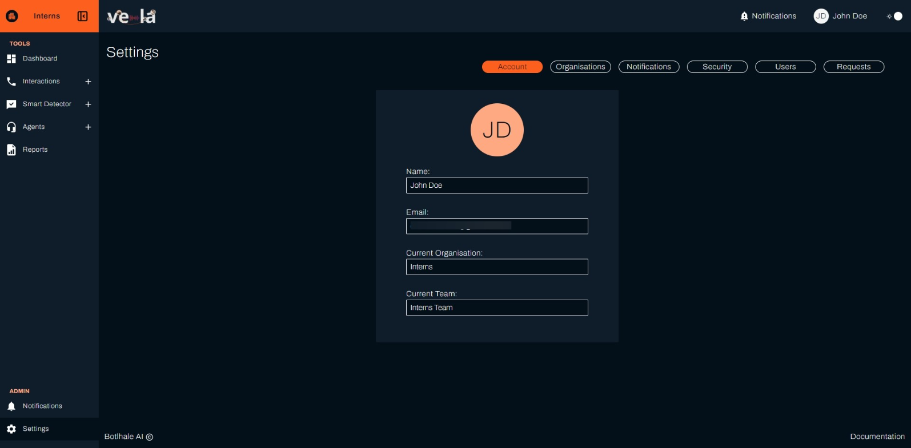
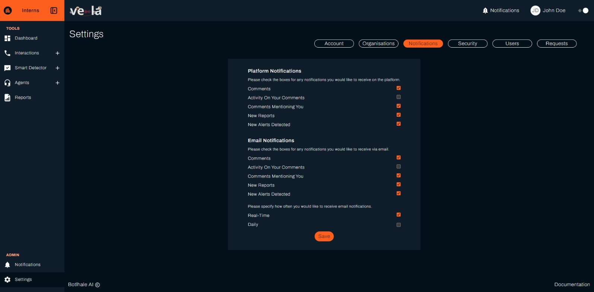
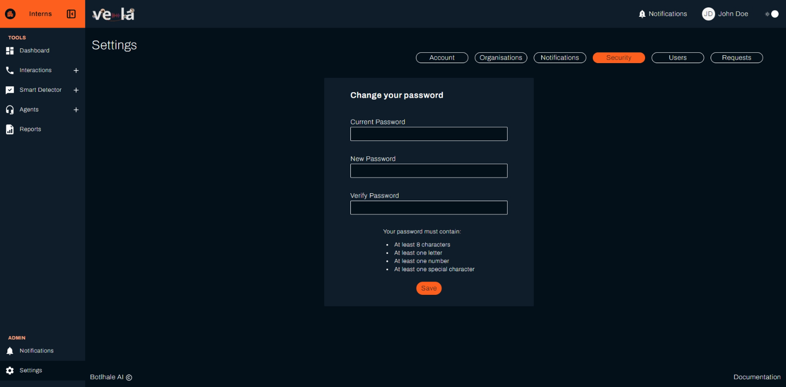
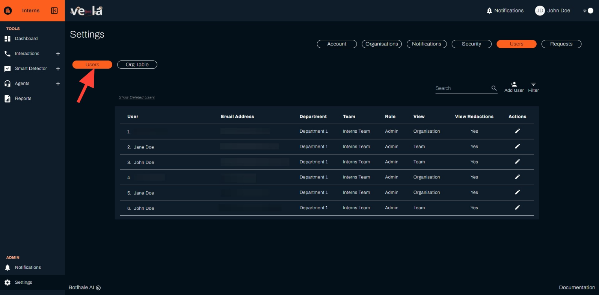

# Settings

The Settings Screen serves as a centralised hub for managing your account settings, preferences, and organisational affiliations within the platform. It allows you to customise your user experience, manage notifications, and access user administration functionalities (for users with appropriate permissions).

## Key Functionalities

### Account

On this tab, you can:

- View and update your general profile information, including:
  - Name
  - Email address
  - Organisation affiliation (primary and additional)
  - Team assignment (if applicable)

### Organisations

The Organisations tab allows you to manage your organisational settings and monitor usage. This section includes:

#### Organisation Management

- View a list of organisations you belong to
- Switch between your primary and secondary organisations using the dedicated icon
- Create new organisations (admin privilege required)
- Edit existing organisation details (admin privilege required)

#### Organisation Info

Upload and manage your organisation's branding and information:
- Organisation logo
- Organisation name
- Short organisation description/bio

#### Usage Overview

Monitor your organisation's platform usage:
- Organisation status
- Monthly allocated duration
- Current usage statistics
- Usage gauge visualisation

#### Usage Notifications

Configure email alerts for usage monitoring:
- Set notification thresholds (50%–100% of allocated usage)
- Receive proactive alerts before reaching limits

#### Exceeding Duration Options

Control what happens when usage limits are reached:
- **Halt analysis**: Stop processing when limits are reached
- **Continue analysis**: Keep processing (additional charges may apply)

#### Redactable Entities

Configure data privacy and compliance settings:
- Select sensitive data types for automatic redaction from transcripts
- Options include: email addresses, ID numbers, phone numbers, and other PII

#### Save Changes

Remember to apply all updates by clicking the "Save" button after making any changes to your organisation settings.

### Notifications

On this tab, you can:

- Set your preferred frequency for receiving notifications within the platform
- Choose your desired notification delivery channels (platform, email, or both)

### Security

On this tab, you can:

- Update your account password for enhanced security

### Users (Admin Privileges Required)

On this tab, you can:

- View a comprehensive list of users within your organisation(s)
- Apply filters to refine the displayed user list based on specific criteria
- Add new users to your organisation(s)
- Edit existing user information, including roles and permissions

## Users - Organisation Table (Admin Privileges Required)

On this tab, you can:

- View existing departments, teams and users respectively
- Add new departments, teams 
- Reassign teams

