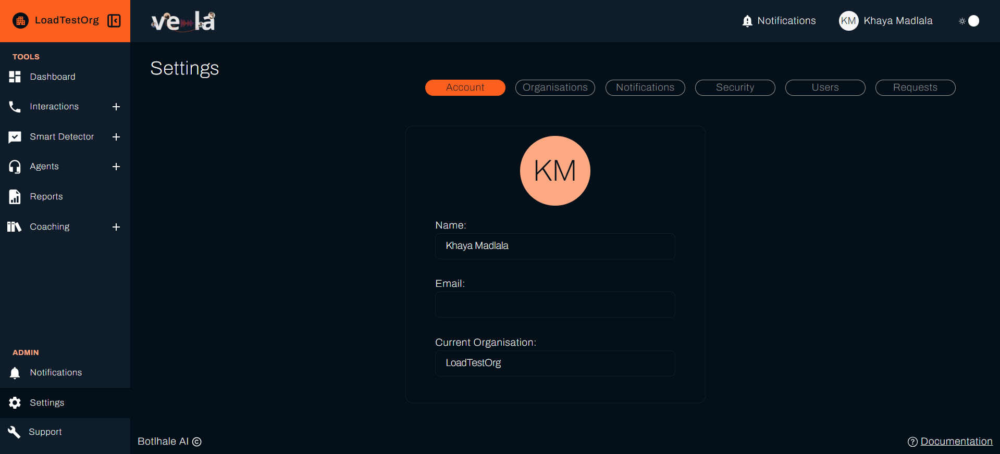
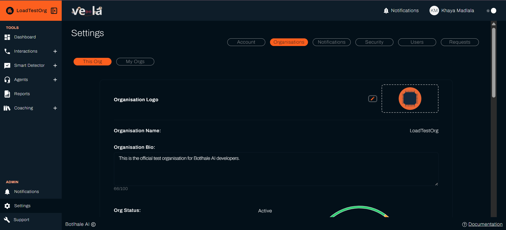
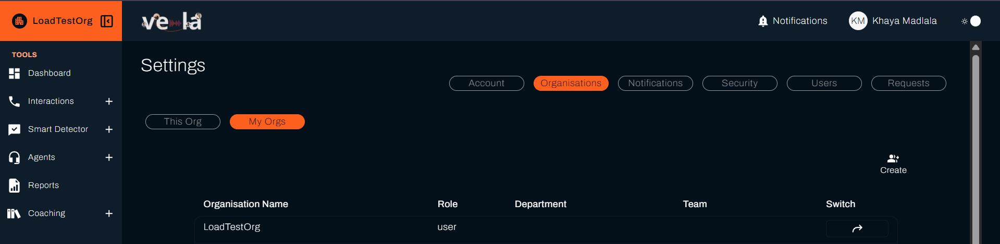
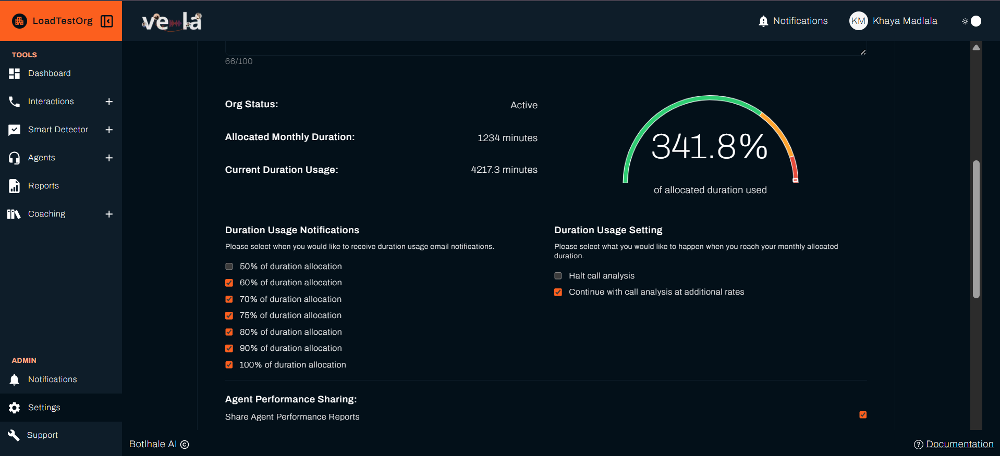
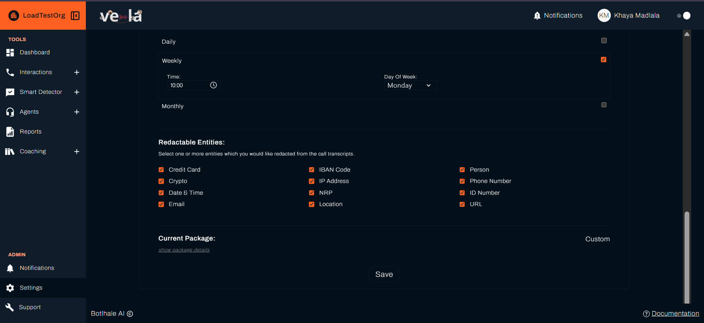
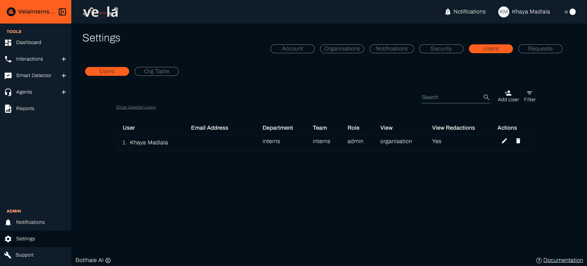
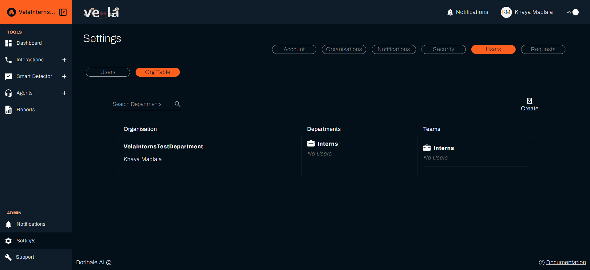
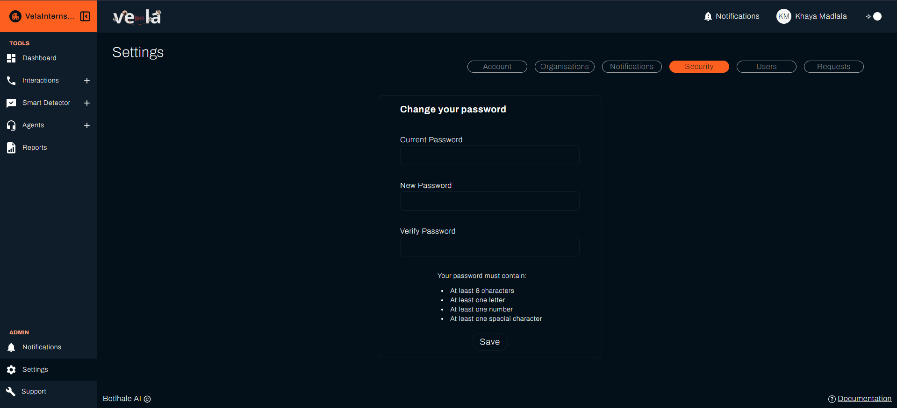

# Configure Your Vela Experience

Customise Vela to match your organisation's needs, manage your team effectively, and ensure your data is secure. This guide shows you how to set up Vela for effective performance and user experience.

## What You Can Achieve

With Vela settings, you can:
- [ ] **Customise your profile** and organisation information
- [ ] **Manage team access** and permissions effectively
- [ ] **Configure security** and privacy settings
- [ ] **Set up notifications** to stay informed
- [ ] **Monitor usage** and optimise your plan

---

## Manage Your Account and Profile

### Update Your Personal Information
Keep your profile current for better team collaboration:

- [ ] **Go to "Settings" → "Account"**
- [ ] **Update your information**:
  - [ ] Name and email address
  - [ ] Organisation affiliations
  - [ ] Team assignments
  - [ ] Contact preferences
- [ ] **Click "Save"** to apply your settings

> **Why this matters**: Accurate profile information helps with team communication and ensures you receive the right notifications.

---

## Configure Your Organisation

### Manage Organisation Settings
Set up your organisation's branding and information:

- [ ] **Go to "Settings" → "Organisations"**
- [ ] **Update organisation details**:
  - [ ] Organisation name and logo
  - [ ] Description and contact information
  - [ ] Branding preferences
  - [ ] Package and subscription details
- [ ] **Configure usage settings** as needed

### Monitor Usage and Limits
Track your organisation's platform usage:

| **Metric** | **What It Shows** | **Action** |
|------------|-------------------|------------|
| **Current usage** | How much data you've processed | Monitor growth trends |
| **Monthly allocation** | Your plan limits | Plan for upgrades if needed |
| **Usage trends** | Growth over time | Optimise usage patterns |
| **Upgrade options** | Available plan improvements | Consider scaling up |

### Set Up Usage Notifications
Configure alerts to stay within your limits:
- [ ] **Set notification thresholds** (50% to 100% of allocation)
- [ ] **Choose delivery method** (email, platform, or both)
- [ ] **Configure escalation** for approaching limits
- [ ] **Set up overage handling** preferences

### Configure Data Privacy
Protect sensitive information with automatic redaction:

- [ ] **Select sensitive data types** for redaction:
  - [ ] Email addresses
  - [ ] ID numbers
  - [ ] Phone numbers
  - [ ] Credit card information
  - [ ] Other PII (Personally Identifiable Information)
- [ ] **Set redaction rules** for different data types
- [ ] **Test redaction** with sample data

---

## Manage Your Team

### User Management (Admin Access Required)
Control who has access to your Vela platform:

- [ ] **Go to "Settings" → "Users"**
- [ ] **View all users** in your organisation
- [ ] **Add new users** as needed
- [ ] **Modify permissions** and roles
- [ ] **Deactivate users** who no longer need access
- [ ] **Manage department assignments**
- [ ] **Handle user requests** and approvals

### Department and Team Organisation
Structure your organisation for better management:

- [ ] **Go to "Settings" → "Users - Organisation Table"**
- [ ] **Create departments** to group related teams
- [ ] **Set up teams** within departments
- [ ] **Assign users** to appropriate teams

### User Roles and Permissions
| **Role** | **Permissions** | **Best For** |
|----------|-----------------|--------------|
| **Admin** | Full system access, user management, organisation settings | IT managers, system administrators |
| **Manager** | Team management, reports, agent oversight | Team leaders, supervisors |
| **Agent** | View own performance, access knowledge base | Customer service agents |
| **Analyst** | Data analysis, reporting, insights | Business analysts, quality assurance |

---

## Security and Access Control

### Password and Authentication

- [ ] **Set strong password requirements** for your organisation
- [ ] **Enable two-factor authentication** for enhanced security
- [ ] **Configure session timeouts** for automatic logout
- [ ] **Set up password reset** procedures

---

## Notification Preferences

### Email Notifications
- [ ] **Configure email delivery** for different notification types
- [ ] **Set notification frequency** (immediate, daily, weekly)
- [ ] **Choose notification content** (summary vs. detailed)
- [ ] **Set up email templates** for consistency

### Platform Notifications
- [ ] **Enable in-app notifications** for automated alerts
- [ ] **Configure notification sounds** and visual indicators
- [ ] **Set notification priorities** for different alert types
- [ ] **Customise notification display** preferences

---

## Usage Optimization

### Data Management
- [ ] **Review data retention** policies and settings
- [ ] **Optimise data upload** processes
- [ ] **Monitor data quality** and accuracy
- [ ] **Set up data backup** procedures

### Performance Monitoring
- [ ] **Track system performance** metrics
- [ ] **Monitor user activity** patterns
- [ ] **Identify usage bottlenecks** and optimise
- [ ] **Plan for capacity** increases

### Cost Optimization
- [ ] **Review usage patterns** to identify optimization opportunities
- [ ] **Set up usage alerts** to avoid overages
- [ ] **Optimise data processing** to reduce costs
- [ ] **Plan for scaling** based on growth

---

## Advanced Configuration

### Custom Branding
- [ ] **Upload company logo** for reports and dashboards
- [ ] **Set brand colours** for consistent appearance
- [ ] **Configure email signatures** for notifications
- [ ] **Customise report templates** with your branding

### Workflow Automation
- [ ] **Set up automated alerts** for specific conditions
- [ ] **Configure report scheduling** for regular delivery
- [ ] **Set up data sync** with external systems
- [ ] **Configure escalation workflows** for issues

---

## Troubleshooting Common Issues

| **Problem** | **Solution** |
|-------------|--------------|
| **Can't access settings** | Check user permissions, verify admin access, contact support |
| **Changes not saving** | Check internet connection, refresh page, clear browser cache |
| **Users not receiving notifications** | Verify email settings, check spam filters, test notification delivery |
| **API integration issues** | Contact your Account Manager, check rate limits, review authentication settings |

---

## Next Steps

| **For Notifications** | **For Smart Monitoring** |
|----------------------|-------------------------|
| [Configure Notifications](./notifications.md) | [Set Up Smart Monitoring](./smart-detector-overview.md) |

### See also
- [Dashboard Overview](./dashboard.md) - Monitor your configured settings
- [API Integration](./api.md) - Configure external system connections
- [Official API Documentation](https://docs-apis.botlhale.xyz) - Complete API reference for integrations
- [Data Upload Guide](./data-upload.md) - Set up data import settings
- [Agent Performance](./agents.md) - Manage team settings and permissions

## Need Help?

- **Contact Support**: support@botlhale.ai

