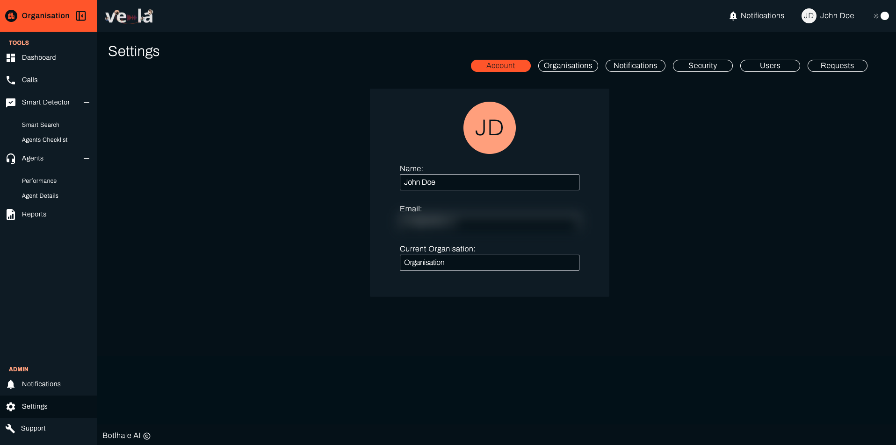
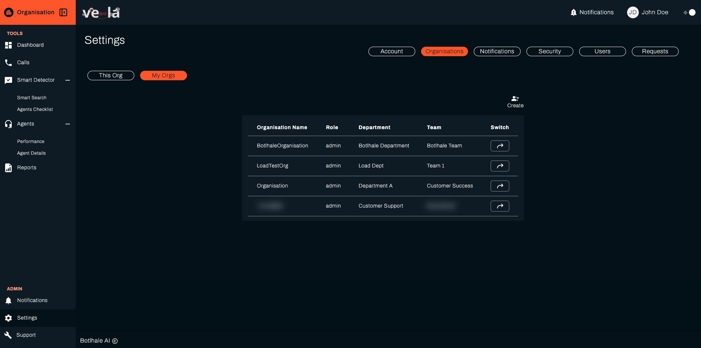
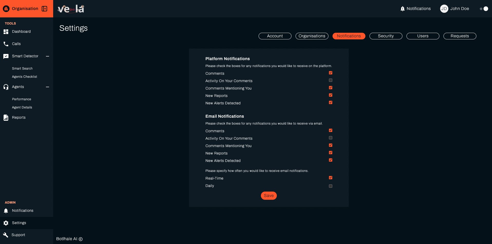
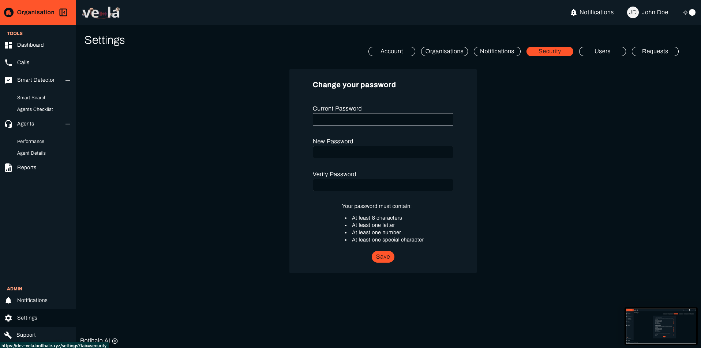
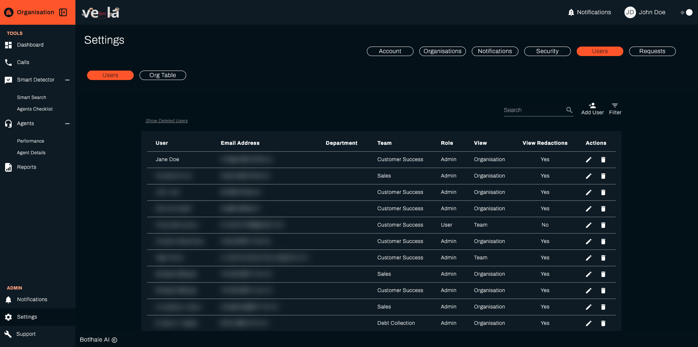
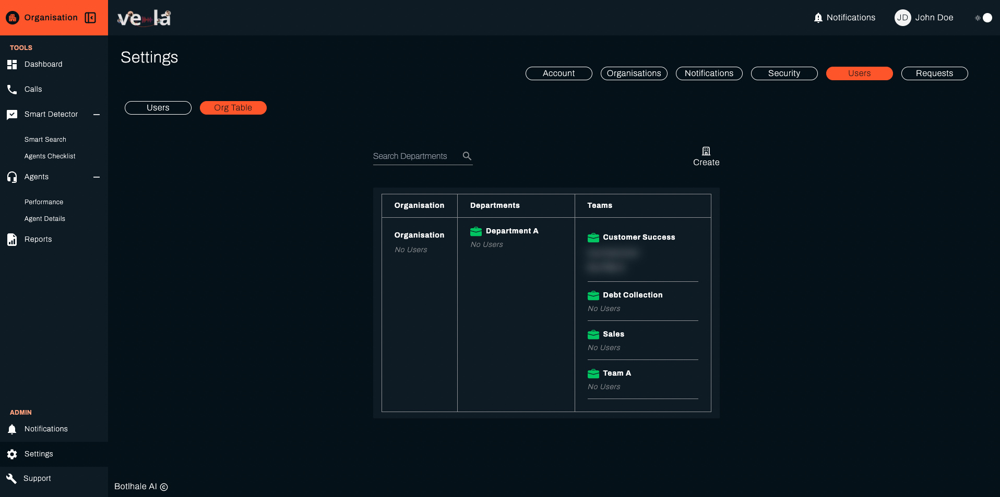
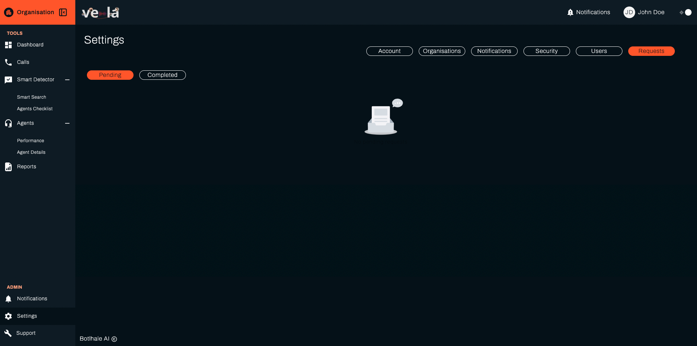

# Settings

The Settings Screen serves as a centralised hub for managing your account settings, preferences,
and organisational affiliations within the platform. It allows you to customise your user
experience, manage notifications, and access user administration functionalities (for users with
appropriate permissions).

#### Key Functionalities

## Account

On this tab, you can:

- View and update your general profile information, including:
- Name
- Email address
- Organisation affiliation (primary and additional)
- Team assignment (if applicable)

## Organizations

On this tab, you can:

- View a list of organisations you belong to.
- Switch between your primary and secondary organisations using the dedicated icon.
- Create new organisations (admin privilege required).
- Edit existing organisation details (admin privilege required).

## Notifications

On this tab, you can:

- Set your preferred frequency for receiving notifications within the platform.
- Choose your desired notification delivery channels (platform, email, or both).

## Security

On this tab, you can:

- Update your account password for enhanced security.

## Users (Admin Privileges Required)

On this tab, you can:

- View a comprehensive list of users within your organisation(s). 
- Apply filters to refine the displayed user list based on specific criteria.
- Add new users to your organisation(s). 
- Edit existing user information, including roles and permissions.

## Users - Organisation Table (Admin Privileges Required)
On this tab, you can:

- View existing departments, teams and users respectively
- Add new departments, teams 
- Reassign teams

## Manage Requests

On this tab, admin can manage the incoming requests from the participants of the organisation.

