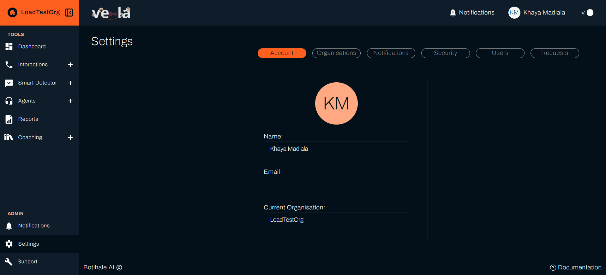
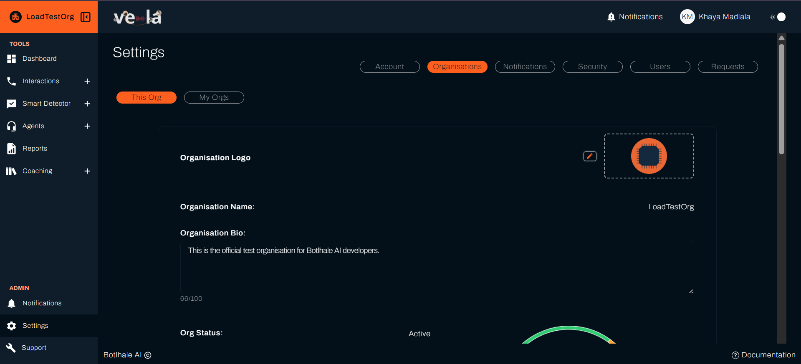
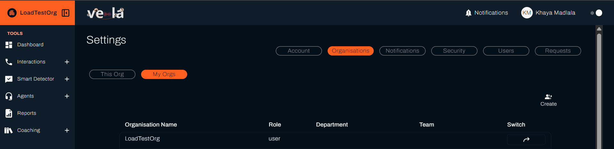
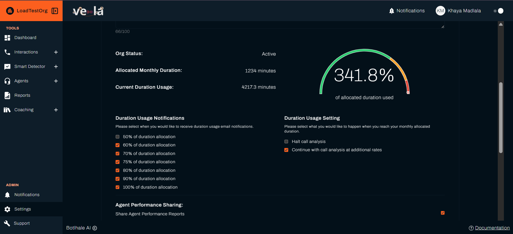
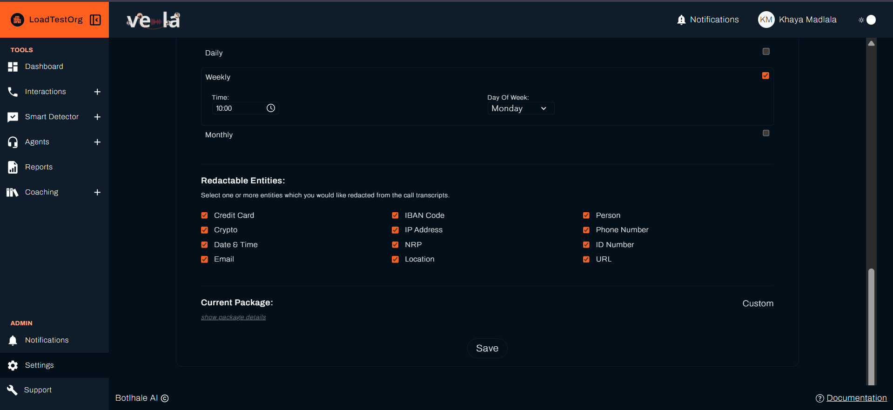
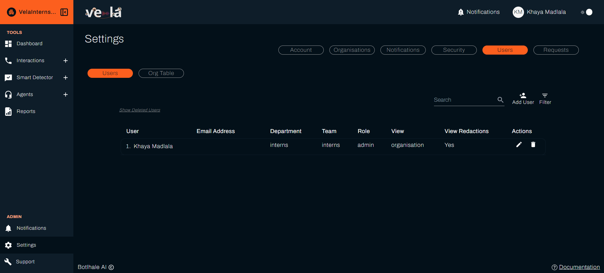
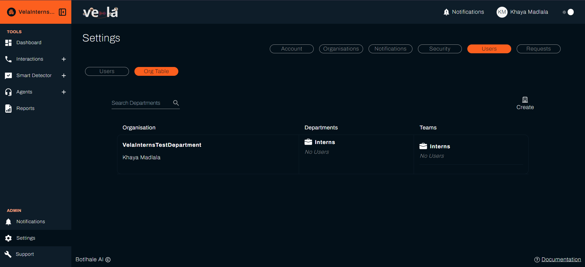
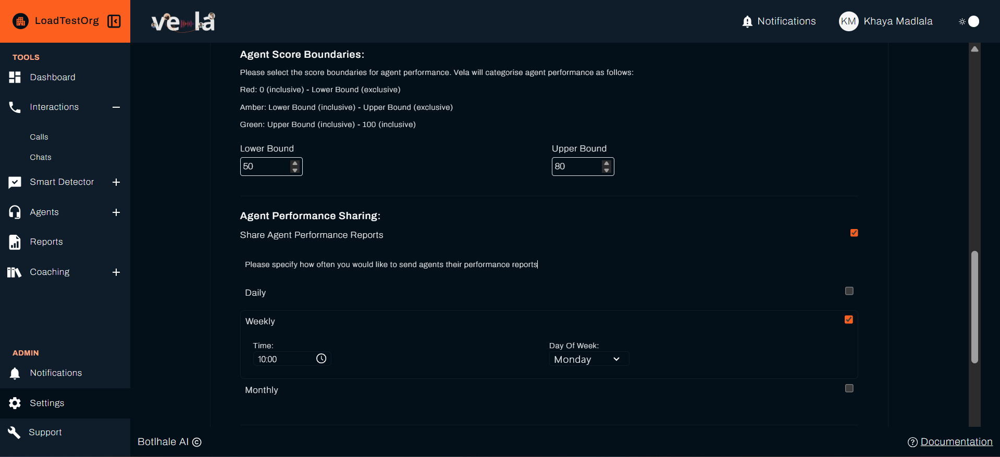
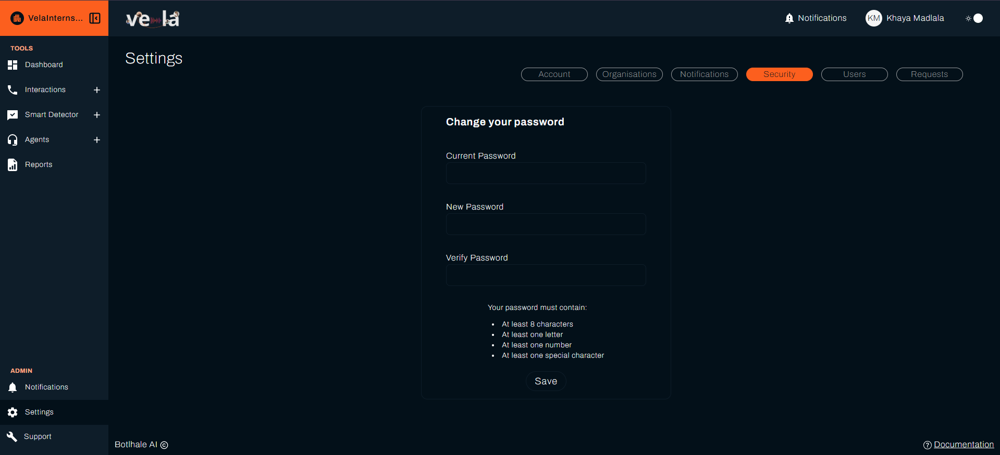

# Configure Your Vela Experience

Customise Vela to match your organisation's needs, manage your team effectively, and ensure your data is secure. This guide shows you how to set up Vela for effective performance and user experience.

## What You Can Achieve

Vela settings let you:
- [ ] **Customise your profile** and organisation information
- [ ] **Manage team access** and permissions effectively
- [ ] **Configure security** and privacy settings
- [ ] **Set up notifications** to stay informed
- [ ] **Monitor usage** and optimise your plan

---

## Manage Your Account and Profile

### Update Your Personal Information
Keep your profile current for better team collaboration:

- [ ] **Go to "Settings" → "Account"**
- [ ] **View your information**:
  - [ ] Name and email address
  - [ ] Organisation affiliations
  - [ ] Team assignments
  - [ ] Contact preferences
- [ ] **Click "Save"** to apply your settings

> **Why this matters**: Accurate profile information helps with team communication and ensures you receive the right notifications.

---

## Configure Your Organisation

### Manage Organisation Settings
Set up your organisation's branding and information:

- [ ] **Go to "Settings" → "Organisations"**
- [ ] **Update organisation details**:
  - [ ] Organisation name and logo
  - [ ] Organisation Bio
  - [ ] Package and subscription details
- [ ] **Configure usage settings** as needed

### Monitor Usage and Limits
Track your organisation's platform usage:

| **Metric** | **What It Shows** | **Action** |
|------------|-------------------|------------|
| Current usage | How much data you've processed | Monitor growth trends |
| Monthly allocation | Your plan limits | Plan for upgrades if needed |
| Usage trends | Growth over time | Optimise usage patterns |
| Upgrade options | Available plan improvements | Consider scaling up |

### Duration Usage Settings
Configure what happens when your monthly allocation is reached:
- [ ] **Halt call analysis** — processing stops when the allocation is used up
- [ ] **Continue at additional rates** — processing continues past the allocation and additional usage is billed accordingly

### Configure Data Privacy
Protect sensitive information with automatic redaction:

- [ ] **Select sensitive data types** for redaction:
  - [ ] Credit Card
  - [ ] IBAN Code
  - [ ] Person
  - [ ] Location
  - [ ] Crypto
  - [ ] Phone Number
  - [ ] Email
  - [ ] NRP
  - [ ] IP Address
  - [ ] Date & Time
  - [ ] URL
  - [ ] ID Number
  - [ ] Medical License
  - [ ] Organisation
- [ ] **Save** your redaction configuration

---

## Manage Your Team

### User Management (Admin Access Required)
Control who has access to your Vela platform:

- [ ] **Go to "Settings" → "Users"**
- [ ] **View all users** in your organisation
- [ ] **Add new users** as needed
- [ ] **Modify permissions** and roles
- [ ] **Deactivate users** who no longer need access
- [ ] **Manage department assignments**
- [ ] **Handle user requests** and approvals

### Department and Team Organisation
Structure your organisation for better management:

- [ ] **Go to "Settings" → "Users"** and select the **"Org Table"** tab
- [ ] **Create departments** to group related teams
- [ ] **Set up teams** within departments
- [ ] **Assign users** to appropriate teams

### User Roles and Permissions
Each user has two separate settings that together determine what they can do and see:

| **Setting** | **Options** | **What It Controls** |
|-------------|-------------|----------------------|
| **Role** | `Admin` or `User` | Whether the user can manage other users and organisation settings |
| **View (Scope)** | `Organisation`, `Department`, or `Team` | Which data the user can see across the platform |
| **View Redactions** | `Yes` or `No` | Whether the user sees raw transcripts or redacted versions |

An Admin with organisational scope has full visibility and management access. A User with team scope can only see data for their assigned team.

### Agent Score Boundaries
Configure performance thresholds for your team:

- [ ] **Go to "Settings" → "Organisations"** and locate the Agent Score Boundaries section
- [ ] **Set performance thresholds** for your organisation:
  - [ ] **Red Zone**: 0% to Lower Bound (e.g., 0-50%)
  - [ ] **Amber Zone**: Lower Bound to Upper Bound (e.g., 50-80%)
  - [ ] **Green Zone**: Upper Bound to 100% (e.g., 80-100%)
- [ ] **Adjust Lower Bound** using the input field
- [ ] **Adjust Upper Bound** using the input field

### Agent Performance Sharing
Automate performance report delivery to agents:

- [ ] **Enable "Share Agent Performance Reports"** checkbox
- [ ] **Choose reporting frequency**:
  - [ ] **Daily** - Send reports every day
  - [ ] **Weekly** - Send reports weekly (recommended)
    - [ ] **Set time** for report delivery (e.g., 10:00)
    - [ ] **Select day of week** (e.g., Monday)
  - [ ] **Monthly** - Send reports monthly

---

## Security and Access Control

### Password and Authentication

- [ ] **Change your password** through Settings → Security (not shown for SSO users)
- [ ] **Reset your password** via the "Forgot your password?" link on the login page

:::note Password Requirements
Password requirements are fixed by the platform (minimum 8 characters, at least one letter, one number, and one special character). These cannot be changed by administrators.
:::

---

## Notification Preferences

### Platform Notifications
In-app notifications are sent automatically for Smart Search alerts, comments, reports, and call processing completions. You can configure Smart Search notifications per search when creating or editing a Smart Search.

---

---

## Troubleshooting Common Issues

| **Problem** | **Solution** |
|-------------|--------------|
| Can't access settings | Check user permissions, verify admin access, contact support |
| Changes not saving | Check internet connection, refresh page, clear browser cache |
| Users not receiving notifications | Verify email settings, check spam filters, test notification delivery |
<!-- | **API integration issues** | Contact your Account Manager, check rate limits, review authentication settings | -->

---

## Next Steps

| **For Notifications** | **For Smart Monitoring** |
|----------------------|-------------------------|
| [Configure Notifications](./Notifications.md) | [Set Up Smart Monitoring](./smart-detector-overview.md) |

### See also
- [Dashboard Overview](./Dashboard.md) - Monitor your configured settings
- [API Integration](./api.md) - Configure external system connections
- [Official API Documentation](https://docs-apis.botlhale.ai) - Complete API reference for integrations
- [Data Upload Guide](./data-upload.md) - Set up data import settings
- [Agent Performance](./Agents.md) - Manage team settings and permissions

## Need Help?

- **Contact Support**: support@botlhale.ai

