# Smart Detector
## Introduction

Welcome to Smart Detector on the Vela platform! Smart Detector empowers you to monitor 100% of your customer interactions, regardless of the language spoken, using advanced natural language processing (NLP) and machine learning. This section offers three powerful tools to enhance your call center operations:

- **Smart Search:** Create and manage automated searches to identify specific topics, intents, keywords, or pain points within call transcripts, enabling deeper insights and proactive issue resolution.

- **Agent Scorecard:** Evaluate and improve agent performance by setting up checklists and tracking key behaviors across interactions.

- **Knowledge Base:** Build and maintain a repository of resources to assist agents, providing quick access to information on common topics, intents, **keywords**, or **pain points** identified in customer interactions.

Navigate through these features using the cards on the main **Smart Detector page**, or dive deeper into specific categories like **Topics**,**Intents**, **Keywords**, and **Pain Points** using the labels below the cards. These tools help you analyze calls, uncover trends, and optimize your team’s performance with ease.

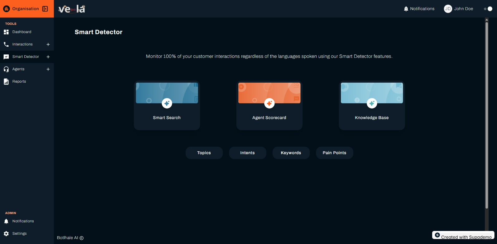

## After Clicking Smart Search
Once you click the **Smart Search** card on the Smart Detector homepage, you’ll be taken to the Smart Search section. This is the central hub for analyzing your call transcripts by creating and managing automated search queries. Here’s what you’ll see and how to get started:

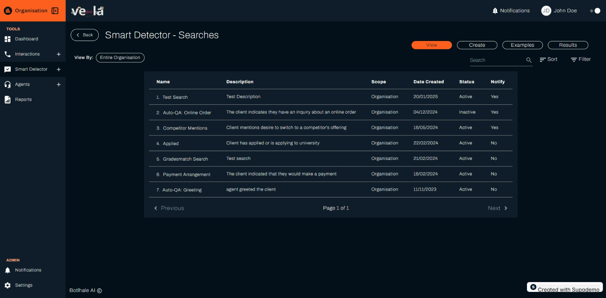

After landing on the Smart Search section, you’ll start in the **Smart Searches tab**, specifically on the **View sub-tab**. This screen displays a table of all the automated search queries created within your organization. Here’s a breakdown of what you see and how to interact with this page:

### Understanding the View Sub-Tab Layout
- **Header:** The title "Smart Detector - Searches" confirms you’re in the Smart Search section.
- **Sub-Tabs:** At the top, you’ll see options like View, Create, Examples, and Results. You’re currently on the View sub-tab, which is highlighted (orange).
- **Filter Option:** A dropdown labeled "View: Entire Organization" lets you choose the scope of the searches displayed (e.g., organization-wide or specific teams).
- **Table:** The main content is a table listing all search queries, with the following columns:
    - **Name:** The name of the search query (e.g., "Test Search").
    - **Description:** A brief explanation of what the search looks for (e.g., "The client indicates they have an inquiry about an online order").
    - **Scope:** The range of calls the search applies to (e.g., "Organisation").
    - **Date Created:** When the search was created (e.g., "20/01/2026").
    - **Status: Whether** the search is active or inactive (e.g., "Active" or "Inactive").
    - **Notify:** Indicates if notifications are enabled for this search (e.g., "Yes" or "No").
- **Navigation:** At the bottom, you’ll see pagination controls ("Previous", "Page 1 of 1", "Next") to navigate through multiple pages of search queries if there are more than can fit on one page.
- **Sort and Filter:** Icons labeled Sort and Filter (next to a search bar) allow you to organize and narrow down the list of searches.

 ## Changing the Scope in "View By": From Entire Organisation to Specific Department or Specific Team

The "View By" dropdown in the **Smart Searches** tab (under the **View sub-tab**) lets you change the scope of the search queries displayed in the table. By default, it’s set to **Entire Organisation**, showing all queries across your organization. Here’s how to change it to Specific **Department** or **Specific Team** to focus on searches for a particular department (e.g., Customer Support or Sales) or team (e.g., Billing Team).

# How to get started Guid:
### Step 1: Locate and Open the "View By" Dropdown
In the Smart Searches tab, under the View sub-tab, find the dropdown labeled **View By: Entire Organisation.**

Click on the dropdown to open it. You’ll see three options:
- Entire Organisation
- Specific Department
- Specific Team

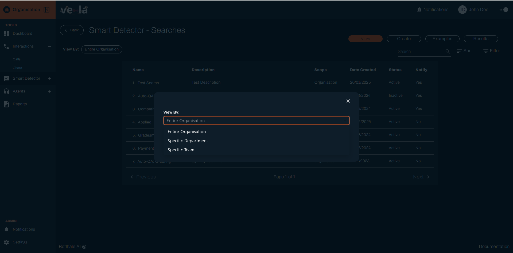

### Step 2: Change to Specific Department
- **Select Specific Department:**
  - Click on **Specific Department** from the dropdown.

  

#### Choose a Department:
  -  A new dropdown or field will appear, listing available departments (e.g.,**'Department A'**).
  -  Click the department you want to focus on, such as **'Department A'**.

    

 #### Apply the Change:
   - Click the Apply button to save the changes 

### Step 3: Change to Specific Team
- Select Specific Team:
  - Click on Specific Team from the "View By" dropdown

 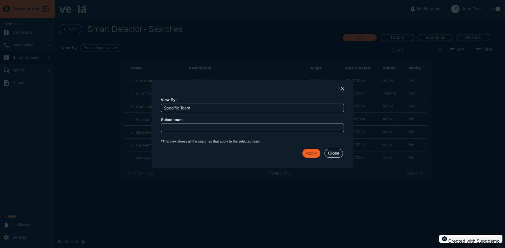   
 
#### Choose a Team:
- A new dropdown or field will appear, listing available teams within your organization (e.g., "Customer Success-(Department A)" "Debt Collection - (Department A)", “Sales-(Department A)” or Team A - (Department A)).

 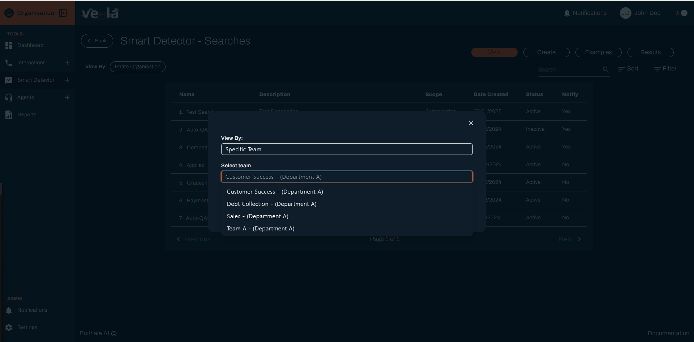  

 You may first need to select a department to see the teams within it, then choose a team like "Customer Success-(Department A)."

   
 #### Apply the Change:
   - Click the Apply button to save the changes .

## Clicking on a Name in the Table
In the **Smart Searches** tab, under the **View** sub-tab, the table lists all the automated search queries created within your organization. The **Name** column in the table contains the titles of these search queries, and each name is clickable. Here’s what happens when you click on a name and how to proceed:

 

 After clicking on a search query name (e.g., "Test Search") in the Name column of the table in the Smart Searches tab (under the View sub-tab), you’ll be taken to a detailed view of that specific search query. This page provides all the information about the search and allows you to manage its settings. Here’s what you’ll see and how to interact with this screen:

 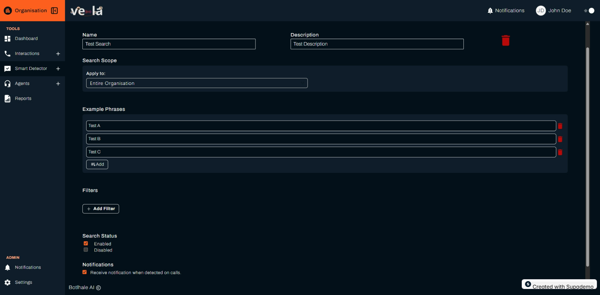

### Overview of the Detailed View
The detailed view is organized into several sections, each providing specific information about the search query:
- **Name:**
  - Displays the name of the search query, such as "Test Search."
  - This field is editable if you have permission to modify the search.
- **Description:**
  - Shows a brief description of what the search looks for, such as "Test Description."
  - This field is also editable, allowing you to update the description if needed.
- **Search Scope:**
  - Indicates the range of calls the search applies to.
  - In this case, it’s set to Entire Organisation, meaning the search monitors all calls across the organization.
  - A dropdown allows you to change the scope to Specific Department or Specific Team if needed.
- **Example Phrases:**
  - Lists example phrases that the search query looks for in call transcripts, such as "Test A," "Test B," and "Test C."
  - Each phrase has a delete icon (a red trash bin) next to it, allowing you to remove phrases if necessary.
  - An Add button lets you include new example phrases to refine the search.
- **Filters:**
  - Shows any filters applied to the search query, such as call duration, agent ID, or specific keywords.
  - Currently, no filters are set (indicated by the "+ Add Filter" button).
  - Click + Add Filter to add criteria like "Call Duration > 5 minutes" or "Keyword: refund."

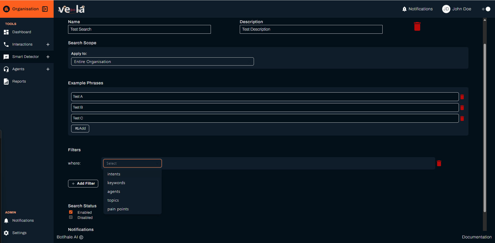

- **Search Status:**
  - Displays whether the search is currently active or inactive.
  - A checkbox labeled Enabled indicates the search is active (checked) or inactive (unchecked).
  - You can toggle this checkbox to enable or disable the search.
- **Notifications:**
  - A checkbox labeled Receive notification when detected on calls indicates whether notifications are enabled.
  - If checked, you’ll receive alerts when the search query detects a match in ongoing calls.
  - You can toggle this checkbox to enable or disable notifications.
- **Delete Option:**
  - At the top-right of the screen, there’s a red trash bin icon.
  - Clicking this icon allows you to delete the entire search query if you have permission.

## Create
To create a new automated search query in the Smart Searches tab, you’ll use the Create sub-tab. This allows you to define a search that monitors call transcripts for specific patterns, keywords, or behaviors. Here’s a step-by-step guide to setting up your new search query:

# How to get stared guid 
### Step 1: Navigate to the Create Sub-Tab
  - In the Smart Searches tab, click the **Create** sub-tab at the top (next to **View**, **Examples**, and **Results**).
  - This opens a form with fields to configure your new search query.

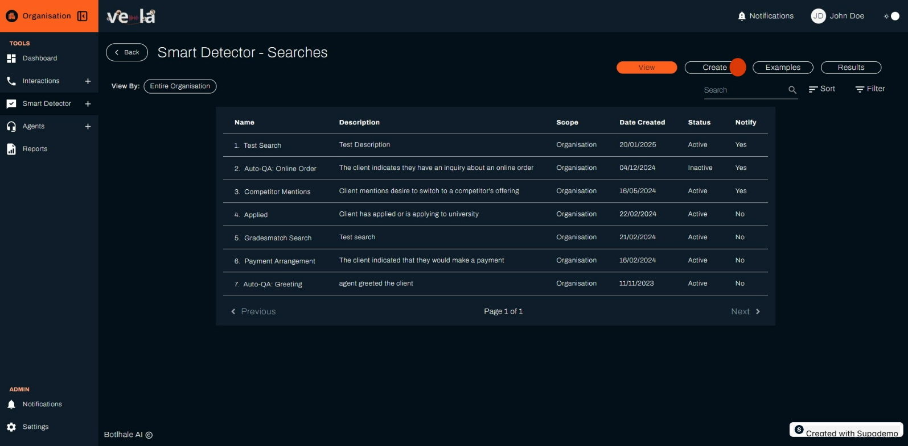

## Step 2: Fill Out the Form
The form includes several sections to define your search query. Fill them out as follows:
1. **Name:**
  - Enter a unique name for the search query in the Name field.
  - Example: "Customer Complaints"
  - Choose a name that clearly indicates the purpose of the search, making it easy to identify later.
2. **Description:**
  - Add a brief description in the Description field to explain what the search will look for.
  - Example: "Searches for calls where customers express complaints about a product or service."
  - This helps others in your organization understand the search’s purpose.
3. **Search Scope:**
  - Use the dropdown labeled Apply to to set the scope of the search.
  - Options include:
      - **Entire Organisation:** The search will monitor all calls across the organization (default).
      - **Specific Department:** The search will only apply to calls handled by a specific department (e.g., Customer Support).
      - **Specific Team:** The search will only apply to calls handled by a specific team (e.g., Billing Team).
  - Example: Select Specific Department, then choose "Customer Support" to focus on that department’s calls.
4. **Example Phrases:**
  - Add example phrases that the search should look for in call transcripts.
  - Click the Add button to include a new phrase, then type it in the field that appears.
  - Example: Add phrases like "I’m not happy with," "This product is defective," or "I want to complain."
  - You can add multiple phrases to make the search more comprehensive.
5. **Filters:**
  - Click + Add Filter to set specific criteria for the search.
  - Examples of filters include:
    - **Call Duration:** Search for calls longer or shorter than a specific time (e.g., "Call Duration > 5 minutes").
    - **Agent ID:** Focus on calls handled by a specific agent.
    - **Keywords:** Search for additional words or phrases (e.g., "refund").
  - Follow the on-screen prompts to configure the filter, then save it.
  - Example: Add a filter for "Keyword: refund" to narrow down the search.
6. **Search Status:**
  -  Use the Enabled checkbox to determine if the search should start immediately:
    - Enabled (checked): The search will be active as soon as you create it.
    - **Disabled** (unchecked): The search will be saved but won’t run until you enable it later.
  - Example: Check Enabled to start monitoring right away.
7. **Historical Search:**
  - Check the Upon creation, run this search on historical calls checkbox if you want the search to analyze past call data.
  - Example: Check this box to see if any historical calls match your criteria, such as past customer complaints.
8. **Notifications:**
  - Check the Receive notification when detected on calls checkbox to get alerts when the search finds a match in ongoing calls.
  - Example: Check this box to receive a notification whenever a call contains phrases like "I’m not happy with."

## Step 3: Create the Search Query
  - Once you’ve filled out all the necessary fields, click the orange **Create** button at the bottom-right of the form.
  - Your new search query will be saved and, if **Enabled** is checked, it will immediately start monitoring call transcripts based on your settings.

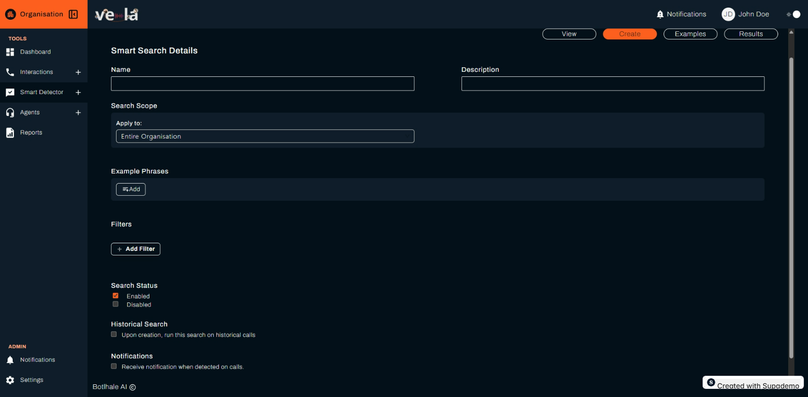

#### Examples
The Examples sub-tab in the Smart Searches tab provides a library of predefined search query templates that you can use as inspiration or enable for your own call monitoring. These templates are designed to help you quickly set up common searches without starting from scratch. Here’s what you’ll see and how to use this sub-tab:

# HOW TO START GUID:

## Step 1: Navigate to the Examples Sub-Tab

  - In the Smart Searches tab, click the Examples sub-tab at the top (next to View, Create, and Results).
  - This opens a table displaying the available predefined search query templates.

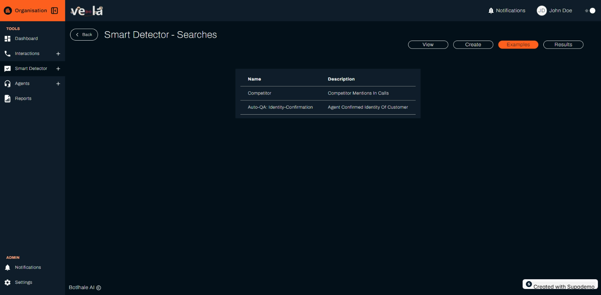

## Step 2: Understand the Examples Table
The table lists the predefined templates with the following columns:
- **Name:**
   - The name of the template, such as "Competitor" or "Auto-QA: Identity-Confirmation."
   - Clicking the name takes you to a detailed view of the template, similar to the detailed view of a user-created search query.

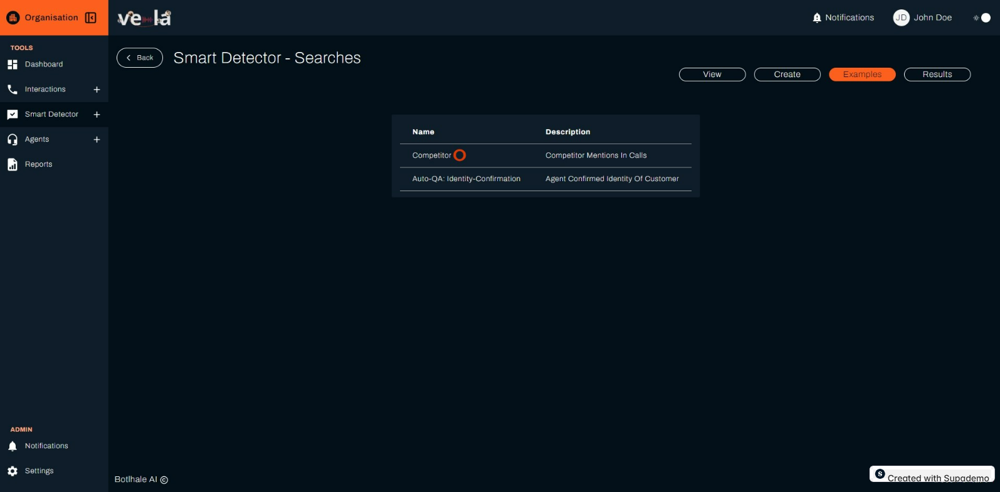

When you click on a template name (e.g., "Competitor") in the table of the Examples sub-tab within the Smart Searches tab, you’ll be taken to a detailed view of that predefined search query template. This page, labeled "Smart Search Details," shows the template’s settings and allows you to enable or customize it for your use. Here’s what you’ll see and how to interact with this screen:

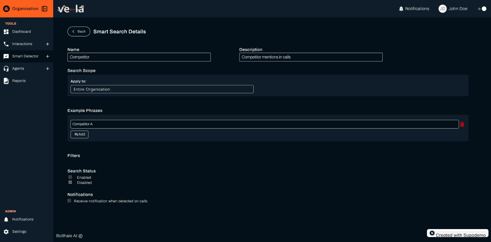

- **Name:**
  - Displays the name of the template, such as "Competitor."
  - This field is editable if you choose to customize the template.
- **Description:**
  - Shows a brief description of what the template searches for, such as "Competitor mentions in calls."
  - This field is also editable for customization.
- **Search Scope:**
  - Indicates the range of calls the template would apply to if enabled.
  - In this case, it’s set to Entire Organisation, meaning it would monitor all calls across the organization.
  - A dropdown allows you to change the scope to Specific Department or Specific Team if needed.
- **Example Phrases:**
  - Lists example phrases that the template looks for in call transcripts, such as "Competitor A."
  - Each phrase has a delete icon (a red trash bin) next to it, allowing you to remove phrases if you customize the template.
  - An Add button lets you include new example phrases to refine the search.
- **Filters:**
  - Shows any filters applied to the template.
  - Currently, no filters are set (indicated by the lack of a "+ Add Filter" button in this view, though this option may appear if you enable and edit the template).
  - Filters could include criteria like call duration or additional keywords.
- **Search Status:**
  - Displays whether the template is currently active or inactive.
  - The Enabled checkbox is unchecked by default for templates, meaning the search is not active until you enable it.
You can check this box to activate the template.
- **Notifications:**
  - A checkbox labeled Receive notification when detected on calls indicates whether notifications are enabled.
  - By default, this is unchecked for templates, but you can enable it to receive alerts when the search finds a match in ongoing calls.

# Results
The **Results** sub-tab in the **Smart Searches** tab shows a summary of the matches found by your active search queries, helping you identify calls that meet the criteria you’ve set up. This section explains what you’ll see and how to interact with the results, including the difference between the **Single** and **Compound** views.

## Step 1: Navigate to the Results Sub-Tab
 - In the Smart Searches tab, click the Results sub-tab at the top (next to View, Create, and Examples).
 - This opens a summary view of the results for all active search queries in your organization.

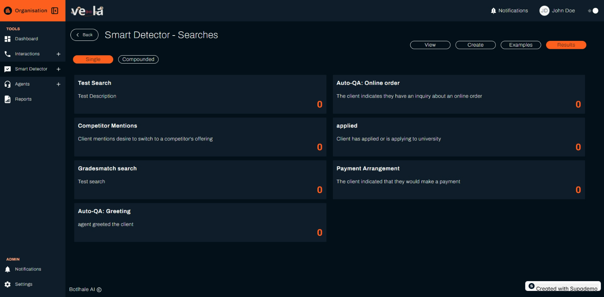

## Step 2: Understand the Results Summary
The **Results** sub-tab displays a list of active search queries with the following details:
**Name:**
  - The name of the search query, such as "Test Search" or "Auto-QA: Online order."
  - This matches the names you see in the View sub-tab.
**Description:**
  - A brief explanation of what the search looks for, such as "Client indicates they have an inquiry about an online order."
  - This helps you quickly recall the purpose of each search.
**Match Count:**
  - A number next to each search query (e.g., "0") indicates how many calls have matched the search criteria.
  - In the screenshot, all searches show "0," meaning no calls have matched these criteria yet.
  - As matches are found, this number will increase, reflecting the number of calls flagged by the search.

## Step 3: Choose Between Single and Compound Views
At the top of the **Results** sub-tab, you’ll see two options: Single and Compound. These determine how the results are displayed:
Single View (currently selected):

  - Shows the results for each search query individually.
  - Each row represents one search query, with its name, description, and the number of matches.
  - Use this view to quickly see how many calls match each search query on its own.
**Compound View:**
  - Combines multiple search queries to show calls that match more than one criterion at the same time.
  - Example: You might see how many calls mention both "competitor" (from the "Competitor Mentions" search) and "online order" (from the "Auto-QA: Online order" search).
  - This view is useful for identifying calls that meet multiple conditions, helping you uncover more complex patterns.

 # Smart Search Results

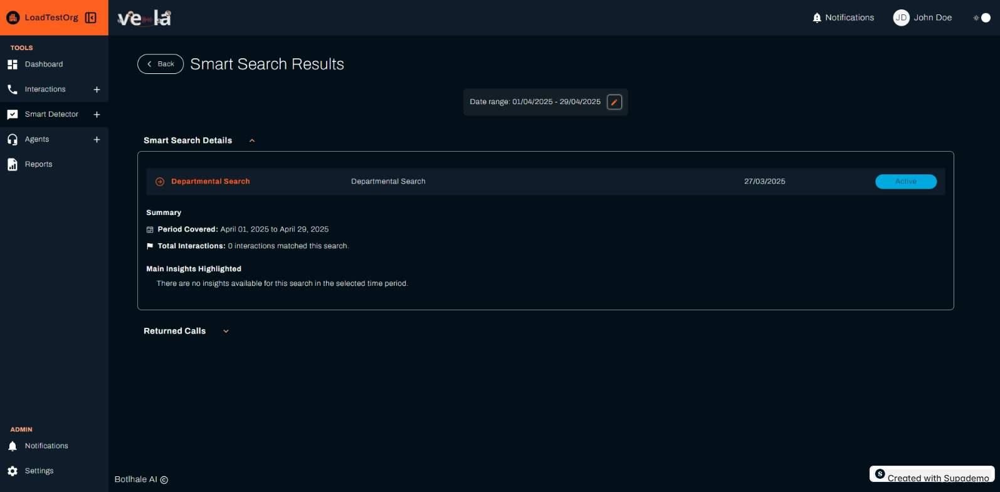

- **Date Range:**
   - A date range filter at the top (e.g., "01/04/2025 – 22/04/2025") allows you to adjust the time period for the results.
   - Click on the date range to select a different period if needed.
- **Smart Search Details:**
   - Name and Description: Displays the search query’s name (e.g., "Test Search") and description (e.g., "Test Description").
   - Date Created: Shows when the search was created (e.g., "20/01/2025").
   - Status: Indicates whether the search is active or inactive. In this case, a blue "Active" label confirms the search is currently running.
- **Summary:**
   - Period Covered: Shows the date range for the results (e.g., "Apr 01, 2025 to Apr 22, 2025").
   - Total Interactions: Displays the number of interactions (calls) that matched the search criteria (e.g., "0 interactions matched this search").
   - Main Insights: Provides a summary of the results. If there are no matches, it will say, "There are no insights available for this search in the selected time period."
- **Returned Calls:**
   - This section (currently empty) would list the specific calls that match the search criteria, including details like call date, agent, and transcript snippets.
   - Since there are no matches ("0 interactions"), this section is empty.

## Step 2: Confirm the Search Status
- Look at the Status label in the Smart Search Details section.
- A blue "Active" label (as shown in the screenshot) means the search is currently running and monitoring calls.
- If the label says "Inactive," the search is paused and won’t detect new matches until you enable it (you can enable it by going to the View sub-tab,  clicking the search name, and checking the Enabled checkbox in the detailed view).

## Step 3: Check the Status of Other Searches
- To check the status of other search queries (e.g., "Auto-QA: Online order," "Competitor Mentions"), click the Back button at the top-left to return to the Results sub-tab.
- In the Results sub-tab, you’ll see the summary table listing all active search queries (as seen in the previous section).
- Click on another search query name (e.g., "Auto-QA: Online order") to go to its Smart Search Results page.
On that page, look at the Status label in the Smart Search Details section to confirm whether it’s "Active" or "Inactive."
- Repeat this process for each search query you want to check.

#### Returned Calls

On the **Smart Search Results** page for a specific search query (e.g., "Test Search"), the **Returned Calls** section allows you to view and analyze the calls that match the search criteria. This section can be expanded by clicking on its header, revealing a table of matching calls (if any). Here’s what you’ll see and how to interact with this section:

## Step 1: Locate and Expand the Returned Calls Section

- On the Smart Search Results page, find the Returned Calls section below the Smart Search Details section.
- The header "Returned Calls" is clickable and has a small arrow next to it, indicating it can be expanded or collapsed.
- Click on the Returned Calls header to expand the section and view the table of matching calls.

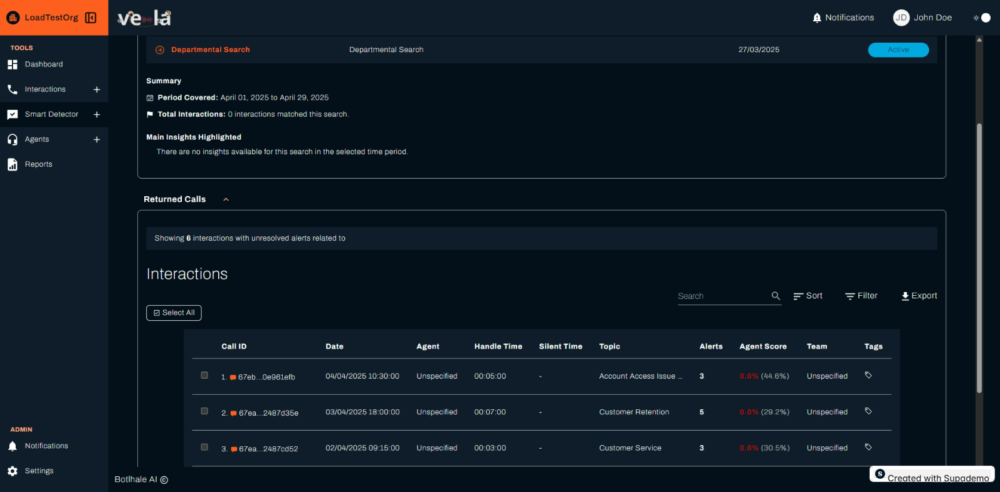

## Step 2: Understand the Returned Calls Table

The Returned Calls section contains a table labeled "Interactions," which lists the calls that match the search query’s criteria. Here’s what you’ll see:

**If No Calls Are Found (Current State)**

- If there are no matches, the table will display a message: "No calls matching the search query found," as shown in the screenshot.
- This means no calls within the selected date range (e.g., "01/04/2025 – 22/04/2025") match the search criteria (e.g., the example phrases or filters   set for "Test Search").
- Possible reasons for no matches:
   - The search criteria are too specific (e.g., the example phrases don’t match common call language).
   - The date range is too narrow (e.g., try expanding it to include more calls).
   - The search scope is limited (e.g., only applies to a small team with few calls).
   - Not enough calls have been processed since the search was activated.

**If Calls Are Found (Populated State)**

If there are matching calls, the table will populate with the following columns:

- **Call ID:**
   - A unique identifier for each call (e.g., "C12345").
   - Clicking the Call ID may take you to a detailed view of the call, including the full transcript and audio (if available).
- **Date:**
   - The date and time the call occurred (e.g., "15/04/2025 14:30").
- **Agent:**
    - The name or ID of the agent who handled the call (e.g., "Agent123").
- **Handle Time:**
    - The duration of the call (e.g., "00:05:32" for 5 minutes and 32 seconds).
**Silent Time:**
    - The amount of time during the call with no speaking (e.g., "00:00:45" for 45 seconds of silence).
- **Topic:**
    - The main topic or category of the call, often auto-detected (e.g., "Complaint").
- **Alerts:**
   - Any alerts triggered by the call, such as "Competitor Mention" or "Escalation Needed."
- **Agent Score:**
    - A performance score for the agent based on the call (e.g., "85/100").
- **Team:**
    - The team the agent belongs to (e.g., "Customer Support").
- **Tags:**
    - Any tags associated with the call for easy categorization (e.g., "Urgent").

## Step 3: Interact with the Returned Calls Table

When the table is populated with matching calls, you can interact with it in several ways:

1. **View Call Details:**
 - Click on a Call ID to view the full details of that call, including the transcript with highlighted phrases that matched the search criteria (e.g., "Test A" from the "Test Search" query).
 - You may also be able to listen to the call recording if audio playback is enabled.

2. **Sort and Filter:**

- Use the Sort and Filter icons above the table to organize the results:
   - Sort: Click the Sort icon (double arrow) to sort by columns like Date, Handle Time, or Agent Score.
   - Filter: Click the Filter icon (funnel) to narrow down the results, such as showing only calls from a specific Team or with a specific Alert.
- Example: Filter by Alert to show only calls with "Competitor Mention."

3. **Search Within Results:**
- Use the search bar above the table to search for specific keywords within the returned calls (e.g., search for "refund" to find calls mentioning that word).

4. **Select and Export:**

 - Use the Select All checkbox to select all calls in the table.
 - Click the Export icon (download arrow) to export the table data to a file (e.g., CSV) for further analysis.
 - Example: Export the list of calls to share with your team for review.

5. **Navigate Pages:**
 -If there are multiple pages of results, use the Previous and Next buttons at the bottom of the table to navigate (e.g., "Page 1 of 1" in the screenshot, but this would change if more calls are found).

 ## Using the Compound View in the Results Sub-Tab
**The Compound view** in the **Results** sub-tab of the Smart Searches tab allows you to combine multiple smart searches to identify calls that match all selected criteria at the same time. This is useful for uncovering complex patterns, such as calls that mention both a competitor and a specific issue. Here’s how to set up and use the Compound view to analyze your call data:

## Step 1: Navigate to the Compound View
- In the **Smart Searches** tab, click the Results sub-tab at the top (next to **View**, **Create**, and **Examples**).
- At the top of the **Results** sub-tab, you’ll see two options: **Single and Compound**.
- Click**Compound to switch** to the compound view (as shown in the screenshot).

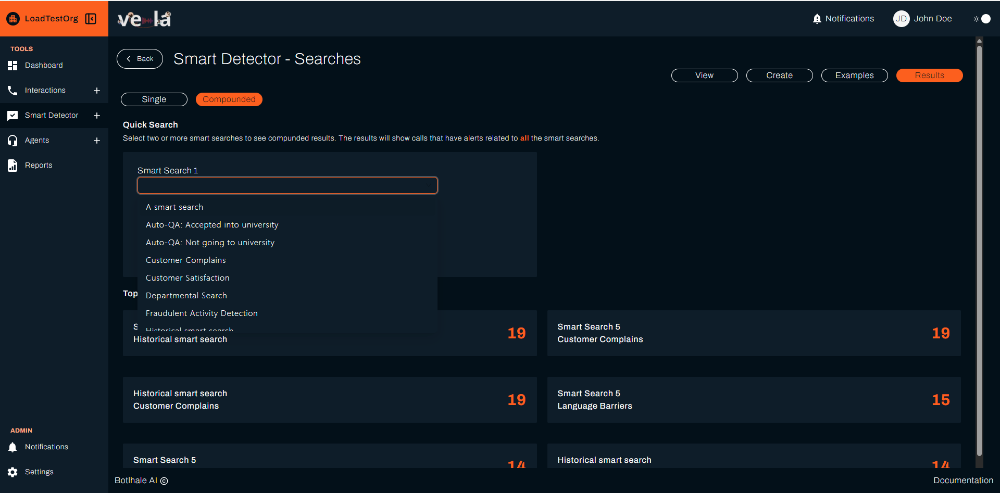

## Step 2: Select Smart Searches to Combine

The **Compound** view provides a "Quick Search" section where you can select two or more smart searches to combine:

1. **Smart Search 1:**
  - Click the dropdown labeled Smart Search 1 to see a list of available smart searches.
  - The list includes all active search queries from the View sub-tab, such as "applied," "Auto-QA: Greeting," "Auto-QA: Online order," "Competitor Mentions," "Gradesmatch search," "Payment Arrangement," and "Test Search."
  - Select the first search query you want to include.
    - Example: Choose "Competitor Mentions" to look for calls mentioning a competitor.
2. **Add More Smart Searches:**
- After selecting the first search, a Smart Search 2 dropdown will appear (not shown in the screenshot but part of the workflow).
- Click the Smart Search 2 dropdown and select a second search query.
 - **Example:** Choose "Auto-QA: Online order" to look for calls that also mention an online order inquiry.
- You can continue adding more smart searches (e.g., Smart Search 3) by clicking a "+ Add" button or similar option, depending on the interface.
3. **Apply the Selection:**
- Once you’ve selected the desired smart searches, click an Apply or Search button (not visible in the screenshot but typically present in such interfaces) to run the compound search.
- The system will find calls that match all the selected search criteria simultaneously.

## Step 3: Interpret the Compound Results

After applying the compound search, a table of results will appear below the "Quick Search" section (not shown in the screenshot since the selection is still in progress). Here’s what you’ll see:

- **Table of Matching Calls:**
  - The table will list calls that match all the selected smart searches.
  - Example: If you selected "Competitor Mentions" and "Auto-QA: Online order," the table will show calls where a client mentioned a competitor and had an inquiry about an online order.
  - Columns in the table may include:
    - Call ID: A unique identifier for each call.
    - Date: The date and time of the call.
    - Agent: The agent who handled the call.
    - Handle Time: The duration of the call.
    - Silent Time: The amount of silence in the call.
    - Topic: The main topic of the call.
    - Alerts: Any alerts triggered by the call.
    - Agent Score: The agent’s performance score.
    - Team: The agent’s team.
    - Tags: Any tags associated with the call.

- **No Matches Found:**

- If no calls match all the selected criteria, the table will display a message like "No calls matching the compound search query found."
- This could happen if the criteria are too restrictive or if there aren’t enough calls that meet all conditions.

# Selecting Smart Search 2 in the Compound 

In the **Compound** view of the **Results** sub-tab, you can combine multiple smart searches to find calls that match all selected criteria simultaneously. After selecting the first smart search in the Smart Search 1 dropdown, you’ll proceed to the Smart Search 2 dropdown to add a second search query to the compound analysis. This section explains how to use the Smart Search 2 dropdown, complete the setup, and interpret the results.

## Step 1: Access the Smart Search 2 Dropdown
- Ensure you’re in the Compound view of the Results sub-tab (click Compound at the top if you’re in Single view).
- After selecting a search query in the **Smart Search 1**dropdown (e.g., "Competitor Mentions"), the **Smart Search 2** dropdown will appear below it, as shown in the screenshot.

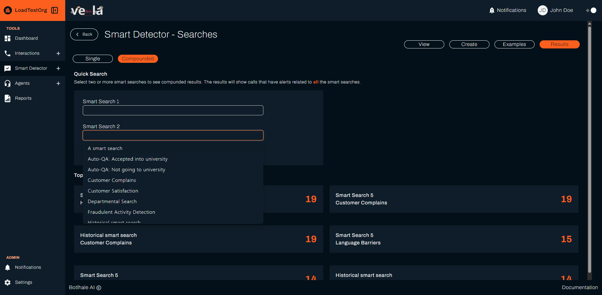

## Step 2: Select a Second Smart Search

- Click the Smart Search 2 dropdown to see a list of available smart searches.
- The list includes all active search queries from the View sub-tab, such as "applied," "Auto-QA: Greeting," "Auto-QA: Online order," "Competitor Mentions," "Gradesmatch search," "Payment Arrangement," and "Test Search."
- Select the second search query you want to combine with the first one.
  - Example: If you selected "Competitor Mentions" for Smart Search 1, you might choose "Auto-QA: Online order" for Smart Search 2 to find calls where a client mentioned a competitor and had an inquiry about an online order.

## Step 3: Add More Smart Searches (Optional)

- If you want to combine more than two smart searches, look for a "+ Add" button or a Smart Search 3 dropdown that appears after selecting Smart Search 2 (not shown in the screenshot but typical in such interfaces).
- Repeat the process to add additional search queries, such as "Payment Arrangement," to further narrow down the results.
  - Example: Adding "Payment Arrangement" would find calls that mention a competitor, discuss an online order, and indicate a payment arrangement.
## Step 4: Apply the Compound Search

- Once you’ve selected all the desired smart searches (at least two), click an Apply or Search button (not visible in the screenshot but typically present in such interfaces) to run the compound search.
- The system will analyze your call data and return a table of calls that match all the selected search criteria simultaneously.

# Navigating to the Agent Scorecard Section

The **Smart Detector page** provides an overview of the Smart Detector features, including Smart Search and **Agent Scorecard**. Clicking on the Agent Scorecard card takes you to a dedicated section where you can evaluate and monitor agent performance based on their interactions with customers. This section explains what happens when you click on the Agent Scorecard card and provides an overview of the Agent Scorecard feature.

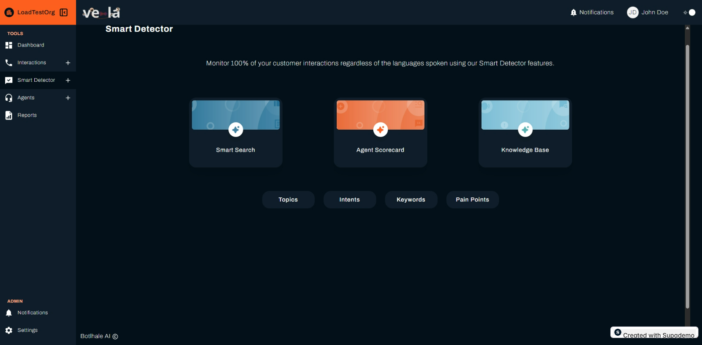

## Exploring the Agent Scorecard Section – View Tab

The **Agent Scorecard section** of the Smart Detector feature allows you to evaluate agent performance by defining questions that assess their interactions with customers. After clicking the Agent Scorecard card from the main Smart Detector page, you’ll be taken to the Agent Scorecard section, which includes several tabs: **View**, **Create**, **Examples**, and **Results**. This section focuses on the View tab, which displays a table of questions used to score agents, and explains how to interact with this table.

## Step 1: Navigate to the Agent Scorecard Section – View Tab

- From the left sidebar, click on Smart Detector under the Tools section, then click the Agent Scorecard card on the main Smart Detector page.
- This opens the Agent Scorecard section, with the View tab selected by default (as shown in the screenshot).
- The page title "Smart Detector – Agent Scorecard" confirms you’re in the correct section.

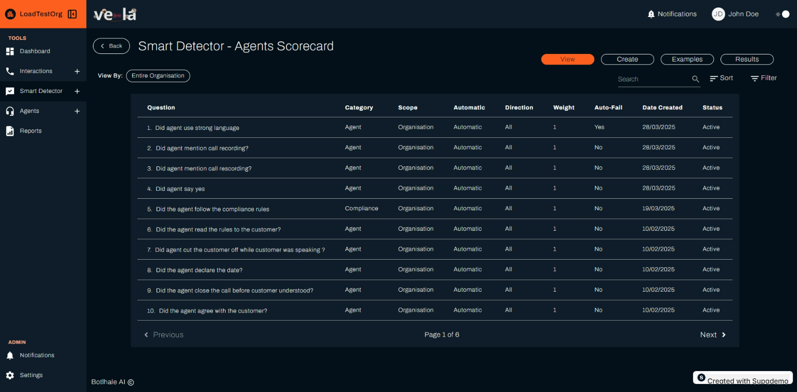

## Step 2: Understand the View Tab Interface

The View tab provides an overview of the questions used to evaluate agent performance, displayed in a table with the following elements:
- **Tabs:**
   - **View** (currently selected): Shows the list of questions used for scoring.
   - **Create:** Allows you to add new questions (covered in a later section).
   - **Examples:** Provides predefined question templates (covered in a later section).
   - **Results:** Displays agent scores based on these questions (covered in a later section).

- **View By Dropdown:**
  - A dropdown labeled "View By: Entire Organisation" lets you filter the questions by scope (e.g., Entire Organisation, Specific Department, or Specific Team).
 - Example: Select "Customer Support" under Specific Department to view only questions applied to that department.

- **Table of Questions:**

The table lists all questions used to evaluate agents, with the following columns:
- **Question:**
  - The specific question used to assess agent performance.
  - Example: "Did the agent let the customer know that the organisation name is Botlhale Collections?"
- **Category:**
  - The category the question belongs to, such as "Collections," "Customer Care," or "Test Category."
  - Categories help organize questions by theme or department.
- **Scope:**
  - The scope of the question, such as Departments, Teams, or Organisation.
  - Example: "Departments" means the question applies to specific departments.
- **Direction:**
  - Indicates whether the question is evaluated automatically ("Automatic") or manually.
  - All questions in the screenshot are marked as "Automatic," meaning they’re assessed using predefined rules (e.g., detecting specific phrases in call transcripts).
- **Weight:**
  - The weight assigned to the question, which determines its impact on the agent’s overall score.
  - Example: A weight of "1" means the question has a standard impact, while a weight of "3" (as in "Test question") has a higher impact.
- **Auto-Fail:**
  - Indicates whether failing this question automatically fails the agent’s entire scorecard ("Yes" or "No").
  - Example: "Yes" for "Did the agent let the customer know that the organisation name is Botlhale Collections?" means failing this question results in an automatic failure.
- **Date Created:**
  - The date the question was created.
  - Example: "24/03/2025" for the first question.
- **Status:**
  - The current status of the question, such as "Active" or "Inactive."
  - All questions in the screenshot are "Active," meaning they’re currently used to evaluate agents.

  # Viewing and Editing a Question in Agent Scorecard Details

When you click on a question in the table under the Question column in the View tab of the Agent Scorecard section, you’ll be taken to the Agent Scorecard Details page for that specific question. This page allows you to view and edit the question’s settings, such as its scope, category, and weight, to fine-tune how it evaluates agent performance. Here’s what you’ll see and how to interact with this page.

## Step 1: Navigate to the Agent Scorecard Details Page

- In the Agent Scorecard section, ensure you’re on the View tab (as described in the previous section).
- In the table of questions, locate the Question column and click on a question.
- Example: Click on "Did the agent let the customer know that the organisation name is Botlhale Collections?" to open its details.
- This takes you to the Agent Scorecard Details page for that question, as shown in the screenshot.

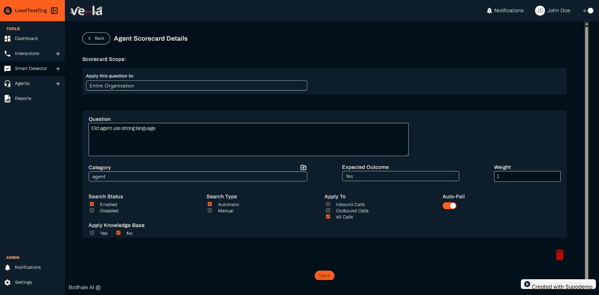

## Step 2: Understand the Agent Scorecard Details Page

The **Agent Scorecard Details** page provides a detailed view of the selected question, with the following sections:

- **Header:**

   - The title "Agent Scorecard Details" confirms you’re viewing the details of a specific question.
   - A Back button (a left arrow) at the top-left lets you return to the View tab.
- **Scorecard Scope:**
   - Apply this question to: A dropdown indicating the scope of the question (e.g., Specific Department, Specific Team, or Entire Organisation).
      - In the screenshot, it’s set to Specific Department.
   - Applying search to: A second dropdown specifying the department, team, or organisation the question applies to.
      - In the screenshot, it’s set to Department A.
   - You can change these dropdowns to adjust the scope of the question.
- **Question:**
   - Displays the text of the question, such as "Did the agent let the customer know that the organisation name is Botlhale Collections?"
   - This field is editable, allowing you to modify the question text if needed.
- **Category:**
   - A dropdown showing the category the question belongs to (e.g., "compliance").
   - Categories help organize questions by theme or department.
   - You can change the category by selecting a different option from the dropdown.
- **Expected Outcome:**
    - A dropdown indicating the expected answer to the question (e.g., Yes or No).
      - In the screenshot, it’s set to Yes, meaning agents are expected to let the customer know the organisation name.
   - You can change this to No if the expected behavior changes.
- **Weight:**
    - A numerical field showing the weight of the question (e.g., "1"), which determines its impact on the agent’s overall score.
    - You can edit this field to increase or decrease the weight.
    - Example: Increase the weight to "3" to give this question a higher impact on the score.
- **Search Status:**
  - A checkbox labeled Enabled indicating whether the question is active or inactive.
  - In the screenshot, the Enabled checkbox is checked, meaning the question is currently used to evaluate agents.
  - Uncheck this box to disable the question without deleting it.
- **Search Type:**
   - A radio button selection between Automatic and Manual.
     - In the screenshot, Automatic is selected, meaning the question is evaluated by the system (e.g., by detecting phrases like "Botlhale Collections" in call transcripts).
   - You can switch to Manual if the question requires human evaluation.
- **Apply To:**
   - Checkboxes for Inbound Calls, Outbound Calls, and All Calls, determining which types of calls the question applies to.
     - In the screenshot, All Calls is checked, meaning the question applies to both inbound and outbound calls.
   - You can adjust these checkboxes to limit the question to specific call types.
**Auto-Fail:**
   - A toggle switch indicating whether failing this question automatically fails the agent’s entire scorecard.
     - In the screenshot, Auto-Fail is enabled (set to "On"), meaning failing this question results in an automatic failure.
   - You can toggle this to "Off" if you don’t want failing this question to result in an automatic failure.
- **Delete Icon:**
   - A red trash bin icon at the bottom-right allows you to delete the question entirely.
   - Deleting a question removes it from the scorecard and stops it from being used in evaluations.
- **Save Button:**
  - An orange Save button at the bottom lets you save any changes you make to the question’s settings.

## Step 3: Edit the Question Settings

You can modify the question’s settings to better suit your evaluation needs:

1. **Change the Scope:**
  - Adjust the Apply this question to dropdown to change the scope (e.g., from Specific Department to Entire Organisation).
  - Update the Applying search to dropdown to select a different department, team, or organisation.
    -  Example: Change Department A to Department B to apply the question to a different department.

2. **Edit the Question Text:**
  -  Click into the Question field and modify the text.
    - Example: Change "Did the agent let the customer know that the organisation name is Botlhale Collections?" to "Did the agent introduce the organisation as Botlhale Collections?"

3. **Update the Category:**
  - Select a different category from the Category dropdown.
    - Example: Change "compliance" to "Customer Care" if the question better fits that category.

4. **Adjust the Expected Outcome:**
  - Change the Expected Outcome dropdown to No if the desired behavior changes.
    - Example: Set to No if agents are not expected to mention the organisation name.

5. **Modify the Weight:**
  - Edit the Weight field to increase or decrease the question’s impact on the agent’s score.
    - Example: Increase the weight to "2" to make this question more significant in the overall score.

6. **Enable or Disable the Question:**
  - Check or uncheck the Enabled checkbox under Search Status to activate or deactivate the question.
   - Example: Uncheck Enabled to temporarily stop using this question without deleting it.

7. **Change the Search Type:**
   - Switch between Automatic and Manual under Search Type.
   - Example: Select Manual if you want a human reviewer to evaluate this question instead of the system.

8. **Update Call Type Applicability:**
  - Adjust the Apply To checkboxes to change which calls the question applies to.
   - Example: Uncheck All Calls and check Inbound Calls to apply the question only to inbound calls.

9. **Toggle Auto-Fail:**
   - Toggle the Auto-Fail switch to "Off" if you don’t want failing this question to automatically fail the agent’s scorecard.
     - Example: Turn Auto-Fail off to allow agents to fail this question without failing the entire scorecard.

10. **Save Changes:**
  - After making any changes, click the orange Save button to apply them.
  - If you don’t save, your changes will not take effect.
11. **Delete the Question (Optional):**
  - Click the red trash bin icon to delete the question entirely.
  - A confirmation prompt may appear to ensure you want to proceed with the deletion.

# Create Tab 

The Create tab in the Agent Scorecard section of the Smart Detector feature allows you to define a new question for evaluating agent performance. This question will be used to assess agents based on their interactions with customers, contributing to their overall scorecard. Here’s how to create a new question using the Create tab.

## Step 1: Navigate to the Create Tab
- From the left sidebar, click on Smart Detector under the Tools section, then click the Agent Scorecard card on the main Smart Detector page.
- This opens the Agent Scorecard section, with the View tab selected by default.
- Click the Create tab at the top (next to View, Examples, and Results) to access the question creation form, as shown in the screenshot.

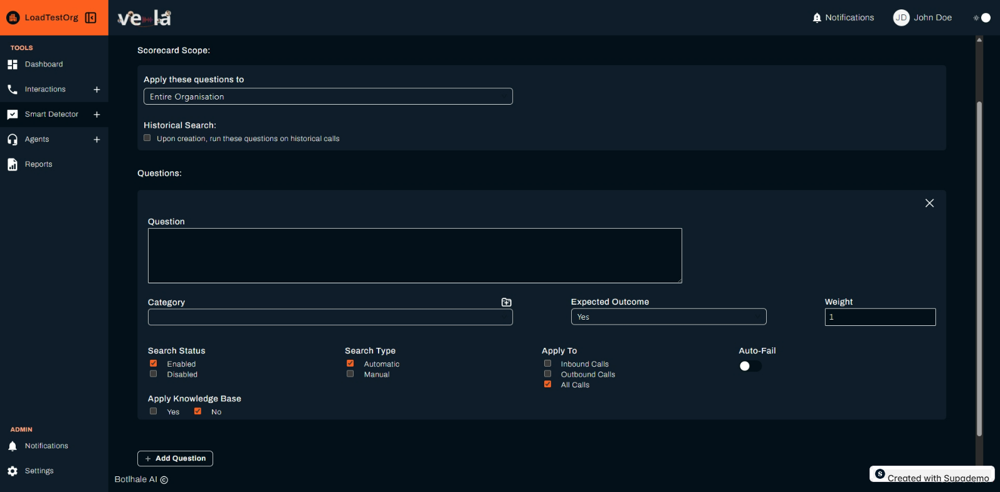

## Step 2: Understand the Create Tab Interface

- Scorecard Scope:
  - Apply these questions to: A dropdown to set the scope of the question (e.g., Entire Organisation, Specific Department, or Specific Team).
    - In the screenshot, it’s set to Entire Organisation.
  - A second dropdown may appear if you select Specific Department or Specific Team to specify the department or team (not visible in the screenshot since Entire Organisation is selected).
- Historical Search:
  - A checkbox labeled Upon creation, run these questions on historical calls.
  - If checked, the question will be applied to past calls to evaluate agent performance retroactively.
    - In the screenshot, this box is unchecked.
- Questions:
  - A section where you can define one or more questions.
  - A blank Question field where you can enter the text of the new question.
  - A small "X" icon next to the Questions header, which may allow you to clear the form or remove additional questions if you’re creating multiple questions at once.
- Category:
  - A dropdown to select the category for the question (e.g., "compliance," "Customer Care").
  - Categories help organize questions by theme or department.
- Expected Outcome:
  - A dropdown to set the expected answer to the question (e.g., Yes or No).
    - In the screenshot, it’s set to Yes.
- Weight:
   - A numerical field to set the weight of the question (e.g., "1"), which determines its impact on the agent’s overall score.
      - In the screenshot, it’s set to "1".
- Search Status:
   - A checkbox labeled Enabled to determine whether the question is active or inactive upon creation.
     - In the screenshot, the Enabled checkbox is checked, meaning the question will be active once created.
- Search Type:
   - A radio button selection between Automatic and Manual.
     - In the screenshot, Automatic is selected, meaning the question will be evaluated by the system (e.g., by detecting specific phrases in call transcripts).
   - Manual would require human evaluation.
- Apply To:
   - Checkboxes for Inbound Calls, Outbound Calls, and All Calls to determine which types of calls the question applies to.
      - In the screenshot, All Calls is checked, meaning the question will apply to both inbound and outbound calls.
- Auto-Fail:
   - A toggle switch to determine whether failing this question automatically fails the agent’s entire scorecard.
     - In the screenshot, Auto-Fail is disabled (set to "Off").
- Save Button (Not Visible in Screenshot):
   - An orange Save button (typically at the bottom, as seen in similar interfaces like the Agent Scorecard Details page) lets you save the new question.

## Step 3: Create a New Question

Follow these steps to create a new question:

1. Set the Scorecard Scope:
- Use the Apply these questions to dropdown to select the scope.
   - Example: Choose Specific Department to apply the question to a specific department, then select the department (e.g., "Customer Support") in the second dropdown that appears.
   - In the screenshot, it’s set to Entire Organisation, meaning the question will apply to all agents in the organization.

2. Enable Historical Search (Optional):
  - Check the Upon creation, run these questions on historical calls box if you want the question to evaluate past calls.
    - Example: Check this box to see how agents performed on this question in calls from the last 30 days.
  - Leave it unchecked (as in the screenshot) if you only want the question to apply to future calls.

3. Enter the Question:
  - In the Question field, type the text of the new question.
   - Example: "Did the agent offer a solution to the customer’s issue?"
  - Ensure the question is clear and specific to make evaluation straightforward.

4. Select the Category:
- Choose a category from the Category dropdown.
   - Example: Select "Customer Care" if the question relates to customer service quality.
- If no suitable category exists, you may need to create a new category (depending on your permissions and the platform’s capabilities).

5. Set the Expected Outcome:
  - Use the Expected Outcome dropdown to select the desired answer.
    - Example: Set to Yes if agents are expected to offer a solution (as in the screenshot).
  - Set to No if the behavior should not occur (e.g., "Did the customer use swear words?").
6. Assign a Weight:
  - Enter a number in the Weight field to determine the question’s impact on the agent’s score.
    - Example: Keep the default "1" for a standard impact, or increase to "3" for a more significant question.
  - In the screenshot, it’s set to "1".
7. Set the Search Status:
  - Check the Enabled box to make the question active upon creation (as in the screenshot).
  - Uncheck it if you want to create the question but not use it immediately.
8. Choose the Search Type:
  - Select Automatic or Manual under Search Type.
     - Example: Choose Automatic (as in the screenshot) to let the system evaluate the question by detecting specific phrases in call transcripts (e.g., "I can solve that for you").
  -  Choose Manual if the question requires human judgment.
9. Specify Call Types:
   - Use the Apply To checkboxes to determine which calls the question applies to.
     - Example: Check All Calls (as in the screenshot) to apply the question to both inbound and outbound calls.
   - Alternatively, check Inbound Calls or Outbound Calls to limit the scope.
10. Toggle Auto-Fail:
  - Toggle the Auto-Fail switch to "On" if failing this question should automatically fail the agent’s scorecard.
     - Example: Turn Auto-Fail on for critical questions like "Did the agent use inappropriate language?"
  - Leave it "Off" (as in the screenshot) if failing the question should only affect the score without causing an automatic failure.
11. Save the Question:
  - Click the orange Save button (not visible in the screenshot but typically present at the bottom) to create the question.
  - After saving, the question will appear in the View tab’s table and will start being used to evaluate agents (if Enabled is checked).

# Examples Tab

The Examples tab in the Agent Scorecard section of the Smart Detector feature provides a list of predefined example questions that you can use as templates for creating new questions to evaluate agent performance. These examples serve as a starting point, helping you quickly set up questions without starting from scratch. This section explains how to use the Examples tab and how to leverage the example questions.

# Step 1: Navigate to the Examples Tab

- From the left sidebar, click on Smart Detector under the Tools section, then click the Agent Scorecard card on the main Smart Detector page.
- This opens the Agent Scorecard section, with the View tab selected by default.
- Click the Examples tab at the top (next to View, Create, and Results) to access the list of example questions, as shown in the screenshot.

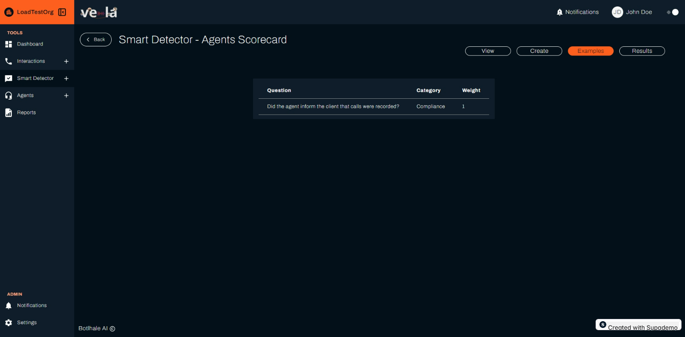

## Step 2: Understand the Examples Tab Interface

The Examples tab displays a table of predefined questions with the following elements:

- **Header:**
  - The title "Smart Detector – Agent Scorecard" confirms you’re in the Agent Scorecard section.
  - A Back button (a left arrow) at the top-left lets you return to the main Smart Detector page.
- **Tabs:**
  - **View:** Shows the list of active questions used for scoring (covered previously).
  - **Create:** Allows you to add new questions (covered previously).
  - **Examples**  (currently selected): Displays predefined example questions.
  - **Results:** Shows agent scores based on the questions (covered in a later section).

- **Table of Example Questions:**
The table lists example questions that can be used as templates, with the following columns:

- **Question:**
   - The text of the example question.
   - Example: "Did the agent inform the client that calls were recorded?"
- **Category:**
   - The category the question is associated with, such as "compliance."
   - Categories help organize questions by theme or department.
- **Weight:**
   - The suggested weight for the question, which determines its impact on the agent’s overall score.
   - Example: "1" for the question in the screenshot, indicating a standard impact.
- **Additional Features (Not Shown but Inferred):**
   - While not visible in the screenshot, the table may include sorting, filtering, or pagination options (similar to the View tab) if there are many example questions.
   - Clicking on a question may allow you to view its full details or directly add it to your scorecard.

## Step 3: Navigate to the Examples Tab and Click a Question

- In the Agent Scorecard section, go to the Examples tab (as described in the previous section).
- In the table of example questions, locate the Question column and click on a question.
   - Example: Click on "Did the agent inform the client that calls were recorded?" to open its details.
- This takes you to the simplified Agent Scorecard Details page for that example question, as shown in the screenshot.

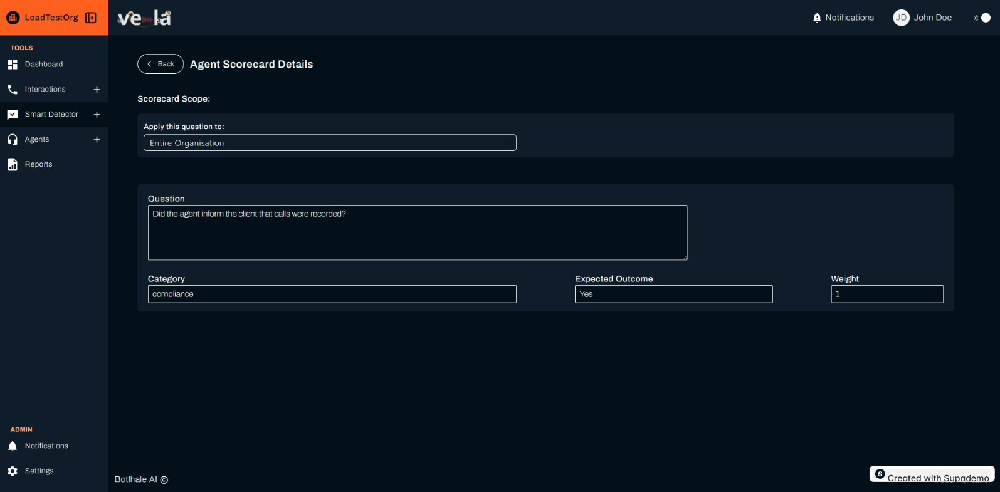

## Step 4: Understand the Simplified Agent Scorecard Details Page
The Agent Scorecard Details page for an example question provides a preview of the question’s settings, with the following sections:

- **Header:**
  - The title "Agent Scorecard Details" confirms you’re viewing the details of a specific question.
  - A Back button (a left arrow) at the top-left lets you return to the Examples tab.
- **Scorecard Scope:**
  - **Apply this question to:** A dropdown indicating the suggested scope of the question (e.g., Entire Organisation, Specific Department, or Specific Team).
    - In the screenshot, it’s set to Entire Organisation, meaning the question is designed to apply to all agents in the organization.
  - Unlike the detailed view in the View tab, there’s no second dropdown to specify a department or team, as this is a preview of an example question.
- **Question:**
  - Displays the text of the example question, such as "Did the agent inform the client that calls were recorded?"
  - This field is not editable in this view, as the page is for previewing the example question.
- **Category:**
  - A dropdown showing the category the question is associated with (e.g., "compliance").
  - This field is not editable in this view but shows how the question is categorized.
- **Expected Outcome:**
   - A dropdown indicating the expected answer to the question (e.g., Yes or No).
   - In the screenshot, it’s set to Yes, meaning agents are expected to inform clients that calls are recorded.
   - This field is not editable in this view.
- **Weight:**
  - A numerical field showing the suggested weight of the question (e.g., "1"), which determines its impact on the agent’s overall score.
  - In the screenshot, it’s set to "1", indicating a standard impact.
  - This field is not editable in this view.
- **Missing Fields (Compared to View Tab Details):**
  - Unlike the Agent Scorecard Details page accessed from the View tab, this simplified version does not include fields like Search Status, Search Type, **Apply To, Auto-Fail**, or a **Save button**.
  - This suggests that the page is a read-only preview, and you cannot directly add or modify the question from this view.

# Analyzing Results in the Agent Scorecard 

## Results Tab

The **Results tab** in the **Agent Scorecard section** of the Smart Detector feature allows you to view the outcomes of agent performance evaluations based on the questions defined in your scorecard. This tab provides a table summarizing how agents performed against each question, helping you identify areas for improvement. This section explains the Results tab, the table of results, and what to do if no results are found.

## Step 1: Navigate to the Results Tab

- From the left sidebar, click on Smart Detector under the Tools section, then click the Agent Scorecard card on the main **Smart Detector page.**
- This opens the **Agent Scorecard section**, with the View tab selected by default.
- Click the **Results tab** at the top (next to View, Create, and Examples) to access the results table, as shown in the screenshot.

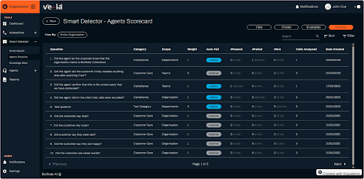

## Step 2: Understand the Results Tab Interface

The Results tab displays a table summarizing the performance of agents against the questions in your scorecard, with the following elements:

- **Header:**
  - The title "Smart Detector – Agent Scorecard" confirms you’re in the Agent Scorecard section.
  - A Back button (a left arrow) at the top-left lets you return to the main Smart Detector page.
- **Tabs:**
  - **View:** Shows the list of active questions used for scoring (covered previously).
  - **Create:** Allows you to add new questions (covered previously).
  - **Examples:** Displays predefined example questions (covered previously).
  - **Results** (currently selected): Shows the results of agent evaluations.

- **View By Dropdown:**
  - A dropdown labeled "View By: Entire Organisation" lets you filter the results by scope (e.g., Entire Organisation, Specific Department, or Specific Team).
  - Example: Select "Customer Support" under Specific Department to view results only for that department.

- **Table of Results:**
The table lists the questions and their evaluation outcomes, with the following columns:

  - **Question:**
    - The text of the question used to evaluate agents.
     - Example: "Did the agent let the customer know that the organisation name is Botlhale Collections?" (not shown in the screenshot since the table is empty).

  - **Category:**
   - The category the question belongs to (e.g., "compliance").
   - Categories help organize questions by theme or department.
  - **Scope:**
   - The scope of the question (e.g., Departments, Teams, or Organisation).
   - Example: "Organisation" means the question applies to all agents in the organization.
  - **Weight:**
    - The weight assigned to the question, which determines its impact on the agent’s overall score.
    - Example: "1" for a standard impact.
  - **Auto-Fail:**
    - Indicates whether failing this question automatically fails the agent’s entire scorecard ("Yes" or "No").
    - Example: "Yes" means failing the question results in an automatic failure.
  - **#PASSED:**
    - The number of calls where the agent passed the question (i.e., met the expected outcome).
    - Example: If the question expects a Yes outcome and the agent met it in 50 calls, this would show "50".
  - **#FAILED:**
    - The number of calls where the agent failed the question (i.e., did not meet the expected outcome).
    - Example: If the agent failed to meet the expected outcome in 10 calls, this would show "10".
  - **#N/A:**
    - The number of calls where the question was not applicable (e.g., the phrase wasn’t detected, or the call type didn’t match).
    - Example: If the question applies only to inbound calls and 5 calls were outbound, this would show "5".
 - **Calls Analysed:**
    - The total number of calls analyzed for this question.
    - Example: If 65 calls were analyzed, this would show "65".
 - **Date Created:**
    - The date the question was created.
    - Example: "24/03/2025".
 - **Sort and Filter Options:**
  - Use the Sort and Filter icons above the table to organize the results:
  - Sort: Click the Sort icon (double arrow) to sort by columns like Question, #PASSED, or Date Created.
  - Filter: Click the Filter icon (funnel) to narrow down the list, such as showing only questions in the "Customer Care" category or with "Auto-Fail: Yes."
  - Example: Filter by Category to show only "compliance" questions.
 - **Search Bar:**
    - Use the search bar above the table to find specific questions by keyword.
    - Example: Type "recorded" to find questions like "Did the agent inform the client that calls were recorded?"
 - **Pagination Controls:**
    - The table includes pagination controls at the bottom (e.g., "Page 1 of 1").
    - Use the Previous and Next buttons to navigate between pages if there are more questions than can fit on one page.

   # Navigating to the Knowledge Base Section
The **Smart Detector page** provides an overview of the Smart Detector features, including Smart Search, Agent Scorecard, and Knowledge Base. Clicking on the **Knowledge Base card** takes you to a dedicated section where you can manage and access a centralized repository of information to support agents during customer interactions. This section explains what happens when you click on the **Knowledge Base card** and provides an overview of the Knowledge Base feature.

## Step 1: Navigate to the Knowledge Base Section

- From the left sidebar, click on Smart Detector under the Tools section.
- On the main Smart Detector page, locate the three cards: Smart Search, Agent Scorecard, and Knowledge Base.
- Click on the Knowledge Base card to access the Knowledge Base section, as shown in the screenshot.
-The page title "Knowledge Base" confirms you’re in the correct section.

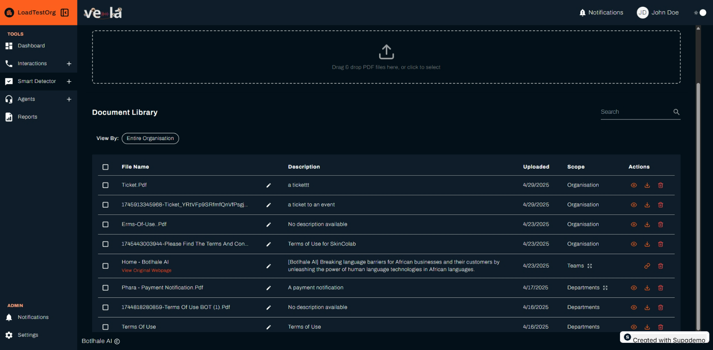

## Step 2: Understand the Knowledge Base Section Interface
The Knowledge Base section provides tools to upload and manage documents, with the following elements:
- **Header:**
  - The title "Knowledge Base" confirms your location.
  - The left sidebar highlights Smart Detector as the active section.
- **Search Bar:**
  - A search bar at the top-right to find documents by name or keyword.
  - Example: Search for "terms" to find documents like "TERMS OF USE."
- **PDF Upload Area:**
  - A rectangular area at the top with the text: "Drag & drop PDF files here, or click to select."
  - This area allows you to upload PDF documents to the Knowledge Base.
- **View By Dropdown:**
  - A dropdown labeled "VIEW BY" set to "Entire Organisation," which likely filters the Document Library table based on the scope of the documents.
  - Possible options might include "Entire Organisation," "Departments," or "Teams," reflecting the scopes shown in the table.
- **Document Library Table:**
  - A table labeled "Document Library" listing all uploaded documents.
  - The table includes the following columns:
- **File Name:**
  - The name of the uploaded document, with a checkbox for selecting multiple documents (if batch actions are supported).
  - Example: "Ticket.pdf," "Erms-of-Use.pdf," "TERMS OF USE."
- **Description:**
  - A brief description of the document, often indicating its purpose or content.
  - Example: "a ticket" for "Ticket.pdf," or "No description available" for "Erms-of-Use.pdf."
- **Uploaded:**
  - The date the document was uploaded.
  - Example: "4/29/2025" for "Ticket.pdf," "4/17/2025" for "Phara_Payment Notification.pdf."
- **Scope:**
  - The scope of the document, indicating who can access it (e.g., "Organisation," "Departments," "Teams").
  - Example: "Organisation" for "Ticket.pdf," "Teams" for "Home_Bothale AI."
- **Actions:**
  - Options to interact with the document, such as viewing, downloading, or deleting.
  - Example: Icons include a view icon (eye), a download icon (down arrow), and a delete icon (trash bin).
- **The table lists several documents, such as:**
  - "Ticket.pdf" with description "a ticket," uploaded on "4/29/2025," scope "Organisation."
  - "Home_Bothale AI" with a description about breaking language barriers, uploaded on "4/23/2025," scope "Teams."
  - "Phara_Payment Notification.pdf" with description "A payment notification," uploaded on "4/17/2025," scope "Departments."

## Step 3: Upload a Document to the Knowledge Base

To add a new document to the Knowledge Base:
1. **Access the PDF Upload Area:**
- Locate the PDF Upload area at the top of the page, which says: "Drag & drop PDF files here, or click to select."
2. **Upload a PDF:**
- Drag and Drop: Drag a PDF file from your computer and drop it into the upload area.
- Click to Select: Click the area to open a file explorer, then select a PDF file from your computer.
- Example: Upload a file named "Refund Policy.pdf."
3. **Define Document Details (If Prompted):**
- After uploading, you may be prompted to provide additional details:
- **File Name:** The name of the document (auto-filled but editable).
  - **Example:** "Refund Policy.pdf."
- Description: Add a brief description of the document.
  - Example: "Guidelines for processing customer refunds."
- Scope: Select the scope of the document (e.g., "Organisation," "Departments," "Teams").
- Example: Set to "Customer Support" under "Departments."
4. **Save the Document:**
- Click a Save or Upload button (if prompted) to add the document to the Document Library.
- The new document will appear in the Document Library table with its upload date and scope.
   - Example: "Refund Policy.pdf" will show with the description "Guidelines for processing customer refunds," uploaded on "4/29/2025," scope "Departments."

## Step 4: Manage Documents in the Document Library

The Document Library table allows you to manage uploaded documents:
1. View Documents:
- In the **Actions column**, click the view icon (eye) to preview the document.
  - Example: Click the view icon for "Ticket.pdf" to open a preview of the PDF.

2. **Download Documents:**
 - In the Actions column, click the download icon (down arrow) to download the document to your computer.
 - Example: Download "Phara_Payment Notification.pdf" to save it locally.

3. **Delete Documents:**
- In the Actions column, click the delete icon (trash bin) to remove the document.
-A confirmation prompt may appear to ensure you want to proceed.
  - Example: Delete "Erms-of-Use.pdf" if it’s no longer needed.
  
4. **Filter by Scope:**
- Use the VIEW BY dropdown to filter documents by scope.
- Example: Change from "Entire Organisation" to "Departments" to see only documents scoped to departments, like "Phara_Payment Notification.pdf."
5. **Search for Documents:**
- Use the search bar to find specific documents by name or keyword.
-Example: Search for "terms" to find "TERMS OF USE" and "174484192809568-TERMS OF USE BOT (1).pdf."

## Step 5: Use Documents in Customer Interactions
Uploaded documents in the Knowledge Base can be used by agents to assist with customer interactions:
1. **Access During Calls:**
- Agents can access the Knowledge Base during customer interactions to reference documents.
- Example: An agent handling a billing query can view "Phara_Payment Notification.pdf" to provide accurate information.
2. **Link to Smart Detector Insights:**
- Use insights from the Topics, Intents, Keywords, and Pain Points sections to upload relevant documents.
- Example: If the Pain Points section identifies "Billing and payment issues," ensure documents like "Phara_Payment Notification.pdf" are available for agents.
3. **Update Documents:**
- If a document becomes outdated, upload a new version and delete the old one.
  - Example: Replace "TERMS OF USE" with an updated version if policies change.

<!-- ## Smart Searches

This tab allows users to view and create general searches applicable to the entire corpus of call transcripts. It also offers a library of pre-built search templates for common use cases.

### View

The View tab of Vela's **Smart Search > General** screen offers a tabular view of the auto search queries created within your organization.

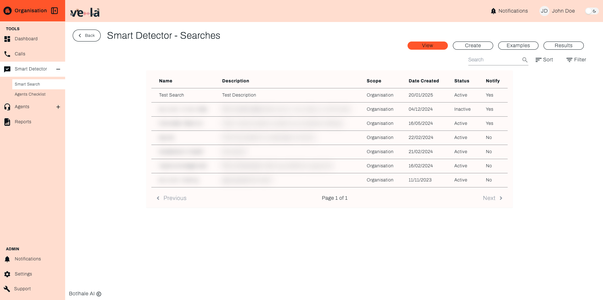

The View tab facilitates efficient navigation of the created search queries. Users can:

- **Sort:** Order entries by any table column.
- **Filter:** Apply targeted criteria based on various parameters like the query's name, description, date, and status.

:::info
Clicking on a specific search query gives you a view of the specific details of a search as seen in the following image.
:::

### Create

The Create tab of this screen allows you to create new auto search queries within your organization.

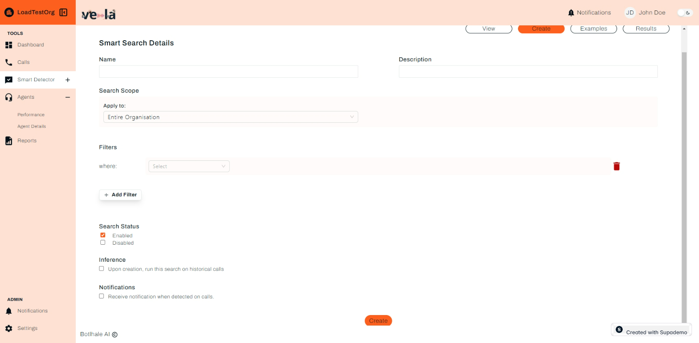

**How To create a new auto search query:**

1. Ensure you are on the Create tab of the Smart Search screen.
2. Enter the requested information outlined and exemplified below.

**2.1 Enter a Name & Description**

- Provide a unique name for the Smart Search to help identify its purpose.
- Add a description that explains what this search will analyze.
  Define the Search Scope

**2.2 Select where this search should be applied:**
- Entire `Organization (default)` – Search all calls within the system.
- Specific `Teams or Departments` – Restrict the search to certain groups.

**2.3Apply Filters**

- Click `Add Filter` to narrow down the search.
- Use filters like:
- Call Duration – Find calls shorter or longer than a specific time.
- Agent ID – Focus on calls handled by certain agents.
- Topics or Keywords – Search for specific customer queries or complaints.

**2.4 Enable Search Status**

- Enabled (checked) – Activates the search immediately.
- Disabled – Saves the search without running it.

**2.5  Advanced Options**

- Inference – Runs the search on historical call data if enabled.
- Notifications – Sends alerts when matches are found in ongoing calls.

**2.6 Create the Search**

- Click "Create" to finalize and activate the Smart Search.

3. Your newly created auto search query appears on the View tab of the Smart Search screen.

### Templates

The Templates tab of this screen allows you to review and enable predefined auto search queries within your organization.

<!-- :::info
Insert image of the template tab once templates have been created
::: -->

:::info
Clicking on the name of a specific template brings you to a detailed view of the predefined auto search query and allows you to enable or disable the query.
:::

<!-- The Templates tab facilitates efficient navigation of the predefined search queries. Users can:

- **Sort:** Order entries by any table column.
- **Filter:** Apply targeted criteria based on various parameters like the query's name, description, and status.

## Agent Checklists

This tab allows users to create and monitor searches specifically focused on individual agents' performance, identifying trends and areas for improvement based on flagged issues.

### View
Agent-specific searches are presented on the View tab in a tabular format.

## How To Get Started - Guide

**1. Understanding the Agent Checklist Table**
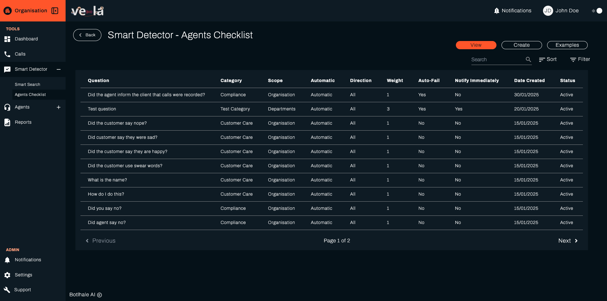

Each row represents an evaluation criterion that is automatically checked for every call. The columns include:

- **Question** – The specific behavior or action being evaluated (e.g., "Did the agent greet the customer?").
- **Category** – Indicates that the evaluation **applies to Agents**.
- **Scope** – The evaluation applies to the **entire organization or a specific team**.
- **Automatic** – Shows that the system automatically evaluates the checklist item.
- **Direction** – Determines whether the rule applies to **all calls, inbound, or outbound calls**.
- **Weight** – The importance of the question in the overall agent performance score.
- **Auto-Fail** – If marked Yes, failing this item results in an automatic fail on the checklist.
- **Date Created** – The date the rule was added.
- **Status** – Indicates whether the checklist item is **Active or Inactive**.

**2. Sort & Filter**

- Use the search bar to find specific checklist items.
- Apply filters to analyze checklist data based on teams, date ranges, or specific agent behaviors.

### Create

The Create tab of this screen allows you to create new agent search queries within your organization.

## Step-by-Step Guide to Creating a Checklist

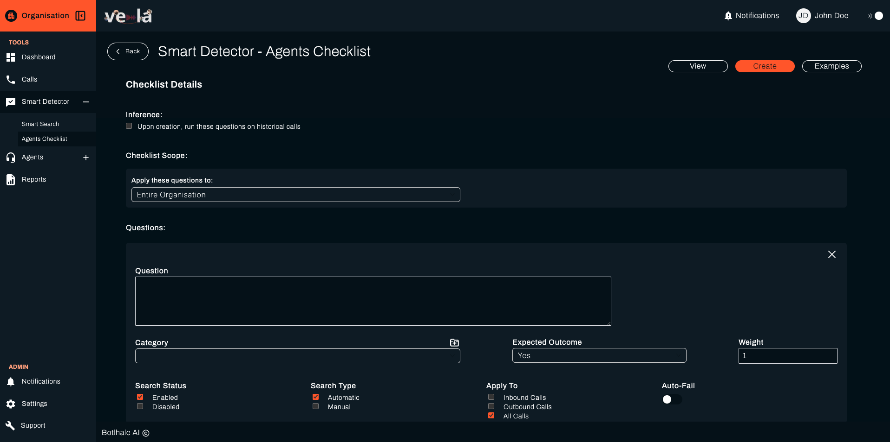

To create a new agent search query:

**Step 1: Define the Checklist Scop**

- Select Entire Organization to apply the checklist across all teams.
- Choose a specific department or team if needed.

**Step 2: Add a New Checklist Question**

- **Question:** Enter the specific evaluation criteria (e.g., "Did the agent greet the customer?").
- **Category:** Assign a category such as Customer Service, Compliance, Sales, or Support.
- **Expected Outcome:** Define the ideal response (Yes or No) to indicate compliance.
- **Weight:** Assign a numerical weight to determine the importance of the question in the overall evaluation.

**Step 3: Configure Checklist Settings**
- Search Status:

 ✅ **Enabled**– Activates the checklist immediately.

 ⬜ **Disabled** – Saves the checklist but does not apply it yet.

- Apply To

 ⬜ **Inbound Calls** – Apply this checklist only to customer-initiated calls.

 ⬜ **Outbound Calls** – Apply this checklist only to agent-initiated calls.

 ✅ **All Calls** – Apply the checklist to all interactions.

- Auto-Fail Option:

 - If enabled, failing this question will automatically mark the agent as failing the checklist.

**Step 4: Save & Apply the Checklist**

 - Click "Create" to finalize and activate the checklist.
 - The new rule will be applied to all relevant calls based on the selected criteria.

## Topic Search

This tab allows you to create and monitor user-defined topics for grouping calls based on specific themes or categories.

To create a new topic search:

1. Click on the **New Topic** button.
2. In the pop-up window that appears, enter a unique name adequately representing the topic you wish to create.
3. Click **Create Topic**.

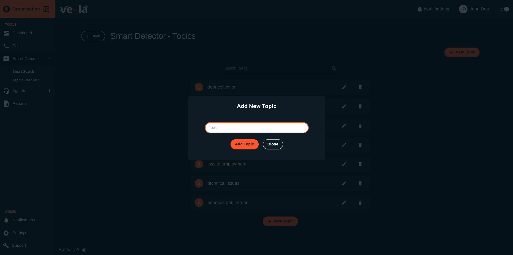

4. Your topic is created and displayed on the screen.
5. You can edit or delete existing topic searches using the Edit or Delete icons.

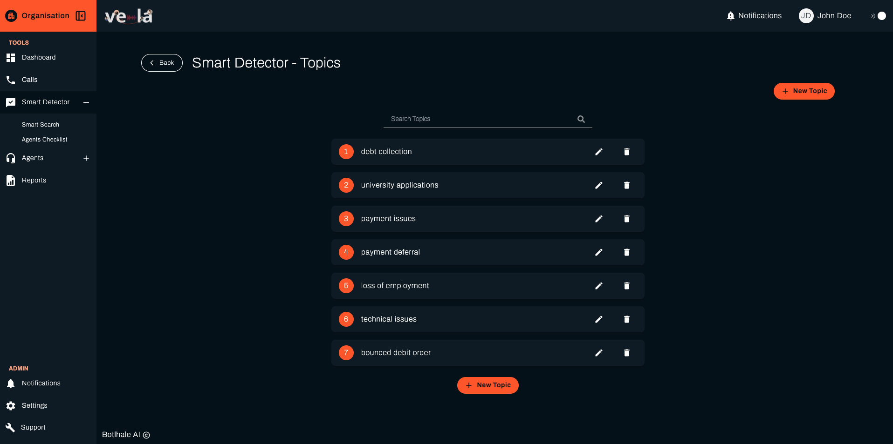

## Intent Search

This tab allows you to create and monitor searches which identify calls associated with particular intents within their dialogue flow.

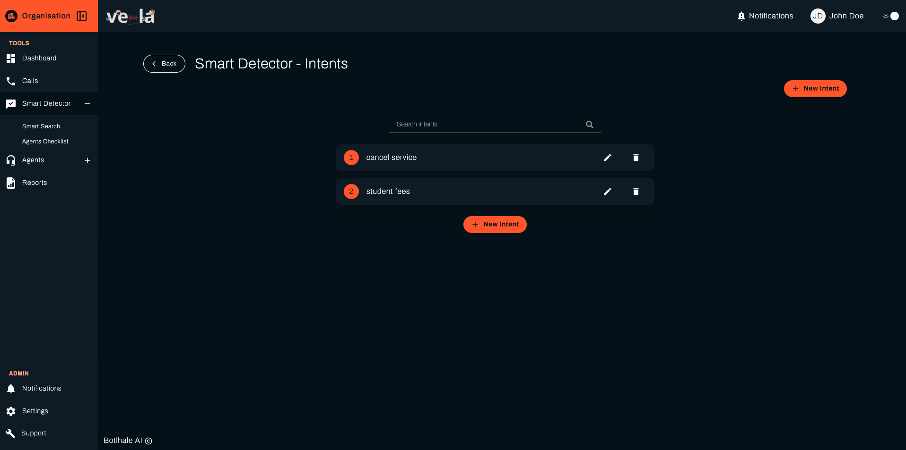

To create a new intents search:

1. Click on the **New Intent** button.
2. In the pop-up window that appears, enter a unique name adequately representing the intent you wish to create.
3. Click **Create Intent**.
4. Your intent is created and displayed on the screen.
5. You can edit or delete existing intent searches using the Edit or Delete icons.

## Keyword Search

This tab allows you to create and monitor searches which track specific keywords or phrases across the call data.

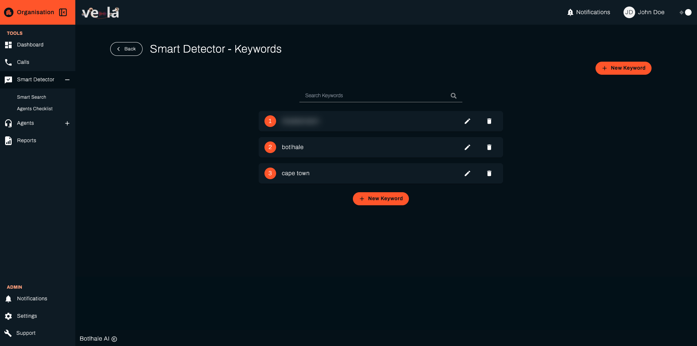

To create a new keyword search:

1. Click on the **New Keyword** button.
2. In the pop-up window that appears, enter a keyword for the search you wish to create.
3. Click **Create Keyword**.
4. Your keyword search is created and displayed on the screen.
5. You can edit or delete existing keyword searches using the Edit or Delete icons.

## Pain Points

**Understanding Pain Points**

Pain points are categorized issues that customers frequently encounter during calls. These insights help supervisors identify and address recurring challenges.

## How To Get Started - Guide
**1.Adding a New Pain Point**
1. Click the "+ New Pain Point" button.
2. Enter a title and a brief description of the issue.
3. Save the pain point, and it will appear in the list.

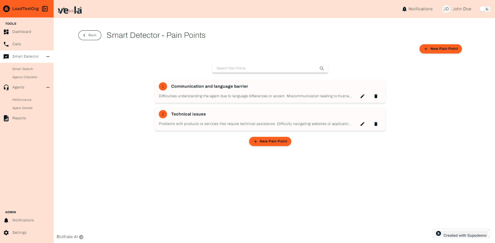

**2.Editing a Pain Point**
1. Click the pencil icon next to an existing pain point.
2. Update the description or rename the pain point.
3. Save changes to apply updates.

**3.Deleting a Pain Point**
- Click the trash bin icon to remove a pain point from the list. --> -->