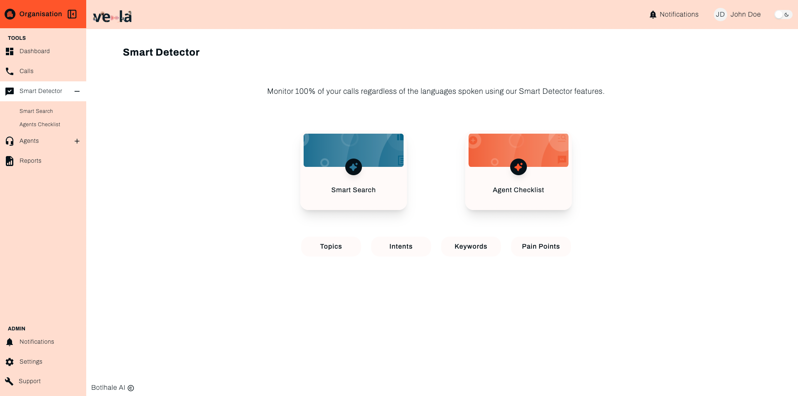
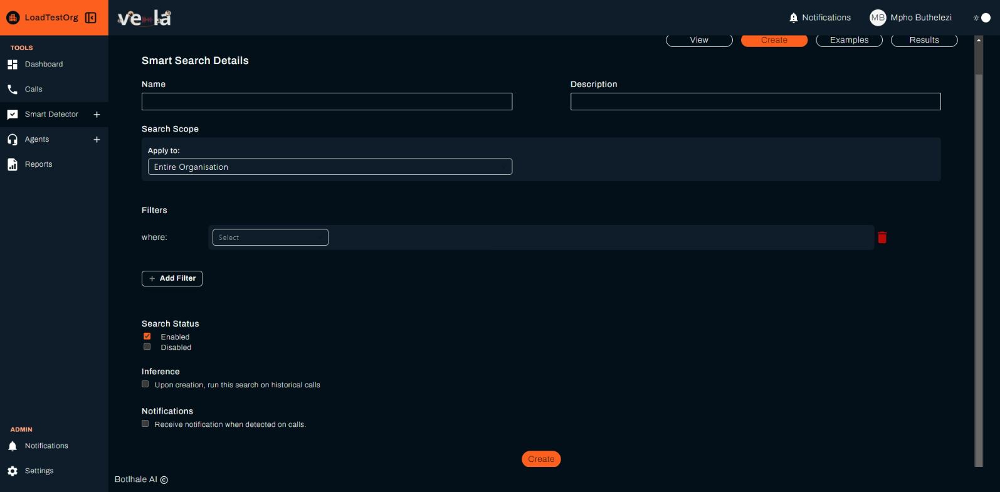
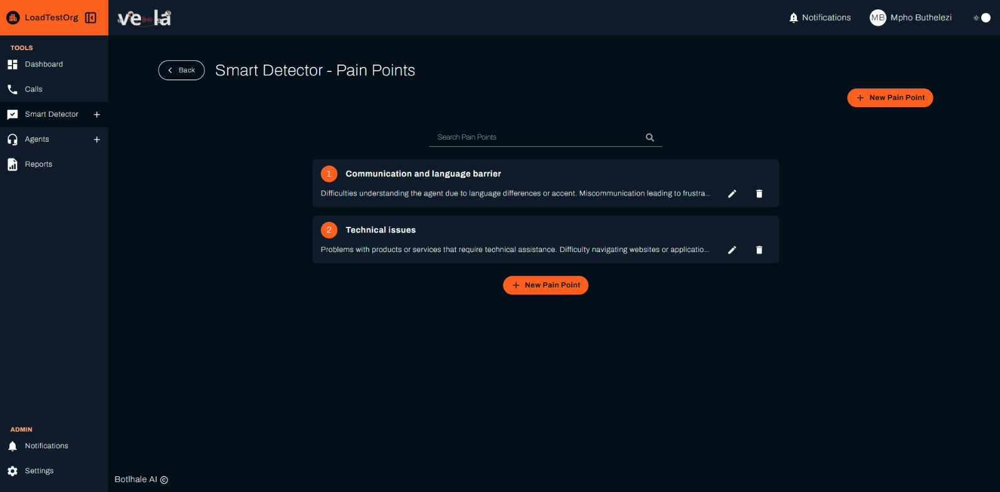

# Smart Detector

The Smart Search section harnesses advanced natural language processing (NLP) and machine learning algorithms to dissect individual calls.

The Smart Search screen serves as the central hub for managing automated searches within your call transcript data. It allows users to build complex search queries that identify the presence or absence of specific elements like words, phrases, or topics. Once activated, these pre-defined criteria continuously scan incoming transcripts, automatically flagging matches as "issues" for further investigation and analysis. The Smart Search page is organized into 4 tabs which allow users to create and enable various search queries.

## Smart Searches

This tab allows users to view and create general searches applicable to the entire corpus of call transcripts. It also offers a library of pre-built search templates for common use cases.

### View

The View tab of Vela's **Smart Search > General** screen offers a tabular view of the auto search queries created within your organization.

The View tab facilitates efficient navigation of the created search queries. Users can:

- **Sort:** Order entries by any table column.
- **Filter:** Apply targeted criteria based on various parameters like the query's name, description, date, and status.

:::info
Clicking on a specific search query gives you a view of the specific details of a search as seen in the following image.
:::

### Create

The Create tab of this screen allows you to create new auto search queries within your organization.

**How To create a new auto search query:**

1. Ensure you are on the Create tab of the Smart Search screen.
2. Enter the requested information outlined and exemplified below.

**2.1 Enter a Name & Description**

- Provide a unique name for the Smart Search to help identify its purpose.
- Add a description that explains what this search will analyze.
  Define the Search Scope

**2.2 Select where this search should be applied:**
- Entire `Organization (default)` – Search all calls within the system.
- Specific `Teams or Departments` – Restrict the search to certain groups.

**2.3Apply Filters**

- Click `Add Filter` to narrow down the search.
- Use filters like:
- Call Duration – Find calls shorter or longer than a specific time.
- Agent ID – Focus on calls handled by certain agents.
- Topics or Keywords – Search for specific customer queries or complaints.

**2.4 Enable Search Status**

- Enabled (checked) – Activates the search immediately.
- Disabled – Saves the search without running it.

**2.5  Advanced Options**

- Inference – Runs the search on historical call data if enabled.
- Notifications – Sends alerts when matches are found in ongoing calls.

**2.6 Create the Search**

- Click "Create" to finalize and activate the Smart Search.

3. Your newly created auto search query appears on the View tab of the Smart Search screen.

### Templates

The Templates tab of this screen allows you to review and enable predefined auto search queries within your organization.

<!-- :::info
Insert image of the template tab once templates have been created
::: -->

:::info
Clicking on the name of a specific template brings you to a detailed view of the predefined auto search query and allows you to enable or disable the query.
:::

The Templates tab facilitates efficient navigation of the predefined search queries. Users can:

- **Sort:** Order entries by any table column.
- **Filter:** Apply targeted criteria based on various parameters like the query's name, description, and status.

## Agent Checklists

This tab allows users to create and monitor searches specifically focused on individual agents' performance, identifying trends and areas for improvement based on flagged issues.

### View
Agent-specific searches are presented on the View tab in a tabular format.

## How To Get Started - Guide

**1. Understanding the Agent Checklist Table**

Each row represents an evaluation criterion that is automatically checked for every call. The columns include:

- **Question** – The specific behavior or action being evaluated (e.g., "Did the agent greet the customer?").
- **Category** – Indicates that the evaluation **applies to Agents**.
- **Scope** – The evaluation applies to the **entire organization or a specific team**.
- **Automatic** – Shows that the system automatically evaluates the checklist item.
- **Direction** – Determines whether the rule applies to **all calls, inbound, or outbound calls**.
- **Weight** – The importance of the question in the overall agent performance score.
- **Auto-Fail** – If marked Yes, failing this item results in an automatic fail on the checklist.
- **Date Created** – The date the rule was added.
- **Status** – Indicates whether the checklist item is **Active or Inactive**.

**2. Sort & Filter**

- Use the search bar to find specific checklist items.
- Apply filters to analyze checklist data based on teams, date ranges, or specific agent behaviors.

### Create

The Create tab of this screen allows you to create new agent search queries within your organization.

## Step-by-Step Guide to Creating a Checklist

To create a new agent search query:

**Step 1: Define the Checklist Scop**

- Select Entire Organization to apply the checklist across all teams.
- Choose a specific department or team if needed.

**Step 2: Add a New Checklist Question**

- **Question:** Enter the specific evaluation criteria (e.g., "Did the agent greet the customer?").
- **Category:** Assign a category such as Customer Service, Compliance, Sales, or Support.
- **Expected Outcome:** Define the ideal response (Yes or No) to indicate compliance.
- **Weight:** Assign a numerical weight to determine the importance of the question in the overall evaluation.

**Step 3: Configure Checklist Settings**
- Search Status:

 ✅ **Enabled**– Activates the checklist immediately.

 ⬜ **Disabled** – Saves the checklist but does not apply it yet.

- Apply To

 ⬜ **Inbound Calls** – Apply this checklist only to customer-initiated calls.

 ⬜ **Outbound Calls** – Apply this checklist only to agent-initiated calls.

 ✅ **All Calls** – Apply the checklist to all interactions.

- Auto-Fail Option:

 - If enabled, failing this question will automatically mark the agent as failing the checklist.

**Step 4: Save & Apply the Checklist**

 - Click "Create" to finalize and activate the checklist.
 - The new rule will be applied to all relevant calls based on the selected criteria.

## Topic Search

This tab allows you to create and monitor user-defined topics for grouping calls based on specific themes or categories.

To create a new topic search:

1. Click on the **New Topic** button.
2. In the pop-up window that appears, enter a unique name adequately representing the topic you wish to create.
3. Click **Create Topic**.

4. Your topic is created and displayed on the screen.
5. You can edit or delete existing topic searches using the Edit or Delete icons.

## Intent Search

This tab allows you to create and monitor searches which identify calls associated with particular intents within their dialogue flow.

To create a new intents search:

1. Click on the **New Intent** button.
2. In the pop-up window that appears, enter a unique name adequately representing the intent you wish to create.
3. Click **Create Intent**.
4. Your intent is created and displayed on the screen.
5. You can edit or delete existing intent searches using the Edit or Delete icons.

## Keyword Search

This tab allows you to create and monitor searches which track specific keywords or phrases across the call data.

To create a new keyword search:

1. Click on the **New Keyword** button.
2. In the pop-up window that appears, enter a keyword for the search you wish to create.
3. Click **Create Keyword**.
4. Your keyword search is created and displayed on the screen.
5. You can edit or delete existing keyword searches using the Edit or Delete icons.

## Pain Points

**Understanding Pain Points**

Pain points are categorized issues that customers frequently encounter during calls. These insights help supervisors identify and address recurring challenges.

## How To Get Started - Guide
**1.Adding a New Pain Point**
1. Click the "+ New Pain Point" button.
2. Enter a title and a brief description of the issue.
3. Save the pain point, and it will appear in the list.

**2.Editing a Pain Point**
1. Click the pencil icon next to an existing pain point.
2. Update the description or rename the pain point.
3. Save changes to apply updates.

**3.Deleting a Pain Point**
- Click the trash bin icon to remove a pain point from the list.