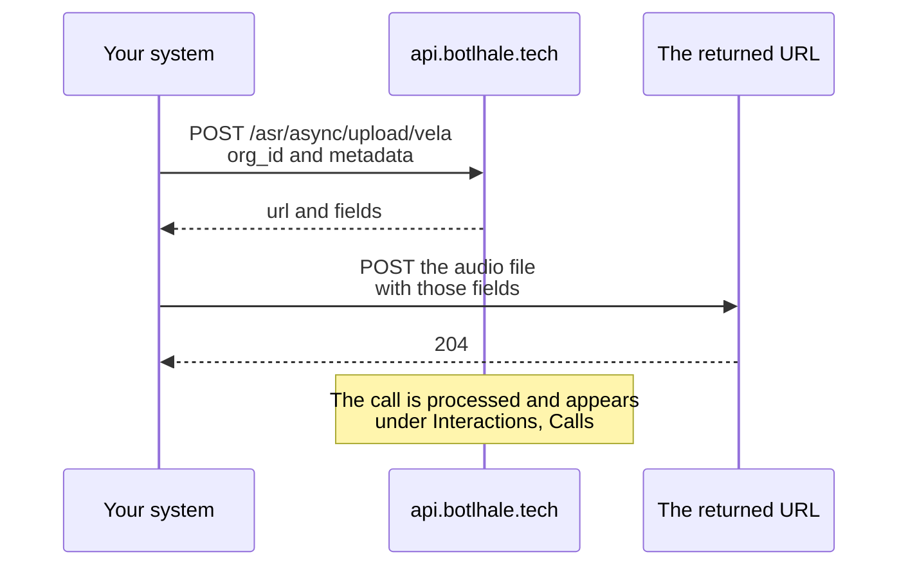

import Tabs from '@theme/Tabs';
import TabItem from '@theme/TabItem';

# API Reference
Endpoint reference for the Vela endpoints: sending call recordings and chat transcripts in, exporting analysed calls out, and checking what your organisation is entitled to. For uploading through Vela instead, see [Upload Your Data](../data-upload.md).

Botlhale's API also covers transcription, translation, text to speech, and chat bots, which sit outside Vela. Those are documented at [api-docs.botlhale.ai](https://api-docs.botlhale.ai/).

:::note Where this page and the published reference differ
[api-docs.botlhale.ai](https://api-docs.botlhale.ai/) is the authority on these endpoints. This page follows it, and adds two things it does not yet cover.

**More metadata fields.** Vela reads fields the reference does not list, and the gap is much wider for chats than for calls. All of them are documented below.

| Endpoint | Fields Vela reads that the reference leaves out |
| :--- | :--- |
| Calls | `contact`, `notifyEmail`, `validate_metadata` |
| Chats | the three above, plus `agent_name`, `team`, `department`, `direction`, `tags`, `language` |

**Lower-case `sender`.** The reference shows `Agent` capitalised on chat messages. Vela matches the value exactly, and only lower case is recognised.

Where the two disagree on anything else, the reference is right.
:::

## Authentication

Sign in once to get a refresh token, exchange it for an access token, then send that access token on every request.

### Step 1: Sign In

```
POST https://api.botlhale.tech/auth/login
```

```json
{ "email": "your-email@example.com", "password": "your-password" }
```

The reply carries everything you need to record:

```json
{
  "message": "Login successful",
  "token": "<access_token>",
  "refresh_token": "<refresh_token>",
  "org_id": "<org_id>",
  "id": "<refresh_token_entry_id>"
}
```

Keep the `refresh_token`, the `org_id`, and the `id`. The `id` identifies this particular refresh token, and it is the only way to revoke that one later.

### Step 2: Get an Access Token

```
POST https://api.botlhale.tech/auth/generate
```

```json
{ "refresh_token": "<your_refresh_token>" }
```

```json
{ "token": "<access_token>", "expires": 0 }
```

`expires` tells you how long the access token is good for, so schedule the next refresh from it rather than guessing.

### Step 3: Send the Access Token

```
Authorization: Bearer <access_token>
```

:::caution Build the refresh in from the start
Access tokens are short-lived. Refresh tokens last far longer. An integration that fetches one access token and keeps using it works until that token expires, then returns **401** on every request. That is the failure most often mistaken for a broken endpoint, and `expires` on the token tells you when it is due.

Refresh on a schedule, or whenever a request returns **401**, and treat the refresh token as the credential worth protecting.
:::

### Revoking a Refresh Token

**Each user can hold only a limited number of active refresh tokens at once.** Once you reach that limit, revoke one you are no longer using rather than generating another:

{/* UNVERIFIED: exact limit (recollection says three). Not documented at api-docs.botlhale.ai, and no auth/token-issuing source is available in this checkout. Needs engineering to confirm the number before restating it. */}

```
POST https://api.botlhale.tech/auth/revoke_token
```

```json
{ "email": "your-email@example.com", "id": "<refresh_token_entry_id>" }
```

The `id` is the one returned by `/auth/login`. Record it at sign-in, because it is the only way to revoke that token yourself. Where it has been lost, support has to clear the limit for you.

### Resetting a Password

`POST /auth/reset_password` starts a reset and sends a confirmation code. `POST /auth/confirm_reset_password` completes it, taking `email`, `confirmation_code`, and `new_password`.

### Base URLs

| Environment | Base URL |
| :--- | :--- |
| Production | `https://api.botlhale.tech` |
| Development | `https://dev.botlhale.tech` |

Send production data to the production URL. Interactions uploaded to the development environment do not appear in your Vela organisation, and recovering them means someone re-uploading them by hand, which can lose the original call dates.

The full endpoint reference, covering the wider Botlhale platform as well as Vela, is at [api-docs.botlhale.ai](https://api-docs.botlhale.ai/).

---

## Calls

:::info Authentication
Every request needs an `Authorization: Bearer <token>` header, from [Authentication](#authentication) above. Access tokens are short-lived, so refresh yours before it lapses.
:::

**Endpoint URL:**
```
https://api.botlhale.tech/asr/async/upload/vela
```

**Description:**
This endpoint accepts a call recording for processing by Vela. It validates the organisation's allocation and returns upload credentials for securely transferring the audio file.

Uploading a call takes two requests, and the audio never goes to this endpoint. The first call returns a URL and a set of form fields. You post the audio to that URL:



The second request goes to the URL the first one returned, not back to the API. Posting the file to `api.botlhale.tech` is the commonest first-integration mistake.

**Parameters:**

| Parameter      | Requirement | Description                                              |
|----------------|-------------|----------------------------------------------------------|
| org_id         | Required    | Your organisation's Vela identifier, issued with your token. It is not the organisation name, and it does not appear in Settings. |
| metadata       | Optional    | An object holding the fields below. |

Send the request as JSON, with `Content-Type: application/json`.

:::caution Use the Vela organisation identifier
If you have been issued more than one organisation ID, only the Vela one connects an upload to your Vela account. Uploading with another can succeed, returning a success code and a file key, while nothing appears under **Interactions**.

An upload that reports success but never shows up is the sign to check this first.
:::

Before your first upload, confirm with your Account Manager that your organisation is active and has minutes allocated. An organisation with no allocation set is refused with **400** `Allocation exceeded`, the same error as one that has used up its minutes.

Processing draws on that allocation, so filter out recordings too short to evaluate before you send them. A few seconds of hold music or a dropped call consumes the allocation without producing anything worth reading.

Every `metadata` field is optional.

| Field | What it sets | Format and notes |
| :--- | :--- | :--- |
| `email` | The agent, matched on their email address | |
| `agent` | The same as `email` | An alternative name for the field |
| `agent_name` | The agent, matched on their name | Case-insensitive, and the name as it appears in Vela rather than a username. Creates the agent where none matches, provided `team` exists |
| `team` | The team the call belongs to | Has to exist in Vela already. An upload never creates one |
| `department` | The department the call is attributed to | |
| `direction` | Whether the call was inbound or outbound | `inbound` or `outbound` |
| `tags` | Your own labels for the call | An array of strings, for example `["complaint", "billing"]` |
| `contact` | The customer's phone number | A string or a number, stored exactly as you send it |
| `date_of_call` | When the call took place | `DD/MM/YYYY, HH:mm:ss`, read as **Africa/Johannesburg**. Defaults to the upload time |
| `interaction_id` | Your own reference | Stored as the call's filename |
| `validate_metadata` | Rejects metadata Vela cannot use | Returns **400** instead of filling in a default |

Four of these are worth a second look:

- **`agent_name` and `team` work together.** An unmatched team is dropped, and that also stops a new agent being created. Check the spelling before sending a batch.
- **`tags` is the place for your own identifiers**, such as a queue name, a campaign, or a ticket reference. Anything with a field of its own belongs there instead, so send direction as `direction` rather than as a tag.
- **`contact` is what [Search by Phone Number](../number-search-guide.md) matches on.** Keep the format consistent across your integration, or the same customer looks like several.
- **`date_of_call` fails quietly.** A value Vela cannot parse falls back to the upload time, so every call ends up dated when you sent it rather than when it happened.

:::warning Metadata problems are silent by default
Vela records the fields it can use and fills in defaults for the ones it cannot, so the upload succeeds either way. An unmatched `team` or `department`, a `direction` that is not `inbound` or `outbound`, `tags` sent as a string rather than an array, and an unparseable `date_of_call` all behave this way.

Send `validate_metadata` to change that. Vela then returns a **400** naming the field it could not use, which is the safer setting while you are building an integration.

Either way, check the first few calls of a new integration under **Interactions → Calls** and confirm the agent, team, direction, and tags landed as you intended.
:::

:::info Allocation check
The endpoint checks the organisation's monthly allocated duration before it issues upload credentials. Where the allocation has been used up, or none is set, it returns **400** `Allocation exceeded` and no upload takes place.
:::

**Response Format**: The response carries the two things the second request needs. `url` is where the audio goes, and `fields` is a set of form values that authorise that upload.

**Sample Response:**
```json
{
    "url": "<upload_url>",
    "fields": { "<form field>": "<value>" }
}
```

Send every entry in `fields` back unchanged, as form fields, alongside the audio. Both samples below do this by spreading `fields` into the second request. The storage service issues that set and can change it, so pass through whatever arrives rather than hard-coding the keys.

**Request Example**

<Tabs>
<TabItem value="py" label="Python" default>

```py
import requests, json

# Step 1: Get upload credentials
response = requests.post(
    "https://api.botlhale.tech/asr/async/upload/vela",
    headers={
        "Authorization": "Bearer YOUR_ACCESS_TOKEN",
        "Content-Type": "application/json",
    },
    json={
        "org_id": "your_org_id",
        "metadata": {"email": "agent@example.com", "date_of_call": "15/01/2025, 14:30:00"},
    },
)
result = response.json()

# Step 2: Upload the audio file
files = [('file', ('call.wav', open('/path/to/audio/call.wav', 'rb'), 'audio/wav'))]
requests.post(result['url'], data=result['fields'], files=files)
```

</TabItem>
<TabItem value="nodejs" label="NodeJs - Request" >

```js
const request = require('request');
const fs = require('fs');

// Step 1: Get upload credentials
request.post({
  url: 'https://api.botlhale.tech/asr/async/upload/vela',
  headers: { 'Authorization': 'Bearer YOUR_ACCESS_TOKEN' },
  json: {
    org_id: 'your_org_id',
    metadata: { email: 'agent@example.com', date_of_call: '15/01/2025, 14:30:00' }
  }
}, (err, res) => {
  const { url, fields } = res.body;

  // Step 2: Upload the audio file
  request.post({
    url,
    formData: { ...fields, file: fs.createReadStream('/path/to/audio/call.wav') }
  }, (err, res) => console.log(res.body));
});
```

</TabItem>
</Tabs>

**Error Responses:**

| Status | Message | Cause |
| :--- | :--- | :--- |
| 404 | `Organisation not found` | `org_id` does not match an organisation. |
| 400 | `Missing fileName` | The request did not name the file being uploaded. |
| 400 | `Allocation exceeded` | The organisation has used its monthly duration, or has no allocation set. A newly created organisation that has not been activated returns this. |
| 400 | `Could not find agent with the provided metadata` | Raised when `validate_metadata` is set and no agent matched. |
| 400 | `Team not found` | Raised when `validate_metadata` is set and `team` did not match. |
| 400 | `Department not found` | Raised when `validate_metadata` is set and `department` did not match. |
| 400 | `Invalid date of call. Correct format is DD/MM/YYYY, HH:mm:ss` | `date_of_call` could not be parsed, and `validate_metadata` was set. |
| 400 | `Invalid interaction direction. Options are outbound or inbound` | `direction` was something else, and `validate_metadata` was set. |
| 400 | `Invalid interaction tags. Tags must be an array.` | `tags` was sent as a string, and `validate_metadata` was set. |
| 400 | `Invalid notify email` | `notifyEmail` is not a valid address, and `validate_metadata` was set. |

The wider platform's status codes, including **401** for an expired token and **429** for rate limiting, are listed under [Error Codes](https://api-docs.botlhale.ai/) in the published reference.

---

## Chats

:::info Authentication
Every request needs an `Authorization: Bearer <token>` header, from [Authentication](#authentication) above. Access tokens are short-lived, so refresh yours before it lapses.
:::

**POST Request**

```
https://api.botlhale.tech/chats/upload/vela
```

`Authorization: Bearer <ProvidedToken>`

Below are the attributes and the formats of each attribute required in the body.

| Body Params      | Type   | Requirement | Description                                              |
|------------------|--------|-------------|----------------------------------------------------------|
| org_id            | string | Required    | Organisation ID provided to you by Botlhale AI           |
| chats            | Array  | Required    | Array of message objects                                 |
| metadata         | Object | Optional    | Chat metadata. See description below.                    |

Every `metadata` field is optional.

| Field | Type | What it sets | Format and notes |
| :--- | :--- | :--- | :--- |
| `email` | string | The agent, matched on their email address | |
| `agent` | string | The same as `email` | The chat is left unassigned where no agent matches |
| `agent_name` | string | The agent, matched on their name | Case-insensitive, and the name as it appears in Vela rather than a username. Sent with `team`, it creates the agent where none matches |
| `team` | string | The team the chat is attributed to | |
| `department` | string | The department the chat is attributed to | |
| `direction` | string | Whether the chat was inbound or outbound | `inbound` or `outbound`. Defaults to `inbound` |
| `tags` | array | Your own labels for the chat | An array of strings |
| `contact` | string or number | The customer's phone number | Stored exactly as sent. See the note under Calls above |
| `date` | string | When the chat took place | `DD/MM/YYYY, HH:mm`, read as **Africa/Johannesburg**. Seconds are accepted. Defaults to the upload time |
| `language` | string | The language of every message in the chat | Overrides `language` on the individual messages. Leave it out where each message carries its own |
| `interaction_id` | string | Your own reference | Stored as the chat's filename |
| `notifyEmail` | string | An address to notify when analysis finishes | |
| `validate_metadata` | boolean | Rejects metadata Vela cannot use | Returns **400** instead of filling in a default |

Each object in `chats` is one message:

| Field | Type | Requirement | What it holds |
| :--- | :--- | :--- | :--- |
| `message` | string | Required | The text that was sent |
| `time` | string | Required | `DD/MM/YYYY, HH:mm`, read as **Africa/Johannesburg**. Seconds are accepted |
| `sender` | string | Required | `agent`, `user`, or `bot`, in lower case |
| `language` | string | Optional | The language of this message. Ignored where `metadata.language` is set |

Response time is measured from each `user` message to the `agent` or `bot` message that answers it.

:::warning Send `sender` in lower case
Vela matches these three values exactly. A capitalised `Agent` still stores the message and shows it in the transcript, so the upload looks correct. Vela reads it as neither an agent nor a bot reply, though, so the conversation drops out of the response time average.

The wider Botlhale reference shows `Agent` capitalised for this field. Lower case is what Vela reads.
:::

:::info Chat allocation
Chats are counted against a separate monthly chat allocation, not the duration allocation used for calls. Once the organisation reaches that allocation, the endpoint returns an error.
:::

**Response Format**

The endpoint accepts the request and starts the analysis in the background, so a success response means the chat was accepted rather than processed. The body carries the chat's ID:

```json
{
    "message": "Chat successfully created.",
    "id": "68f2a1c4e9b7d3a80f5c2e11"
}
```

Keep that `id` to match what you sent against what you find. To confirm the analysis finished, look under **Interactions → Chats**, or set `notifyEmail` and wait for the completion email.

| Status | Error | Cause |
|--------|-------|-------|
| 404 | `Organisation not found` | `org_id` does not match an organisation. |
| 400 | `Monthly chats allocation exceeded` | The organisation has used its chat allocation. |
| 400 | `Could not find agent with the provided metadata` | Raised when `validate_metadata` is set and no agent matched. |
| 400 | `Team not found` | Raised when `validate_metadata` is set and `team` did not match. |
| 400 | `Department not found` | Raised when `validate_metadata` is set and `department` did not match. |
| 400 | `Invalid date of chat. Correct format is DD/MM/YYYY, HH:mm:ss` | `date` could not be parsed, and `validate_metadata` was set. The message names the format with seconds, though minutes alone are accepted. |
| 400 | `Invalid interaction direction. Options are outbound or inbound` | `direction` was something else, and `validate_metadata` was set. |
| 400 | `Invalid interaction tags. Tags must be an array.` | `tags` was sent as a string, and `validate_metadata` was set. |
| 400 | `Invalid contact. Contact must be a string or number` | `contact` was another type, and `validate_metadata` was set. |
| 400 | `Invalid notify email` | `notifyEmail` is not a valid address, and `validate_metadata` was set. |
| 500 | `Something went wrong with the upload` | The request could not be read, usually because `chats` is not valid JSON. |

:::warning Metadata problems are silent
Vela matches each metadata field as it creates the chat, and drops the ones it cannot match. A field it cannot use leaves the chat created without it, so you get a success response either way. An unmatched `team`, a `direction` that is not `inbound` or `outbound`, `tags` sent as a string rather than an array, an unparseable `date`, and a malformed `notifyEmail` all behave this way.

Send `validate_metadata` to change that. Vela then returns a **400** naming the field it could not use, which is the safer setting while you are building an integration.

Check the first few chats of a new integration under **Interactions → Chats** and confirm the agent, team, direction, and tags landed as you intended.
:::

**Example of body**

```python 
chats: [ 
    { "message": "Sawubona, ngithumele imali izolo kodwa ayikafiki. Ngingenzani?", "time": "06/08/2024, 09:15:00", "sender": "user", "language": "zu-ZA" }, 
    { "message": "Sawubona! Ngingu-bot lokwesekwa. Ngiyaxolisa ukuzwa ukuthi imali ayikafiki. Ake sibheke ndawonye.", "time": "06/08/2024, 09:15:00", "sender": "bot", "language": "zu-ZA" }, 
    { "message": "Ngicela unginike inombolo yesazisi noma ikhodi yesithenjwa yokuthumela imali.", "time": "06/08/2024, 09:16:00", "sender": "bot", "language": "zu-ZA" }, 
    { "message": "Nansi inombolo yesazisi: 1234567890.", "time": "06/08/2024, 09:17:00", "sender": "user", "language": "zu-ZA" }
]

```

**Request Example**

```python 
import json
import requests

url = "https://api.botlhale.tech/chats/upload/vela"

chats = [ 
        { "message": "Sawubona, ngithumele imali izolo kodwa ayikafiki. Ngingenzani?", "time": "06/08/2024, 09:15:00", "sender": "user", "language": "zu-ZA" }, 
        { "message": "Sawubona! Ngingu-bot lokwesekwa. Ngiyaxolisa ukuzwa ukuthi imali ayikafiki. Ake sibheke ndawonye.", "time": "06/08/2024, 09:15:00", "sender": "bot", "language": "zu-ZA" }, 
        { "message": "Ngicela unginike inombolo yesazisi noma ikhodi yesithenjwa yokuthumela imali.", "time": "06/08/2024, 09:16:00", "sender": "bot", "language": "zu-ZA" }, 
        { "message": "Nansi inombolo yesazisi: 1234567890.", "time": "06/08/2024, 09:17:00", "sender": "user", "language": "zu-ZA" }
    ]
data = {
    'org_id': 'your_org_id',
    'chats': chats,
}

headers = {
  'Authorization': 'Bearer YOUR_ACCESS_TOKEN',
  'Content-Type': 'application/json',
}

response = requests.post(url, json=data, headers=headers)

print(response.status_code)
print(response.text) 
print(json.dumps(response.json(), indent=4))
```

## Exporting Calls

Pulls analysed calls back out of Vela, for reporting in your own tools rather than reading them in the platform.

```
GET https://api.botlhale.tech/calls/export/vela
```

Everything is a query parameter, and only `org_id` is required:

| Parameter | Description |
| :--- | :--- |
| `org_id` | Required. Your Vela organisation identifier |
| `start_date` and `end_date` | The period to export, formatted `DD-MM-YYYY` (for example `01-11-2025`) |
| `departments`, `teams`, `agents` | Comma-separated names or IDs to narrow the export |
| `min_score` and `max_score` | Only calls scoring inside the range |
| `page` and `count_per_page` | Paging, for exports too large to take in one request |

Note the date format. It is `DD-MM-YYYY` here, with dashes, while `date_of_call` on upload is `DD/MM/YYYY, HH:mm:ss` with slashes. The two are not interchangeable.

The reply does not hold the calls themselves. It gives you a link to fetch them:

```json
{
  "file_name": "Exports/calls_export_..._20251125_102753.json",
  "presigned_url": "https://storage.example.com/exports/calls_export.json?signature=...",
  "status": "success"
}
```

Download `presigned_url` to get the export. Presigned links expire, so fetch the file as part of the same job rather than storing the link to use later.

:::tip Scoring reports without a person exporting them
This is the endpoint to build a recurring report on. Filter by team or agent, take a score range, and page through the result rather than exporting the whole period at once.

For a one-off, the **Export** control on the Agent Scorecard **Results** tab is quicker. See [Build an Agent Scorecard](../agent-scorecard-guide.md#4-read-the-results).
:::

---

## Checking Your Organisation

Reports what your organisation is entitled to and how much of it has been used.

```
GET https://api.botlhale.tech/organisations/vela/{OrgID}
```

The reply covers the limits this documentation refers to elsewhere:

| Field | What it tells you |
| :--- | :--- |
| `active` | Whether the organisation is activated. Uploads against an inactive organisation do not process |
| `monthlyAllocatedDuration` and `currentDurationUse` | The allocation in seconds, and how much has been used |
| `stopWhenAllocationExceeded` | Whether processing halts once the allocation runs out |
| `scorecardLimit`, `smartSearchLimit`, `painPointsLimit` | The caps your plan sets |
| `coachingEnabled` | Whether the Coaching add-on is on |
| `numberOfActiveAgents`, `numberOfTeams`, `numberOfDepartments` | The size of your structure |
| `users` | Each user's name, email, role, access level, team, department, and whether they can view redactions |

Administrators see the same two figures under **Settings → Organisations → This Org**, as **Allocated Monthly Duration** and **Current Duration Usage**. See [Organisation Configuration](../settings-config/organisation-configuration.md).

Checking `currentDurationUse` against `monthlyAllocatedDuration` before a large batch is the reliable way to know whether it processes. It answers the same question as asking your Account Manager, without waiting for a reply.

---

## Related

- [Upload Your Data](../data-upload.md): upload through Vela instead of the API
- [System Requirements](../getting-started/system-requirements.md): the formats and size limits these endpoints accept
- [Security and Compliance](../security-compliance.md): where the recordings and transcripts you send are held, and how they are encrypted

## Need Help?

**Contact Support:** support@botlhale.ai