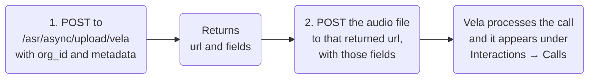

import Tabs from '@theme/Tabs';
import TabItem from '@theme/TabItem';

# API Reference
Endpoint reference for sending call recordings and chat transcripts to Vela programmatically. For uploading through Vela instead, see [Upload Your Data](../data-upload.md).

## Authentication

Sign in once to get a pair of tokens, then use the access token on every request.

```
POST https://api.botlhale.tech/auth/login
```

```json
{ "email": "your@email.com", "password": "your_password" }
```

The reply carries both tokens and your organisation identifier:

```json
{ "token": "<access_token>", "refresh_token": "<refresh_token>", "org_id": "XXXXXXXX" }
```

Keep both. Send the access token on every request:

```
Authorization: Bearer <access_token>
```

### Refreshing the Access Token

**The access token expires 24 hours after it is issued.** The refresh token is long-lived, so exchange it for a new access token rather than signing in again:

```
POST https://api.botlhale.tech/auth/generate
```

```json
{ "refresh_token": "<your_refresh_token>" }
```

```json
{ "token": "<new_access_token>" }
```

:::caution Build the refresh in from the start
An integration that fetches one access token and keeps using it works for a day and then stops. Refresh on a schedule, or when a request comes back unauthorised, and treat the refresh token as the credential worth protecting.
:::

### Base URLs

| Environment | Base URL |
| :--- | :--- |
| Production | `https://api.botlhale.tech` |
| Development | `https://dev.botlhale.tech` |

Send production data to the production URL. Interactions uploaded to the development environment do not appear in your Vela organisation, and recovering them means someone re-uploading them by hand, which can lose the original call dates.

The full endpoint reference is at [api-docs.botlhale.ai](https://api-docs.botlhale.ai/).

---

## Calls

:::info Authentication
Every request needs an `Authorization: Bearer <token>` header, from [Authentication](#authentication) above. The token expires after 24 hours.
:::

**Endpoint URL:**
```
https://api.botlhale.tech/asr/async/upload/vela
```

**Description:**
This endpoint accepts a call recording for processing by Vela. It validates the organisation's allocation and returns upload credentials for securely transferring the audio file.

Uploading a call takes two requests, and the audio never goes to this endpoint. The first call returns a URL and a set of form fields. You post the audio to that URL:



**Parameters:**

| Parameter      | Requirement | Description                                              |
|----------------|-------------|----------------------------------------------------------|
| org_id         | Required    | Your organisation's Vela identifier, issued with your token. It is not the organisation name, and it does not appear in Settings. |
| metadata       | Optional    | The information below, as a JSON string in a form field. See the note below. |

:::caution Two things that fail quietly at the start of an integration
**Send the request as form data, not as a JSON body.** `metadata` is a form field carrying a JSON string, which is why the examples below use `json.dumps` and `JSON.stringify`. A JSON body is not parsed, and the reply is `Please provide org_id` even though you sent one.

**Use the Vela organisation identifier.** If you have been issued more than one, only the Vela one connects an upload to your Vela account. Uploading with another can succeed, returning a success code and a file key, while nothing appears under **Interactions**. An upload that reports success but never shows up is the sign to check this first.
:::

Before your first upload, confirm with your Account Manager that your organisation is active and has minutes allocated. Uploads against an organisation that is not yet activated do not process, and the failure is not visible from the API response.

Processing draws on that allocation, so filter out recordings too short to evaluate before you send them. A few seconds of hold music or a dropped call consumes the allocation without producing anything worth reading.

All `metadata` fields are optional:

- **email**: Email address of the agent who participated in the call.
- **agent**: Alternative to `email`: also matched on the agent's email address.
- **agent_name**: The agent's name, matched against agent records case-insensitively. Use the name as it appears in Vela (for example `John Smith`), not a username. Where no agent matches, Vela creates one, but only when the `team` you sent already exists. Check the spelling before you send a batch.
- **team**: The team the call belongs to. The team has to exist in Vela already, because an upload never creates one. A team Vela cannot match is dropped, and that also stops a new agent being created from `agent_name`.
- **department**: Department the call should be attributed to.
- **direction**: Call direction: `inbound` or `outbound`.
- **tags**: Classification labels for the call, as an array of strings (for example `["complaint", "billing"]`). Tags are also where identifiers from your own systems belong, such as a queue name, a campaign, or a ticket reference, so they travel with the interaction and can be filtered on in Vela. Anything with a field of its own belongs in that field instead, so send call direction as `direction` rather than as a tag.
- **contact**: The customer's phone number, as a string or a number. Vela stores it exactly as you send it, so keep the format consistent across your integration. This is what [Search by Phone Number](../number-search-guide.md) matches on, and sending it here is what makes an interaction findable by number.
- **date_of_call**: When the call took place, formatted `DD/MM/YYYY, HH:mm:ss` (for example `15/01/2025, 14:30:00`). If omitted, the upload time is used. Send the exact format: a value Vela cannot parse falls back to the upload time, so the call is dated when you sent it rather than when it happened.
- **interaction_id**: Your own reference for the call. It is stored as the call's filename.
- **validate_metadata**: Set it to make Vela reject a request whose metadata it cannot use, instead of accepting it and filling in a default. See the note below.

:::warning Metadata problems are silent by default
Vela records the fields it can use and fills in defaults for the ones it cannot, so the upload succeeds either way. An unmatched `team` or `department`, a `direction` that is not `inbound` or `outbound`, `tags` sent as a string rather than an array, and an unparseable `date_of_call` all behave this way.

Send `validate_metadata` to change that. Vela then returns a **400** naming the field it could not use, which is the safer setting while you are building an integration.

Either way, check the first few calls of a new integration under **Interactions → Calls** and confirm the agent, team, direction, and tags landed as you intended.
:::

:::info Allocation check
The API verifies that the organisation is within its monthly allocated duration. If the allocation has been exceeded, an error is returned.
:::

**Response Format**: The response carries the two things the second request needs. `url` is where the audio goes, and `fields` is a set of form values that authorise that upload.

**Sample Response:**
```json
{
    "url": "<upload_url>",
    "fields": { "<form field>": "<value>" }
}
```

Send every entry in `fields` back unchanged, as form fields, alongside the audio. Both samples below do this by spreading `fields` into the second request. The storage service issues that set and can change it, so pass through whatever arrives rather than hard-coding the keys.

**Request Example**

<Tabs>
<TabItem value="py" label="Python" default>

```py
import requests, json

# Step 1: Get upload credentials
response = requests.post(
    "https://api.botlhale.tech/asr/async/upload/vela",
    headers={"Authorization": "Bearer YOUR_API_TOKEN"},
    data={
        "org_id": "your_org_id",
        "metadata": json.dumps({"email": "agent@example.com", "date_of_call": "15/01/2025, 14:30:00"})
    }
)
result = response.json()

# Step 2: Upload the audio file
files = [('file', ('call.wav', open('/path/to/audio/call.wav', 'rb'), 'audio/wav'))]
requests.post(result['url'], data=result['fields'], files=files)
```

</TabItem>
<TabItem value="nodejs" label="NodeJs - Request" >

```js
const request = require('request');
const fs = require('fs');

// Step 1: Get upload credentials
request.post({
  url: 'https://api.botlhale.tech/asr/async/upload/vela',
  headers: { 'Authorization': 'Bearer YOUR_API_TOKEN' },
  formData: {
    org_id: 'your_org_id',
    metadata: JSON.stringify({ email: 'agent@example.com', date_of_call: '15/01/2025, 14:30:00' })
  }
}, (err, res) => {
  const { url, fields } = JSON.parse(res.body);

  // Step 2: Upload the audio file
  request.post({
    url,
    formData: { ...fields, file: fs.createReadStream('/path/to/audio/call.wav') }
  }, (err, res) => console.log(res.body));
});
```

</TabItem>
</Tabs>


## Chats

:::info Authentication
Every request needs an `Authorization: Bearer <token>` header, from [Authentication](#authentication) above. The token expires after 24 hours.
:::

**POST Request**

```
https://api.botlhale.tech/chats/upload/vela
```

`Authorization: Bearer <ProvidedToken>`

Below are the attributes and the formats of each attribute required in the body.

| Body Params      | Type   | Requirement | Description                                              |
|------------------|--------|-------------|----------------------------------------------------------|
| org_id            | string | Required    | Organisation ID provided to you by Botlhale AI           |
| chats            | Array  | Required    | Array of message objects                                 |
| metadata         | Object | Optional    | Chat metadata. See description below.                    |

Metadata object: 
- **email** (string): Email address of the agent in the chat.
- **agent** (string): Alternative to `email`: also matched on the agent's email address. If no agent is matched, the chat is left unassigned.
- **agent_name** (string): The agent's name, matched case-insensitively. Use the name as it appears in Vela, not a username. Sent together with `team`, it creates the agent when no existing record matches, so check the spelling before you send a batch.
- **team** (string): Team the chat should be attributed to.
- **department** (string): Department the chat should be attributed to.
- **direction** (string): `inbound` or `outbound`. Defaults to `inbound`.
- **tags** (array): Classification labels for the chat, as an array of strings.
- **contact** (string or number): The customer's phone number, stored exactly as sent. See the note under the calls endpoint above.
- **date** (string): When the chat took place, formatted `DD/MM/YYYY, HH:mm:ss` (for example `15/01/2025, 14:30:00`). If omitted, the upload time is used. Send the exact format: a value Vela cannot parse falls back to the upload time, so the chat is dated when you sent it rather than when it happened.
- **language** (string): Language code applied to every message in the chat. When set, it overrides the `language` on the individual message objects. Leave it out if your messages carry their own language codes.
- **interaction_id** (string): Your own reference for the chat. It is stored as the chat's filename.
- **notifyEmail** (string): An email address to notify when the chat's analysis is complete.
- **validate_metadata** (boolean): Set it to make Vela reject a request whose metadata it cannot use, instead of accepting it and filling in a default. See the note below.


Message object:

- **message** (string): Text that was sent.
- **time** (string): Format `DD/MM/YYYY, HH:mm:ss`.
- **sender** (string): `agent`, `user`, or `bot`. Response time is measured from each `user` message to the `agent` or `bot` message that answers it.
- **language** (string): Language code. Optional, and ignored when `metadata.language` is set.

:::info Chat allocation
Chats are counted against a separate monthly chat allocation, not the duration allocation used for calls. Once the organisation reaches that allocation, the endpoint returns an error.
:::

**Response Format**

The endpoint accepts the request and starts the analysis in the background, so a success response means the chat was accepted rather than processed. The body carries the chat's ID:

```json
{
    "message": "Chat successfully created.",
    "id": "68f2a1c4e9b7d3a80f5c2e11"
}
```

Keep that `id` to match what you sent against what you find. To confirm the analysis finished, look under **Interactions → Chats**, or set `notifyEmail` and wait for the completion email.

| Status | Error | Cause |
|--------|-------|-------|
| 404 | `Organisation not found` | `org_id` does not match an organisation. |
| 400 | `Monthly chats allocation exceeded` | The organisation has used its chat allocation. |
| 400 | `Invalid date of chat. Correct format is DD/MM/YYYY, HH:mm:ss` | `date` could not be parsed, and `validate_metadata` was set. |
| 500 | `Something went wrong with the upload` | The request could not be read, usually because `chats` is not valid JSON. |

:::warning Metadata problems are silent
Vela matches each metadata field as it creates the chat, and drops the ones it cannot match. A field it cannot use leaves the chat created without it, so you get a success response either way. An unmatched `team`, a `direction` that is not `inbound` or `outbound`, `tags` sent as a string rather than an array, an unparseable `date`, and a malformed `notifyEmail` all behave this way.

Send `validate_metadata` to change that. Vela then returns a **400** naming the field it could not use, which is the safer setting while you are building an integration.

Check the first few chats of a new integration under **Interactions → Chats** and confirm the agent, team, direction, and tags landed as you intended.
:::

**Example of body**

```python 
chats: [ 
    { "message": "Sawubona, ngithumele imali izolo kodwa ayikafiki. Ngingenzani?", "time": "06/08/2024, 09:15:00", "sender": "user", "language": "zu-ZA" }, 
    { "message": "Sawubona! Ngingu-bot lokwesekwa. Ngiyaxolisa ukuzwa ukuthi imali ayikafiki. Ake sibheke ndawonye.", "time": "06/08/2024, 09:15:00", "sender": "bot", "language": "zu-ZA" }, 
    { "message": "Ngicela unginike inombolo yesazisi noma ikhodi yesithenjwa yokuthumela imali.", "time": "06/08/2024, 09:16:00", "sender": "bot", "language": "zu-ZA" }, 
    { "message": "Nansi inombolo yesazisi: 1234567890.", "time": "06/08/2024, 09:17:00", "sender": "user", "language": "zu-ZA" }
]

```

**Request Example**

```python 
import json
import requests

url = "https://api.botlhale.tech/chats/upload/vela"

chats = [ 
        { "message": "Sawubona, ngithumele imali izolo kodwa ayikafiki. Ngingenzani?", "time": "06/08/2024, 09:15:00", "sender": "user", "language": "zu-ZA" }, 
        { "message": "Sawubona! Ngingu-bot lokwesekwa. Ngiyaxolisa ukuzwa ukuthi imali ayikafiki. Ake sibheke ndawonye.", "time": "06/08/2024, 09:15:00", "sender": "bot", "language": "zu-ZA" }, 
        { "message": "Ngicela unginike inombolo yesazisi noma ikhodi yesithenjwa yokuthumela imali.", "time": "06/08/2024, 09:16:00", "sender": "bot", "language": "zu-ZA" }, 
        { "message": "Nansi inombolo yesazisi: 1234567890.", "time": "06/08/2024, 09:17:00", "sender": "user", "language": "zu-ZA" }
    ]
data = {
    'org_id': 'your_org_id',
    'chats': json.dumps(chats)

    
}

headers = {
  'Authorization': 'Bearer YOUR_API_TOKEN',
}

response = requests.post(url, data=data, headers=headers)

print(response.status_code)
print(response.text) 
print(json.dumps(response.json(), indent=4))
```


## Related

- [Upload Your Data](../data-upload.md): upload through Vela instead of the API
- [System Requirements](../getting-started/system-requirements.md): the formats and size limits these endpoints accept
- [Security and Compliance](../security-compliance.md): where the recordings and transcripts you send are held, and how they are encrypted

## Need Help?

**Contact Support:** support@botlhale.ai