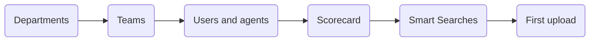

# Best Practices

What experienced teams do at each stage. Start from the section you need.

| If you are | Go to |
| :--- | :--- |
| Setting Vela up | [1. Setting Up](#1-setting-up) |
| Running QA each day | [2. Running QA](#2-running-qa) |
| Coaching from scores | [3. Coaching](#3-coaching) |
| Loading historical calls | [4. Bulk Upload](#4-bulk-upload) |
| Sending figures to other people | [5. Reports](#5-reports) |
| Keeping a working setup healthy | [6. Maintenance](#6-maintenance) |

---

## 1. Setting Up

Build in this order. Each step needs the one before it.

| Step | Do this | Because |
| :--- | :--- | :--- |
| **Departments and teams** | Mirror your real reporting lines. Give every team a real name | Team leads see only their own teams. A team called "Other" makes its data meaningless |
| **Scorecard** | Build it before the first upload | Interactions are scored as they arrive. Questions added later apply to new interactions only |
| **Smart Searches** | Build your compliance searches before the first upload | A search matches interactions that arrive after it. To cover your archive, turn on **Historical Search** as you create it |

:::caution Historical Search is set once
**Historical Search** appears only while you create a search. Editing a search later cannot add it, so a search that needs to cover past interactions has to be built with it on.
:::

### Writing Scorecard Questions

Write questions that a reviewer and the AI answer the same way.

| Write this | Rather than this |
| :--- | :--- |
| Did the agent verify the customer's identity before proceeding? | Was the agent professional? |
| Did the agent state the cancellation notice period? | Did the agent explain the policy well? |
| If the customer disputed the charge, did the agent explain the dispute process? | Did the agent handle the dispute? |

Three rules cover most of it:

1. **Ask whether the right thing happened**, and set **Expected Outcome** to **Yes**. Scoring is more accurate this way, even where your internal scorecard is written in the negative.
2. **Name the specific action.** "Verify identity" is in the transcript. "Professional" is a judgement that moves between reviewers.
3. **Say when a question applies**, so the AI answers N/A on the calls it does not cover.

Use **Auto-Fail** only where one failure invalidates the whole interaction, such as a missed regulatory disclosure.

Build a separate scorecard for each set of procedures. Inbound support and outbound sales need different questions, and one scorecard covering both produces scores nobody can act on.

---

## 2. Running QA

### Every day

1. **Start with your unresolved alerts.** Vela has already flagged these, so they beat sampling the call list.
2. **Sort Smart Searches by Results, descending.** The top search is triggering most, which usually means a systemic issue rather than one agent.
3. **Check the Dashboard for movement.** Look for falling scores and for **Sentiment Distribution in Interactions** turning negative.
4. **Close the loop on every interaction you open.** Comment, tag the agent with an @ mention, mark as reviewed.

Step 4 is the one teams skip. An interaction marked reviewed with no comment is a QA record with no coaching in it.

### Every week

| Check | What it tells you |
| :--- | :--- |
| Team average against last week | The direction of travel |
| Alert volume, up or down | Whether a launch, process change, or training explains it |
| Widest gaps between automatic and manual scores | The scorecard wording needs work, or those calls need human judgement |
| One search triggering for the same agent | A pattern worth a conversation rather than more alerts |

Read three or four weeks before acting. One week of movement is usually variation.

---

## 3. Coaching

| Do this | Instead of |
| :--- | :--- |
| "When the customer asked about cancellation, the notice period was left out. The procedure requires you to confirm it." | "You weren't very clear" |
| Comment within a day of the call | Comment at the end of the month |
| Tag the agent with an @ mention | Leaving the comment untagged |
| Recognise a call that went well | Commenting only on failures |

An untagged comment raises no notification, so the agent may never read it.

**Coach patterns, not incidents.** One failed question on one call is often an unusual call. The same question failed across five of the last ten calls is a skill gap.

**Override a score only where the AI missed context**, such as a required phrase said in different words. Record why in a comment. Overrides that all move the same way point at scorecard wording that needs fixing.

---

## 4. Bulk Upload

The steps are in [Upload Your Data](../data-upload.md). This is what makes a large load go well.

1. **Test five to ten files first.** Checking the format, agent names, teams, and departments on a small batch takes minutes. Finding a systematic error after thousands of files means uploading them again.
2. **Build the CSV from the downloaded template.** Column name mismatches cause most bulk failures.
3. **Match `agent_name`, `team`, and `department` to records that already exist.** Use the agent's name as it appears on their record, rather than a username such as `john.smith`. Values Vela cannot match are dropped, and the interaction is attributed to nobody.
4. **Upload outside busy hours**, and keep the page open until the batch finishes.
5. **Keep the source audio** until the results screen is clean.
6. **Read the results screen the same day.** A failure is easier to explain now than in a fortnight.

---

## 5. Reports

- **Schedule a report to arrive before the meeting that uses it**, so people read it beforehand.
- **Send figures with a sentence of context.** A score on its own reads as a warning rather than coaching.
- **Remove reports nobody acts on.** A few reports people use beat a library nobody opens.

---

## 6. Maintenance

| Review | How often | Look for |
| :--- | :--- | :--- |
| Scorecard | Quarterly, and after any procedure change | Questions that no longer match how the work is done |
| Smart Searches | Monthly | Searches nobody acts on, and phrase lists that have fallen behind how customers speak |
| User access | Twice a year, and after any team change | People who changed teams and kept their old access, and accounts of people who have left |

Note the date whenever you change a scorecard. Trends that cross that date need reading with the change in mind.

Deactivate a Smart Search before deleting it. A short spell inactive confirms nobody relied on it.

---

## Related

- [Administrator Setup](../getting-started/quick-start/administrator-setup.md): the setup steps themselves
- [Build an Agent Scorecard](../agent-scorecard-guide.md): building and editing questions
- [Set Up Smart Search](../smart-search-guide.md): building and managing searches
- [Review and Score Interactions](../features/quality-assurance-tools.md): the daily review workflow
- [Troubleshooting Guide](../support/troubleshooting-guide.md): fixing what goes wrong

---

## Need Help?

**Contact Support:** support@botlhale.ai
