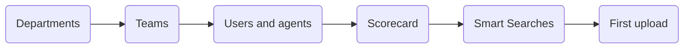

# Best Practices
Recommendations drawn from Vela's core workflows, covering setup through to day-to-day QA. Each section stands on its own, so start from the one you need.

| If you are | Read |
| :--- | :--- |
| Setting Vela up for the first time | [Setting Up for Success](#setting-up-for-success) |
| Running QA day to day | [Daily and Weekly QA Workflows](#daily-and-weekly-qa-workflows) |
| Turning scores into improvement | [Coaching and Agent Development](#coaching-and-agent-development) |
| Loading historical calls | [Bulk Upload](#bulk-upload-best-practices) |
| Sending figures to other people | [Report Scheduling and Distribution](#report-scheduling-and-distribution) |
| Keeping a working setup healthy | [System Maintenance](#system-maintenance) |

---

## Setting Up for Success

Set Vela up in dependency order. Each step needs the one before it, and working out of order means going back to redo it.

The order matters most at the two ends. A team cannot be assigned to a department that does not exist, and a Smart Search only matches interactions uploaded after it was created, unless you turn on **Historical Search** when you build it.

### Organisational Structure

Mirror your real-world reporting lines when you create departments and teams in Vela. Create departments and teams before you add any users. Users are assigned to teams, and teams belong to departments. Accurate structure at this stage ensures that team leads see only the data for their teams, that reports are organised meaningfully, and that Smart Search scopes match the correct groups of agents.

Avoid creating catch-all teams (such as "Other" or "Misc"). If a team changes its composition or structure, update it in Vela at the same time. Data scoped to a team that no longer reflects the real structure becomes difficult to interpret.

### Scorecard Design

The scorecard decides how every interaction is scored, so design it before your first call is uploaded rather than adjusting it once results are in.

Write questions that both the AI and a human reviewer would answer the same way:

| Write this | Rather than this | Why |
| :--- | :--- | :--- |
| Did the agent verify the customer's identity before proceeding? | Was the agent professional? | The first has an answer in the transcript. The second is a judgement that moves between reviewers |
| Did the agent state the cancellation notice period? | Did the agent explain the policy well? | Names the specific thing that was said or missed |
| If the customer disputed the charge, did the agent explain the dispute process? | Did the agent handle the dispute? | Says when the question applies, so the AI can answer N/A on the calls it does not |

Phrase questions positively, asking whether the right thing happened, and set **Expected Outcome** to **Yes**. Partners running Vela at scale find scoring more accurate this way, even where their own internal scorecard is written in the negative.

Group related questions into categories, such as Opening, Compliance, Handling, and Closing, and weight the categories by what your organisation actually cares about. Weights are relative to each other, so what matters is the balance across your own questions rather than any external scale.

Use Auto-Fail only where a single failure invalidates the interaction on its own, such as a regulatory disclosure that was never given.

Scope each scorecard to the teams it applies to. Where teams work to different procedures, such as inbound support against outbound sales, build a scorecard for each. One catch-all scorecard with broadly worded criteria produces scores nobody can act on.

### Smart Search Configuration

Create your most important Smart Searches, particularly the compliance-critical ones, before your first calls are uploaded. A search matches only the interactions uploaded after it is created, unless you enable **Historical Search** and choose whether it covers all historical calls or a specific date range. That option is available only when you create the search, and cannot be added by editing it later, so a search that needs to cover your archive has to be built with it on.

For compliance monitoring, write search phrases around the specific language your agents are required to use or prohibited from using. For customer experience monitoring, build phrase lists around the real language your customers use when frustrated, escalating, or requesting specific actions. Review the results after your first batch of calls and refine the phrases based on what you see. Early false positives are a normal part of tuning.

Scope each search to the people its results are actionable by. An organisation-wide compliance search suits a policy that applies to everyone. A search specific to one product line or team should be scoped to that team or department so that results are actionable by the right people.

Keep the number of active searches manageable. Your plan caps how many you can hold, and that is five unless your plan sets a different number. When you reach the limit, **New Smart Search** is greyed out with no message explaining why, so spend the allowance on your compliance-critical searches first. A small set of well-scoped searches produces more actionable alerts than a large set of broad ones. See [Search Management](../smart-search-guide.md#search-management).

---

## Daily and Weekly QA Workflows

### Daily QA Routine

Work in this order. It starts from what Vela has already flagged, rather than from a list you sample by hand.

1. **Open your unresolved alerts first.** These are interactions your own searches have flagged, which makes them a better starting point than the call list.
2. **Sort Smart Searches by Results, descending.** The most frequently triggered searches come to the top, and a search triggering repeatedly usually points at something systemic rather than one agent.
3. **Check the Dashboard for movement.** Look for agents whose scores are falling day over day, or whose **Sentiment Distribution in Interactions** is shifting negative.
4. **Close the loop on every interaction you review.** Add a coaching comment, tag the agent with an @ mention so they are notified, and mark it as reviewed.

Step 4 is the one that gets skipped. An interaction marked reviewed with no comment on it is a QA record with no coaching in it, and the agent learns nothing from the time you spent.

### Weekly QA Analysis

Once a week, read across the period rather than interaction by interaction:

| What to check | What it tells you |
| :--- | :--- |
| Team average against last week | Whether the direction of travel has changed |
| Alert volume, up or down | Whether a known event explains it, such as a launch, a process change, or training |
| The widest gaps between automatic and manual scores | Either the scorecard wording needs work, or those calls genuinely need human judgement |
| Any search triggering for the same agent repeatedly | A pattern worth a direct conversation rather than more alerts |

Read several weeks before concluding anything. A single week moving in either direction is usually variation, and acting on it produces changes that are reversed a fortnight later.

---

## Coaching and Agent Development

### Making Feedback Actionable

Feedback that agents can act on is time-stamped, specific, and linked to a concrete behaviour rather than a general impression. Rather than noting that an agent "wasn't very clear", point to the moment. For example: "When the customer asked about the cancellation policy, the explanation was incomplete. The procedure requires you to confirm the notice period and any charges."

Balance corrective feedback with positive reinforcement. Use the comment system to acknowledge interactions that went well, not only those that need improvement. Agents who receive recognition for specific behaviours are more likely to repeat them.

Tag the agent using the @ mention when leaving coaching comments. Without the tag, the agent does not receive a notification and the feedback may go unread.

Add coaching comments promptly after reviewing an interaction. Feedback that arrives days after an event loses context for both the agent and the reviewer.

### Using Scorecard Overrides Effectively

Use manual overrides when the AI has clearly missed context, such as cultural nuance, a required phrase spoken in different words, or a complex resolution the transcript does not represent fairly. Document your reasoning in a comment so there is a record of why the score was adjusted.

Do not override scores to inflate performance metrics. If overrides are consistently moving scores in the same direction for all agents, it is a sign that the scorecard criteria need to be updated rather than routinely bypassed.

### Identifying Training Needs from Patterns

Look for patterns across multiple interactions rather than acting on individual calls. An agent who fails one scorecard item on one call may have had an unusual interaction. An agent who fails the same item across five of their last ten interactions has a skill gap that training can address.

If Coaching is enabled for your organisation, build a course around the gap and give it a trigger score range that selects the agents who have it. Courses are assigned by score, not by name, so a narrow range reaches the people who need it while a wide one reaches everyone and measures nothing.

Once a course has gone out, monitor whether the relevant scorecard item improves over the following two to four weeks. If it does not, a direct coaching conversation is likely needed in addition to the course.

:::note Coaching is an add-on
**Coaching** appears in the navigation only when it is enabled for your organisation. If you do not see it, agents receive their performance reports on the schedule set in [Organisation Configuration](../settings-config/organisation-configuration.md#4-agent-performance-sharing) instead.
:::

### Decide What Agents Can See

Where Coaching is enabled, **Coaching → Preferences → Agent View Permissions** decides whether agents see all of their interactions or only those a reviewer has marked as reviewed.

Reviewed-only is the stricter setting and the one worth considering if your reviewers add context that changes how a score reads. It also means an unreviewed backlog is invisible to the agent, so pick it only if your team keeps up with reviewing. Agree the setting before agents are invited, because changing it later changes what they have already been able to see.

---

## Bulk Upload Best Practices

The mechanics are in [Upload Your Data](../data-upload.md). What follows is what makes a large historical load go well.

**Test with five to ten files first.** Confirming that the format, agent names, teams, and departments match on a small batch costs minutes. Discovering a systematic error after thousands of files costs a re-upload, and the interactions are already dated by then.

**Build the CSV from the downloaded template.** Column name mismatches are the most common cause of bulk failures, and starting from the template avoids them entirely.

**Match `agent_name`, `team`, and `department` to records that already exist.** Use the agent's name as it appears on their record, rather than a username such as `john.smith`. Values Vela cannot match are dropped, and the interaction is attributed to nobody.

**Upload outside busy hours**, and keep the page open until the batch finishes.

**Keep the source audio until processing is confirmed.** Once the results screen is clean, archive it under your own retention policy.

**Read the results screen straight away.** A failure is far easier to explain on the day than a fortnight later.

---

## Report Scheduling and Distribution

Set the frequency and time on a scheduled report so it arrives before, not during, the meetings where it is discussed. A weekly performance report that lands the morning of a team meeting gives attendees time to review it rather than reading it for the first time in the room.

When passing reports on to agents, include context. A score or metric sent without explanation can be misread as a performance warning rather than a coaching tool. Accompany automated reports with a brief summary of what the data shows and what the team should take from it.

Review which scheduled reports are still being used regularly. Reports that have not prompted any action or discussion in several months are candidates for removal or simplification. A few relevant reports are more useful than a large library that no one reads.

---

## System Maintenance

### Keeping Scorecards Current

Review your scorecard at minimum every quarter and whenever a significant procedure change occurs. Outdated scorecard criteria produce scores that do not reflect current standards, which makes coaching conversations confusing for agents.

When updating a scorecard, note the date the change took effect. This matters when you review historical scores. Trends that span a scorecard change need to be read with that change in mind.

If you add new questions, ensure they are observable behaviours that the AI can detect from the transcript. Questions that depend on context not captured in the audio or chat log produce unreliable automatic scores and increase the burden on manual review.

### Managing Smart Searches

Review active Smart Searches monthly. Check whether each search is still relevant, whether its results are being actioned, and whether its phrase list still reflects current language patterns. Language used by customers and agents evolves. Phrase lists that were accurate six months ago may produce more false positives or miss new patterns now.

Deactivate searches that are no longer being acted upon. An accumulation of unresolved alerts from searches that nobody reviews reduces the signal-to-noise ratio for the entire team and risks burying genuine issues.

When a Smart Search is no longer needed, deactivate it rather than deleting it immediately. Keeping it inactive for a short period allows you to confirm that its alerts are not being referenced by anyone before removing it entirely.

### Reviewing User Access

Review user access levels at least twice a year and whenever there is a change in team structure. Access levels should reflect current reporting lines. A team lead who moves to another department should not keep access to their previous team's data. Deactivate the accounts of people who have left the organisation promptly. See [User and Team Management](../settings-config/user-management.md).

---

## Related

- [Administrator Setup](../getting-started/quick-start/administrator-setup.md): step-by-step initial configuration
- [Review and Score Interactions](../features/quality-assurance-tools.md): the review, scoring, and coaching steps these recommendations build on
- [Set Up Smart Search](../smart-search-guide.md): building and managing automated searches
- [Build Your Knowledge Base](../knowledge-base-guide.md): uploading and linking documents
- [Troubleshooting Guide](../support/troubleshooting-guide.md): resolving common issues

---

## Need Help?

**Contact Support:** support@botlhale.ai
