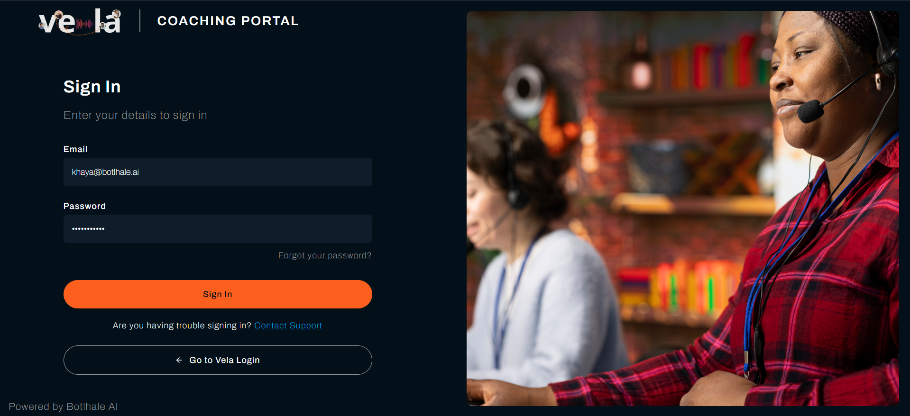
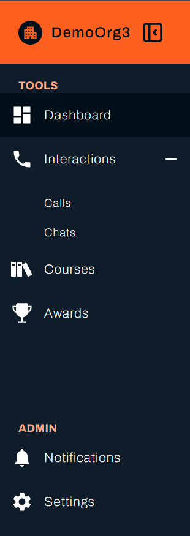
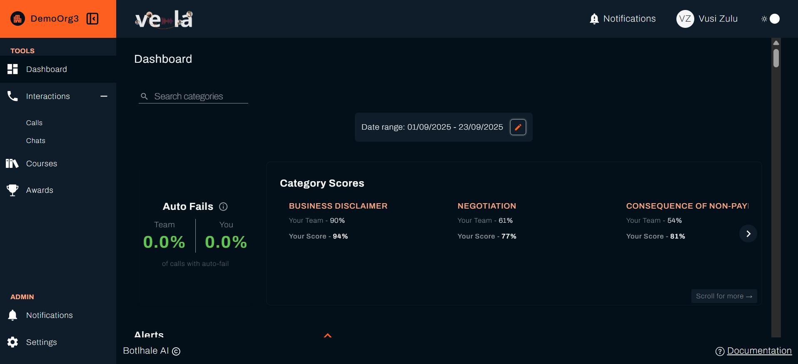
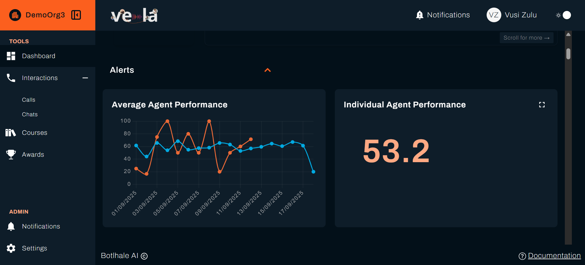
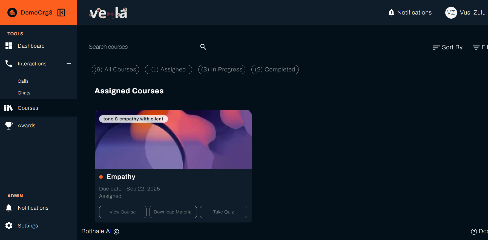
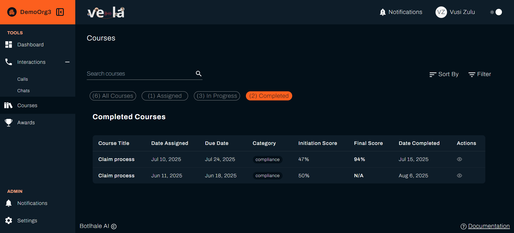
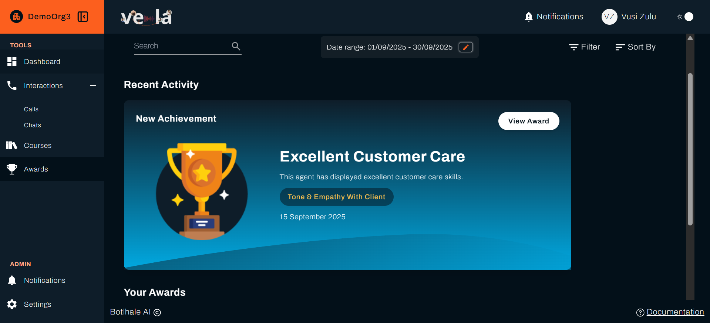

# Quick Start Guide for Agents

Welcome to Vela Agent Portal! Vela agent portal helps you understand your performance, receive feedback from your team lead, and access courses to improve your skills. This guide will get you comfortable using your Agent Portal in just 15 minutes, so you can start tracking your progress and responding to coaching right away.

## Getting Started

### System Requirements
- **Supported browsers**: Chrome, Firefox, Edge
- **Internet connection**: Required to access your portal

### Logging Into Vela
Your team lead or administrator has set up your account. Here's how to access it:

1. Go to your Vela login page (your team lead will provide this link)
2. Choose your login method:
   - **Google**: Click "Sign in with Google" if your company uses Gmail
   - **Microsoft**: Click "Sign in with Microsoft" for company email
   - **Email and Password**: Use the credentials provided by your team lead
3. First-time setup:
   - Check your email for a verification message
   - Click the verification link
   - Create your password with:
     - At least 8 characters
     - At least one letter
     - At least one number
     - At least one special character (like @, #, !)

**Having trouble logging in?** Contact your team lead - they can help reset your password or verify your account details.

### Your Agent Portal Overview
After logging in, you'll see your Agent Portal - a simplified, focused view designed just for you. Here's what you'll find:

#### Your Main Sections
- **Dashboard** - Your performance scores and trends
- **Interactions** - Your calls and chats with feedback
- **Courses** - Courses assigned to help you improve
- **Awards** - Recognition for your achievements
- **Notifications** - Messages from your team lead

**Important**: You only see your own data - not other agents' information. This keeps everything private and focused on your personal development.

## Essential First Steps

### 1. Check Your Performance Dashboard (5 minutes)
What you'll see on your dashboard:

#### Your Current Score
- This is your overall performance rating (0-100)
- Higher scores mean better performance
- Your team lead uses this to understand how you're doing

#### Score Trends
- Shows if your performance is improving, staying steady, or declining
- Look for patterns over days and weeks

#### Peer Comparison
- See how you compare to your teammates (anonymous)
- Use this for motivation - aim to be in the top performers

#### Recent Activity
- Your latest calls and chats
- Quick view of recent scores

#### What the colours mean:
- **Green scores** - Great job! Keep up the excellent work
- **Yellow scores** - Good, with room for small improvements
- **Red scores** - Need attention - check feedback and courses

**Expected outcome**: You'll understand exactly how you're performing and whether you're improving over time.

### 2. Review Your Interactions and Feedback (5 minutes)
Check for feedback from your team lead:

1. Click **"Interactions"**
2. Click on a specific call
3. Look for the comment icon next to any calls or chats
4. Click on interactions with comments to read feedback
5. Read the feedback carefully - your team lead is trying to help you improve
6. Reply if you have questions - use the comment box to ask for clarification

#### Understanding your scores:
- Each interaction gets a score from Vela's AI
- Your team lead may add their own evaluation
- Focus on the feedback, not just the number

#### Types of feedback you might see:
- **Positive feedback**: "Great job handling that difficult customer calmly"
- **Coaching suggestions**: "Try to summarise the solution before ending the call"
- **Courses recommendations**: "Please complete the Active Listening course"

#### How to respond:
- Thank your team lead for feedback
- Ask questions if something isn't clear
- Confirm when you've made changes or completed suggested courses

**Expected outcome**: You'll stay connected with your team lead's coaching and can ask questions to improve faster.

### 3. Complete Your Assigned Courses (10 minutes)
Access your learning:

1. Click **"Courses"** 
2. You'll see **"Assigned Courses"** - these are picked specifically for you
3. Click on any course to start learning
4. Work through the modules at your own pace
5. Take any quizzes or assessments included

#### Track your progress:
- In progress modules will appear on the "In Progress" tab
- Completed modules will appear in the "Completed" tab
- Certificates are available when you complete full courses

#### Why courses is assigned:
- Based on your performance scores
- Addresses specific areas where you can improve
- Helps you develop new skills for better customer service

**Expected outcome**: You'll continuously improve your skills and see your performance scores increase over time.

## Daily Routine for Success

### Start of Your Shift (2 minutes)
- **Quick dashboard check** - See if your scores are trending up or down
- **Check notifications** - Read any new messages from your team lead
- **Review priority training** - See if you have any urgent courses to complete

### During Breaks (5 minutes)
- **Complete courses modules** - Use downtime productively
- **Review recent interaction feedback** - Learn from your latest calls/chats
- **Check your peer ranking** - Stay motivated by tracking your progress

### End of Your Shift (3 minutes)
- **Quick performance review** - How did today's interactions score?
- **Respond to feedback** - Reply to any team lead comments
- **Plan tomorrow's improvement** - What will you focus on next?

## Understanding Your Performance

### What Gets Measured
Vela's AI scores each of your interactions against your organisation's Agent Scorecard criteria. The specific evaluation categories and what they measure are defined by your administrator — ask your team lead if you need clarification on what is being assessed.

### How Scores Are Calculated
- AI automatically scores each of your interactions
- Your team lead may adjust scores based on their review
- Overall score is an average of all your recent interactions
- Trends matter more than individual call scores

### Using Peer Comparisons Positively
- **Top performers** - Learn from what they're doing well
- **Average range** - Solid performance, look for small improvements
- **Below average** - Focus on courses and implementing feedback

**Remember**: Everyone improves at different rates - focus on your own progress

## Making the Most of Training

### Types of Courses You Might See
Courses are created by your Team Lead and are tailored to your organisation's specific needs. They will typically address skill gaps identified from your interaction scores and scorecard results. Ask your team lead for context on any course assigned to you.

### Study Tips for Success
- **Take courses when you're alert** - Don't rush through when tired
- **Take notes on key points** you want to remember
- **Practice immediately** - Try new techniques on your very next calls
- **Ask questions** - Contact your team lead if courses content is unclear
- **Review certificates** - Keep track of what you've completed

### Connecting Training to Performance
- **Before training** - Notice your scores in specific areas
- **During training** - Focus on skills that address your weak points
- **After training** - Watch for score improvements in those areas

## Earning Recognition

### Types of Awards You Can Receive
- **Performance achievements** - High scores over time
- **Improvement recognition** - Significant score increases
- **Courses completion** - Finishing assigned courses
- **Special recognition** - Outstanding customer feedback
- **Team contributions** - Helping colleagues or special projects

### How to Increase Your Chances
- **Consistently complete training** - Shows commitment to improvement
- **Respond positively to feedback** - Demonstrates professionalism
- **Maintain steady improvement** - Small gains over time add up
- **Ask for help when needed** - Shows maturity and desire to learn

## Communication with Your Team Lead

### When to Reach Out
- **You don't understand feedback** - Ask for specific examples
- **Technical problems** - Can't access courses or see scores
- **Personal challenges** - Life situations affecting your performance
- **Ideas for improvement** - Suggestions for better processes

### How to Communicate Professionally
- **Be respectful** - Your team lead is trying to help you succeed
- **Be specific** - "I'm confused about the feedback on call #12345"
- **Be solution-focused** - "What can I do differently next time?"
- **Be timely** - Respond to feedback within a day or two

### Using the Comment System
- **Read carefully before responding**
- **Acknowledge feedback** - "Thanks for the suggestion, I'll try that"
- **Ask clarifying questions** - "Can you give me an example of better phrasing?"
- **Report progress** - "I completed the course you recommended"

## Troubleshooting Common Issues

### Login and Access Problems
- **"Wrong password"** - Contact your team lead for a reset
- **"Account locked"** - Contact support at support@botlhale.ai to unblock your account
- **"Page won't load"** - Try a different browser or clear your browser cache

### Training and Course Issues
- **"Course won't start"** - Refresh the page, or try a different browser
- **"Progress not saving"** - Make sure you click "Complete" on each module
- **"Certificate not appearing"** - May take a few minutes after course completion

### Performance and Feedback Questions
- **"Don't understand my score"** - Ask your team lead to explain the specific evaluation
- **"Feedback seems unfair"** - Discuss specific examples professionally with team lead
- **"Scores not updating"** - New interactions may take a few hours to process

## Privacy and Your Data

### What You Can See
- **Only your own interactions** - Never other agents' calls or chats
- **Your own performance data** - Scores, trends, and feedback
- **Anonymous peer comparisons** - Rankings without names
- **Your course records** - Courses assigned and completed

### What Your Team Lead Sees
- **Your performance scores and trends**
- **Your interaction details for quality assurance**
- **Your course progress and completion rates**
- **Comments and feedback you send through the system**

### Your Privacy Rights
- **Personal conversations are not recorded or monitored outside work**
- **Performance data is used only for coaching and development**
- **Course records help identify your professional development needs**

## Tips for Long-term Success

### Build Good Habits
- **Check your dashboard daily** - Stay aware of your performance trends
- **Complete courses promptly** - Don't let courses pile up
- **Engage with feedback** - Treat coaching as a growth opportunity
- **Set personal goals** - Aim to improve specific scores each month

### Focus on Continuous Improvement
- **Small changes often lead to big score improvements**
- **Consistent effort beats occasional bursts of activity**
- **Ask questions** - Your team lead wants you to succeed
- **Celebrate progress** - Acknowledge your improvements along the way

### Career Development Mindset
- **View feedback as investment in your professional growth**
- **See training as opportunity to develop valuable skills**
- **Use peer comparisons as motivation, not competition**
- **Document your achievements** - Keep track of certificates and improvements

## Quick Reference

### Daily Checklist
- Check dashboard for new feedback
- Review notifications and messages
- Continue assigned training courses
- Respond to team lead comments
- Monitor performance trends

### When You Need Help
- **Login issues**: Contact your team lead
- **Courses questions**: Use the comment system to ask your team lead
- **Technical problems**: Try refreshing your browser first
- **Performance concerns**: Schedule time to discuss with your team lead

### Key Reminders
- **Focus on improvement trends, not individual interaction scores**
- **Complete training promptly** - it directly helps your performance
- **Communicate professionally with your team lead through comments**
- **Use peer comparisons positively for motivation**
- **Ask questions when feedback isn't clear**

**Remember**: Vela is designed to help you succeed. Your team lead and the AI analysis are tools to support your professional development and help you provide excellent customer service. The goal is your continuous improvement and career growth!

