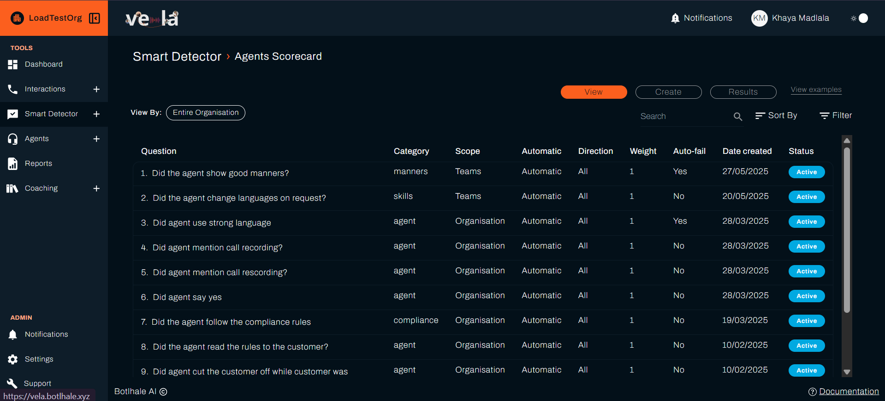
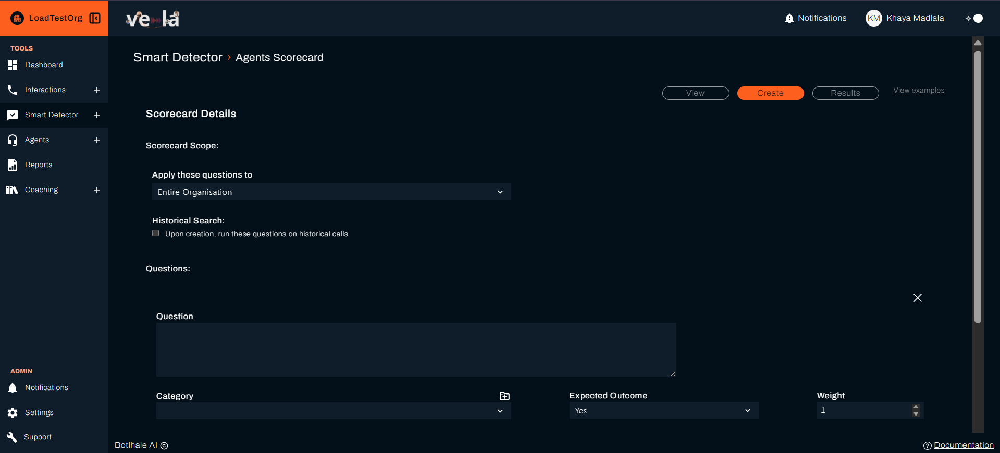
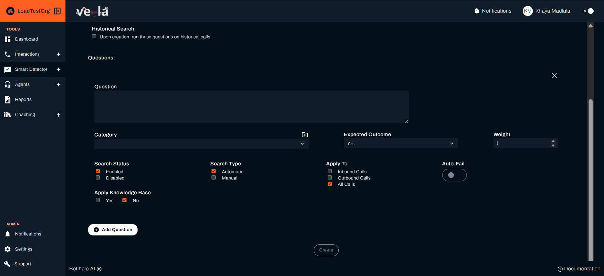

# Create Agent Scorecards

Build fair, consistent, and effective evaluation systems that help your agents improve and your team succeed. Agent scorecards provide objective assessments that drive coaching, training, and performance improvement.

## What You Can Achieve

Agent scorecards transform subjective evaluations into objective insights. You'll be able to:

| **Performance Evaluation** | **Coaching & Development** | **Quality Assurance** |
|---------------------------|---------------------------|---------------------|
| **Measure performance objectively** | **Guide targeted coaching** | **Ensure consistent standards** |
| **Identify training needs** | **Track improvement over time** | **Maintain quality standards** |
| **Recognise excellence** | **Drive continuous improvement** | **Support compliance requirements** |

---

## Getting Started with Agent Scorecards

### Step 1: Access Scorecard Builder

- [ ] **Go to "Smart Detector" → "Agent Scorecard"**
- [ ] **Click "Create"** to build your first scorecard
- [ ] **Choose your evaluation focus** based on your team's needs

### Step 2: Define Evaluation Criteria

- [ ] **Select evaluation categories** (communication, problem-solving, etc.)
- [ ] **Set scoring weights** for each category
- [ ] **Define performance standards** and expectations
- [ ] **Configure scoring thresholds** for different performance levels

### Step 3: Test and Deploy
- [ ] **Review sample evaluations** to ensure accuracy
- [ ] **Adjust criteria** based on initial results
- [ ] **Train your team** on the new evaluation system
- [ ] **Launch scorecard** for ongoing use

---

## Scorecard Components

### Evaluation Categories
Structure your scorecard with these key performance areas:

| **Category** | **What It Measures** | **Scoring Focus** |
|--------------|---------------------|------------------|
| **Communication** | Clarity, professionalism, empathy | Tone, language, listening skills |
| **Problem Solving** | Issue resolution effectiveness | Analysis, creativity, follow-through |
| **Product Knowledge** | Understanding of products/services | Accuracy, depth, application |
| **Customer Focus** | Meeting customer needs and expectations | Understanding, responsiveness, satisfaction |
| **Efficiency** | Time management and process adherence | Speed, accuracy, resource utilization |
| **Compliance** | Policy adherence and regulatory requirements | Documentation, procedures, standards |

### Scoring System
| **Score Range** | **Performance Level** | **Action Required** |
|-----------------|---------------------|-------------------|
| **90-100%** | Excellent | Recognise, mentor others, advanced development |
| **80-89%** | Good | Minor improvements, skill refinement |
| **70-79%** | Satisfactory | Coaching needed, specific improvements |
| **Below 70%** | Needs Improvement | Intervention, intensive coaching |

---

## Building Effective Scorecards

### Criteria Selection
Choose evaluation criteria that align with your business goals:

| **Business Goal** | **Focus Areas** | **Evaluation Criteria** |
|------------------|-----------------|----------------------|
| **Customer Satisfaction** | Service quality, problem resolution | Communication, customer focus, problem solving |
| **Operational Efficiency** | Speed, accuracy, productivity | Efficiency, process adherence, time management |
| **Compliance & Quality** | Standards, procedures, documentation | Compliance, accuracy, documentation |
| **Team Development** | Skill growth, knowledge sharing | Product knowledge, communication, mentoring |

### Weighting Strategy
Assign appropriate weights to different criteria:

| **Weighting Approach** | **When to Use** | **Example Weights** |
|----------------------|-----------------|-------------------|
| **Balanced** | General performance evaluation | Equal weights (16.7 percent each) |
| **Customer-Focused** | Service-oriented roles | Communication (25 percent), Customer Focus (25 percent), Problem Solving (20 percent) |
| **Efficiency-Focused** | High-volume operations | Efficiency (30 percent), Process Adherence (25 percent), Speed (20 percent) |
| **Quality-Focused** | Compliance-heavy roles | Compliance (30 percent), Accuracy (25 percent), Documentation (20 percent) |

### Performance Standards
Define clear expectations for each criterion:

| **Criterion** | **Excellent (90-100 percent)** | **Good (80-89 percent)** | **Satisfactory (70-79 percent)** | **Needs Improvement (below 70 percent)** |
|---------------|------------------------|------------------|-------------------------|----------------------------|
| **Communication** | Clear, professional, empathetic, excellent listening | Generally clear, professional, good listening | Sometimes unclear, basic professionalism | Unclear, unprofessional, poor listening |
| **Problem Solving** | Creative solutions, excellent follow-through | Effective solutions, good follow-through | Basic solutions, some follow-through | Ineffective solutions, poor follow-through |
| **Customer Focus** | Exceeds expectations, anticipates needs | Meets expectations, responsive | Sometimes meets expectations | Fails to meet expectations |

---

## Implementing Scorecards

### Training Your Team
- [ ] **Explain the purpose** of the scorecard system
- [ ] **Review evaluation criteria** and scoring standards
- [ ] **Provide examples** of different performance levels
- [ ] **Address questions** and concerns about the system

### Monitoring and Adjustments
- [ ] **Review initial results** to ensure fairness and accuracy
- [ ] **Adjust criteria** based on feedback and observations
- [ ] **Refine scoring weights** to better reflect priorities
- [ ] **Update standards** as business needs evolve

### Feedback Integration
- [ ] **Share results** with agents regularly
- [ ] **Provide specific feedback** on areas for improvement
- [ ] **Celebrate successes** and improvements
- [ ] **Use results** to guide coaching and training

---

## Using Scorecard Results

### Individual Development
Use scorecard results to guide agent improvement:

| **Score Pattern** | **Development Focus** | **Action Plan** |
|------------------|---------------------|----------------|
| **High scores across all areas** | Advanced development, leadership | Mentoring opportunities, advanced training, career progression |
| **Mixed scores** | Targeted improvement | Focus coaching on low-scoring areas, build on strengths |
| **Low scores in specific areas** | Skill development | Targeted training, practice opportunities, peer support |
| **Consistently low scores** | Comprehensive development | Intensive coaching, skill assessment, role evaluation |

### Team Analysis
Analyse patterns across your team:

| **Pattern** | **Team Impact** | **Management Action** |
|-------------|-----------------|---------------------|
| **High team scores** | Excellent performance, strong culture | Maintain standards, share best practices, recognise excellence |
| **Mixed team performance** | Varying skill levels, training opportunities | Identify training needs, implement coaching programs |
| **Low team scores** | Systemic issues, training gaps | Comprehensive training review, process improvement |
| **Declining scores** | Performance issues, changing standards | Investigate root causes, adjust expectations |

### Process Improvement
Use scorecard data to improve processes:

- [ ] **Identify common weaknesses** across the team
- [ ] **Spot training gaps** that affect multiple agents
- [ ] **Recognise process issues** that impact performance
- [ ] **Track improvement** over time to measure effectiveness

---

## Advanced Scorecard Features

### Automated Scoring
- [ ] **Set up automatic evaluation** of all interactions
- [ ] **Configure scoring** for feedback
- [ ] **Enable trend analysis** to track improvement over time
- [ ] **Integrate with coaching** systems for seamless development

### Custom Metrics
- [ ] **Add business-specific criteria** relevant to your industry
- [ ] **Include compliance requirements** for regulated environments
- [ ] **Create role-specific scorecards** for different positions
- [ ] **Develop seasonal adjustments** for varying business needs

### Reporting and Analytics
- [ ] **Generate individual reports** for agent development
- [ ] **Create team summaries** for management review
- [ ] **Track trends over time** to measure improvement
- [ ] **Compare performance** across teams and departments

---

## Troubleshooting Common Issues

| **Problem** | **Cause** | **Solution** |
|-------------|-----------|--------------|
| **Inconsistent scoring** | Unclear criteria, subjective standards | Define specific criteria, provide examples, train evaluators |
| **Low agent engagement** | Lack of understanding, perceived unfairness | Explain purpose, provide training, address concerns |
| **Resistance to change** | Fear of evaluation, unclear benefits | Communicate benefits, involve agents in design, provide support |
| **Poor correlation with outcomes** | Misaligned criteria, wrong focus areas | Review business goals, adjust criteria, measure impact |

---

## Best Practices for Scorecards

### Design Principles
- [ ] **Keep it simple** - Focus on the most important criteria
- [ ] **Be objective** - Use measurable, observable behaviours
- [ ] **Stay relevant** - Align with business goals and customer needs
- [ ] **Ensure fairness** - Apply consistent standards across all agents

### Implementation Strategy
- [ ] **Start small** - Begin with a few key criteria
- [ ] **Pilot test** - Try with a small group before full rollout
- [ ] **Gather feedback** - Listen to agents and managers
- [ ] **Iterate and improve** - Refine based on experience and results

### Ongoing Management
- [ ] **Regular review** - Update criteria and standards as needed
- [ ] **Monitor effectiveness** - Track impact on performance and satisfaction
- [ ] **Share results** - Use data to guide coaching and development
- [ ] **Celebrate success** - Recognise improvements and achievements

---

## Next Steps

| **For Smart Monitoring** | **For Knowledge Management** | **For Team Development** |
|-------------------------|----------------------------|------------------------|
| [Set Up Smart Monitoring](./smart-detector-overview.md) | [Build Knowledge Base](./knowledge-base-guide.md) | [Improve Agent Performance](./agents.md) |

### See also
- [Agent Performance](./agents.md) - Coach your team effectively
- [Smart Monitoring](./smart-detector-overview.md) - Set up automated alerts
- [Dashboard Overview](./dashboard.md) - Monitor performance trends
- [Knowledge Base](./knowledge-base-guide.md) - Build training resources
- [Official API Documentation](https://docs-apis.botlhale.xyz) - Complete API reference for integrations

## Need Help?

- **Contact Support**: support@botlhale.ai
