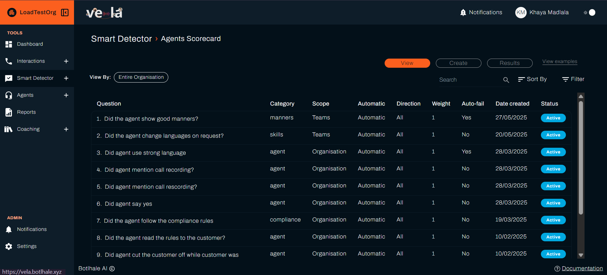
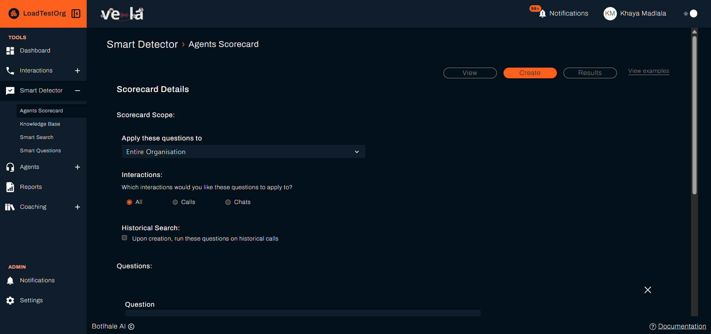
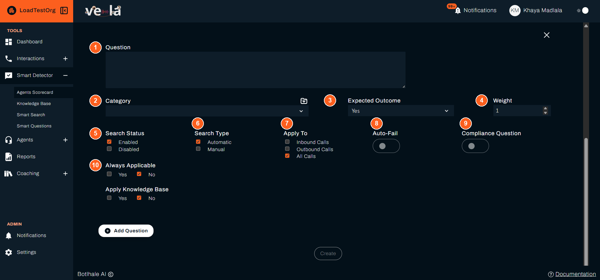

# Build an Agent Scorecard

The Agent Scorecard is the set of questions Vela scores every interaction against. Without one, interactions are transcribed and analysed but carry no score, so every figure that depends on scoring stays empty: agent scores, the compliance and quality split, categories, and the strengths and weaknesses on an agent's Details page.

:::note The sidebar says "Agents Scorecard"
The sidebar and the trail at the top of the page name it in the plural. This documentation uses the singular "Agent Scorecard" for the feature itself.
:::

---

## Before You Begin

You need:

- **Access level:** Organisational, Departmental, or Team, covering the teams the scorecard should apply to. See [Access Level](./reference/glossary.md#access-level).
- **The behaviours you want to measure**, written down before you start. A scorecard built at the keyboard tends to grow questions that overlap.
- **To decide about Historical Search**, covered in step 2. Set it before you save, because it is the one choice on this form that creation fixes for good.

---

## 1. Open the Create Tab

1. Select **Smart Detector** in the left sidebar, then **Agents Scorecard**.
2. Select the **Create** tab.

The page has four tabs. **View** lists the questions you already have, **Create** adds one, **Results** shows how interactions have scored against them, and **Examples** holds ready-made questions supplied with Vela, which are worth reading before you write your own.

---

## 2. Set What the Scorecard Covers

The settings above the question list apply to the whole scorecard. Every question you add inherits them.

| Setting | What it does |
| :--- | :--- |
| **Scorecard Scope** | Which parts of the organisation the scorecard applies to. An interaction is scored against the scorecards covering the agent who handled it |
| **Interactions** | **All**, **Calls**, or **Chats**. This covers the whole set, so one scorecard cannot mix call-only and chat-only questions |
| **Historical Search** | Runs the scorecard against interactions already in Vela. Choose **All historical calls** or a **Specific date range** |

:::warning Historical Search cannot be added later
It is only offered when you create the scorecard. Leave it off and the interactions already in Vela are never scored against these questions, and the only way to change that is to upload those recordings again.
:::

---

## 3. Write the Questions

Each question is one yes/no judgement about the interaction. The fields below are numbered to match the screenshot.

| # | Field | What it does |
|:--|-------|--------------|
| 1 | **Question** | The behaviour being assessed, phrased so it can be answered yes or no |
| 2 | **Category** | A grouping label such as Opening, Compliance, or Closing. Categories are what produce an agent's strengths and weaknesses. See the note below on adding one |
| 3 | **Expected Outcome** | Which answer counts as a pass. Set it to match how you phrased the question |
| 4 | **Weight** | How much this question contributes, relative to the others |
| 5 | **Search Status** | Whether the question runs against incoming interactions |
| 6 | **Search Type** | Whether the AI answers it, or a reviewer does by hand |
| 7 | **Apply To** | Inbound calls, outbound calls, or all calls |
| 8 | **Auto-Fail** | Failing this question takes the whole interaction to `0.0%`, with the score earned on the other questions shown in brackets beside it |
| 9 | **Compliance Question** | Counts this question towards the **Compliance Score** instead of the **Quality Score**. Every question counts towards the **Overall Score** either way |
| 10 | **Always Applicable** | Whether the AI may answer N/A, or only Yes and No |

Select **Add Question** for each further question, then **Create** to save. The questions are active as soon as the scorecard is created.

:::warning Your plan caps how many questions you can have
The limit is five unless your plan sets a different one. Check your allowance under **Settings → Organisations**, where **show package details** lists the **Agent Scorecard Limit**. When you reach it the **Create** tab is greyed out, with no message explaining why. Delete a question you no longer need to make room, or ask your Account Manager about a higher limit. Only your own enabled questions count towards it, so the ready-made ones on **Examples** do not.
:::

Every field, including those this page does not cover, is listed in [Scorecard Fields](./reference/scorecard-fields.md). For how the three scores are worked out, and why compliance is reported separately, see [How Scoring Works](./explanation/how-scoring-works.md).

:::note Adding a category
**Category** starts as a list of the categories you already use. To add a new one, select the folder-with-a-plus icon beside the field and type the name. The icon then becomes a pointing hand, which takes you back to choosing from the list.

Keep the list short and meaningful. Categories are what **Take A Bow** and **Work On This** report on an agent's Details page, so a category per question tells you nothing about where they are strong.
:::

### Writing Questions the AI Can Answer

The AI reads a transcript. A question works when its answer is visible there.

* **Describe something observable.** *Did the agent state the cancellation notice period?* has an answer in the transcript. *Was the agent empathetic?* does not, and produces scores that feel arbitrary to the people receiving them.
* **Say when the question applies**, if it does not apply to every conversation. *If the customer disputed the charge, did the agent explain the dispute process?* lets the AI answer N/A on the calls where no dispute came up, so the question drops out of the score instead of counting as a failure. This only works while **Always Applicable** is **No**, which is the default. Set it to **Yes** and the AI has to answer Yes or No, so a call the question never applied to costs the agent a No.
* **Keep weights relative.** There is no external scale. A question weighted 10 among questions weighted 1 dominates the score, and what matters is the balance between your own questions.
* **Use Auto-Fail sparingly.** It is for something that invalidates an interaction on its own, such as a regulatory disclosure that was never given.

For questions the AI cannot judge from the transcript alone, set **Search Type** to **Manual** so a reviewer answers it by hand. The question then sits at N/A on every interaction until someone opens it and sets an outcome, so use it only where you have the review capacity.

Where the answer depends on your own procedure rather than general knowledge, turn on **Apply Knowledge Base** instead, and the AI judges the question against a document you have uploaded. See [Build Your Knowledge Base](./knowledge-base-guide.md).

## 4. Edit or Delete a Question

Open a question from the **View** tab to change its wording, category, weight, scope, or settings, or to delete it.

Editing and deleting behave differently, and the difference matters:

| | What happens to interactions already scored |
| :--- | :--- |
| **Deleting a question** | Nothing. They keep the question and its outcome, and their scores do not change |

{/* UNVERIFIED: the stored score on the interaction is not recomputed when a question is deleted, so the screen figure holds. But the export path in interactions/calls/[id]/call.js (around line 517) looks each score's question up in a map and returns early with query: null when it is gone, skipping the compliance and quality denominator accumulation below it. An export taken after a deletion may therefore disagree with the compliance/quality split shown on screen. Confirm by exporting one interaction before and after deleting a compliance question. */}
| **Editing its weight, Auto-Fail, Compliance, or Expected Outcome** | They are scored again from the current settings, including their **Initial** figures |

:::warning Editing a weight changes past scores
Scores are worked out from your scorecard as it stands today, so a change reaches backwards across your whole history. A trend that looked flat can change shape because of an edit made this morning.

Change weights deliberately, note when you did it, and compare periods either side of the change rather than reading the history as one measurement. To stop using a question, delete it rather than setting its weight to zero. See [How Scoring Works](./explanation/how-scoring-works.md).
:::

Adding a question is safe. It applies to interactions processed after the change, and older interactions keep the scorecard they were scored against.

---

## Check Your Work

The questions appear on the **View** tab as soon as you save, but a score needs an interaction to score.

If you turned Historical Search on, interactions already in Vela are scored as it works through them. If you left it off, the scorecard applies from now on, so the **Results** tab stays empty until new interactions are processed. That is the expected state rather than a fault.

You are finished when you open a processed interaction, go to its **Scorecard** tab, and see your questions with an outcome on each. An interaction showing no scorecard usually means the scope does not cover that agent's team, or the **Interactions** setting does not match the channel. See [Scorecard and Scoring Issues](./support/troubleshooting-guide.md#scorecard-and-scoring-issues).

---

## Related

- [Scorecard Fields](./reference/scorecard-fields.md): every field on a question, with its values and default
- [How Scoring Works](./explanation/how-scoring-works.md): weights, N/A, auto-fail, and why editing rewrites history
- [Review and Score Interactions](./features/quality-assurance-tools.md): reviewing and overriding what the scorecard produces
- [Set Up Smart Questions](./smart-questions-guide.md): asking about a conversation without scoring the agent
- [Administrator Setup](./getting-started/quick-start/administrator-setup.md): the scorecard as part of first-time configuration

---

## Need Help?

**Contact Support:** support@botlhale.ai
