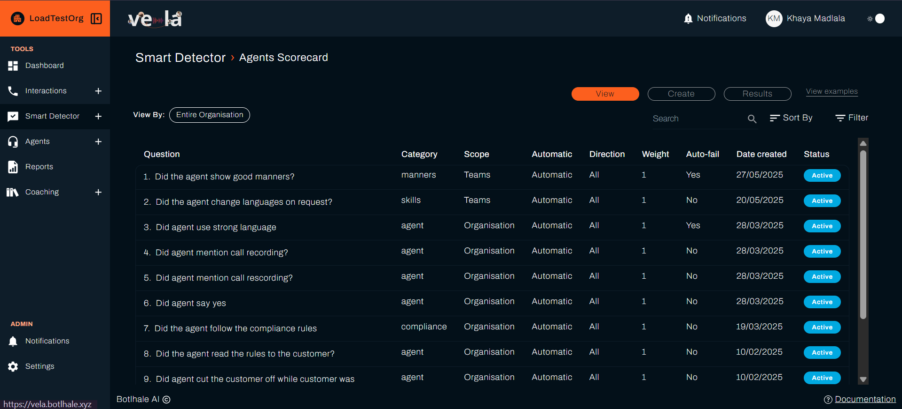
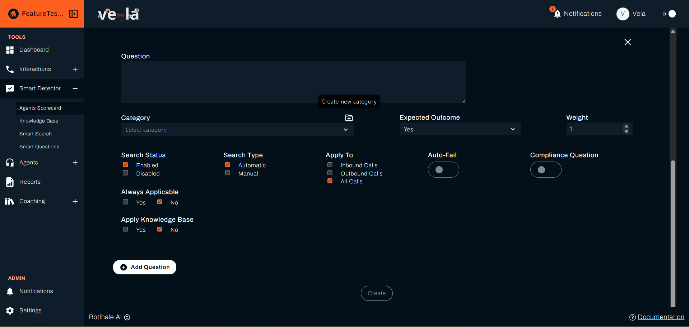
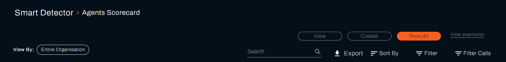

import { ScorecardScopeForm, ScorecardQuestionForm } from '@site/src/components/annotatedForms';

# Build an Agent Scorecard

The Agent Scorecard is the set of questions Vela scores every interaction against. Without one, interactions are transcribed and analysed but carry no score, so every figure that depends on scoring stays empty. That covers agent scores, the compliance and quality split, categories, and the strengths and weaknesses on an agent's Details page.

:::tip In short
By the end you will have a scorecard of yes/no questions that Vela scores interactions against.

1. Under **Smart Detector → Agents Scorecard**, on the **Create** tab, [set what the scorecard covers](#2-set-what-the-scorecard-covers), deciding **Historical Search** before you save.
2. [Write the questions](#3-write-the-questions), selecting **Add Question** for each further one, then **Create**.
3. [Read the results](#4-read-the-results) on the **Results** tab to find the questions that are not working.
:::

:::note The sidebar says "Agents Scorecard"
The sidebar and the trail at the top of the page name it in the plural. This documentation uses the singular "Agent Scorecard" for the feature itself.
:::

---

## Before You Begin

You need:

- **Access level:** Organisational, Departmental, or Team, covering the teams the scorecard should apply to. See [Access Level](./reference/glossary.md#access-level).
- **The behaviours you want to measure**, written down before you start. A scorecard built at the keyboard tends to grow questions that overlap.
- **A decision about Historical Search**, covered in step 2. Set it before you save, because it cannot be changed once the scorecard is created.

---

## 1. Open the Create Tab

1. Select **Smart Detector** in the left sidebar, then **Agents Scorecard**.
2. Select the **Create** tab.

The page has four tabs. **View** lists the questions you already have, **Create** adds a new question, **Results** shows how your questions have performed across interactions, and **View examples** holds ready-made questions supplied with Vela, which are worth reading before you write your own.

---

## 2. Set What the Scorecard Covers

The settings above the question list apply to the whole scorecard. Every question you add inherits them.

<ScorecardScopeForm />

:::warning Historical Search cannot be added later
Leave it off and these questions apply to interactions processed from now on. For the options afterwards, see [Scoring older interactions against a new question](./explanation/how-scoring-works.md#scoring-older-interactions-against-a-new-question).
:::

---

## 3. Write the Questions

Each question is one yes/no judgement about the interaction.

<ScorecardQuestionForm />

Select **Add Question** for each further question, then **Create** to save. The questions are active as soon as the scorecard is created.

:::warning Your plan caps how many questions you can have
The limit is five unless your plan sets a different one. Check your allowance under **Settings → Organisations → This Org**, where **show package details** lists the **Agent Scorecard Limit**. A 0 means your plan has no custom limit, so the standard limit of five applies. Only your enabled questions count towards it. When you reach it, the **Create** tab is greyed out. To make room, disable or delete a question you no longer need, or ask your Account Manager about upgrading your plan for a higher limit.
:::

{/* ENGINEERING (known bug, documented as intended): show package details reads org.package?.checklistLimit ?? 0 (vela origin/vela-fly app/(pages)/settings/thisOrg.jsx:69), so a plan with no custom limit shows 0 while the standard limit of five applies. Intended: it shows the limit in force. */}

Every field, including those this page does not cover, is listed in [Scorecard Fields](./reference/scorecard-fields.md). For how the three scores are worked out, and why compliance is reported separately, see [How Scoring Works](./explanation/how-scoring-works.md).

:::note Adding a category
**Category** starts as a list of the categories you already use. To add a new one, select the folder-with-a-plus icon beside the field and type the name. The icon then becomes a pointing hand, which takes you back to choosing from the list.

Keep the list short and meaningful. Categories are what **Take A Bow** and **Work On This** report on an agent's Details page. Grouping related questions under one category is what lets those reports show a real pattern, rather than a single question's result.
:::

### Writing Questions the AI Can Answer

The AI reads a transcript. A question works when its answer is visible there.

* **Describe something observable.** *Did the agent state the cancellation notice period?* has an answer in the transcript. *Was the agent empathetic?* does not, and produces scores that feel arbitrary to the people receiving them.
* **Say when the question applies**, if it does not apply to every conversation. *If the customer disputed the charge, did the agent explain the dispute process?* lets the AI answer N/A on calls where no dispute came up. The question then drops out of the score instead of counting as a failure. This only works while **Always Applicable** is **No**, which is the default. Set it to **Yes** and the AI has to answer Yes or No, so the agent gets a No on calls where the question never applied. {/* ENGINEERING (known bug, documented as intended): see the note in how-scoring-works.md, When a question does not apply. */}
* **Keep weights relative to each other.** There is no external scale. A question weighted 5 among questions weighted 1 dominates the score, and what matters is the balance between your own questions.
* **Use Auto-Fail sparingly.** It is for something that invalidates an interaction on its own, such as a regulatory disclosure that was never given. One failed Auto-Fail question makes the whole interaction read 0.0%, whatever else went well.
* **Phrase the question positively.** *Did the agent verify the customer's identity?* scores more accurately than *Did the agent fail to verify the customer's identity?* Ask whether the right thing happened, and set **Expected Outcome** to **Yes**.

:::tip Questions that look for something rather than score it
Some questions exist to record that something happened rather than to judge it, such as a customer expressing dissatisfaction, or a competitor being mentioned.

Write those positively too, then set **Expected Outcome** to **No**. The question then passes when the thing is absent and fails when it is present, so a "fail" reads as *this happened* rather than *the agent did badly*.

Keep the two kinds apart when you read the Results tab. A high failure rate on a scored question is a performance problem. A high failure rate on one of these is a finding.
:::

For questions the AI cannot answer from the transcript alone, set **Search Type** to **Manual** so a reviewer answers it manually. The question then sits at N/A on every interaction until someone opens it and sets an outcome, so use it only where you have the review capacity.

Where the answer depends on your own procedure rather than general knowledge, turn on **Apply Knowledge Base** instead, and the AI analyses the question against a document you have uploaded. See [Build Your Knowledge Base](./knowledge-base-guide.md).

---

## 4. Read the Results

The **Results** tab shows how your questions have performed across interactions, rather than how one interaction scored. Use it to find the questions that are not working.

Each row is numbered, and holds:

| Column | What it shows |
| :--- | :--- |
| **Question** | The question as written |
| **Category** | The grouping it belongs to |
| **Scope** | Which part of the organisation it covers |
| **Weight** | How much it contributes, relative to the others |
| **Auto-Fail** | Whether failing it fails the whole interaction, as **Active** or **Inactive** |
| **Passed** | How many interactions passed it, with the percentage beside the count |
| **Failed** | How many interactions failed it, with the percentage beside the count |
| **N/A** | How many it did not apply to. These are excluded from the score rather than counted as failures |
| **Calls Analysed** | How many interactions it has run against |
| **Date Created** | When the question was added |

Reading **Passed**, **Failed**, and **N/A** together matters more than any one of them. A question with a high **N/A** share is not failing. It does not apply to most conversations, which is what **Always Applicable** set to **No** is for.

**What to look for.** A question failed by almost everyone is usually worded in a way the AI cannot answer from a transcript, rather than a behaviour your whole team is missing. A question passed by everyone measures nothing. Both are worth rewording before you read anything into the scores they produce.

A low **Calls Analysed** count against an old question points at scope or the **Interactions** setting instead: the question may not be reaching the interactions you expected. See [Check Your Work](#check-your-work).

### The Controls Above the Table

| Control | What it does |
| :--- | :--- |
| **View By** | Sets how much of the organisation the figures cover, for example **Entire Organisation** |
| The date range | Bounds the interactions counted. Select the pencil to change it |
| **Search** | Narrows the list by the wording of a question |
| **Sort By** | Orders the list on a column you choose |
| **Filter** | Narrows which **questions** are listed |
| **Filter Calls** | Narrows which **interactions** the figures are counted from |
| **Export** | Downloads the table |

**Filter** changes the rows you see. **Filter Calls** changes the numbers in them, and covers chats as well as calls.

Under **Filter**, narrow by category, weight, the passed, failed, and N/A counts, scope, direction, search type, Auto-Fail, and search status as **Enabled** or **Disabled**, or by the date a question was created. Select **Apply** to use it. **Clear dates** resets the date range on its own, and **clear all fields** resets the filter, confirming with **Filters cleared successfully**.

A date range that ends before it starts is refused with **Invalid date range**. Check the order of the two dates.

---

## 5. Edit or Delete a Question

Open a question from the **View** tab to change its wording, category, weight, scope, or settings, or to delete it.

Editing and deleting behave differently, and the difference matters:

| | What happens to interactions already scored |
| :--- | :--- |
| **Deleting a question** | Nothing. Historical interactions keep its outcome, and their scores do not change, in the interface and in exports alike |
| **Editing its weight, Auto-Fail, or Compliance Question** | The Call Details panel updates their **Compliance Score**, **Quality Score**, and **Initial** figures straight away. Their **Agent Score**, the Dashboard, and the table on **Agents → Performance** take the new settings when each interaction is next scored |
| **Editing its Expected Outcome** | Past AI answers keep the result they were given. Only answers a reviewer has changed are compared against the new setting |

:::warning Editing a weight splits your history
Change weights deliberately, note when you did it, and compare periods either side of the change rather than reading the history as one measurement. To stop using a question, delete it rather than setting its weight to zero. See [How Scoring Works](./explanation/how-scoring-works.md#changing-a-scorecard-after-interactions-are-scored).
:::

A new question applies to interactions processed after you add it. Older interactions keep the scorecard they were scored against, unless you turn on **Historical Search** as you create the question. Then Vela adds the new question to older interactions in its scope and date range and recalculates their scores.

---

## Check Your Work

The questions appear on the **View** tab as soon as you save, but a score needs an interaction to score.

If you left **Historical Search** off, the scorecard applies from now on, so the **Results** tab remains empty until new interactions are processed.

You are finished when you open a processed interaction, go to its **Scorecard** tab, and see your questions with an outcome on each. An interaction showing no scorecard usually means the scope does not cover that agent's team, or the **Interactions** setting excludes calls or chats like this one. See [Scorecard and Scoring Issues](./support/smart-detector-issues.md#scorecard-and-scoring-issues).

---

## Related

- [Scorecard Fields](./reference/scorecard-fields.md): every field on a question, with its values and default
- [How Scoring Works](./explanation/how-scoring-works.md): weights, N/A, auto-fail, and what editing does to past scores
- [Review and Score Interactions](./features/quality-assurance-tools.md): reviewing and overriding what the scorecard produces
- [Set Up Smart Questions](./smart-questions-guide.md): asking about a conversation without scoring the agent
- [Administrator Setup](./getting-started/quick-start/administrator-setup.md): the scorecard as part of first-time configuration

---

## Need Help?

**Contact Support:** support@botlhale.ai
