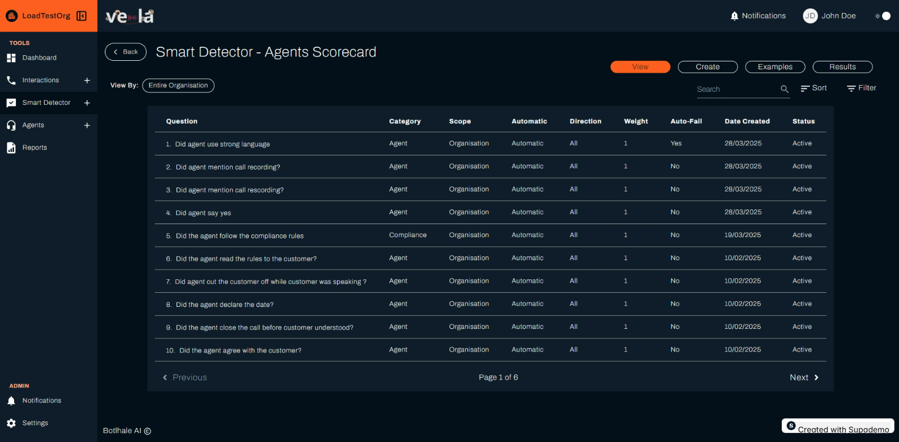

# Agent Scorecard Guide

The Agent Scorecard feature allows you to evaluate and improve agent performance by setting up checklists and tracking key behaviours across interactions.

## Overview

Agent Scorecard uses AI-powered analysis to automatically evaluate agent performance based on predefined criteria.

## Getting Started

### Accessing Agent Scorecard

1. Navigate to **Smart Detector** from the left sidebar
2. Click on the **Agent Scorecard** card
3. You'll see four main tabs:
   - **View**: See all existing scorecard questions
   - **Create**: Build new evaluation questions
   - **Examples**: Use predefined question templates
   - **Results**: Review agent performance scores

## View Tab - Managing Scorecard Questions

The View tab displays a table of all questions used to evaluate agent performance.

### Understanding the Table

- **Question**: The specific question used to assess agent performance
- **Category**: The category the question belongs to (e.g., "Compliance", "Customer Care")
- **Scope**: Range of calls the question applies to (Organisation, Department, or Team)
- **Direction**: Whether the question is evaluated automatically or manually
- **Weight**: Impact of the question on the agent's overall score
- **Auto-Fail**: Whether failing this question automatically fails the entire scorecard
- **Date Created**: When the question was created
- **Status**: Whether the question is active or inactive

## Create Tab - Building New Questions

### Step-by-Step Creation Process

1. **Navigate to Create Tab**: Click the "Create" sub-tab
2. **Fill Out the Form**:

   **Scorecard Scope**: Set the range of calls to evaluate
   - Entire Organisation: Apply to all agents
   - Specific Department: Focus on particular departments
   - Specific Team: Focus on specific teams

   **Question**: Enter the evaluation criteria
   - Example: "Did the agent offer a solution to the customer's issue?"
   - Be specific and measurable

   **Category**: Select the appropriate category
   - Compliance: Regulatory and policy requirements
   - Customer Care: Service quality standards
   - Sales: Revenue-related behaviours

   **Expected Outcome**: Set the desired answer
   - Yes: Agent should perform this action
   - No: Agent should not perform this action

   **Weight**: Determine the question's impact
   - Higher weights have greater impact on overall scores
   - Use weights to prioritise critical behaviours

3. **Save the Question**: Click the orange "Save" button

## Results Tab - Analysing Performance

The Results tab shows the outcomes of agent performance evaluations based on your scorecard questions.

### Understanding Results

- **Question**: The evaluation criteria used
- **Category**: The question category
- **#PASSED**: Number of calls where agents met the criteria
- **#FAILED**: Number of calls where agents didn't meet the criteria
- **#N/A**: Number of calls where the question wasn't applicable
- **Calls Analysed**: Total number of calls evaluated

## Best Practices

### Creating Effective Questions

1. **Be Specific**: Use clear, measurable criteria
2. **Focus on Impact**: Prioritize questions that affect customer experience
3. **Balance Automation**: Mix automatic and manual evaluations appropriately
4. **Regular Review**: Update questions based on changing business needs

## Need Help?

For additional support with Agent Scorecard:
- Contact support@botlhale.ai
- Review the video tutorials on the homepage
