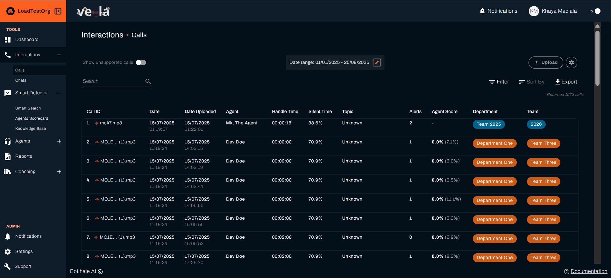
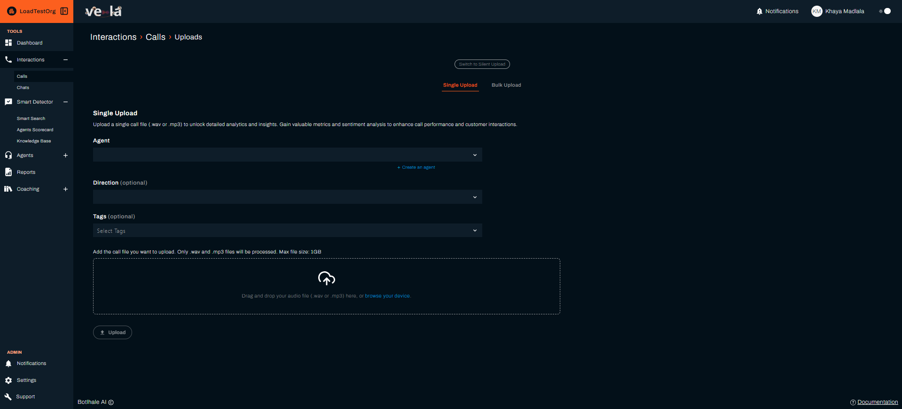
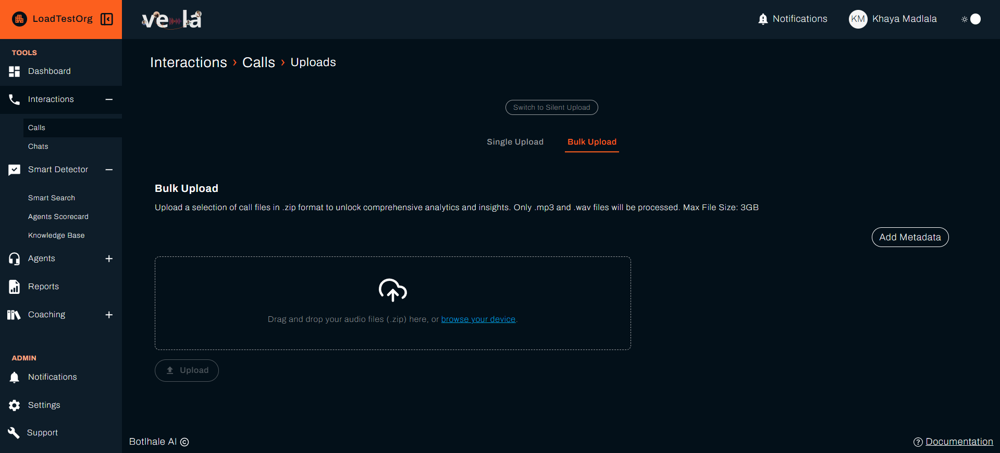

import Tabs from '@theme/Tabs';
import TabItem from '@theme/TabItem';

# Get Your Data into Vela Quickly

Upload your call and chat data to start analysing customer interactions and improving team performance. This guide shows you how to get your data into Vela and start seeing insights.

## What You Can Achieve

When you upload your data to Vela, you can:
- [ ] **Analyse every customer interaction** with AI-powered insights
- [ ] **Identify patterns and trends** across your team
- [ ] **Spot training opportunities** for agents
- [ ] **Track customer satisfaction** over time
- [ ] **Generate insights** that improve your business

---

## Choose Your Upload Method

### Option 1: Manual Upload (Recommended for New Users)
**Best for**: Getting started with existing call files

#### Step-by-Step Process





- [ ] **Go to "Calls"** in the left sidebar
- [ ] **Click "Upload"** button
- [ ] **Select your call files** - We support WAV, MP3, video formats, and ZIP/RAR/7Z archives for bulk upload
- [ ] **Click "Upload"** and wait for processing

> **Why this matters**: You can start analysing your data immediately without any technical setup.

### Option 2: FTP Integration (For Larger Organisations)
**Best for**: Organisations with automated call recording systems


#### Setup Process
- [ ] **Contact your Vela Account Manager** to set up FTP integration
- [ ] **Provide FTP credentials** for your call recording server
- [ ] **Configure sync** - Data flows without manual intervention

> **Why this matters**: Once set up, your data flows without manual intervention.

---

## Supported Data Formats

### Call Recordings
| **Format Type** | **Supported Formats** | **File Size Limit** |
|-----------------|---------------------|-------------------|
| **Audio formats** | WAV, MP3, and other standard call recording formats | Up to 1 GB per upload |
| **Video formats** | Various video formats with audio extraction | Up to 1 GB per upload |
| **Batch uploads** | Multiple files at once / zipped files (ZIP, RAR, 7Z) | Up to 3 GB per upload |

### Chat Data
| **Format Type** | **Supported Formats** | **Requirements** |
|-----------------|---------------------|------------------|
| **Text formats** | JSON | Structured data with timestamps |
| **Structured data** | Agent and customer messages | Sender, timestamp, message content |
| **Metadata** | Session information | Agent IDs, customer IDs |

### Data Requirements
- [ ] **Call recordings**: Audio quality affects transcription accuracy
- [ ] **Chat data**: Properly formatted with sender, timestamp, and message content
- [ ] **Metadata**: Agent information, call dates, customer IDs (if available)

---

## Getting Started with Manual Upload

Follow these simple steps to upload your call recordings and start analysing customer interactions in Vela.

### Step 1: Prepare Your Files
Before uploading, ensure your files are ready for optimal processing:

- [ ] **Organise your call recordings** in a dedicated folder for easy access
- [ ] **Verify file formats** - We support WAV, MP3, video formats, and ZIP/RAR/7Z archives for bulk uploads
- [ ] **Check file sizes** - Ensure files are within your system's upload limits
- [ ] **Ensure audio quality** - Clear recordings provide better transcription results
- [ ] **Optional**: Create a ZIP file containing multiple recordings for batch upload

> **Pro Tip**: Name your files descriptively (e.g., "Agent_John_Call_2024-01-15.wav") to help with organisation later.

### Step 2: Upload Your Data
Upload your files through Vela's interface:

- [ ] **Navigate to "Calls"** in the left sidebar of your Vela dashboard
- [ ] **Click the "Upload" button** in the top-right corner of the Calls page
- [ ] **Choose your upload method**:
  - **Single file**: Click "Choose File" and select individual recordings
  - **Multiple files**: Use "Batch Upload" to select multiple files at once
  - **Drag & Drop**: Simply drag files from your computer directly into the upload area
- [ ] **Review the upload summary** showing file names, sizes, and formats
- [ ] **Click "Upload"** to begin the upload process

> **What happens next**: Your files will be securely uploaded and queued for processing.

### Step 3: Monitor Processing
Track the progress of your uploads and processing:

- [ ] **Watch the upload progress** - Real-time progress bars show upload status
- [ ] **Start analysing** - Click on processed calls to view transcripts, insights, and analytics
<!-- - [ ] **Check processing status** in the Calls section - Files will show "Processing" status -->


> **Processing**: Files will be processed and available for analysis when complete.

### Step 4: Verify and Optimise
Ensure your data is ready for analysis:

- [ ] **Review transcriptions** for accuracy and completeness
- [ ] **Check metadata** - Agent information, timestamps, and call details
- [ ] **Explore insights** - View sentiment analysis, key topics, and performance metrics
- [ ] **Set up notifications** - Configure alerts for new uploads and processing completion

---

## Setting Up Automated Uploads

### For Organisations with Existing Systems

| **Step** | **Action** | **Details** |
|----------|------------|-------------|
| **1** | **Contact your Vela Account Manager** | Provide system details and requirements |
| **2** | **Provide system details** | Call recording system type, data storage location, current data format |
| **3** | **Set up integration** | We'll configure the connection |
| **4** | **Test the connection** | Ensure data flows correctly |
| **5** | **Go live** | Automated uploads begin |

### Integration Options
| **Integration Type** | **Best For** | **Setup Complexity** |
|---------------------|--------------|---------------------|
| **FTP/SFTP servers** | Direct file transfer | Medium |
| **Cloud storage** | AWS S3, Google Cloud, Azure | Low |
| **API integration** | Custom data feeds | High |


---

## 🔌 API Integration for Developers

### Upload Call Recordings via API
For organisations with custom systems, use our API to upload data programmatically:

**Endpoint**: `https://api.botlhale.xyz/asr/async/upload/vela`

**Required Parameters**:
- `org_id` - Your organisation identifier
- `file` - Audio file (WAV, MP3, M4A, FLAC)
- `metadata` - Call information (optional)

**Example Request**:
```python
import requests

url = "https://api.botlhale.xyz/v1/asr/async/upload/vela"
headers = {
    "Authorization": "Bearer YOUR_API_TOKEN"
}

files = {
    'file': open('call_recording.wav', 'rb')
}

data = {
    'org_id': 'your_org_id',
    'metadata': '{"agent_id": "123", "customer_id": "456"}'
}

response = requests.post(url, headers=headers, files=files, data=data)
print(response.json())
```

### Upload Chat Data via API
**Endpoint**: `https://api.botlhale.xyz/chat/upload`

**Example Request**:
```python
import requests
import json

url = "https://api.botlhale.xyz/v1/chat/upload"
headers = {
    "Authorization": "Bearer YOUR_API_TOKEN",
    "Content-Type": "application/json"
}

chat_data = {
    "org_id": "your_org_id",
    "conversation": [
        {
            "sender": "agent",
            "message": "Hello, how can I help you today?",
            "timestamp": "2024-01-15T10:30:00Z",
        },
        {
            "sender": "customer",
            "message": "I have a question about my account",
            "timestamp": "2024-01-15T10:31:00Z",
        }
    ]
}

response = requests.post(url, headers=headers, json=chat_data)
print(response.json())
```

---

## Data Processing Timeline

> **Processing Timeline**: Processing times vary based on file size and system load.

### Processing Overview
| **File Size** | **Processing** | **What Happens** |
|---------------|----------------|------------------|
| **Small files** (< 10 MB) | Varies | Transcription, analysis, insights generation |
| **Medium files** (10-100 MB) | Varies | Full processing with detailed analysis |
| **Large files** (> 100 MB) | Varies | Full analysis with all features |

### Factors Affecting Processing Time
- [ ] **File size** - Larger files take longer to process
- [ ] **Audio quality** - Clear audio may process more efficiently
- [ ] **System load** - Peak times may be slower
- [ ] **Analysis depth** - More detailed analysis requires more time

---


### Troubleshooting Upload Issues
| **Problem** | **Common Cause** | **Solution** |
|-------------|------------------|--------------|
| **Upload fails** | File too large, unsupported format | Check file size and format requirements |
| **Processing fails** | Poor audio quality, corrupted file | Verify file integrity and audio quality |
| **Slow processing** | Large files, system load | Wait for completion or try during off-peak hours |

---

## Data Quality Best Practices

### Before Upload
- [ ] **Check audio quality** - Clear, audible recordings improve transcription accuracy
- [ ] **Verify file formats** - Use supported formats for processing
- [ ] **Organise files** - Group related recordings together
- [ ] **Include metadata** - Agent IDs, customer IDs, timestamps

### After Upload
- [ ] **Review processing results** - Check for any issues
- [ ] **Verify data accuracy** - Ensure transcripts are correct
- [ ] **Monitor insights** - Look for patterns and trends
- [ ] **Optimise processes** - Improve efficiency over time

---

## Next Steps

| **For Data Monitoring** | **For Analysis** |
|------------------------|------------------|
| [Monitor Performance](./dashboard.md) | [Analyse Calls](./calls.md) |

### See also
- [Quick Start Guide](./quick-start.md) - Get started with Vela
- [Dashboard Setup](./dashboard.md) - Create your performance dashboard
- [API Integration](./api.md) - Automate your data uploads
- [Settings Configuration](./settings.md) - Configure your organisation settings
- [Official API Documentation](https://docs-apis.botlhale.xyz) - Complete API reference for data uploads

## Need Help?

- **Contact Support**: support@botlhale.ai
