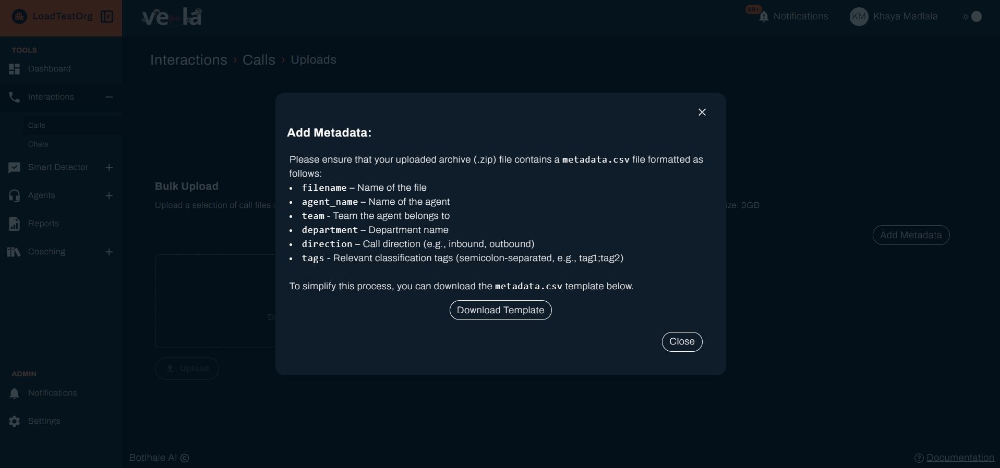
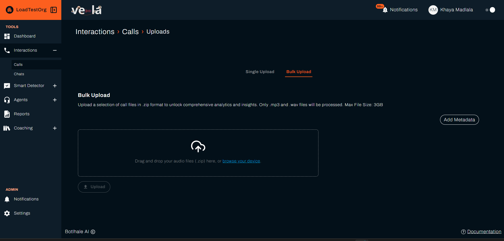
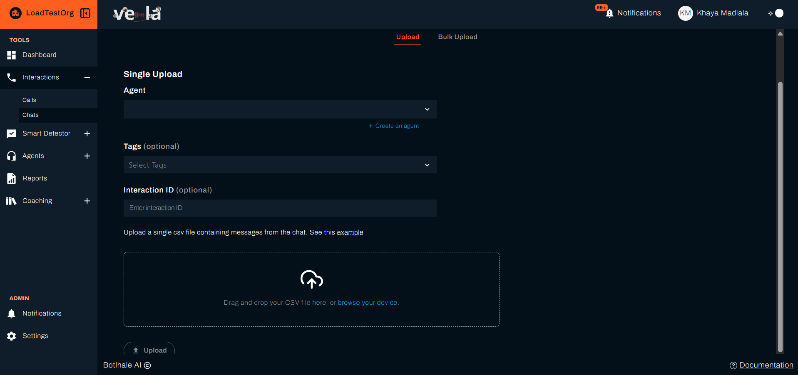
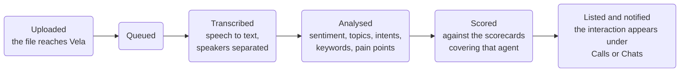

import Tabs from '@theme/Tabs';
import TabItem from '@theme/TabItem';

# Upload Your Data
Upload your call and chat data to start analysing customer interactions and improving team performance.

Recordings and transcripts you upload are encrypted in transit and at rest, and sensitive details in transcripts are masked. See [Security and Compliance](./security-compliance.md).

---

## Before You Begin

You need:

- **A file in a format Vela accepts.** Calls are WAV or MP3. A single chat is CSV and a bulk chat upload is JSON. A bulk call upload is a ZIP holding the audio files and a `metadata.csv`. Check which tab you are on before preparing the file, because the tabs take different formats. See [Supported Formats](#supported-formats) for every limit.
- **The agent who handled the interaction.** Choosing the agent fills in their team and department for you. All three are required, so an agent recorded with **No Team** or **No Department** leaves those fields empty and the Upload button stays disabled.
- **Access level:** Organisational, Departmental, or Team, covering the agent. See [Access Level](./reference/glossary.md#access-level).
- **Duration left in your organisation's monthly allocation.** What happens when it runs out depends on the **Duration Usage Setting** an administrator chose: analysis either halts or continues at additional rates. See [Organisation Configuration](./settings-config/organisation-configuration.md).

---

## Upload Methods

### Manual Upload

Use Vela to upload files directly. Best for getting started and for ad-hoc uploads.

#### Single Call Upload

1. Select **Interactions → Calls** in the left sidebar
2. Select **Upload**
3. Select the **Single Upload** tab
4. Fill in the form: choose the **Agent** (Team and Department fill in automatically), then optionally set **Direction** and **Tags**
5. Select your audio file (WAV or MP3) or drag and drop it into the upload area
6. Select **Upload**


#### Bulk Call Upload

Bulk upload brings in many recordings at once from a single ZIP archive. Use it to import your existing recordings when you first set up Vela, or to bring in a batch of calls later.

**Step 1: Prepare your audio files**

Confirm every file is WAV or MP3, then compress them into a single ZIP archive. Keep the archive under the 3 GB limit, and split larger sets into several batches.

Use ZIP, not RAR or 7z. The upload area takes those too, so the file uploads in full before Vela reads it and finds it cannot.

If you zip files the normal way in Windows Explorer, the archive already works. The tabs below cover 7-Zip and WinRAR, which offer choices that can produce a ZIP Vela cannot read.

:::note If an archive uploads but never processes
The compression method is the usual cause. Vela reads archives compressed with **Deflate**, which is what Windows Explorer uses by default, and **Store**, which means no compression. **Deflate64**, **BZip2** and **LZMA** produce a valid ZIP file that Vela cannot open, so it uploads in full and then fails.
:::

<Tabs groupId="zip-tool">
<TabItem value="windows" label="Windows (built-in)">

Windows Explorer uses Deflate by default, so its archives are already compatible. Select your files, right-click, and choose **Send to → Compressed (zipped) folder**.

</TabItem>
<TabItem value="7zip" label="7-Zip">

1. Select your files, right-click, and choose **7-Zip → Add to archive**.
2. Set **Archive format** to **zip**.
3. Set **Compression method** to **Deflate** (not Deflate64).
4. Select **OK**.

</TabItem>
<TabItem value="winrar" label="WinRAR">

1. Select your files, right-click, and choose **Add to archive**.
2. Set the archive format to **ZIP** (not RAR).
3. Any compression level works.

</TabItem>
</Tabs>

**Step 2: Prepare the metadata file**

Create a `metadata.csv` describing each recording, and place it inside the same ZIP archive as the audio files.

```csv
filename,agent_name,team,department,direction,tags
call_001.mp3,John Smith,Sales Team,Sales,inbound,sales;product_inquiry
call_002.wav,Mary Jones,Support Team,Customer Service,outbound,follow_up;resolution
```



| Column | Description | Example |
| :--- | :--- | :--- |
| `filename` | The exact audio file name, including the extension | `call_001.mp3` |
| `agent_name` | The agent's name as recorded in Vela | `John Smith` |
| `team` | The team the agent belongs to | `Sales Team` |
| `department` | The agent's department | `Customer Service` |
| `direction` | Call direction | `inbound` or `outbound` |
| `tags` | Classification labels, semicolon-separated | `sales;product_inquiry` |

`agent_name`, `team`, and `department` are matched case-insensitively, so `John Smith` and `john smith` both work. They match on the **name** as recorded in Vela, so a username or email such as `john.smith` does not match.

:::tip Start from the template
Download the `metadata.csv` template from the upload page and build your file from it. Mismatched column names are the most common cause of bulk upload failures.
:::

**Step 3: Upload**

1. Select **Interactions → Calls → Upload**
2. Select the **Bulk Upload** tab
3. Upload your ZIP file
4. Wait for the upload to finish. Processing then runs in the background, so you can leave the page
5. Vela emails you when the analysis is ready, and the calls appear under **Interactions → Calls**



:::tip Test with a small batch first
Upload five to ten files before committing a large historical dataset. Confirming that agent, team, and department names match correctly on a small batch is far less disruptive than discovering a systematic error after thousands of files.
:::

#### Chat Upload

1. Select **Interactions → Chats → Upload**
2. Select the **Upload** tab for a single chat or **Bulk Upload** for multiple
3. Upload your file
4. Wait for the upload to finish. Processing then runs in the background

:::warning The two tabs take different file formats
**Upload** accepts a **CSV** file containing the messages of one chat. **Bulk Upload** accepts **JSON**. The upload area rejects the wrong format, so check which tab you are on before preparing the file.

On the **Upload** tab you can also set **Agent**, **Tags**, and an **Interaction ID**, all optional except the agent. The page ends that instruction with a dotted-underlined **example** link. Select it to download a sample CSV with the exact layout.
:::



Bulk chat files must follow the layout Vela expects: a list of conversations, each with a `metadata` section and a `messages` list.

```json
[
  {
    "metadata": {
      "date": "DD/MM/YYYY, HH:mm:ss",
      "agent": "agent@example.com",
      "interaction_id": "<your_reference>",
      "language": "en-ZA"
    },
    "messages": [
      {
        "message": "message 1",
        "time": "DD/MM/YYYY, HH:mm:ss",
        "sender": "user",
        "language": "en-ZA"
      }
    ]
  }
]
```

Every message must have `message`, `time`, and `sender`. `sender` must be `user`, `agent`, or `bot`.

For the full details, including size limits, see [System Requirements](./getting-started/system-requirements.md).

---

### API Upload

Upload call recordings or chat data programmatically via the Vela API. You need an API token first. See the [API Reference](./advanced/api-documentation.md) for how to obtain one, and for the full request and response formats.

**Call recordings endpoint:** `https://api.botlhale.xyz/asr/async/upload/vela`

**Step 1: Get upload credentials**
```python
import requests, json

response = requests.post(
    "https://api.botlhale.xyz/asr/async/upload/vela",
    headers={"Authorization": "Bearer YOUR_API_TOKEN"},
    data={
        'org_id': 'your_org_id',
        'metadata': json.dumps({"email": "agent@example.com", "date_of_call": "15/01/2025, 14:30:00"})
    }
)
result = response.json()
```

**Step 2: Upload the audio file**
```python
files = [('file', ('call.wav', open('call.wav', 'rb'), 'audio/wav'))]
requests.post(result['url'], data=result['fields'], files=files)
```

**Chat upload endpoint:** `https://api.botlhale.xyz/chats/upload/vela`

See the [API Reference](./advanced/api-documentation.md) for full request formats and the chat payload schema.

---

## Supported Formats

| Type | Formats | Size limit |
|------|---------|------------|
| Single audio upload | WAV, MP3 | 1 GB |
| Bulk upload (archive) | WAV or MP3 + metadata.csv, in a ZIP | 3 GB |
| Single chat upload | CSV | Not stated on the page |
| Bulk chat upload | JSON, in the layout shown above | 1 MB |

Audio files above their limit are rejected before the upload starts, with a "file too big" message.

:::note Chat file size
The **Bulk Upload** tab states a 1 MB maximum. The single **Upload** tab states none, so treat 1 MB as the guide for both.

Split large exports into several files rather than uploading one big one. A failed upload then costs you one small file rather than the whole export.
:::

---

## Processing

Once uploaded, Vela queues files for processing. Transcription, speaker identification, sentiment analysis, keyword detection, intent classification, and automatic scorecard evaluation all happen during processing, one after another.


```mermaid
flowchart LR
    A("Uploaded<br/>the file reaches Vela") --> B("Queued")
    B --> C("Transcribed<br/>speech to text,<br/>speakers separated")
    C --> D("Analysed<br/>sentiment, topics, intents,<br/>keywords, pain points")
    D --> E("Scored<br/>against the scorecards<br/>covering that agent")
    E --> F("Listed and notified<br/>the interaction appears under<br/>Calls or Chats")
```

An interaction reaches the **Calls** or **Chats** list once all of that has finished, not when you upload it. An upload you cannot find yet is normally still working through it rather than lost.

Processing time depends on file length, audio quality, and current server load. Vela emails you when processing is complete.

---

## Check Your Work

Wait for the notification telling you the analysis is ready, then open **Interactions → Calls** or **Interactions → Chats** and check that your files are listed.

An interaction that is not in the list yet has not finished processing. That is the normal state straight after an upload, so give it time before treating it as a failure, and see [Troubleshooting](#troubleshooting) below if it stays that way.

A bulk upload also shows a results screen naming any rows it could not process. Read that before assuming the whole batch succeeded, because a row rejected there is never processed at all.

---

## Troubleshooting

| Problem | Likely cause | Solution |
| :--- | :--- | :--- |
| Upload fails | Unsupported format or file too large | Use WAV or MP3. Keep a single call under 1 GB and a ZIP under 3 GB |
| A bulk upload uploads, then processes nothing | The archive is RAR or 7z rather than ZIP | Recreate it as a ZIP and upload again |
| `Unknown compression method: 9`, `: 12`, or `: 14` | The ZIP was made with Deflate64, BZip2, or LZMA | Recreate it with Deflate or Store. See [Prepare your audio files](#bulk-call-upload) |
| Chat upload fails | The file format does not match the tab. **Upload** takes CSV, **Bulk Upload** takes JSON | Check which tab you are on, then supply that format |
| Bulk chat upload fails | The JSON is broken, or does not match the layout Vela expects | Check the file against the layout in [Chat Upload](#chat-upload), and confirm every message has `message`, `time`, and `sender` |
| Processing fails | Poor audio quality or corrupted file | Verify the file plays locally before uploading |
| Slow processing | Large batch or peak server load | Split large batches, and run a big historical import overnight |

### Bulk Metadata Errors

A bulk upload checks the `metadata.csv` before it processes anything. If it returns one of these, fix the CSV and upload again:

| Error message | Cause | Fix |
| :--- | :--- | :--- |
| `CSV file does not contain 'filename' header` | The CSV has no `filename` column | Add a `filename` column. The template already has the right headers |
| `Mismatch between .wav/.mp3 files and CSV entries` | A `filename` in the CSV is not in the ZIP, or a file in the ZIP is not listed | Make every `filename` match a file in the ZIP exactly, including the extension |
| `Invalid direction value in CSV` | A `direction` value is not `inbound`, `outbound`, or blank | Use `inbound`, `outbound`, or leave it blank |
| `Agent 'X' cannot be created without a team` | The CSV names a new agent with no team | Add that agent's `team` and `department` to the row |
| `Department name 'X' exceeds the maximum length of 30 characters` | A new department or team name is too long. The same limit applies to both | Shorten the name to 30 characters or fewer |
| `Team name 'X' contains invalid characters` | The name uses a character outside the allowed set | Use letters, numbers, spaces, hyphens, underscores, or ampersands only |
| `You are trying to create a new department but you don't have permissions to do that` | Creating a department needs organisational access, and creating a team needs departmental or organisational access | Ask an administrator to create it first, or choose the skip option during import |

A bulk upload can create departments and teams that the CSV names but Vela does not have yet, within your own access level. Creating a department needs organisational access. Creating a team needs departmental or organisational access.

New department and team names must be 30 characters or fewer, and use only letters, numbers, spaces, hyphens, underscores, and ampersands. A name containing a slash, apostrophe, or full stop is rejected.

---

## Related

- [Review and Score Interactions](./features/quality-assurance-tools.md): review and score what you have uploaded
- [System Requirements](./getting-started/system-requirements.md): the full format and size specifications
- [API Reference](./advanced/api-documentation.md): send calls and chats programmatically
- [Security and Compliance](./security-compliance.md): where uploaded recordings and transcripts are held, how they are encrypted, and how they are backed up

## Need Help?

**Contact Support:** support@botlhale.ai
