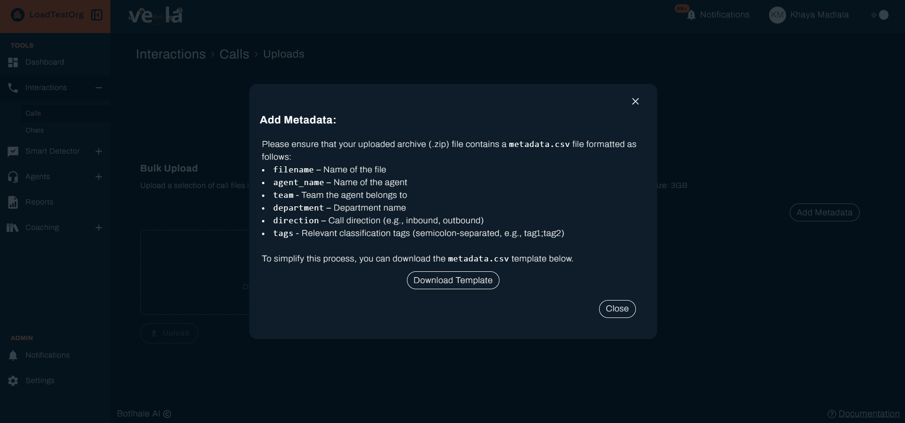
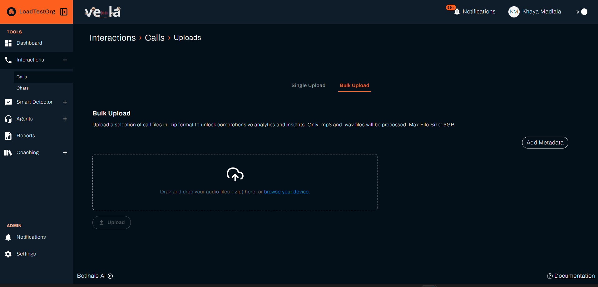

import Tabs from '@theme/Tabs';
import TabItem from '@theme/TabItem';
import { SingleCallUploadForm } from '@site/src/components/annotatedForms';
import Hotspots from '@site/src/components/Hotspots';
import chatUpload from '@site/img/screenshots/chats/upload.png';

# Upload Your Data
Upload your call and chat data to start analysing customer interactions and improving team performance.

:::tip In short
By the end you will have your calls and chats in Vela, listed under **Interactions** once processing finishes.

1. For one call, use the [**Single Upload** tab](#single-call-upload) under **Interactions → Calls → Upload** and choose the **Agent**.
2. For many calls, zip the recordings with a `metadata.csv` and use the [**Bulk Upload** tab](#bulk-call-upload).
3. For chats, use [**Interactions → Chats → Upload**](#chat-upload), with a CSV on **Upload** or JSON on **Bulk Upload**.
:::

Recordings and transcripts you upload are encrypted in transit and at rest, and sensitive details in transcripts are masked where your administrator has configured redaction. See [Security and Compliance](./security-compliance.md).

---

## Before You Begin

You need:

- **A file in a format Vela accepts.** Calls are WAV or MP3. A single chat is CSV and a bulk chat upload is JSON. A bulk call upload is a ZIP holding the audio files and a `metadata.csv`. See [Supported Formats](#supported-formats) for every limit.
- **The agent who handled the interaction, with a team and department.** This applies to the **Single Upload** call tab and the **Upload** chat tab. Choosing the agent fills in their team and department, and the upload needs both. For an agent recorded with **No Team** or **No Department**, give them a team first in [Manage Agents and Teams](./features/manage-agents-and-teams.md). Bulk uploads take the agent, team, and department from the file instead, covered under each format below. {/* ENGINEERING (known bug, documented as intended): on the Single Upload call tab, Team and Department can be changed on the form, but for an existing agent the form sends only agent, direction, and tags, and the server files the call under the agent record's team and department (vela origin/vela-fly calls/upload/upload.jsx:107-121, api/interactions/calls/route.js:115-122). For an agent with No Team, choosing a team on the form turns Upload on, but the call is filed with no team. On the chat tab, an agent with no team or department is caught only after the file is sent (Invalid team, or Team not found for this organisation). Intended: the call is filed under the team shown on the form, and the chat form checks the agent before sending. Converted from visible text 2026-10-08. */}
- **Access level:** Organisational, Departmental, or Team, covering the agent. See [Access Level](./reference/glossary.md#access-level).
- **Duration left in your organisation's monthly allocation.** What happens when it runs out depends on the **Duration Usage Setting** an administrator chose: analysis either halts or continues at additional rates. See [Organisation Configuration](./settings-config/organisation-configuration.md).

---

## Upload Methods

### Manual Upload

Use Vela to upload files directly. Best for getting started and for ad-hoc uploads.

#### Single Call Upload

1. Select **Interactions → Calls** in the left sidebar
2. Select **Upload**
3. Select the **Single Upload** tab
4. Fill in the form: the **Agent** is required, **Direction** and **Tags** are not. **Team** and **Department** fill in from the agent's record, and the call is filed under those
5. Select your audio file (WAV or MP3) or drag and drop it into the upload area
6. Select **Upload**

<SingleCallUploadForm />

#### Bulk Call Upload

Bulk upload brings in many recordings at once from a single ZIP archive. Use it to import your existing recordings when you first set up Vela, or to bring in a batch of calls later.

**Step 1: Prepare your audio files**

Confirm every file is WAV or MP3, then compress them into a single ZIP archive. Keep the archive under the 3 GB limit, and split larger sets into several batches. Vela rejects a larger ZIP as soon as you add it.

Use a ZIP archive. If your recordings are in a RAR or 7z archive, extract them and zip them again first. {/* ENGINEERING (known bug, documented as intended): the Bulk Upload tab accepts .rar and .7z (vela origin/vela-fly app/(pages)/interactions/calls/upload/upload.jsx:36 and :182 accept list), but vela-data unchunk reads ZIP only, so the archive uploads in full and then fails with Bad archive. Intended: the Bulk Upload tab accepts ZIP only. */}

If you zip files the normal way in Windows Explorer, the archive already works. Vela reads ZIP archives compressed with **Deflate**, the Windows default, or **Store**. In 7-Zip or WinRAR, use the settings in the tabs below.

<Tabs groupId="zip-tool">
<TabItem value="windows" label="Windows (built-in)">

Windows Explorer uses Deflate by default, so its archives are already compatible. Select your files, right-click, and choose **Send to → Compressed (zipped) folder**.

</TabItem>
<TabItem value="7zip" label="7-Zip">

1. Select your files, right-click, and choose **7-Zip → Add to archive**.
2. Set **Archive format** to **zip**.
3. Set **Compression method** to **Deflate** (not Deflate64).
4. Select **OK**.

</TabItem>
<TabItem value="winrar" label="WinRAR">

1. Select your files, right-click, and choose **Add to archive**.
2. Set the archive format to **ZIP** (not RAR).
3. Any compression level works.

</TabItem>
</Tabs>

**Step 2: Prepare the metadata file**

Create a `metadata.csv` describing each recording, and place it inside the same ZIP archive as the audio files.

```csv
filename,agent_name,team,department,direction,tags
call_001.mp3,John Smith,Sales Team,Sales,inbound,sales;product_inquiry
call_002.wav,Mary Jones,Support Team,Customer Service,outbound,follow_up;resolution
```



| Column | Description | Example |
| :--- | :--- | :--- |
| `filename` | The exact audio file name, including the extension | `call_001.mp3` |
| `agent_name` | The agent's name as recorded in Vela | `John Smith` |
| `team` | The team the agent belongs to | `Sales Team` |
| `department` | The agent's department | `Customer Service` |
| `direction` | Call direction | `inbound` or `outbound` |
| `tags` | Classification labels, semicolon-separated | `sales;product_inquiry` |

`agent_name`, `team`, and `department` are matched case-insensitively, so `John Smith` and `john smith` both work. They match on the **name** as recorded in Vela, so a username or email such as `john.smith` does not match.

If a name matches no existing agent, team, or department, Vela creates a new one with that name, within your access level, and puts the calls under it. A misspelt name therefore creates a duplicate rather than failing. After a bulk upload, check **Agents → Agent Details** for agents you did not expect.

File names inside the ZIP must end in lower-case `.wav` or `.mp3`. Where `metadata.csv` names a `.WAV` or `.MP3` file, the whole upload fails with `Mismatch between .wav/.mp3 files and CSV entries`. So rename any `.WAV` or `.MP3` files, and their `filename` entries, before you zip them.

:::tip Start from the template
Download the `metadata.csv` template from the upload page and build your file from it. Mismatched column names are the most common cause of bulk upload failures.
:::

**Step 3: Upload**

1. Select **Interactions → Calls → Upload**
2. Select the **Bulk Upload** tab
3. Upload your ZIP file
4. Wait for the upload to finish. Processing then runs in the background, so you can leave the page
5. The calls appear under **Interactions → Calls** as each one finishes. Vela emails a summary of the batch to users who have **New Alerts Detected** ticked under email notifications in **Settings → Notifications**. Tick it if you want the summary yourself. On the [Lite](./reference/glossary.md#lite) version that setting is hidden, and the summary goes to every user

{/* ENGINEERING (known bug, documented as it behaves; the intended Lite behaviour needs the product owner): Lite hides New Alerts Detected (vela origin/vela-fly settings/notifications.jsx:123,194, !isLite), but addUser sets notifications.email.issues: role !== "agent" for every new user (settings.jsx:187-194; api/register/route.js:105), and vela-data sends batchCompleteEmail to every profile with email.issues true, with no version check (dev-hold lib/inference/engine.js:485-493, 1472-1478; main app/api/notifications/route.js:679-700). So every Lite user receives the batch summary and cannot turn it off. Found 2026-10-08. */}



:::tip Test with a small batch first
Upload five to ten files before committing a large historical dataset. Confirming that agent, team, and department names match correctly on a small batch is far less disruptive than discovering a systematic error after thousands of files.
:::

#### Chat Upload

1. Select **Interactions → Chats → Upload**
2. Select the **Upload** tab for a single chat or **Bulk Upload** for multiple
3. On the **Upload** tab, choose the **Agent**. **Tags** and **Interaction ID** are optional
4. Upload your file
5. Wait for the upload to finish. Processing then runs in the background

:::warning The two tabs take different file formats
**Upload** accepts a **CSV** file containing the messages of one chat. **Bulk Upload** accepts **JSON**. The upload area rejects the wrong format, so check which tab you are on before preparing the file.
:::

<Hotspots
  src={chatUpload}
  alt="The Upload tab of the chat Uploads page, with the Upload and Bulk Upload tabs above the Agent, Team, Department, Tags, and Interaction ID fields, the CSV drag-and-drop area, and the Upload button"
  points={[
    { x: 23.5, y: 24.1, title: 'Agent', body: 'The agent who handled the chat. Choosing them fills in Team and Department, and the agent needs both for the upload to be accepted. + Create an agent adds one without leaving the page.' },
    { x: 27.1, y: 38.9, title: 'Tags', body: 'Labels such as complaint, sales, or billing, so you can filter and report on the chat afterwards. Optional.' },
    { x: 31.3, y: 50.7, title: 'Interaction ID', body: 'Your own reference for the conversation, carried through to the interaction. Optional.' },
    { x: 56.3, y: 77.6, title: 'The upload area', body: 'Drag the CSV in, or select the browse your device link. The dotted example link above it downloads a sample CSV with the exact layout.' },
  ]}
/>

Bulk chat files must follow the layout Vela expects: a list of conversations, each with a `metadata` section and a `messages` list.

```json
[
  {
    "metadata": {
      "date": "DD/MM/YYYY, HH:mm:ss",
      "agent": "agent@example.com",
      "interaction_id": "<your_reference>",
      "language": "en-ZA"
    },
    "messages": [
      {
        "message": "message 1",
        "time": "DD/MM/YYYY, HH:mm:ss",
        "sender": "user",
        "language": "en-ZA"
      }
    ]
  }
]
```

Every message must have `message`, `time`, and `sender`. `sender` must be `user`, `agent`, or `bot`. Give each message the time it was sent, because Vela measures the chat from its first message to its last.

For the full details, including size limits, see [System Requirements](./getting-started/system-requirements.md).

---

### API Upload

Upload call recordings or chat data programmatically via the Vela API. You need an access token first, which you get by signing in. See the [API Reference](./advanced/api-documentation.md) for how to obtain one, and for the full request and response formats.

**Call recordings endpoint:** `https://api.botlhale.tech/asr/async/upload/vela`

**Step 1: Get upload credentials**
```python
import requests, json

response = requests.post(
    "https://api.botlhale.tech/asr/async/upload/vela",
    headers={
        "Authorization": "Bearer YOUR_ACCESS_TOKEN",
        "Content-Type": "application/json",
    },
    json={
        'org_id': 'your_org_id',
        'metadata': {"email": "agent@example.com", "date_of_call": "15/01/2025, 14:30:00"},
    },
)
result = response.json()
```

**Step 2: Upload the audio file**
```python
files = [('file', ('call.wav', open('call.wav', 'rb'), 'audio/wav'))]
requests.post(result['url'], data=result['fields'], files=files)
```

**Chat upload endpoint:** `https://api.botlhale.tech/chats/upload/vela`

See the [API Reference](./advanced/api-documentation.md) for full request formats and the chat payload schema.

---

## Supported Formats

| Type | Formats | Size limit |
|------|---------|------------|
| Single audio upload | WAV, MP3 | 1 GB |
| Bulk upload (archive) | WAV or MP3 + metadata.csv, in a ZIP | 3 GB |
| Single chat upload | CSV | 3 GB |
| Bulk chat upload | JSON, in the layout shown above | 1 MB advised (3 GB enforced) |

Audio files above their limit are rejected before the upload starts, with the message `file too big!`.

:::note Chat file size
The **Bulk Upload** tab advises keeping each JSON file to 1 MB, and uploading one file at a time. Split a large export into several files.
:::

---

## Processing

Once uploaded, Vela queues files for processing. Transcription, speaker identification, sentiment analysis, keyword detection, intent classification, and automatic scorecard evaluation all happen during processing, one after another.

An interaction reaches the **Calls** or **Chats** list once all of that has finished, not when you upload it. An upload you cannot find yet is normally still processing, not lost.

Processing time depends on file length, audio quality, and current server load. For a single upload, Vela emails the address you sign in with when processing is complete. For a bulk upload, Vela emails a summary of the batch, as described in [Bulk Call Upload](#bulk-call-upload).

A single call is dated by the audio file's last-modified time, and a call in a bulk upload by the time stored for that file in the ZIP. A recording copied or saved again before upload therefore carries that later date.

---

## Check Your Work

Open **Interactions → Calls** or **Interactions → Chats** and check that your files are listed. An interaction appears once processing finishes, so if you receive an email when the analysis is ready, check after it arrives. If it has still not appeared after the email, check the failed count in a bulk upload's summary email, and ask an administrator whether the monthly allocation has run out. See [Troubleshooting](#troubleshooting) below.

A bulk upload reports by email. The summary gives counts: how many files uploaded, were analysed, failed, and were skipped because the monthly allocation ran out. To check individual files, compare what appears in the list against the files you sent.

---

## Troubleshooting

| Problem | Likely cause | Solution |
| :--- | :--- | :--- |
| Upload fails | Unsupported format or file too large | Use WAV or MP3. Keep a single call under 1 GB and a ZIP under 3 GB |
| `Bad archive` once a bulk upload finishes | The archive is not a ZIP | Recreate it as a ZIP and upload again |
| `Unknown compression method: 9`, `: 12`, or `: 14` | The ZIP was made with Deflate64, BZip2, or LZMA | Recreate it with Deflate or Store. See [Prepare your audio files](#bulk-call-upload) |
| Chat upload fails | The file format does not match the tab. **Upload** takes CSV, **Bulk Upload** takes JSON | Check which tab you are on, then supply that format |
| Bulk chat upload fails | The JSON is broken, or does not match the layout Vela expects | Check the file against the layout in [Chat Upload](#chat-upload), and confirm every message has `message`, `time`, and `sender` |
| Processing fails | Poor audio quality or corrupted file | Verify the file plays locally before uploading |
| Slow processing | Large batch or peak server load | Split large batches, and run a big historical import overnight |

### Bulk Metadata Errors

A bulk upload checks the `metadata.csv` before it processes anything. If it returns one of these, fix the CSV and upload again:

| Error message | Cause | Fix |
| :--- | :--- | :--- |
| `CSV file does not contain 'filename' header` | The CSV has no `filename` column, or it was saved in Excel's **CSV UTF-8** format, which adds a hidden character before the first heading | Add a `filename` column, or save the file again as **CSV (Comma delimited)**. The template already has the right headers |
| `Mismatch between .wav/.mp3 files and CSV entries` | A `filename` in the CSV is not in the ZIP, a file in the ZIP is not listed, or a file ends in upper-case `.WAV` or `.MP3` | Make every `filename` match a file in the ZIP exactly, and use lower-case `.wav` or `.mp3` extensions |
| `Invalid direction value in CSV` | A `direction` value is not `inbound`, `outbound`, or blank | Use `inbound`, `outbound`, or leave it blank |
| `Agent 'X' cannot be created without a team` | The CSV names a new agent with no team | Add that agent's `team` and `department` to the row |
| `Team X cannot be without a department.` | A row names a `team` but leaves `department` blank. This applies to existing teams too | Add the `department` to that row |
| `Department name 'X' exceeds the maximum length of 30 characters` | A new department or team name is too long. The same limit applies to both | Shorten the name to 30 characters or fewer |
| `Team name 'X' contains invalid characters` | The name uses a character outside the allowed set | Use letters, numbers, spaces, hyphens, underscores, or ampersands only |
| `You are trying to create a new department but you don't have permissions to do that` | Creating a department needs organisational access, and creating a team needs departmental or organisational access | Ask an administrator to create it first |

{/* ENGINEERING (known bug, documented as intended): an upload that ends in one of the errors above can still leave a department or team behind, because unchunk creates them before every check has passed (vela-data app/api/unchunk/route.js, main and dev-hold). Intended: a failed upload creates nothing. Converted from visible text 2026-10-08. */}

Place `metadata.csv` at the root of the ZIP, or one folder down. Vela takes each call's agent, team, and department from it, so a ZIP without one files every call with no agent, team, or department.

---

## Related

- [Review and Score Interactions](./features/quality-assurance-tools.md): review and score what you have uploaded
- [System Requirements](./getting-started/system-requirements.md): the full format and size specifications
- [API Reference](./advanced/api-documentation.md): send calls and chats programmatically
- [Security and Compliance](./security-compliance.md): how uploaded recordings and transcripts are encrypted and backed up, and who to ask about where they are held

## Need Help?

**Contact Support:** support@botlhale.ai
