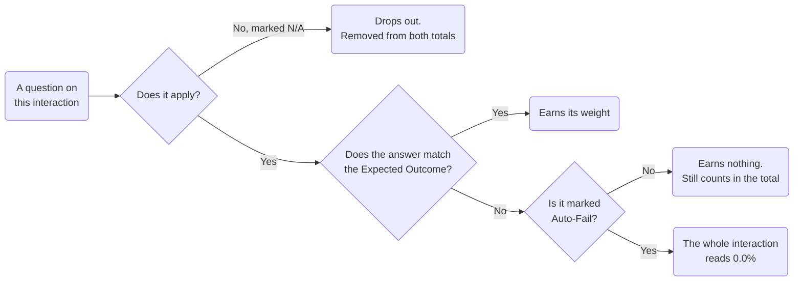
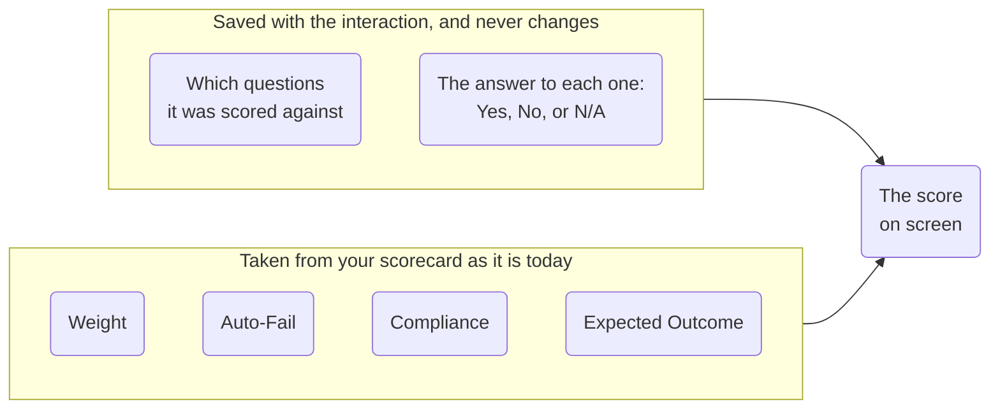
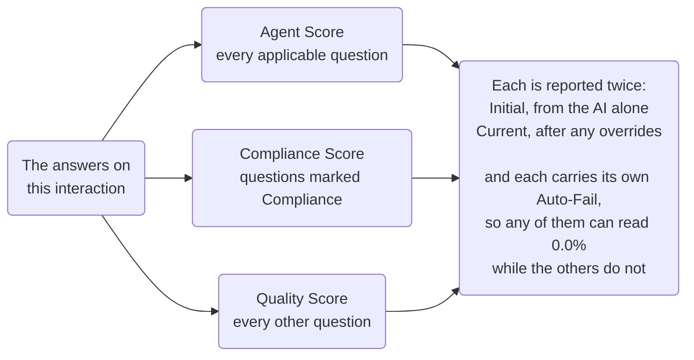
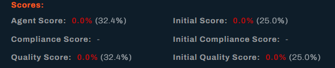

# How Scoring Works

This page explains the thinking behind Vela's scoring, so you can interpret the numbers and decide how much weight to put on them. It does not give instructions. For those, see [Review and Score Interactions](../features/quality-assurance-tools.md) and [Scorecard Fields](../reference/scorecard-fields.md).

---

## Every interaction is scored, not a sample

Traditional QA reviews a handful of calls per agent per month. The sample is small enough that an agent's score says more about which calls happened to be chosen than about their work.

Vela scores every interaction it processes. That changes what the number means. An average across hundreds of interactions is stable in a way a five-call sample never is, and an outlier stops being alarming because you can see the distribution it sits in.

It also changes where your effort goes. The scarce resource is attention, not coverage. That is what Smart Searches and alerts are for. They pick out which of the scored interactions need a person to look at them.

## The score is a weighted percentage

Each scorecard question carries a weight. For a given interaction, Vela adds up the weights of every applicable question to get a total, then adds up the weights of the questions the agent satisfied. The score is the second divided by the first, as a percentage.

Three consequences follow, and they surprise people:

**Weight is relative, not absolute.** A question weighted 10 among questions weighted 1 dominates the score. There is no scale to calibrate against, only the balance between your own questions.

**Questions marked N/A disappear entirely.** They are removed from both totals, not counted as failures. An interaction where half the scorecard did not apply is scored on the half that did, and is directly comparable to one where everything applied.

**Adding a question changes every future score.** The denominator moves. Scores before and after a scorecard change are not strictly comparable, so keep your own note of when you changed it. Vela does not record scorecard changes for you.

Every question on an interaction takes one of four paths, and between them they explain why one call scores 75% and another reads zero:

The sections that follow take each path in turn. A short example makes the arithmetic concrete. Take a four-question scorecard:

| Question | Weight | Outcome |
| :--- | :--- | :--- |
| Verified the customer's identity | 3 | Pass |
| Explained the fee | 2 | Fail |
| Offered the callback option | 3 | Pass |
| Handled the transfer correctly | 2 | N/A |

The transfer question is N/A, so it drops out, leaving three questions worth 8 points between them. The agent passed two of those, worth 6 points, so the score is 6 out of 8, or **75%**. Had the transfer question been scored No instead, it would stay in the total, and the same call would score 6 out of 10, or 60%. That gap is why marking applicability correctly matters.

## When a question does not apply

Not every question fits every call. "Was the transfer handled correctly?" means nothing on a call with no transfer. A question marked **N/A** drops out of the score, as above, so it neither helps nor hurts the agent.

Whether the AI can use N/A comes down to the question's **Always Applicable** setting:

- **Off** (the default): the AI may answer Yes, No, or N/A. For it to choose N/A, the question has to say when it applies, for example *"If the call was transferred, did the agent introduce the receiving department?"* Without that cue, a question that did not apply is often scored No instead.
- **On**: only Yes or No are available. Use it for behaviour expected on every call. On a call where the question does not apply, the agent gets a No.

The default costs something either way. Without a cue in the wording, a question left Off is scored No on the calls it does not fit, which lands the agent where switching Always Applicable on would have left them anyway. The wording is what earns the N/A.

For questions the AI cannot judge from the transcript, two settings help:

- **Search Type: Manual** hands the question to a reviewer. It stays N/A until they answer.
- **Apply Knowledge Base** judges the question against one of your own documents rather than general knowledge, which is what questions like "did the agent complete full verification?" need. See [Knowledge Base](../knowledge-base-guide.md).

## Expected Outcome exists because questions are not always positive

Most scorecard questions are phrased so that "yes" is good: *Did the agent verify the customer's identity?* Some are naturally phrased the other way: *Did the agent interrupt the customer?*

Rather than force every question into positive phrasing, each question records which answer is the desired one. Vela compares the actual answer against that setting.

This is worth understanding because a mis-set Expected Outcome inverts a question silently. The scorecard looks correct, the AI answers correctly, and the score is wrong in a way that is hard to spot from the number alone.

## Changing a scorecard after interactions are scored

Two different things happen here, and the difference matters. Some of what makes up a score is saved with the interaction and never changes again. The rest is taken from your scorecard as it stands today, every time someone opens that interaction:

So an old interaction keeps its answers for good, but the sum built from those answers is worked out fresh each time, using whatever the scorecard says now.

**Which questions an interaction was scored against is fixed when it is processed.** A question you add later does not appear on an older interaction, and one you delete stays on it, with the outcome it was given. Deleting a question retires it from future scoring rather than erasing it from the past.

**The settings on those questions are taken from your scorecard as it is today.** An interaction's score is worked out when you open it, not stored as a number at processing time. Change a question's **weight**, **Auto-Fail**, or **Compliance** setting, and every interaction already scored against that question is scored differently from that moment on. The stored answers do not move. The arithmetic applied to them does.

:::warning Editing a weight rewrites history
This applies backwards across your whole history, and it moves the **Initial** scores too, so the AI's original assessment is re-weighted along with yours. A trend that looked flat can change shape because of an edit made today.

Change weights deliberately, record when you did it, and compare periods either side of the change rather than reading the whole history as one measurement.
:::

The same applies to **Expected Outcome**. Change it after interactions have been scored, and their stored answers are judged against the new setting, so answers that read as passes can become failures.

**Rerun Scorecard** covers the one case the above does not. It appears on an interaction that has no automatic scorecard at all, for example one processed before you created yours, and scores it against the questions applying now. An interaction that already has a score keeps it, so this is not a route to picking up questions added since.

To apply a newly added question to older interactions, the interaction has to be processed again, which means uploading the recording a second time. That leaves you with two interactions for one conversation, so weigh it against starting the new measurement from the change instead.

## Auto-fail shows as zero, with the earned score kept beside it

A question marked Auto-Fail represents something that should invalidate an interaction on its own, such as a regulatory disclosure that was never given. Failing one auto-fails the whole interaction.

An auto-failed interaction reads **0.0%**, with the score the agent earned on everything else in brackets after it. A call showing `0.0% (20.5%)` was auto-failed and scored 20.5% on the rest of the scorecard. A question you mark **N/A** cannot auto-fail an interaction, since it drops out of the scorecard entirely.

Both numbers are there on purpose. The zero is the verdict: this interaction failed, whatever else went well. The bracketed figure is the detail you coach on, and it is the reason the earned score is not thrown away. Two auto-failed calls, one that scored 30% on everything else and one that scored 90%, need very different conversations. The first agent is struggling broadly. The second did good work and missed one critical step, which is usually a memory or process problem rather than a capability one.

Read the bracketed number alongside the zero. An agent whose scores are all zeros is not necessarily an agent who is failing at everything.

The same applies to the compliance and quality subtotals. Each can be auto-failed on its own, and each has its own pair of figures, which is why **Compliance Score** and **Quality Score** in the Call Details panel can read zero independently of one another.

## Compliance and quality are two views of one scorecard

There are not two scorecards. Each question is either marked as a compliance item or it is not, and Vela calculates the same weighted percentage twice: once across the compliance questions, once across the rest.

One set of answers therefore produces six figures in the Call Details panel, which is the usual reason that panel looks more complicated than it is:

The split exists because the two behave differently in practice. Compliance is usually binary and non-negotiable, and a dip matters immediately. Quality is a gradient you improve over months. Averaging them into a single figure hides both signals, since a compliance failure can be masked by strong quality work.

## Human judgement overrides the AI, by design

When a reviewer changes an outcome, their answer replaces the AI's for that question and the score is recalculated. Nothing is lost in the process. The interaction keeps Vela's original **Initial Score**, **Initial Compliance Score**, and **Initial Quality Score** beside the current ones, and the scorecard download records both the initial and the current outcome for every question.

The reason for keeping both is accountability rather than nostalgia. A score a human has adjusted is a different kind of claim from one the AI produced alone, and an agent disputing a score is entitled to see which is which. It also lets you audit your own reviewers: if overrides consistently move scores in one direction, the problem is more likely the scorecard than the AI.

Override on evidence rather than instinct. Every question the AI answered carries its reasoning, shown by the information icon beside the score on the Scorecard tab, so you can read what it based the answer on before deciding it was wrong. Where the reasoning holds up and the answer still feels harsh, reword the question. That fixes it once, whereas overriding the same item every week fixes it never.

## What the AI judges well, and what it does not

Being clear about this protects you from over-trusting the number.

**Reliable:** whether specific words or phrases were said, whether a topic came up, the shape of the conversation, and how sentiment moved through it. These are close to observable facts in a transcript.

**Less reliable:** anything requiring context the transcript does not contain. Whether an exception was justified. Whether a customer was satisfied rather than merely polite. Whether an agent's brevity was efficient or dismissive. Sarcasm, cultural register, and the difference between a scripted phrase and a genuine one.

This is why scorecard questions work best when they describe something observable. *Did the agent state the cancellation notice period?* has an answer in the transcript. *Was the agent empathetic?* does not, and a question like that produces scores that feel arbitrary to the people receiving them.

Audio quality sets a ceiling on all of it. If the transcript is wrong, everything downstream inherits the error.

## Why Smart Questions are not scored

Plenty of things worth knowing about a conversation say nothing about the agent's performance. Whether a customer mentioned a competitor. Whether a particular product came up. Whether a known system fault was the cause.

Folding these into a scorecard would distort it, because the agent cannot influence the answer. Smart Questions exist so you can ask them without contaminating anyone's score. The answers are recorded and reportable, and they never touch the scoring calculation.

If you are unsure where a question belongs, ask what the answer describes. If it describes the **conversation**, it is a Smart Question. If it describes **what the agent did**, it belongs on the scorecard.

## Scope decides what is scored, not only what is seen

A scorecard applies to an organisation, a department, or a team. An interaction is scored against the scorecards covering the agent who handled it.

Scope is not the only filter. A question is applied to an interaction when four things line up:

- The scorecard's **scope** covers the agent.
- The question's **Search Status** is **Enabled**.
- Its **Apply To** matches the call's direction.
- The set's **Interactions** setting matches the channel.

A question set to Chats never scores a call, however well its scope fits. See [Scorecard Fields](../reference/scorecard-fields.md).

Two implications follow. Teams under different scorecards are not directly comparable, because they were measured against different criteria. And an interaction with no question covering it gets no score at all, which is the usual explanation when processed calls appear with nothing in the score column.

## The thresholds are yours

Vela produces a percentage. It does not decide what counts as good.

Your administrator sets the Red, Amber, and Green boundaries. Everything that looks like a judgement in the interface, such as an agent flagged as underperforming, traces back to those numbers rather than to any platform default.

Set them against your own standards and history rather than an external benchmark. A score of 70% means whatever your scorecard makes it mean, and comparing that figure with another organisation's is comparing two different measurements that happen to share a unit.

---

## Related

- [Scorecard Fields](../reference/scorecard-fields.md): every field on a scorecard question
- [Metrics](../reference/metrics.md): what each score metric measures
- [Glossary](../reference/glossary.md): definitions of the terms used here
- [Review and Score Interactions](../features/quality-assurance-tools.md): reviewing and scoring interactions

---

## Need Help?

**Contact Support:** support@botlhale.ai
