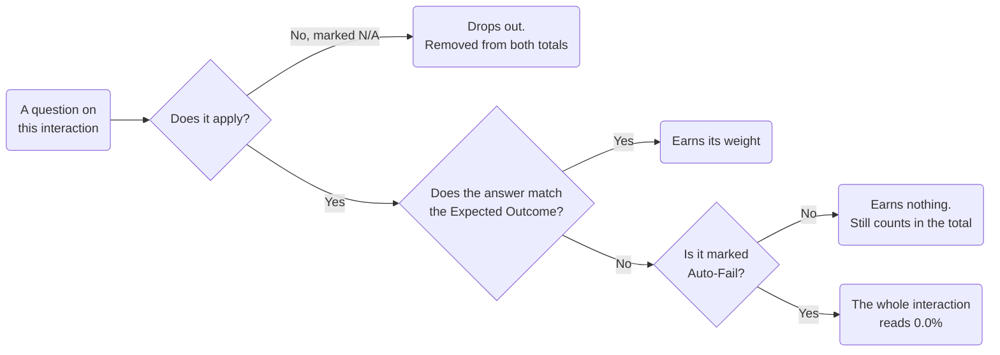

import ScorecardCalculator from '@site/src/components/ScorecardCalculator';
import Hotspots from '@site/src/components/Hotspots';
import scoresBlock from '@site/img/screenshots/calls/call-details-scores.png';

# How Scoring Works

This page explains the thinking behind Vela's scoring, so you can interpret the numbers and decide how much weight to put on them. For step-by-step instructions, see [Review and Score Interactions](../features/quality-assurance-tools.md) and [Scorecard Fields](../reference/scorecard-fields.md).

---

## Every interaction is scored

Traditional QA reviews a handful of calls per agent per month. The sample is too small for an agent's score to reliably reflect their performance. Instead, it may be influenced more by which calls happened to be selected.

Vela scores every interaction it processes. That changes what the number means. An average across hundreds of interactions is far more reliable than one from five calls, and a single unusual call no longer skews the picture, because you can see it alongside all the others.

It also changes where your effort goes. Vela covers every call, so your time goes on deciding which ones need a closer look. Smart Searches and alerts help you find them.

## The score is a weighted percentage

Each scorecard question has a weight you give it to reflect how much it matters. For each interaction, Vela adds up the weights of all the applicable questions, then the weights of the questions the agent met. The agent's score is the weight they earned, expressed as a percentage of the total applicable weight.

Three key consequences follow:

**Weight is relative, not absolute.** A question weighted 5 among questions weighted 1 dominates the score. There is no fixed scale. What matters is how each weight compares with the others on your scorecard.

**Questions marked N/A disappear entirely.** They are removed from both totals, not counted as failures. An interaction where half the scorecard did not apply is scored on the half that did, and is directly comparable to one where everything applied.

**Adding a question changes every future score**, because it adds to the total weight each score is measured against. Scores before and after a scorecard change are not strictly comparable, so note the date of each change yourself. Vela has no scorecard history to read back, so nothing in the product tells you what a setting was before you changed it.

Every question on an interaction takes one of four paths, and between them they explain why one call scores 75% and another reads zero:

```mermaid
flowchart LR
    Q("A question on<br/>this interaction") --> A{"Does it apply?"}
    A -- "No, marked N/A" --> NA("Drops out.<br/>Removed from both totals")
    A -- Yes --> B{"Does the answer match<br/>the Expected Outcome?"}
    B -- Yes --> P("Earns its weight")
    B -- No --> C{"Is it marked<br/>Auto-Fail?"}
    C -- No --> F("Earns nothing.<br/>Still counts in the total")
    C -- Yes --> AF("The whole interaction<br/>reads 0.0%")
```

The sections that follow take each path in turn. A short example makes the arithmetic concrete. Take a four-question scorecard:

| Question | Weight | Outcome | Applicable weight | Weight earned |
| :--- | :--- | :--- | :--- | :--- |
| Verified the customer's identity | 3 | Pass | 3 | 3 |
| Explained the fee | 2 | Fail | 2 | 0 |
| Offered the callback option | 3 | Pass | 3 | 3 |
| Handled the transfer correctly | 2 | N/A | Drops out | Drops out |
| **Total** | | | **8** | **6** |
| **Score** | | | | **6 ÷ 8 = 75%** |

The transfer question is N/A, so it drops out, leaving three questions with a combined weight of 8. The agent passed two of those, worth 6, so the score is 6 out of 8, or **75%**. Had the transfer question been marked Fail instead of N/A, it would stay in the total, and the same call would score 6 out of 10, or 60%. That gap is why marking applicability correctly matters.

## Try it yourself

The calculator below runs the same arithmetic on a scorecard you control. Change a weight, an answer, or an Auto-Fail setting and watch the three scores move: Agent Score, Quality Score, and Compliance Score, which are explained [further down](#compliance-and-quality-are-two-views-of-one-scorecard). It starts on the four-question example above.

<ScorecardCalculator />

## When a question does not apply

Not every question fits every call. "Was the transfer handled correctly?" only makes sense on a call that had a transfer. A question marked **N/A** drops out of the score, as above, so it neither helps nor hurts the agent.

Whether the AI can use N/A comes down to the question's **Always Applicable** setting:

- **No** (the default): the AI may answer Yes, No, or N/A. For it to choose N/A, the question has to say when it applies, for example *"If the call was transferred, did the agent introduce the receiving department?"* Without that wording, the AI often answers No on calls where the question does not apply. That is the same result as setting Always Applicable to Yes.
- **Yes**: only Yes or No are available. Use it for behaviour expected on every call. On a call where the question does not apply, the agent gets a No.

For questions the AI cannot answer from the transcript, two settings help:

- **Search Type: Manual** hands the question to a reviewer. It stays N/A until a reviewer scores it manually.
- **Apply Knowledge Base** checks the question against one of your own documents rather than general knowledge. Use it for questions that depend on your own procedures, such as "did the agent complete full verification?" See [Knowledge Base](../knowledge-base-guide.md).

## Expected Outcome exists because questions are not always positive

Most scorecard questions are phrased so that "yes" is good: *Did the agent verify the customer's identity?* Some are naturally phrased the other way: *Did the agent interrupt the customer?*

Rather than force every question into positive phrasing, each question records which answer is the desired one. Vela compares the actual answer against that setting.

Check this setting carefully. If Expected Outcome is set the wrong way round, the question scores backwards, with no warning. The scorecard looks right and the AI answers correctly, yet the score is wrong. After you create a question, open a few scored interactions and confirm its passes and fails look right.

## Changing a scorecard after interactions are scored

What happens to interactions that are already scored depends on what you change:

| What you change | What happens to interactions already scored |
| :--- | :--- |
| **Add a question** | Older interactions keep their current scores. To score them against the new question too, turn on **Historical Search** when you create it. See [Scoring older interactions against a new question](#scoring-older-interactions-against-a-new-question) |
| **Delete a question** | Older interactions keep the question and its result, so their scores stay the same. New interactions are scored without it |
| **Change Expected Outcome** | The AI's past answers keep their result, so a pass stays a pass. Answers a reviewer has changed are checked against the new setting, so a reviewer's pass can become a fail |
| **Change a weight, Auto-Fail, or Compliance Question** | Some scores switch to the new setting straight away. Others keep the old setting until the interaction is scored again. See below |

{/* Source: vela origin/main lib/helpers.js (calculateTotalScore reads the stored match for AI answers, and query.positive only for editedMatch), interactions/calls/[id]/callDetails.jsx (Agent Score is the stored total_agent_score, the rest recalculated), api/smart_detector/agents_checklist PUT (edits the question only). vela-data origin/main api/notifications/route.js (match set against positive at processing) and api/checklists/route.js (Historical Search appends to existing calls and re-saves metrics). Confirmed on screen 2026-09-30 (test_call_18.wav): after a weight change, Agent Score read 11.1% (stored, old settings) while Initial Score read 7.7% and Compliance Score 33.3% (live, new settings). A reviewer edit then rescored it: Agent Score 38.5%, matching 5 of 13 under the new settings. Agents Performance Details (Agent C, same date range) showed Overall 38.5%, Compliance 0.0%, Quality 50.0%, matching the rescored interaction; its code (agents/performance/[id]/page.jsx) recalculates from current question settings. Dashboard and the Performance list table read stored figures in code; not checked on screen. Re-checked 2026-10-01 against vela (Fly) origin/main: lib/helpers.js calculateTotalScore (N/A returns before the weight is added, so it leaves both totals and cannot auto-fail; a failed question still adds to possible; earned is zeroed on auto-fail while shadowScore is kept), components/calls/agentScore.jsx (the fail branch renders `0.0% (shadow%)`), chats/infoCard.jsx (all six score labels, in the documented order; calls reuse this card), callDetails.jsx (each of the six falls back to a literal "-", so 0 and absent both read as a dash; the three Initial figures are recomputed from current query.weight, so only the answers are the AI's), models/organisation.js (ragBoundaries default [50, 80]), agents_checklist create/edit forms (Expected Outcome, Weight, Auto-Fail, Compliance Question, Always Applicable, Search Type, Apply To, "search status" with Enabled/Disabled, Apply Knowledge Base, "Upon creation, run these questions on historical calls" with All historical calls / Specific date range), and calls/smart_detector.jsx (Rerun Scorecard renders only in the empty state of the Automatic tab, selectedTab 0, and is gated off by agentMode). The label is Compliance Question, never bare Compliance. Scorecard changes are not unlogged: api/smart_detector/agents_checklist/route.js calls logActivity for create, update and delete. lib/auditLog.js sends those to the shared logger only, with an allowlist that drops field values, and vela has no audit screen, so no before/after is readable in the product. Not verifiable here (vela-data absent): which questions a scoring run selects, Historical Search, and rescoring on reassignment. */}

### Changing a weight, Auto-Fail, or Compliance

Some scores are worked out each time you open the screen that shows them, using your current settings. Others are saved when the interaction is scored, and keep the settings from that time.

- **Use the new settings straight away:**
  - In the Call Details panel: the **Compliance Score**, **Quality Score**, the three **Initial** scores, and whether the interaction shows as auto-failed.
  - The **Agent Scorecard** table on an agent's **Agents → Performance → Details** page.
- **Keep the old settings:**
  - In the Call Details panel: the **Agent Score**.
  - The score on the Interactions list, the Dashboard, and the table on **Agents → Performance**.

A saved score switches to the new settings when that interaction is scored again. That happens in three cases: a reviewer changes an answer on it, its agent is reassigned, or a new question created with Historical Search runs on it.

:::warning Past scores mix old and new settings
After you change one of these settings, the Dashboard and the table on **Agents → Performance** keep using the old settings for past interactions. On a single interaction, the **Agent Score** uses the old settings while the **Compliance Score** and **Quality Score** beside it use the new ones, so the three can disagree. An agent's **Details** page also uses the new settings, so it can disagree with the **Agents → Performance** table you opened it from.

Make these changes on purpose, note the date of each change, and compare the period before the change with the period after it, rather than reading your whole history as one measurement.
:::

### Scoring older interactions against a new question

When you create a question on the **Create** tab, tick **Upon creation, run these questions on historical calls**, then choose **All historical calls** or a **Specific date range**. Vela adds the new question to each of those interactions and updates its scores. Each interaction stays a single record.

Historical Search is available only while you create the question. For a question already saved without it, choose one of these:

- Leave older interactions as they are, and measure the new question from the date you added it.
- Upload the recordings again. This creates a second copy of each interaction.

**Reassigning the agent** on an interaction also sends it back to the AI, which answers your questions as they stand today. Every answer is replaced, so reviewer overrides are lost. Use it only to correct an interaction assigned to the wrong agent. See [Review and Score Interactions](../features/quality-assurance-tools.md#d-reassign-the-agent).

The **Rerun Scorecard** button is for a different situation. It appears on the **Scorecard** tab's **Automatic** view, and only where that view is empty, such as an interaction processed before your scorecard existed.

## Auto-fail shows as zero, with the earned score kept beside it

A question marked Auto-Fail represents something that should invalidate an interaction on its own, such as a regulatory disclosure that was never given. Failing one auto-fails the whole interaction.

An auto-failed interaction reads **0.0%**, with the score the agent would have had without the auto-fail in brackets after it. The failed question still counts in that figure, earning nothing. A call showing `0.0% (20.5%)` was auto-failed, and would otherwise have scored 20.5%. A question you mark **N/A** cannot auto-fail an interaction, since it drops out of the scorecard entirely.

Both numbers are there on purpose. The zero is the verdict: this interaction failed, whatever else went well. The bracketed figure is the detail you coach on, which is why Vela keeps it. Two auto-failed calls, one reading `0.0% (30%)` and one reading `0.0% (90%)`, need very different conversations. The first agent is struggling broadly. The second did good work and missed one critical step, which is usually a memory or process problem rather than a capability one.

Read the bracketed number alongside the zero. An agent with a row of zeros may be doing well on everything except one critical step.

This is the notation on a single interaction. The **Agents → Performance** table uses the same rule across many interactions together: see [Monitor Agent Performance](../features/monitor-agent-performance.md#a-find-the-agent) for what a bracketed figure means there.

The same applies to the compliance and quality subtotals. Each can be auto-failed on its own, and each has its own pair of figures, which is why **Compliance Score** and **Quality Score** in the Call Details panel can read zero independently of one another.

## Compliance and quality are two views of one scorecard

There are not two scorecards. Each question is either marked as a compliance item or it is not, and Vela calculates the same weighted percentage twice: once across the compliance questions, once across the rest.

One set of answers therefore produces six figures in the Call Details panel:

<Hotspots
  src={scoresBlock}
  alt="The Scores block from the Call Details panel: Agent Score and Initial Score, Compliance Score and Initial Compliance Score, Quality Score and Initial Quality Score, each shown as a percentage or a dash"
  points={[
    { x: 43, y: 31, title: 'Agent Score', body: 'The weighted percentage across every applicable question. It is saved when the interaction is scored, so after a scorecard change it can differ from the scores below it. A dash means the score is 0% or there is no score.' },
    { x: 49, y: 31, title: 'Initial Score', body: "The Agent Score worked out from the AI's own answers, before any reviewer override. It uses your current settings, so only the answers are the AI's. A dash means the score is 0% or there is no score." },
    { x: 43, y: 58, title: 'Compliance Score', body: 'The same calculation run over only the questions marked Compliance Question. A dash means either no question on this interaction is marked Compliance Question, or the score is 0%. Check the Scorecard tab to tell which.' },
    { x: 49, y: 58, title: 'Initial Compliance Score', body: 'The Compliance Score from the AI\'s own answers, without any changes from a reviewer, and worked out with your current settings. A dash means the score is 0% or there is no score.' },
    { x: 43, y: 85, title: 'Quality Score', body: 'The same calculation over every question not marked Compliance Question. As with Compliance Score, a dash means either there are no such questions or the score is 0%.' },
    { x: 49, y: 85, title: 'Initial Quality Score', body: 'The Quality Score from the AI\'s own answers, without any changes from a reviewer, and worked out with your current settings. A dash means the score is 0% or there is no score.' },
  ]}
/>

The split exists because the two behave differently in practice. Compliance is usually binary and non-negotiable, and a dip matters immediately. Quality is a gradient you improve over months. Averaging them into a single figure hides both signals, since a compliance failure can be masked by strong quality work.

## Human judgement overrides the AI, by design

When a reviewer changes an outcome, their answer replaces the AI's for that question and the score is recalculated. Nothing is lost in the process. The interaction keeps Vela's original **Initial Score**, **Initial Compliance Score**, and **Initial Quality Score** beside the current ones, and the scorecard download records both the initial and the current outcome for every question.

Both are kept for accountability. A score a human has adjusted is a different kind of claim from one the AI produced alone, and an agent disputing a score is entitled to see which is which. It also lets you audit your own reviewers: if overrides consistently move scores in one direction, the problem is more likely the scorecard than the AI.

Override on evidence rather than instinct. Every question the AI answered carries its reasoning, shown by the information icon beside the score on the Scorecard tab, so you can read what it based the answer on before changing it. Where the reasoning holds up and the answer still feels harsh, reword the question. That fixes it once, instead of overriding the same answer every week.

## What the AI analyses well, and what it does not

Being clear about this protects you from over-trusting the number.

**Reliable:** whether specific words or phrases were said, whether a topic came up, the shape of the conversation, and how sentiment moved through it. These are close to observable facts in a transcript.

**Less reliable:** anything requiring context the transcript does not contain. Whether an exception was justified. Whether a customer was satisfied rather than merely polite. Whether an agent's brevity was efficient or dismissive. Sarcasm, cultural register, and the difference between a scripted phrase and a genuine one.

This is why scorecard questions work best when they describe something observable. *Did the agent state the cancellation notice period?* has an answer in the transcript. *Was the agent empathetic?* does not, and a question like that produces scores that feel arbitrary to the people receiving them.

Audio quality affects everything that follows. Poor audio causes errors in the transcript, and every score and analysis built from that transcript carries those errors.

## Why Smart Questions are not scored

Plenty of things worth knowing about a conversation say nothing about the agent's performance. Whether a customer mentioned a competitor. Whether a particular product came up. Whether a known system fault was the cause.

Folding these into a scorecard would distort it, because the agent cannot influence the answer. Smart Questions exist so you can ask them without affecting agent scores. The answers are recorded and reportable, and they never touch the scoring calculation.

If you are unsure where a question belongs, ask what the answer describes. If it describes the **conversation**, it is a Smart Question. If it describes **what the agent did**, it belongs on the scorecard.

## Scope decides what is scored, not only what is seen

A scorecard applies to an organisation, a department, or a team. An interaction is scored against the scorecards covering the agent who handled it.

Scope is not the only filter. A question is applied to an interaction when four things line up:

- The question's **scope** covers the agent.
- The question's **Search Status** is **Enabled**.
- Its **Apply To** matches the call's direction.
- The question's **Interactions** setting includes the interaction's type, call or chat.

A question set to Chats never scores a call, however well its scope fits. See [Scorecard Fields](../reference/scorecard-fields.md).

Two implications follow. Teams under different scorecards are not directly comparable, because they were measured against different criteria. And an interaction that no scorecard question applies to gets no score at all, which is the usual explanation when processed calls appear with nothing in the score column.

## The thresholds are yours

Vela produces a percentage. It does not decide what counts as good.

Your administrator sets the **Lower Bound** and **Upper Bound**, which divide scores into Red, Amber, and Green. They start at 50 and 80. Every colour on a score, and every category listed as a strength or weakness, comes from these two numbers. See [Organisation Configuration](../settings-config/organisation-configuration.md).

Set them against your own standards and history. A boundary borrowed from another contact centre was drawn against different questions, so the same percentage does not mean the same thing there as it does here.

---

## Related

- [Scorecard Fields](../reference/scorecard-fields.md): every field on a scorecard question
- [Metrics](../reference/metrics.md): what each score metric measures
- [Glossary](../reference/glossary.md): definitions of the terms used here
- [Review and Score Interactions](../features/quality-assurance-tools.md): reviewing and scoring interactions

---

## Need Help?

**Contact Support:** support@botlhale.ai
