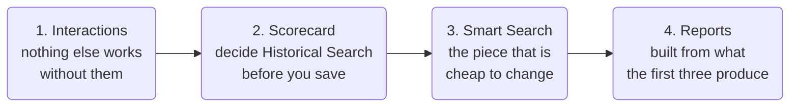

# How the Pieces Fit Together

Each guide explains one feature. This page explains how they relate, and why the order you set them up in matters more than it looks. For what Vela does at all, start with [Platform Overview](../getting-started/platform-overview.md).

---

## The scorecard and Smart Search answer different questions

The two get confused, because both watch every interaction and both raise things for you to look at. The difference is what they are about.

**The Agent Scorecard measures what the agent did.** Did they verify identity, give the disclosure, confirm the payment date. The answers become a score, and the score belongs to the agent.

**Smart Search finds what was said.** A customer asking for a supervisor, a competitor being mentioned, a phrase your compliance team wants to hear about. It raises an alert against the interaction, and it changes nobody's score.

If you find yourself wanting to score something the agent cannot influence, you want neither of these. You want a [Smart Question](../smart-questions-guide.md), which records an answer without touching anyone's score.

The test is what the answer describes. If it describes **what the agent did**, it belongs on the scorecard. If it describes **the conversation**, it is a Smart Search or a Smart Question.

---

## Set up in this order

**Interactions first.** A scorecard with nothing to score and a Smart Search with nothing to match both look broken when they are merely empty. Get a batch of real calls or chats in before you judge anything you have built.

**The scorecard second, because one of its decisions cannot be revisited.** **Historical Search** runs the scorecard against interactions already in Vela, and it is only available when you create the scorecard. Leave it off and the interactions you have already uploaded are never scored, and the only way to change that is to upload them again. Decide before you save, not after.

**Smart Search third, because it is the one piece you expect to get wrong.** Phrases are cheap to edit and the results tell you quickly whether you chose well. Building it after you have interactions means you can turn on its own Historical Search and see real matches immediately, rather than guessing and waiting.

**Reports last.** A report is a view of what the first three produce. Schedule it once you trust what goes into it.

---

## Read the matches before you trust the count

A new Smart Search returning a count is not yet evidence. Open several of the interactions it matched and read them.

Phrases catch words, not intent. A search for escalation language matches an agent saying "let me speak to my manager" as readily as a customer demanding one, and you cannot tell which from the count alone. Reading a handful tells you whether the number means what you think.

This is worth doing once per search, when you create it. After that the phrase list is either right or you have a specific reason to change it.

The same caution applies in reverse. A search returning nothing is usually a phrase list written the way an internal process document describes the situation, rather than the way people actually speak.

---

## What cannot be undone later

Most of Vela is editable. Three things are not, and each one is a decision to make deliberately rather than discover:

| Decision | Why it is one-way |
| :--- | :--- |
| **Historical Search**, on a scorecard, Smart Search, or Smart Question | Only available at creation. Adding it later is not possible, and re-uploading is the only alternative |
| **Editing a scorecard question's weight, Auto-Fail, Compliance, or Expected Outcome** | Scores are worked out from your scorecard as it is today, so a change re-scores your whole history, including the **Initial** figures. See [How Scoring Works](./how-scoring-works.md) |
| **Posting a comment** | Comments cannot be edited or deleted, and a mention only works in a new comment, never in a reply |

Adding a scorecard question later is safe, but it only applies to interactions processed after the change. Older interactions keep the scorecard they were scored against, so a question added today does not appear on last week's calls.

---

## Related

- [Administrator Setup](../getting-started/quick-start/administrator-setup.md): the setup order above, as steps you follow
- [Build an Agent Scorecard](../agent-scorecard-guide.md): the scorecard step above, in full
- [How Scoring Works](./how-scoring-works.md): why editing a weight rewrites history
- [Set Up Smart Search](../smart-search-guide.md): building and refining a search
- [Set Up Smart Questions](../smart-questions-guide.md): asking about the conversation without scoring it

---

## Need Help?

**Contact Support:** support@botlhale.ai
