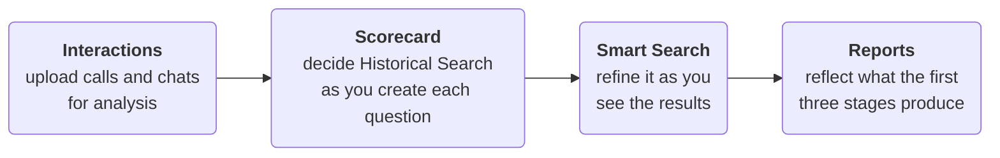

# How the Pieces Fit Together

Each guide explains one feature. This page explains how they relate, and why the order you set them up in matters. To understand what Vela does and how it works, start with the [Platform Overview](../getting-started/platform-overview.md).

---

## The scorecard and Smart Search answer different questions

The two get confused, because both watch every interaction and both raise things for you to look at. The difference is what they are about.

**The Agent Scorecard measures what the agent did.** Did they verify identity, give the disclosure, confirm the payment date. The answers become a score, and the score belongs to the agent.

**Smart Search finds what was said.** A customer asking for a supervisor, a competitor being mentioned, a phrase your compliance team wants to hear about. It raises an alert against the interaction, and it does not affect agent scores.

If you find yourself wanting to score something the agent cannot influence, you want neither of these. You want a [Smart Question](../smart-questions-guide.md), which records an answer without affecting agent scores.

The test is what the answer describes. If it describes **what the agent did**, it belongs on the scorecard. If it describes **the conversation**, it is a Smart Search or a Smart Question.

---

## Set up in this order

```mermaid
flowchart LR
    A("<b>Interactions</b><br/>upload calls and chats<br/>for analysis") --> B("<b>Scorecard</b><br/>decide Historical Search<br/>as you create each question")
    B --> C("<b>Smart Search</b><br/>refine it as you<br/>see the results")
    C --> D("<b>Reports</b><br/>reflect what the first<br/>three stages produce")
```

**Interactions first.** A scorecard with no interactions to score and a Smart Search with no interactions to match both look broken when they are merely empty. Get a batch of real calls or chats in before you judge anything you have built.

**The scorecard second, because one of its settings exists only while you create a question.** Turn on **Historical Search** as you create a question to score the interactions already in Vela against it. A question saved without it applies only to interactions processed afterwards. Interactions uploaded before you had any scorecard can still be scored one at a time with **Rerun Scorecard**. Decide on Historical Search before you save.

**Smart Search third, because you refine it as you see what your interactions contain.** Phrases are quick to edit, and the results show you whether you chose well. Building it after you have interactions means you can turn on its own Historical Search and see real matches immediately, rather than guessing and waiting.

**Reports come last.** They reflect the outputs of the first three stages, so schedule them once you are confident in the underlying data.

---

## Read the matches before you trust the count

A new Smart Search returning a count is not yet evidence. Open several of the interactions it matched and read them.

Phrases catch words, not intent. A search for escalation language matches an agent saying "let me speak to my manager" as readily as a customer demanding one, and you cannot tell which from the count alone. Reviewing a sample of matched interactions helps confirm whether the results reflect what you intended to find.

Do this once when you create each search. If the results consistently match your intended use, you can trust the phrase list unless you have a specific reason to change it.

The same principle applies when a search returns no results. An empty result may mean the phrase list reflects how an internal process describes an issue, rather than how customers or agents actually talk about it. Review the language people use in real interactions, and adjust the phrases to match.

---

## What cannot be undone later

Most of Vela can be changed back. These three cannot be fully reversed, so make each one deliberately:

| Decision | Why it is one-way |
| :--- | :--- |
| **Historical Search**, on a scorecard question, Smart Search, or Smart Question | Available only while you create it. For one saved without it, re-uploading the recordings is the only way to reach older interactions |
| **Editing a scorecard question's weight, Auto-Fail, Compliance, or Expected Outcome** | Changing the setting back does not restore scores that were saved under it in the meantime. A weight, Auto-Fail, or Compliance change reaches past interactions unevenly: some figures move at once, while the **Agent Score**, the Dashboard, and the table on **Agents → Performance** keep the old settings until each interaction is scored again. An Expected Outcome change leaves past AI answers as they were. See [How Scoring Works](./how-scoring-works.md#changing-a-scorecard-after-interactions-are-scored) |
| **Posting a comment** | Comments cannot be edited or deleted. Where your organisation uses the Coaching Portal, tagging the agent only works in a new comment, and not in a reply |

You can add a scorecard question at any time. It adds to the total that future scores are measured against, so note the date. Unless you create it with **Historical Search** on, it applies only to interactions processed afterwards, so a question added today does not appear on last week's calls.

---

## Related

- [Administrator Setup](../getting-started/quick-start/administrator-setup.md): the setup order above, as steps you follow
- [Build an Agent Scorecard](../agent-scorecard-guide.md): the scorecard step above, in full
- [How Scoring Works](./how-scoring-works.md): what editing a weight does to past scores
- [Set Up Smart Search](../smart-search-guide.md): building and refining a search
- [Set Up Smart Questions](../smart-questions-guide.md): asking about the conversation without scoring it

---

## Need Help?

**Contact Support:** support@botlhale.ai
