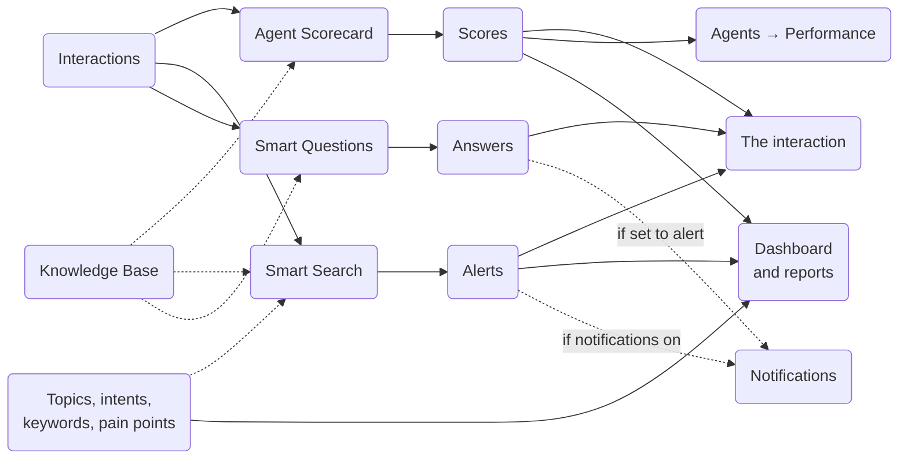

# How the Pieces Fit Together

Each guide explains one feature. This page shows how they connect: what you set up, what each piece produces, and where you read the result. To understand what Vela does as a whole, start with the [Platform Overview](../getting-started/platform-overview.md).

---

## The map

```mermaid
flowchart LR
    I("Interactions") --> SC("Agent Scorecard")
    I --> SS("Smart Search")
    I --> SQ("Smart Questions")
    KB("Knowledge Base") -.-> SC & SS & SQ
    T("Topics, intents,<br/>keywords, pain points") -.-> SS
    SC --> S("Scores")
    SS --> A("Alerts")
    SQ --> AN("Answers")
    S & A & AN --> V("The interaction")
    S --> AP("Agents → Performance")
    S & A & T --> D("Dashboard<br/>and reports")
    A -. "if notifications on" .-> N("Notifications")
    AN -. "if set to alert" .-> N
```

Solid arrows happen to every interaction in scope. Dashed arrows are links you choose to set up.

{/* Sources for each arrow: knowledge-base-guide.md (KB links to scorecard question, Smart Search, Smart Question; does nothing alone), smart-search-criteria.md (Intents, Keywords, Topics, Pain points as criteria), notifications.md (Alerts tab holds Smart Search matches and Smart Question answers set to alert), metrics.md (Total Number of Alerts counts Smart Search matches only; no Smart Question metric exists), quality-assurance-tools.md (interaction tabs and list columns), monitor-agent-performance.md (scores, categories, strengths and weaknesses), custom-reporting.md (reports offer the Dashboard metrics). Checked 2026-10-07. */}

---

## What you set up

Four tools under **Smart Detector** decide what Vela does with each interaction:

- **Agent Scorecard** scores the agent, against the questions that cover the agent's team. See [How Scoring Works](./how-scoring-works.md).
- **Smart Search** flags an interaction that matches criteria you define, and raises an alert. See [Set Up Smart Search](../smart-search-guide.md).
- **Smart Questions** record an answer about the conversation without scoring anyone. See [Set Up Smart Questions](../smart-questions-guide.md).
- **Knowledge Base** gives the AI your own document to judge against, once you link the document to a scorecard question, a Smart Search, or a Smart Question. See [Build Your Knowledge Base](../knowledge-base-guide.md).

Each has a [scope](../reference/glossary.md#scope) that decides which interactions it applies to. A scope is the organisation, a department, or a team.

Your Smart Search terms sit beside these four tools. The AI detects **topics**, **intents**, and **pain points** in your interactions, and your team can add its own. **Keywords** exist only once someone adds them. The terms feed their own Dashboard metrics, and a Smart Search can use any of them as criteria. See [Manage Smart Search Terms](../topics-and-terms-guide.md).

Build the scorecard and your Smart Searches before your first upload, in the order given in [Best Practices: Setting Up](../advanced/best-practices.md#setting-up).

---

## Where each result appears

| Result | Where you read it |
| :--- | :--- |
| **Scores**, from the Agent Scorecard | The interaction's **Call Details** or **Chat Details** panel and **Scorecard** tab, the score columns on the Interactions list, the Quality & Performance metrics on the Dashboard and in reports, and **Agents → Performance** |
| **Alerts**, from Smart Search | The interaction's own **Alerts** tab, the **Alerts** column on the Interactions list, and the alert metrics. Where the search has **Notifications** on, also the **Alerts** tab under Notifications |
| **Answers**, from Smart Questions | The interaction's **Smart Questions** tab, and the **Results** tab of each Smart Question. One set to alert also sends its answer to the **Alerts** tab under Notifications. Answers carry no score, and no Dashboard metric counts them |
| **Topics, intents, keywords, and pain points** | The interaction's **Keywords**, **Intents**, and **Pain Points** tabs, the **Topic** column on the Interactions list, and their metric groups on the Dashboard and in reports |

Reports draw on the same metrics as the Dashboard, under shorter names. See [Metrics](../reference/metrics.md).

Two things change how a score reads once it exists:

- **Score Boundaries** colour every score Red, Amber, or Green. On **Agents → Performance** they also decide which scorecard categories count as an agent's strengths and weaknesses, so the **Category** you give each question decides what can appear there. See [Score Boundaries](../reference/glossary.md#score-boundaries).
- **A reviewer's override** replaces the AI's answer and recalculates the score, and Vela keeps the AI's **Initial** scores beside it. Marking an interaction as reviewed is what the Reviewed Interactions metrics count. See [Review and Score Interactions](../features/quality-assurance-tools.md).

Where your organisation uses the Coaching Portal, the scores also decide which courses agents are assigned and which awards they receive, on each evaluation cycle. See [How Coaching Works](https://docs-coaching.botlhale.xyz/docs/explanation/how-coaching-works).

---

## What decides who sees it

- **Access level** decides how much of the organisation a user sees. It is why two team leads can read different numbers on the same Dashboard. See [Access Level](../reference/glossary.md#access-level).
- **Role** decides what a user can do, not what they see. See [Role](../reference/glossary.md#role).
- **Redaction** masks sensitive details in transcripts for everyone by default, administrators included. See [Redaction](../reference/glossary.md#redaction).

If a piece of this map is missing from your sidebar, see [Lite](../reference/glossary.md#lite).

---

## The scorecard and Smart Search answer different questions

The two get confused, because both watch every interaction and both raise things for you to look at. The difference is what they are about.

**The Agent Scorecard measures what the agent did.** Did they verify identity, give the disclosure, confirm the payment date. The answers become a score, and the score belongs to the agent.

**Smart Search finds what was said.** A customer asking for a supervisor, a competitor being mentioned, a phrase your compliance team wants to hear about. It raises an alert against the interaction, and it does not affect agent scores.

If you find yourself wanting to score something the agent cannot influence, you want neither of these. You want a [Smart Question](../smart-questions-guide.md), which records an answer without affecting agent scores. See [Why Smart Questions are not scored](./how-scoring-works.md#why-smart-questions-are-not-scored) for how to tell which one a question belongs on.

---

## Read the matches before you trust the count

A new Smart Search returning a count is not yet evidence. Open several of the interactions it matched and read them.

Phrases catch words, not intent. A search for escalation language matches an agent saying "let me speak to my manager" as readily as a customer demanding one, and you cannot tell which from the count alone. Reviewing a sample of matched interactions helps confirm whether the results reflect what you intended to find.

Do this once the first interactions it matches arrive. If the results consistently match your intended use, you can trust the phrase list unless you have a specific reason to change it.

The same principle applies when a search still returns no results once interactions have arrived. An empty result then may mean the phrase list reflects how an internal process describes an issue, rather than how customers or agents actually talk about it. Review the language people use in real interactions, and adjust the phrases to match.

---

## What cannot be undone later

Most of Vela can be changed back. These three cannot be fully reversed, so make each one deliberately:

| Decision | Why it is one-way |
| :--- | :--- |
| **Historical Search**, on a scorecard question, Smart Search, or Smart Question | Available only while you create it. To reach older interactions afterwards, delete a Smart Search or Smart Question and create it again with Historical Search on. For a scorecard question, see [Scoring older interactions against a new question](./how-scoring-works.md#scoring-older-interactions-against-a-new-question) |
| **Editing a scorecard question's weight, Auto-Fail, Compliance Question, or Expected Outcome** | Changing the setting back does not restore scores that were saved under it in the meantime. A weight, Auto-Fail, or Compliance Question change reaches some figures at once and others when each interaction is next scored. An Expected Outcome change leaves past AI answers as they were. See [How Scoring Works](./how-scoring-works.md#changing-a-scorecard-after-interactions-are-scored) |
| **Posting a comment** | Comments cannot be edited or deleted. Where your organisation uses the Coaching Portal, tag the agent in a new comment, because a reply cannot carry the tag |

You can add a scorecard question at any time. It adds to the total that future scores are measured against, so interactions either side of it are not scored out of the same total. Note the date you added it, or the step in the average reads as a change in performance. Unless you create it with **Historical Search** on, it applies only to interactions processed afterwards, so a question added today does not appear on last week's calls.

---

## Related

- [Platform Overview](../getting-started/platform-overview.md): what Vela does, from upload to report
- [Best Practices](../advanced/best-practices.md#setting-up): the order to set Vela up in, and why
- [How Scoring Works](./how-scoring-works.md): how a score is worked out, and what editing a weight does to past scores
- [Metrics](../reference/metrics.md): every metric on the Dashboard and in reports
- [Glossary](../reference/glossary.md): definitions of the terms on the map

---

## Need Help?

**Contact Support:** support@botlhale.ai
