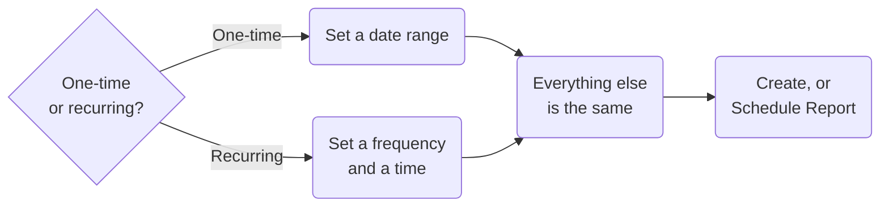
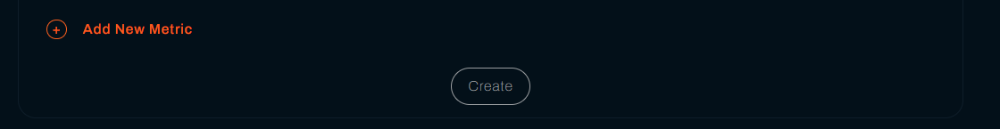
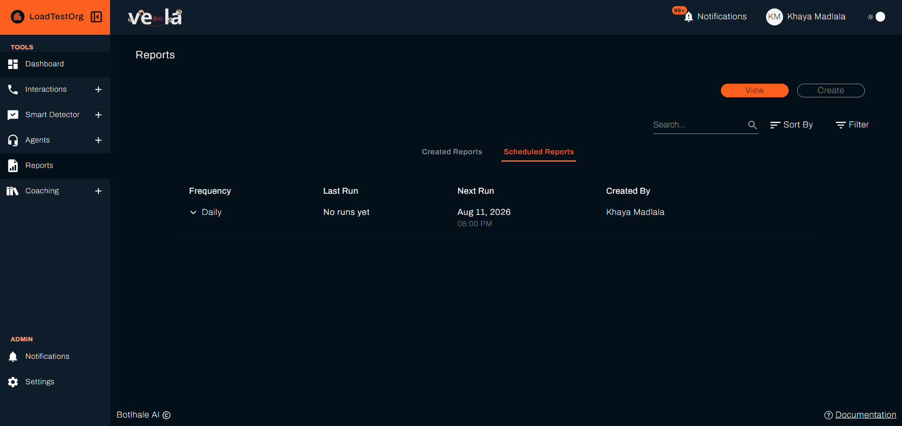
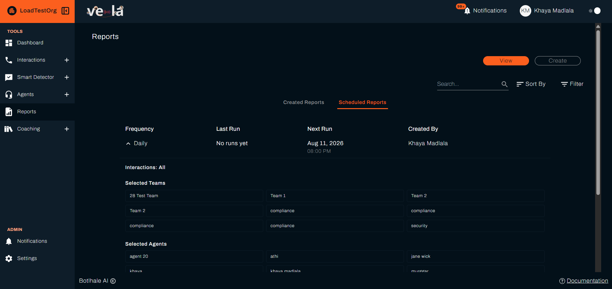
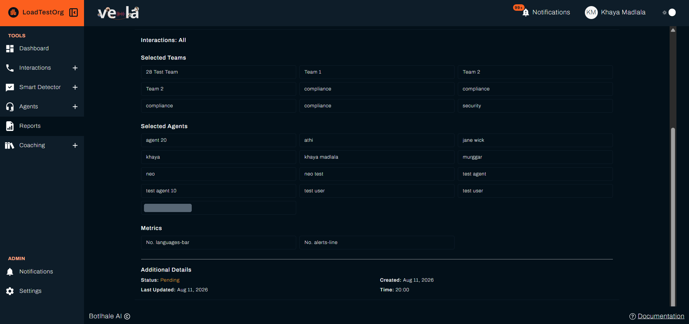

import Tabs from '@theme/Tabs';
import TabItem from '@theme/TabItem';

# Generate Reports
Build a report from the metrics you care about, over the period you choose, and either run it once or have Vela run it for you on a schedule. Reports are how your analytics are shared with people outside Vela, as a file rather than a screen.

---

## Before You Begin

You need:

- **Processed interactions inside the period you are reporting on.** Vela builds the report from the interactions it finds in that period, so a period with none produces no results. Where a scheduled run finds nothing, Vela emails you to say so rather than sending an empty report.
- **Access level:** Organisational, Departmental, or Team, covering the teams you want in the report. See [Access Level](../reference/glossary.md#access-level).
- **To know which metrics your plan offers.** Plans without Smart Search carry the quality assurance groups only. See [Choose the Metrics and Charts](#d-choose-the-metrics-and-charts).

---

## 1. Choose One-Time or Recurring

Go to **Reports** in the left sidebar and select the **Create** tab. Two tabs sit at the top:

- **Create One-Time Report**: build a report now for a date range you pick.
- **Schedule Recurring Report**: have Vela build the report automatically on a schedule.

Both tabs share the same options below. The only difference is how you set the period: a one-time report uses a date range, a recurring report uses a frequency and a time.

---

## 2. Build the Report

### A. Set the Period

<Tabs groupId="report-type">
<TabItem value="onetime" label="One-time report">

Pick a start and end date on the calendar, or use one of the presets. These are **Today**, **Yesterday**, **This Week**, **Last Week**, **This Month**, and **Last Month**. Your choice shows in **From** and **To** above the calendar.

</TabItem>
<TabItem value="recurring" label="Recurring report">

Set the **Report Frequency** (daily, weekly, or monthly) and the **Time**, which is entered in 24-hour format. For a weekly report, also choose the day of the week. For a monthly report, choose the day of the month.

</TabItem>
</Tabs>

### B. Choose the Interaction Type

Under "Which interactions would you like to include in this report?", choose **All**, **Calls**, or **Chats**.

### C. Filter by Team, Department, or Agent

- Select the departments, teams, and agents to include.
- Tick **Include interactions with unspecified agent** to include calls or chats that are not linked to a particular agent.

A report needs at least one team and one agent, and at least one metric, before Vela builds it. Ticking **Include interactions with unspecified agent** satisfies the team and agent requirement on its own, which is how you report on interactions that were never assigned to anyone.

### D. Choose the Metrics and Charts

Select **Add New Metric**, pick a metric, and pick a chart type for it. Repeat to add as many as you need. Each metric is paired with its own chart, so you can mix figures and charts in one report.

Chart types are **Line**, **Bar**, **Pie**, **Doughnut**, and **Table**.

{/* UNVERIFIED: whether "Card" is also offered as a chart type here. It exists as an accepted value in the Reports form (createForm.jsx's allowedCharts set) with its own render path, but which chart types are actually offered for a given metric comes from that metric's `charts` field in the database — vela-data/models/metric.js only types it as an array of strings, no source file lists what is seeded into it. Needs a screenshot of the live Add New Metric picker to confirm Card appears for any metric before restating it here. */}

Metrics are organised into groups, listed alphabetically:

| Group | Examples |
| :--- | :--- |
| **Alert Metrics** | Total Number of Alerts, Total Number of Resolved Alerts |
| **Customer Sentiment** | Sentiment Distribution in Interactions |
| **Interactions and Volume** | Total Number of Calls, Total Number of Chats, Average Call Handle Time (s) |
| **Keywords, Intents, & Language** | Total Number of Keywords, Total Number of Languages, Intent Distribution in Interactions |
| **Quality & Performance** | Average Agent Score (%), Distribution of Total Scores |
| **Reviewed Interactions** | Total Number of Interactions, Percentage of Interactions Reviewed |
| **Team Workload** | Total Number of Agents, Agent Distribution in Interactions |
| **Topics & Pain Points** | Top 10 Topics, Top 10 Pain Points in Interactions (Detected) |

Two things narrow what you see. Metrics that apply only to calls or only to chats are hidden when they do not fit the interaction type you chose. Your plan matters too: on plans without Smart Search, the groups are limited to quality assurance metrics, so alert, keyword, intent, and pain point metrics do not appear.

A group appears once at least one of its metrics survives both, so you may see fewer than eight.

For the full list and what each metric means, see [Metrics](../reference/metrics.md).

:::tip Start with a table
For a large team, or when you are comparing exact numbers rather than reading a chart, pick **Table** first. It shows the values themselves. Switch a metric to a chart once you know what you are looking for.
:::

---

## 3. Run It or Schedule It

### A. Submit the Report

<Tabs groupId="report-type">
<TabItem value="onetime" label="One-time report">

Select **Create**, at the foot of the form below **Add New Metric**. The report generates immediately and opens in the Reports list.

Vela includes the metrics that have data and names each metric it dropped. Where none of them have data, widen the date range or check the teams and agents you selected, and run it again.

</TabItem>
<TabItem value="recurring" label="Recurring report">

Select **Schedule Report**. Vela then runs it on the schedule you set.

Your schedules appear on the **Scheduled Reports** tab of the Reports list, one row each, under **Frequency**, **Last Run**, **Next Run**, and **Created By**. A schedule that has not run yet reads **No runs yet**, and **Next Run** is where you confirm it runs when you expect.

Select a row to expand it. Since a schedule cannot be edited, this is how you check what one is set to:

| Section | What it shows |
| :--- | :--- |
| **Interactions** | Whether the schedule covers All, Calls, or Chats |
| **Selected Teams** | Every team in the schedule's scope |
| **Selected Agents** | Every agent in the schedule's scope |
| **Metrics** | Each metric with its chart type, such as `No. alerts-line` |
| **Additional Details** | **Status**, **Created**, **Last Updated**, and the **Time** it runs at |

A schedule that has not finished a run yet shows a **Status** of **Pending**, which is what a newly created one reads.

{/* One agent name is masked in schedule4.png, to keep a real address out of the documentation under POPIA. The bar shows where it sits without disclosing it. */}

</TabItem>
</Tabs>

:::note A schedule cannot be edited
To change a report's frequency, metrics, or filters, delete the schedule and create a new one.
:::

### B. Who Is Told When a Report Is Ready

A finished report is not emailed as a file. Vela notifies people in your organisation with a link to the report, each according to their own **Settings → Notifications** preferences: in Vela, by email, or not at all. Those whose email frequency is **Daily** receive it in that day's email rather than straight away.

If a scheduled run finds no interactions in its date range, Vela emails you to say the report could not be generated, and the schedule continues to its next run.

---

## 4. Download and Share

Go to **Reports** and stay on the **View** tab. It holds two tabs of its own, **Created Reports** and **Scheduled Reports**, with **Search**, **Sort By**, and **Filter** above them. **Created Reports** lists each report by **Name**, **Created By**, and **Date**.

Select the download icon on a report's row and choose **PDF** or **DOCX**. The file holds the metrics and charts you selected.

To rename a report, select the pencil icon beside its name, type the new one, and confirm. Reports are named automatically when they are generated, so renaming is worth doing on anything you intend to keep or send on.

---

## Check Your Work

How you check depends on which you built. A one-time report is ready straight away, so you can open it now. A schedule produces its first report on its next run, so what you confirm today is that the schedule itself is set correctly.

For a one-time report, you are finished when it appears under **Created Reports** with a download icon on its row, and the downloaded PDF or DOCX holds the metrics and charts you chose. A metric you selected but cannot find in the file had no data in the period.

For a schedule, open **Scheduled Reports** and confirm **Next Run** shows the date and time you intended. That confirms the schedule is set. To confirm it delivers, wait for that first run and check the report arrives as expected.

---

## Related

- [Metrics](../reference/metrics.md): what each metric in a report measures
- [Monitor Agent Performance](./monitor-agent-performance.md): the same analytics on your Dashboard, day to day
- [Manage Notifications](./notifications.md): how you are told when a report finishes generating

## Need Help?

**Contact Support:** support@botlhale.ai
