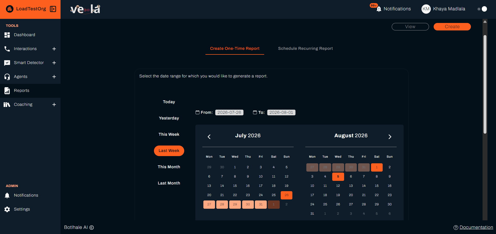
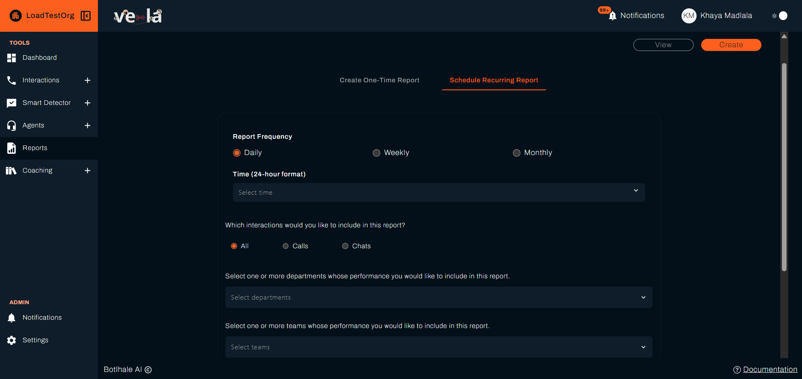
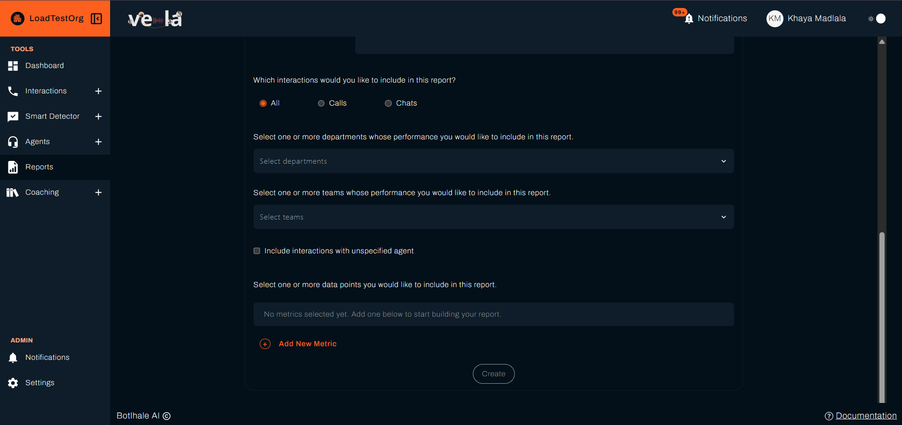
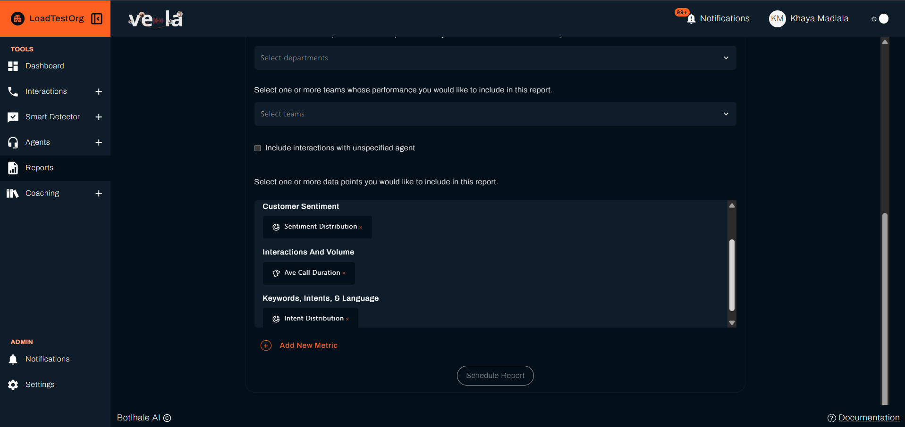
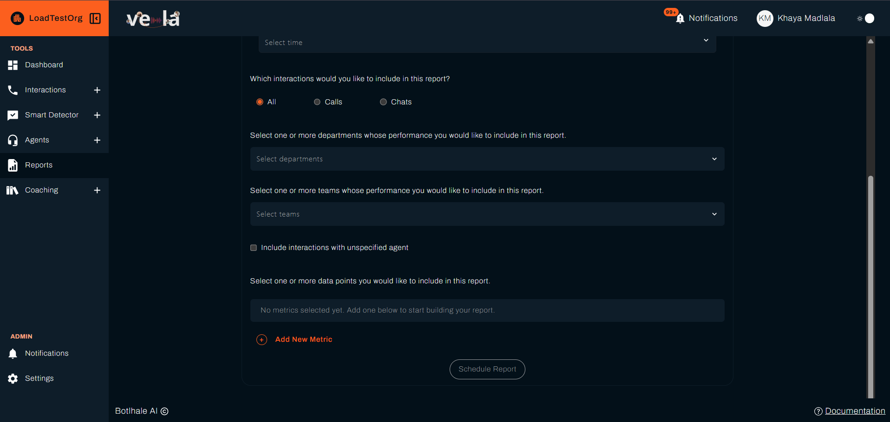
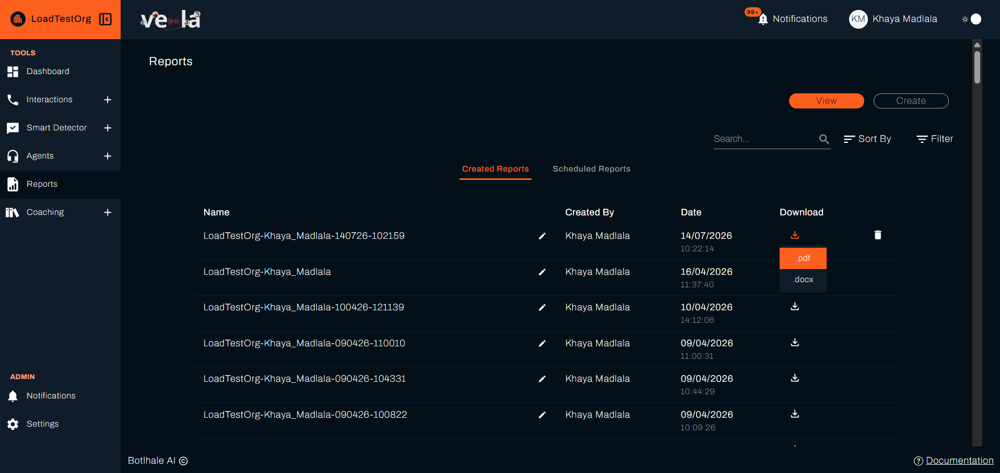

# Generate Reports
The Reports section lets Team Leads and Administrators build, customise, and schedule reports. Use them to track metrics over time, spot trends, and share results with people outside the platform.

---

## 1. Open the Report Builder

Go to **Reports** in the left sidebar and select the **Create** tab. At the top, choose one of two tabs:

- **Create One-Time Report**: build a report now for a date range you pick.
- **Schedule Recurring Report**: have Vela build the report automatically on a schedule.

Both tabs share the same options below. The only difference is how you set the period: a one-time report uses a date range, a recurring report uses a frequency and a time.

---

## 2. Configure the Report

### Set the Period

- **One-time report**: use the calendar to pick a start and end date, or a quick option such as "Last Month".
- **Recurring report**: set the **Report Frequency** (daily, weekly, or monthly) and the **Time**. For a weekly report, also choose the day of the week. For a monthly report, choose the day of the month.

### Choose the Interaction Type

Under "Which interactions would you like to include in this report?", choose **All**, **Calls**, or **Chats**.

### Filter by Team, Department, or Agent

- Select the departments, teams, and agents to include.
- Tick **Include interactions with unspecified agent** to include calls or chats that are not linked to a particular agent.

### Choose Data Points and Charts

Click **Add New Metric**, pick a metric, and pick a chart type for it. Repeat to add as many as you need. Each metric is paired with its own chart, so you can mix figures and charts in one report.

Chart types are **Line**, **Bar**, **Pie**, **Doughnut**, and **Table**.

Metrics are organised into groups:

| Group | Examples |
| :--- | :--- |
| **Interactions and Volume** | No. Calls, No. Chats, No. Agents, Ave Call Duration |
| **Quality & Performance** | Average Agent Score |
| **Topics & Pain Points** | Topic and pain point metrics |
| **Keywords, Intents, & Language** | No. Languages |
| **Alert Metrics** | No. Alerts |
| **Customer Sentiment** | Sentiment Distribution |

Two things narrow that list. Metrics that apply only to calls or only to chats are hidden when they do not fit the interaction type you chose. Your plan matters too: on plans without Smart Search, the groups are limited to quality assurance metrics, so alert, keyword, intent, and pain point metrics do not appear.

For the full list and what each metric means, see [Metrics](../reference/metrics.md).

:::tip Best Practice
For large teams or detailed comparison, start with the **Table** chart to review exact figures, then switch to charts for visual trends.
:::

---

## 3. Generate or Schedule

- On the **Create One-Time Report** tab, click **Create**. The report generates immediately and opens in the Reports list.
- On the **Schedule Recurring Report** tab, click **Schedule Report**. Vela then runs it on the schedule you set. Your schedules appear in the Reports list, where you can review and remove them.

---

## 4. Download and Share

Open a finished report from the Reports list and download it as **PDF** or **DOCX** to share with people outside the platform. The file contains the metrics and charts you selected.

The Reports list has two tabs, **Created Reports** and **Scheduled Reports**, with **Search**, **Sort By**, and **Filter** above them. Click the download icon on a row to choose the format.

---

## Related

- [Metrics](../reference/metrics.md): what each metric in a report measures
- [Monitor Agent Performance](./monitor-agent-performance.md): the same figures on your Dashboard, day to day
- [Notifications](./notifications.md): how you are told when a report finishes generating

## Need Help?

**Contact Support:** support@botlhale.ai
