import Tabs from '@theme/Tabs';
import TabItem from '@theme/TabItem';

# Generate Reports
Build a report from the metrics you care about, over the period you choose, and either run it once or have Vela run it for you on a schedule. Reports are how your analytics are shared with people outside Vela, as a file rather than a screen.

:::tip In short
By the end you will have a report of the metrics you chose, run once or set to run on a schedule.

1. Under **Reports**, select the **Create** tab and [choose one-time or recurring](#1-choose-one-time-or-recurring).
2. [Build the report](#2-build-the-report) from the period, interaction type, teams, agents, and metrics.
3. [Run it or schedule it](#3-run-it-or-schedule-it), then [download it](#4-download-and-share) as **PDF** or **DOCX**.
:::

---

## Before You Begin

You need:

- **Processed interactions inside the period you are reporting on.** Vela builds the report from the interactions it finds in that period, so a period with none produces no results.
- **Access level:** Organisational, Departmental, or Team, covering the teams you want in the report. See [Access Level](../reference/glossary.md#access-level).
- **To know which metrics your plan offers.** On the [Lite](../reference/glossary.md#lite) version, alert, keyword, intent, and pain point metrics are not offered. See [Choose the Metrics and Charts](#d-choose-the-metrics-and-charts).

---

## 1. Choose One-Time or Recurring

Go to **Reports** in the left sidebar and select the **Create** tab. Two tabs sit at the top:

- **Create One-Time Report**: build a report now for a date range you pick.
- **Schedule Recurring Report**: have Vela build the report automatically on a schedule.

Both tabs share the same options below. The only difference is how you set the period: a one-time report uses a date range, a recurring report uses a frequency and a time.

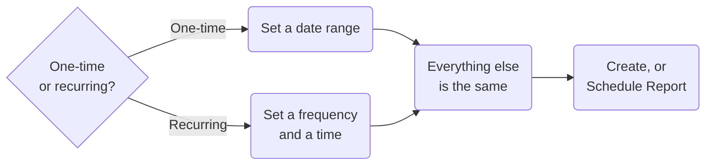
```mermaid
flowchart LR
    C{"One-time<br/>or recurring?"} -- One-time --> D("Set a date range")
    C -- Recurring --> F("Set a frequency<br/>and a time")
    D --> M("Everything else<br/>is the same")
    F --> M
    M --> E("Create, or<br/>Schedule Report")
```

---

## 2. Build the Report

### A. Set the Period

<Tabs groupId="report-type">
<TabItem value="onetime" label="One-time report">

Pick a start and end date on the calendar, or use one of the presets. These are **Today**, **Yesterday**, **This Week**, **Last Week**, **This Month**, and **Last Month**. Your choice shows in **From** and **To** above the calendar.

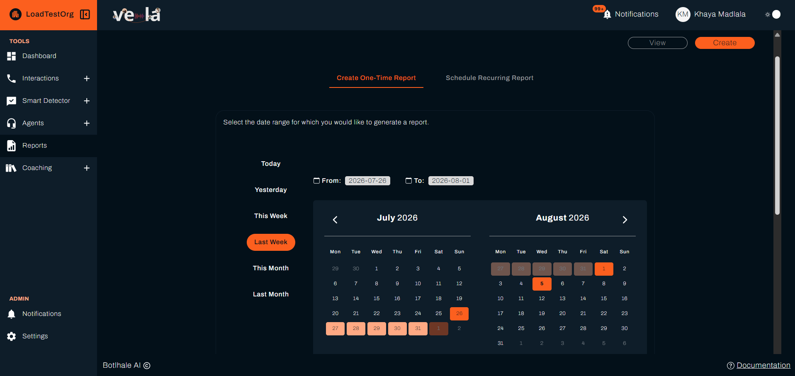

</TabItem>
<TabItem value="recurring" label="Recurring report">

Set the **Report Frequency** (daily, weekly, or monthly) and the **Time**, which is entered in 24-hour format. For a weekly report, also choose the day of the week. For a monthly report, choose the day of the month.

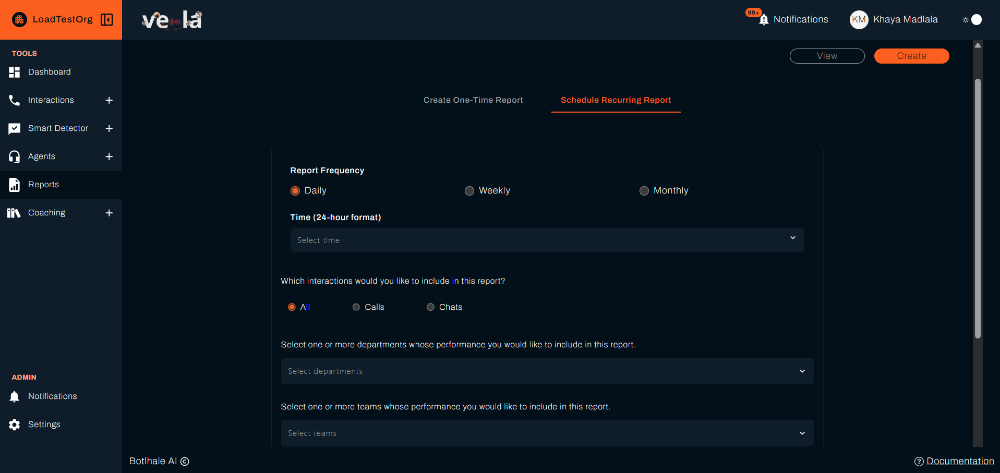

</TabItem>
</Tabs>

### B. Choose the Interaction Type

Under "Which interactions would you like to include in this report?", choose **All**, **Calls**, or **Chats**.

### C. Filter by Team, Department, or Agent

- Select the departments, teams, and agents to include.
- Tick **Include interactions with unspecified agent** to include calls or chats that are not linked to a particular agent.

A report needs at least one team and one agent, and at least one metric, before Vela builds it. Ticking **Include interactions with unspecified agent** satisfies the team and agent requirement on its own, which is how you report on interactions that were never assigned to anyone.

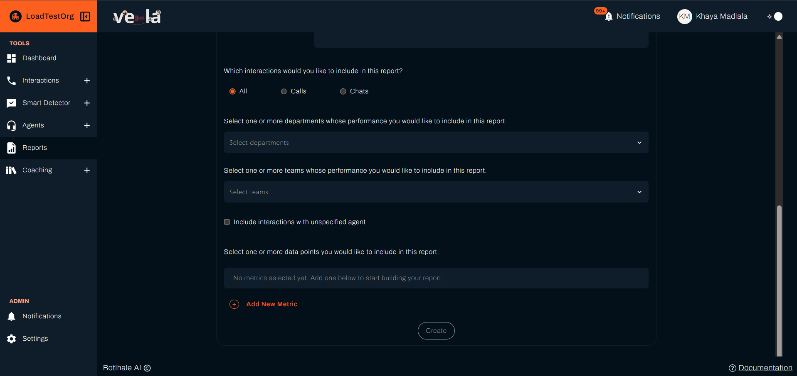

### D. Choose the Metrics and Charts

Select **Add New Metric**, pick a metric, and pick a chart type for it. Repeat to add as many as you need. Each metric is paired with its own chart, so you can mix figures and charts in one report.

Chart types are **Card**, **Line**, **Bar**, **Pie**, **Doughnut**, and **Table**. A **Card** shows the single figure on its own, with no axes. The types offered depend on the metric, so one metric's list can be shorter than this.

{/* UNVERIFIED: on vela-fly, a scheduled report containing a Card metric appears to fail without an email (scheduleReports/route.js reads data.data, which card data does not have), and fails again on every run. Needs engineering to confirm. */}

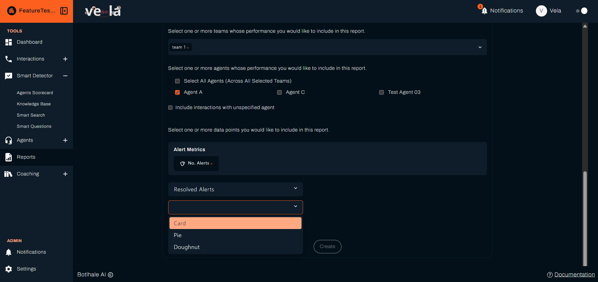

Metrics are organised into groups, listed alphabetically:

| Group | Examples |
| :--- | :--- |
| **Alert Metrics** | Total Number of Alerts, Total Number of Resolved Alerts |
| **Customer Sentiment** | Sentiment Distribution in Interactions |
| **Interactions and Volume** | Total Number of Calls, Total Number of Chats, Average Call Handle Time (s) |
| **Keywords, Intents, & Language** | Total Number of Keywords, Total Number of Languages, Intent Distribution in Interactions |
| **Quality & Performance** | Average Agent Score (%), Distribution of Total Scores |
| **Reviewed Interactions** | Total Number of Interactions, Percentage of Interactions Reviewed |
| **Team Workload** | Total Number of Agents, Agent Distribution in Interactions |
| **Topics & Pain Points** | Top 10 Topics, Top 10 Pain Points in Interactions (Detected) |

Your plan decides which metrics are offered. On the [Lite](../reference/glossary.md#lite) version, alert, keyword, intent, and pain point metrics are not offered. The list shows every call and chat metric, whichever interaction type you chose. A call-only metric in a chats report has no data, so it is dropped when the report is built. The list also uses shorter names than the Dashboard cards. See [Metrics](../reference/metrics.md).

A group appears only where at least one of its metrics is offered on your plan, so you may see fewer than eight.

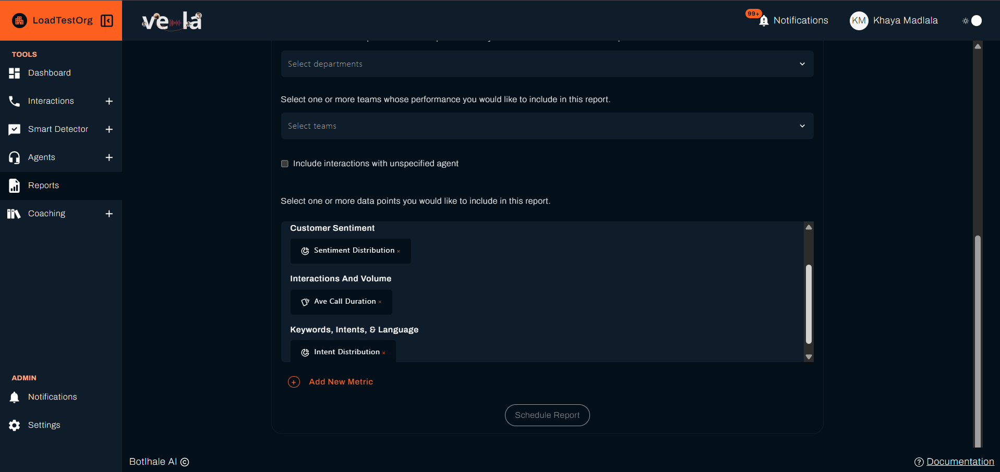

For the full list and what each metric means, see [Metrics](../reference/metrics.md).

:::tip Start with a table
For a large team, or when you are comparing exact numbers rather than reading a chart, pick **Table** first. It shows the values themselves. Switch a metric to a chart once you know what you are looking for.
:::

---

## 3. Run It or Schedule It

### A. Submit the Report

<Tabs groupId="report-type">
<TabItem value="onetime" label="One-time report">

Select **Create**, at the foot of the form below **Add New Metric**. Vela starts building the report in the background and takes you to the Reports list. When the report is ready, Vela emails you a link and it appears under **Created Reports**.

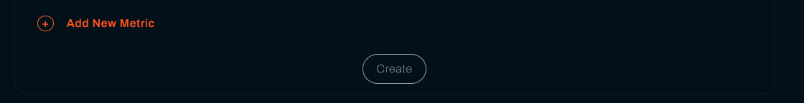

Vela includes the metrics that have data, and shows a message for each metric it dropped, naming the metric and ending *has no data for the selected date range*. Where none of them have data, widen the date range or check the teams and agents you selected, and run it again.

</TabItem>
<TabItem value="recurring" label="Recurring report">

Select **Schedule Report**. Vela then runs it on the schedule you set.

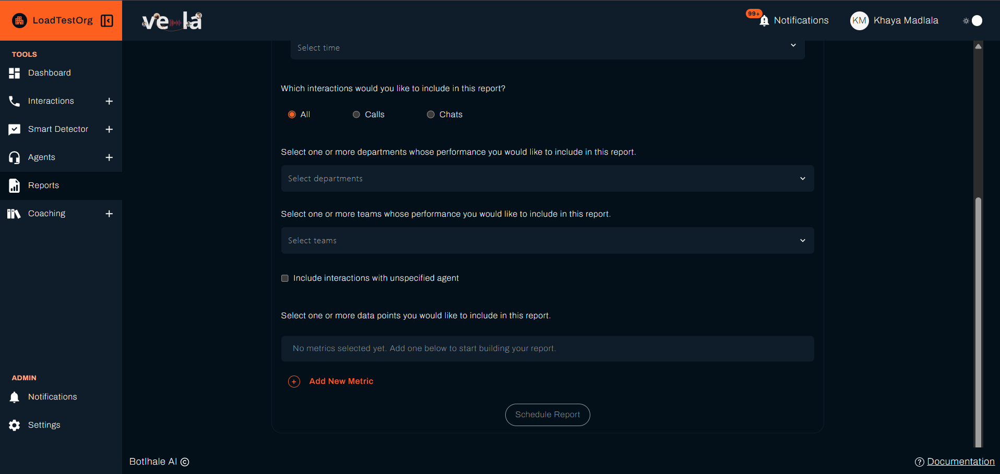

Your schedules appear on the **Scheduled Reports** tab of the Reports list, one row each, under **Frequency**, **Last Run**, **Next Run**, and **Created By**. A schedule that has not run yet reads **No runs yet**, and **Next Run** is where you confirm it runs when you expect.

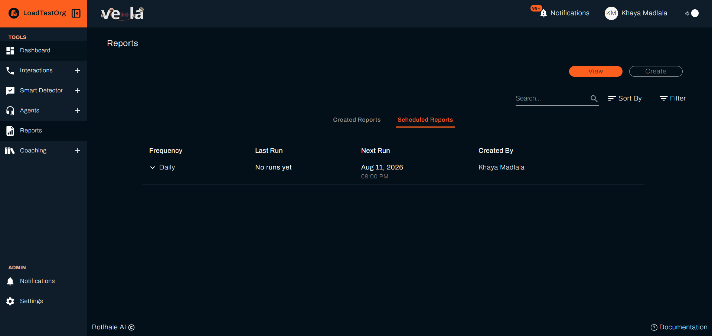

Select a row to expand it and check what the schedule is set to:

| Section | What it shows |
| :--- | :--- |
| **Interactions** | Whether the schedule covers All, Calls, or Chats |
| **Selected Teams** | Every team in the schedule's scope |
| **Selected Agents** | Every agent in the schedule's scope |
| **Metrics** | Each metric with its chart type, such as `No. alerts-line` |
| **Additional Details** | **Status**, **Created**, **Last Updated**, and the **Time** it runs at |

A schedule that has not finished a run yet shows a **Status** of **Pending**.

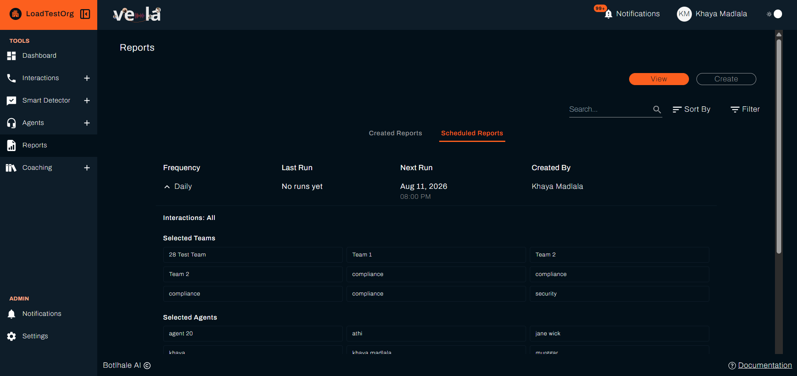

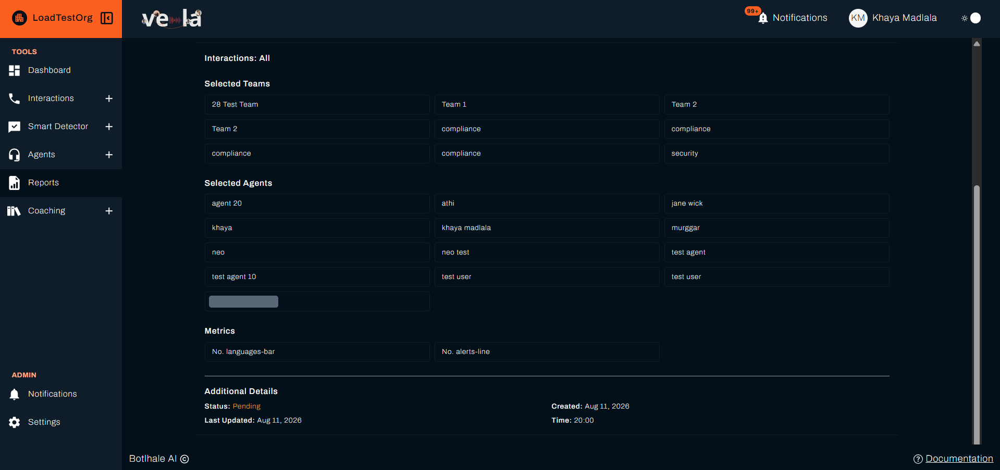

{/* One agent name is masked in schedule4.png, to keep a real address out of the documentation under POPIA. The bar shows where it sits without disclosing it. */}

</TabItem>
</Tabs>

:::note A schedule cannot be edited
To change a report's frequency, metrics, or filters, delete the schedule and create a new one.
:::

### B. Who Is Told When a Report Is Ready

A finished report is not emailed as a file. Vela always emails you, as the person who created it, a link to the report. Everyone else in your organisation is told according to their own **Settings → Notifications** preferences: in Vela, by email, or not at all. Those whose email frequency is **Daily** receive it in that day's email rather than straight away.

If a scheduled run finds no interactions in its date range, Vela emails you to say the report could not be generated, and the schedule continues to its next run.

---

## 4. Download and Share

Go to **Reports** and stay on the **View** tab. It holds two tabs of its own, **Created Reports** and **Scheduled Reports**, with **Search**, **Sort By**, and **Filter** above them. **Created Reports** lists each report by **Name**, **Created By**, and **Date**.

Select the download icon on a report's row and choose **PDF** or **DOCX**. The file holds the metrics and charts you selected, each with a short summary written by AI.

To rename a report, select the pencil icon beside its name, type the new one, and confirm. Reports are named automatically when they are generated, so renaming is worth doing on anything you intend to keep or send on.

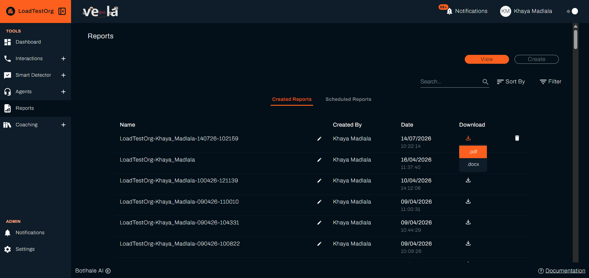

---

## Check Your Work

How you check depends on which you built. A one-time report takes a few minutes to build, and Vela emails you when it is ready.

For a one-time report, you are finished when it appears under **Created Reports** with a download icon on its row, and the downloaded PDF or DOCX holds the metrics and charts you chose. A metric you selected but cannot find in the file had no data in the period. {/* ENGINEERING (known bug, documented as intended): lib/generateReport.js@vela-fly retries the AI insights for each chart, then pushes [] after the last failure (~:395-425). filterEmptyArrays (~:431-445) then drops every chart whose insights are empty, with no message. Only no-data metrics are named (reports/createForm.jsx:351,358; scheduleReports/route.js:104). Intended: a metric with data always appears, with or without its summary. Workaround until fixed, removed from visible text 2026-10-09: create the report again. A metric missing from the second file as well had no data. */}

For a schedule, open **Scheduled Reports** and confirm **Next Run** shows the date and time you intended. After that first run, check the report arrives.

---

## Related

- [Metrics](../reference/metrics.md): what each metric in a report measures
- [Monitor Agent Performance](./monitor-agent-performance.md): the same analytics on your Dashboard, day to day
- [Manage Notifications](./notifications.md): how colleagues are told when a report finishes generating

## Need Help?

**Contact Support:** support@botlhale.ai
