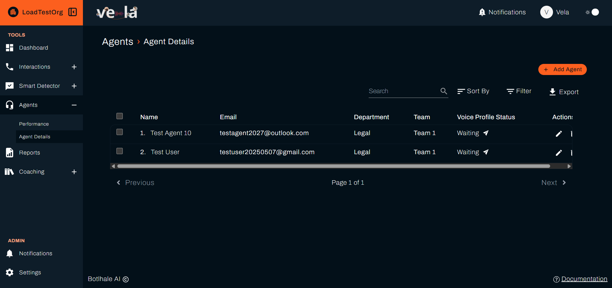
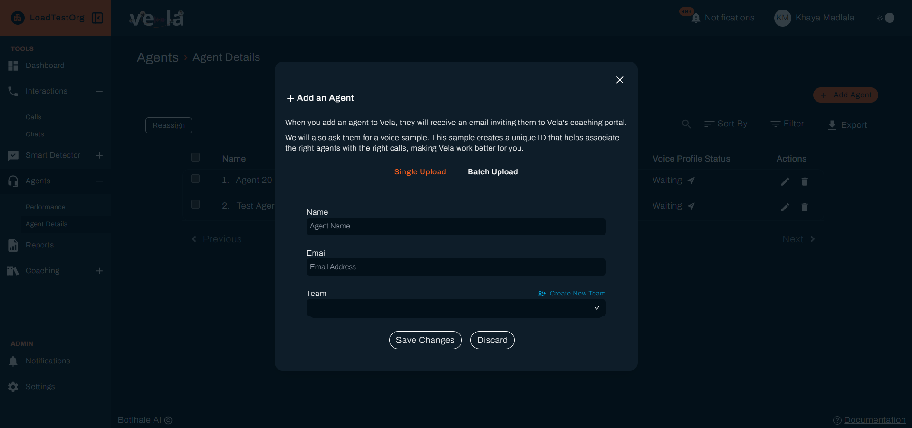
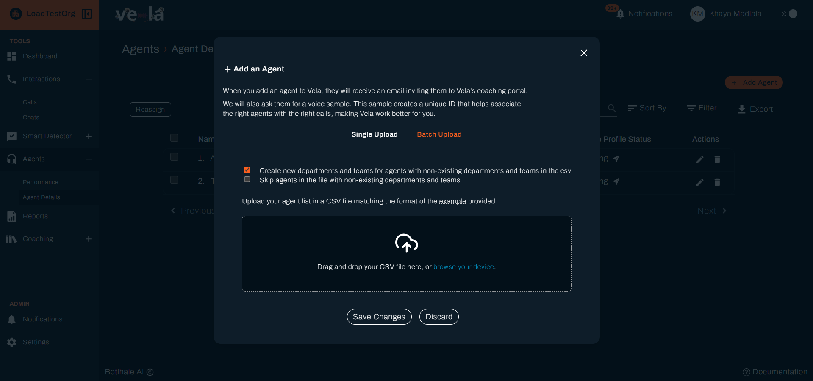
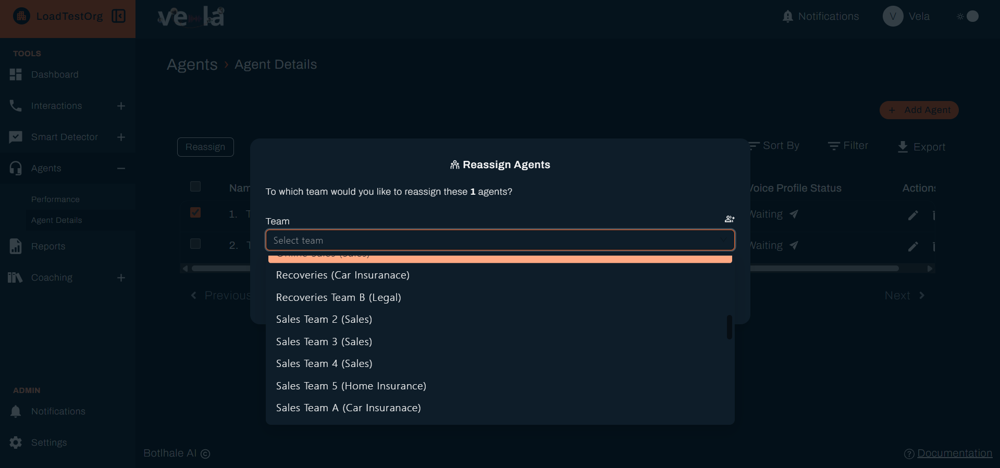
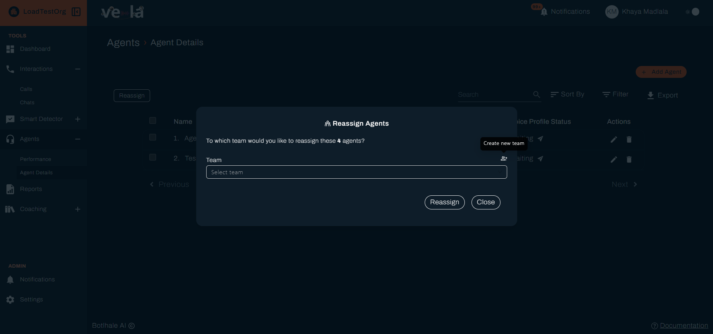

# Manage Agents and Teams
Agents are the people whose interactions Vela analyses. This page covers keeping those records right after the initial setup: adding someone who joins, moving someone between teams, and retiring someone who leaves.

Getting this wrong is quiet rather than loud. An agent in the wrong team still gets scored, but their results land in another team lead's figures, so the numbers stay plausible while being wrong.

---

## Before You Begin

You need:

- **Access level:** Organisational, Departmental, or Team, covering the agents and teams you are changing. You can move an agent into any team your access level covers. See [Access Level](../reference/glossary.md#access-level).
- **The department a team belongs to.** A team is created inside a department, so the department has to exist first. See [Administrator Setup](../getting-started/quick-start/administrator-setup.md).
- **The agent's name and email address.** Both are required when you add someone by hand.

:::note Agents are not users
An agent is a person whose interactions are analysed. A user is a person who signs in to Vela. Adding one does not create the other, and a bulk CSV import creates agents only. See [Agent](../reference/glossary.md#agent) and [User](../reference/glossary.md#user).
:::

---

## 1. Find an Agent

Go to **Agents → Agent Details** in the left sidebar. The table lists everyone you can see, under **Name**, **Email**, **Department**, and **Team**. Four controls sit above it:

| Control | What it does |
| :--- | :--- |
| **Search** | Narrows the list by name |
| **Sort** | Orders the list on any column |
| **Filter** | Opens **Filter By**, where you select departments, teams, and **Status**. Select **Apply** to use it |
| **Export** | Downloads the list, including each agent's department, team, and status |

An agent with nothing assigned reads **No Department** or **No Team** rather than sitting blank, so sorting on either column brings the gaps together. The **Actions** column at the end of each row holds the edit and delete controls. Past one page, **Previous** and **Next** sit below the table with **Page 1 of 2** between them.

---

## 2. Add an Agent

Select **Add Agent** to open **Add an Agent** modal. It has two tabs, **Single Upload** for one person and **Batch Upload** for a CSV of many.

On **Single Upload**:

1. Enter the **Name**, and the **Email** where it is required.
2. Choose the **Team**. If it does not exist yet, **Create New Team** beside the field makes one without leaving the window.
3. Select **Save Changes**, or **Discard** to abandon it.

Name and team are always required. Whether you also need the email, and what the agent receives when you save, depends on your organisation:

| Your organisation has | Email address | What the agent receives |
| :--- | :--- | :--- |
| Neither voice profiles nor the Coaching Portal | Optional | Nothing |
| The Coaching Portal | Required | **Invitation to Vela**, which sets up the sign-in they use for the Agent Portal |
| Voice profiles | Required | **Vela Voice Agent ID Invite**, asking them to record a sample |
| Both | Required | Both emails, sent separately |

Adding an agent can therefore email them straight away. Check the name and address before saving rather than after.

:::tip Adding many agents at once
**Batch Upload**, the second tab, takes a CSV and creates the departments and teams it names as it goes. That is the route for an initial import. See [Importing Agents in Bulk](../settings-config/user-management.md#4-importing-agents-in-bulk).
:::

---

## 3. Edit, Remove, or Restore an Agent

The **Actions** column holds all three.

**Edit** opens the agent's record. Moving them to another team changes whose figures they appear in from that point on, and leaves their existing interactions with the team that handled them.

**Delete Agent** retires the agent rather than erasing them, so their past interactions and scores keep counting towards the team's historical figures.

**Reactivate** brings a removed agent back. Use it rather than adding them again, which would create a second record and split their history.

---

## 4. Set Up Voice Profiles

A voice profile helps Vela tell the agent apart from the customer in a recording. Better speaker separation means a more accurate transcript, and everything scored from that transcript improves with it.

:::note This section depends on your organisation
Voice profiles are enabled per organisation. Where the **Voice Profile Status** column appears on the Agent Details table, yours has them and this section applies.
:::

The **Voice Profile Status** column shows where each agent stands, and carries the action for that state:

| Status | What it means | What to do |
| :--- | :--- | :--- |
| **Not Uploaded** | No voice sample yet | Send the agent an invite to record one |
| **Waiting** | Invited, no sample provided yet | Resend the invite if it has been a while |
| *(a toggle)* | A sample has been provided | Switch the profile off to stop Vela using it, and on again to resume |

The agent records their own sample from the invitation, so this is a request rather than something you complete for them. Chase **Waiting** rows. Until the agent records a sample, Vela separates the speakers on its own.

Where a sample exists, the column shows a toggle rather than a word. **Export** names the same two states in writing, as **Active** and **Inactive**, so use the export when you want the status of a whole list at once rather than reading toggles row by row.

---

## 5. Move Agents Between Teams

**Reassign** moves several agents at once, rather than opening each one in turn.

1. Tick the agents you want to move. **Reassign** appears above the table once at least one is ticked.
2. Select **Reassign**, then choose the department and team to move them into. **Create new team** makes the destination on the spot if it does not exist yet.
3. Confirm the move.

:::note Teams themselves are managed in Settings
Only reassignment is on this screen. Teams are created, renamed, and moved between departments on the **Org Table**, under **Settings → Users**. See [Departments and Teams](../settings-config/user-management.md#3-departments-and-teams).
:::

---

## Check Your Work

Open **Agents → Agent Details** and find the agent you changed. Both should name the department and team you chose. Where either reads **No Department** or **No Team**, the assignment did not take.

Changes apply from now on rather than backwards. An agent you moved keeps their existing interactions under the team that handled them, so their new team's figures build up from today rather than jumping.

For voice profiles, the status is the check. **Not Uploaded** and **Waiting** both mean Vela is still separating speakers without help from a profile, whatever invitations have been sent.

---

## Related

- [Administrator Setup](../getting-started/quick-start/administrator-setup.md): create departments and import agents in bulk when first setting up
- [Monitor Agent Performance](./monitor-agent-performance.md): the performance figures these records feed
- [Glossary](../reference/glossary.md): the difference between an agent, a user, a team, and a department
- [User and Team Management](../settings-config/user-management.md): manage the people who sign in to Vela, rather than the agents they monitor

## Need Help?

**Contact Support:** support@botlhale.ai
