# Monitor Agent Performance
Track how your agents are performing, find where they need help, and turn that into coaching. Use the **Dashboard** for trends across a team, and the **Agents** section for detail on one person.

---

## Before You Begin

You need:

- **Interactions that have finished processing.** Performance figures are calculated from analysed interactions, so a new organisation with nothing uploaded shows no data rather than zeros.
- **An Agent Scorecard covering these agents' teams.** Every figure on this page comes from it: the scores, the categories behind them, and each agent's strengths and weaknesses. Without one, the pages stay empty. See [Build an Agent Scorecard](../agent-scorecard-guide.md).
- **Access level:** Organisational, Departmental, or Team, covering the agents you are monitoring. See [Access Level](../reference/glossary.md#access-level).

---

## 1. Start on the Dashboard

The Dashboard is where you find out whether anything needs your attention today, across everything your access level reaches.

### A. Set the Date Range and Scope

1.  Sign in to Vela and go to the **Dashboard**.
2.  Click the date range to open **Select Date Range**, and pick **Today** or **Yesterday** for a current check.
3.  Click **Filter** to narrow the metrics by department, team, and agent, within your access level, and by direction, tags, topic, or score.

### B. What to Read First

These tell you the most in the least time. Each is defined in full in [Metrics](../reference/metrics.md):

| Metric | What it tells you | When to act |
| :--- | :--- | :--- |
| **Average Agent Score** | The overall quality performance for your scope. See [How Scoring Works](../explanation/how-scoring-works.md). | It stays below your team's standard. |
| **Agent Scores Distribution** | How scores are spread across the team. | Agents cluster in the lower ranges, which points at the team rather than a person. |
| **No. Alerts** and **Resolved Alerts** | How many Smart Search matches were raised, and how many of them have been resolved. | The gap between them widens week on week. |
| **Sentiment Distribution** | The proportion of positive, neutral, and negative customer emotion. | **Negative** spikes suddenly, which usually means a service or system problem. |
| **Talk to Listen Ratio** | Agent talking time relative to customer talking time. | It stays high, so the agent is talking more than listening. |

:::tip Choose your own metrics
Click **Customise** on the Dashboard to choose which metrics appear and how each is charted: table, bar, line, pie, doughnut, or card. The chart types offered vary by metric, so pick the ones that suit what your team is measured on.
:::

---

## 2. Find Out Who, and On What

The Dashboard tells you something is happening. **Agents** in the left sidebar tells you who, and on what. It holds two entries, **Performance** and **Agent Details**. Each screen narrows the last:

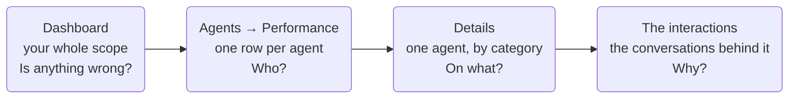

Stopping at any of the first three leaves you with a number. The conversations are where the reason is.

### A. Find the Agent

Go to **Agents → Performance**. It opens on the **Overview** tab, which lists the agents you can see. **Teams**, **Departments**, and **Agents** sit alongside it. Those answer a different question and are covered in [C. Check the Wider Trend](#c-check-the-wider-trend).

Four controls sit above the list:

| Control | What it does |
| :--- | :--- |
| **Search** | Narrows the list by agent name |
| **Sort By** | Orders the list on Name, Team, Department, Interactions, Compliance Score, Quality Score, Score, Strength, Weakness, or Rank |
| **Filter** | Opens **Filter By**, covered below |
| **Export** | Downloads the list as a PDF or a CSV |

#### Filter By

The modal has two kinds of field:

* **Tick lists**: **Department**, **Team**, **Strengths**, and **Weaknesses**.
* **From and To ranges**: **Total Calls**, **Rank**, **Score**, **Compliance Score**, and **Quality Score**.

Click **Apply** to filter, or **Clear All Fields** to reset. The modal scrolls, so the last three ranges sit out of sight until you scroll.

**Strengths** and **Weaknesses** list your scorecard categories, so ticking **Compliance** under Weaknesses finds the agents whose weakest category is compliance.

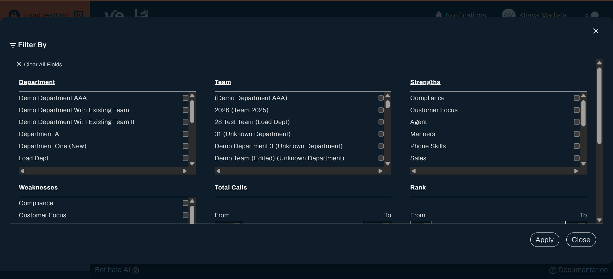

:::tip Try it: put the agents who need coaching first
1. Click **Sort By**.
2. Choose **Ascending**.
3. Sort on **Score**.
4. Click **Save Changes**.

The lowest-scoring agents move to the top of the table, so the people who need attention are the first you see.
:::

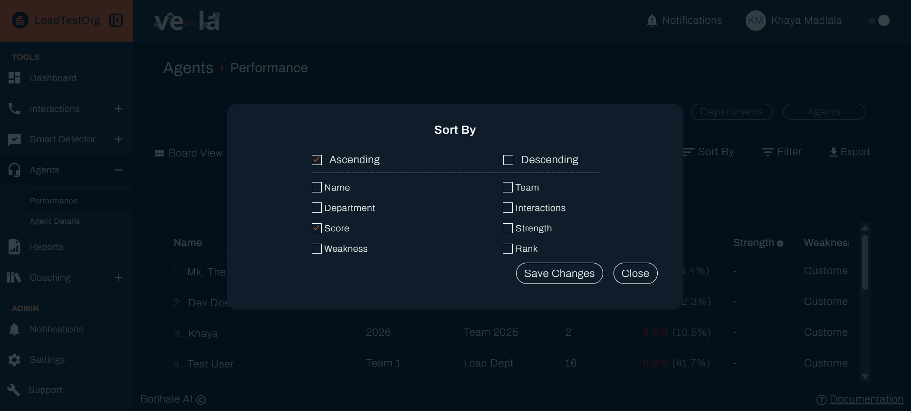

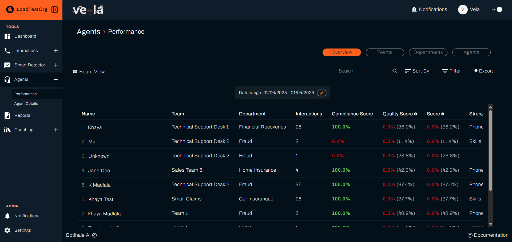

#### Choose a View

The same agents can be shown two ways. The control sits at the top left, above the table, and it names the view it switches you to. In the list it reads **Board View**. Click it and it reads **List View**.

| | **List View** | **Board View** |
| :--- | :--- | :--- |
| **Shows** | One row per agent, in columns you can sort | One card per agent |
| **Each agent** | Name, team, department, interactions, and the compliance, quality, and overall scores | Rank, score, team, **Total Interactions**, **Work On This**, **Take A Bow** |
| **Best for** | Ranking a team and finding the outliers | Reading one agent's summary at a glance |

In List View the row scrolls sideways for the columns that do not fit. Sorting and filtering apply to both views, so narrowing the list in one carries over when you switch.

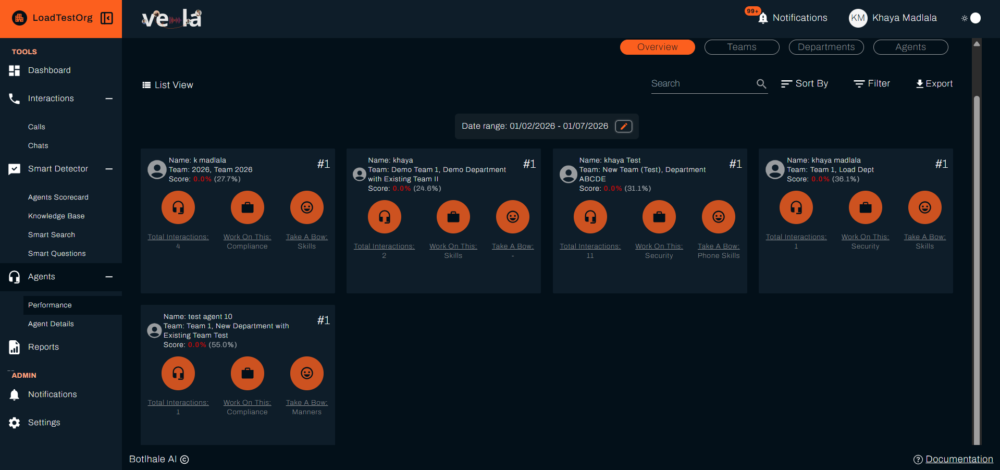

### B. Read One Agent's Detail

Open **Agents → Performance → Details** for an agent. In List View, click **View** at the end of their row. In Board View, click anywhere on their card. The header shows their rank, name, team, and the date range you are looking at. **Export** downloads the page, and **Mail** sends it to the agent.

**The Agent Scorecard table** sits directly below that header, under a centred **Agent Scorecard** caption. It lists one row per scorecard category and ends in a **Total Score** row. Its six columns put the agent beside their team, so you can see whether a low category is theirs alone or shared:

| The agent | Their team |
| :--- | :--- |
| **Compliance Score** | **Team Compliance Score** |
| **Quality Score** | **Team Quality Score** |
| **Overall Score** | **Team Overall Score** |

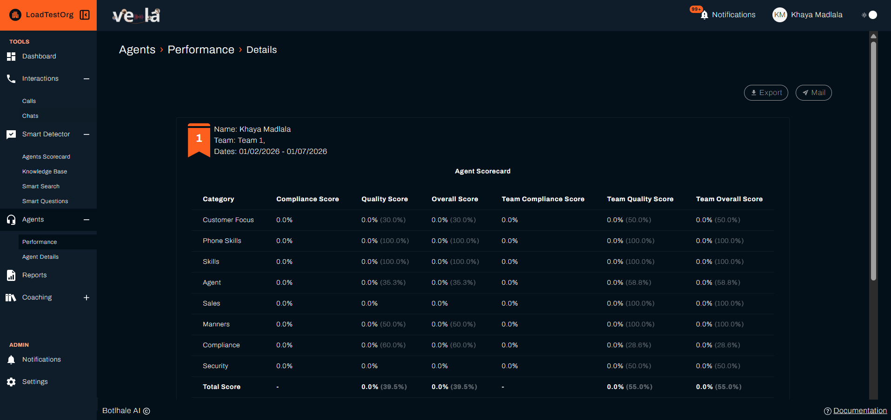

If the table is missing entirely, this agent has no scorecard scores in that date range. Vela hides it rather than showing empty rows. Widen the date range, or check that a scorecard question is scoped to their team. See [Build an Agent Scorecard](../agent-scorecard-guide.md).

**Below the table**, three summaries pick out what matters:

* **Total Interactions**: how many interactions the score is based on. A small number means a shaky average.
* **Take A Bow**: the categories the agent scores well in. This is what the Performance table calls their **Strength**.
* **Work On This**: the categories to coach. This is their **Weakness**.

Categories come from the **Category** field on each scorecard question, so how you group your questions decides what can appear here. If every category appears under **Work On This**, the scores are too close together for Vela to separate them, and the scorecard needs sharper questions. See [How Scoring Works](../explanation/how-scoring-works.md).

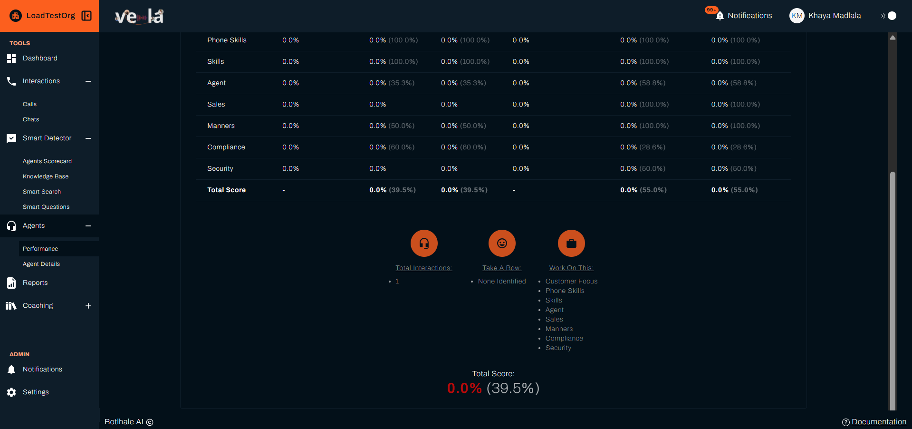

:::note Voice profiles live elsewhere
Voice profiles improve speaker separation in transcripts, which in turn improves what is scored. They are managed per agent under **Agents → Agent Details**, not here. See [Manage Agents and Teams](./manage-agents-and-teams.md).
:::

### C. Check the Wider Trend

One weak agent and a weak team need different responses, so this is worth a minute before you act.

The quickest check is on the Dashboard: **Agent Scores Distribution** shows how scores are spread, so you can see whether this agent sits apart from their colleagues or with them.

For a fuller answer, the three tabs beside **Overview** count categories rather than ranking people. **Teams**, **Departments**, and **Agents** each show which scorecard categories come up most often as a strength, and which come up as a problem.

On any of them, switch between **Strengths** and **Areas to Improve**. The colour changes with it: green for strengths, red for areas to improve.

On **Teams** and **Departments** you get a grid. Your scorecard categories run across the top, your teams or departments down the side, and each cell counts how many agents that category applies to. The darker the cell, the more agents there are.

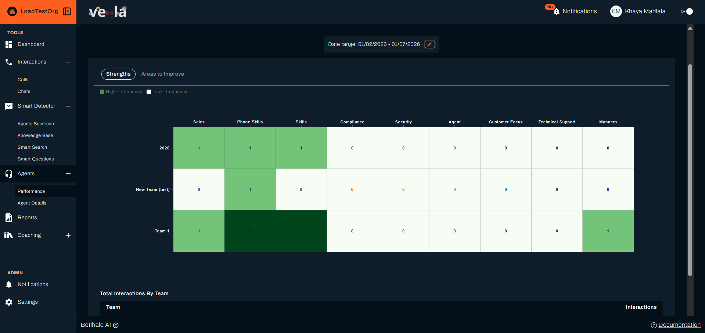

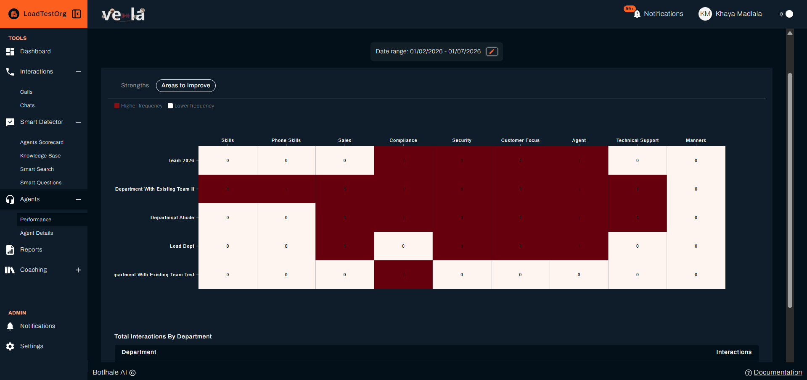

Below each grid, **Total Interactions By Team** or **By Department** gives the volume behind it. Read the two together: two people weak on a category means more in a team of four than in a team of forty.

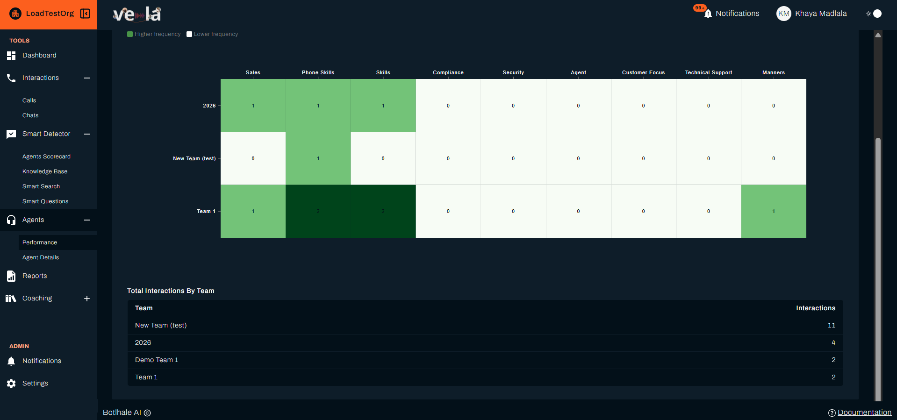

The **Agents** tab charts every agent together, one bar per scorecard category. The longer the bar, the more agents have that category as a strength, or as an area to improve.

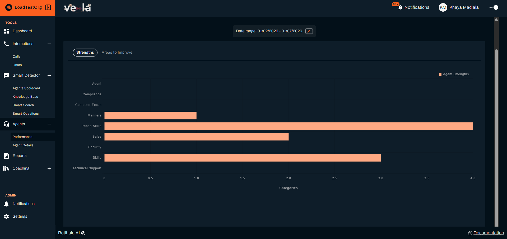

A category that is dark across a whole row, or long on the Agents chart, points to a training gap rather than an individual one. That is the case for a course rather than a one-to-one.

---

## 3. Share What You Found

Two ways out of the platform, depending on who is asking:

* **Export** on **Agents → Performance** downloads the list you are looking at, as a PDF or a CSV. Quickest for a one-off.
* A **report** covers a date range with the metrics you choose, and can run daily, weekly, or monthly so managers receive it without asking. See [Generate Reports](./custom-reporting.md).

---

## 4. Turn What You Find into Coaching

Monitoring is only worth the time if it ends in coaching. This section covers how to get from a figure to a conversation.

### A. Identify Coaching Opportunities

* **Low scores:** An interaction scoring below your organisation's standard, whether Vela scored it or a reviewer did.
* **Alerts:** An agent whose interactions keep raising the same Smart Search alert, for example a compliance phrase, is worth a closer look than the score alone suggests.
* **Trends:** A score falling steadily over several weeks matters more than a single low interaction.

### B. Act on What You Find

1.  **Leave coaching comments** on the interactions that show the issue, tagging the agent so they are notified. See [Review and Score Interactions](./quality-assurance-tools.md#b-comment-to-coach).
2.  **Set up a course** in the Coaching section, with a trigger score range that covers the gap.
3.  **Track results** by monitoring the agent's score trend over the following weeks.

This is a loop rather than a sequence. Tracking the result is what tells you whether the coaching worked, and it puts you back at the Dashboard looking for the next gap:

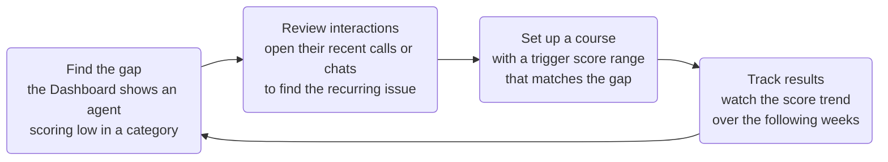

:::note Vela assigns courses by score
You create a course, set the score range that triggers it, and choose the scope it applies to. Vela evaluates agents on the cycle configured in **Coaching → Preferences** and assigns each agent the courses their scores qualify them for, so courses reach people by score rather than by name.

The trigger range is your lever. Set it to match the gap you found, and the agents who have that gap pick the course up on the next evaluation.
:::

**Coaching** appears in the sidebar only if your organisation has the Coaching Portal enabled. Creating courses, tracking completion, and managing awards are covered in the [Vela Coaching Portal documentation](https://docs-coaching.botlhale.xyz).

---

## Check Your Work

The Dashboard and the Performance table both show the date range you selected. Read them back, and they should tell you three things: which agent or team to look at, which scorecard category or metric moved, and the direction it moved in.

Then open two or three of the interactions behind that figure. Reading them tells you whether the score matches the conversations. Where the two agree, you have your answer. Where they differ, trust the conversations and check whether a scorecard question is firing when it should not.

Finish by recording what you decided: a comment on a specific interaction, a course whose trigger range covers the gap, or a note to look again next week.

---

## Related

- [Build an Agent Scorecard](../agent-scorecard-guide.md): the questions and categories every figure here comes from
- [Metrics](../reference/metrics.md): what each figure on the Dashboard measures
- [Review and Score Interactions](./quality-assurance-tools.md): score the interactions behind the numbers
- [Generate Reports](./custom-reporting.md): share performance trends outside the platform

## Need Help?

**Contact Support:** support@botlhale.ai
